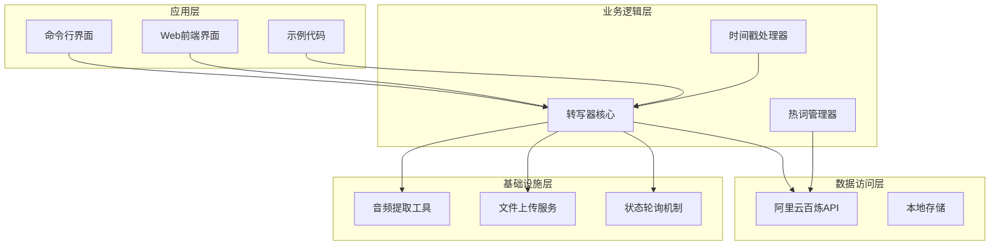
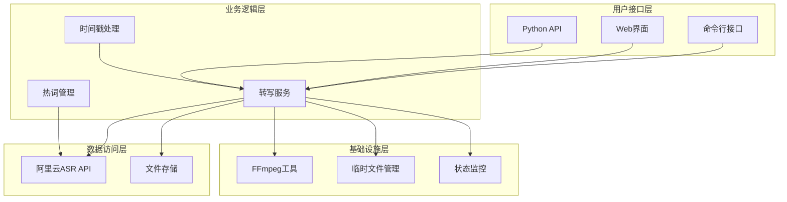
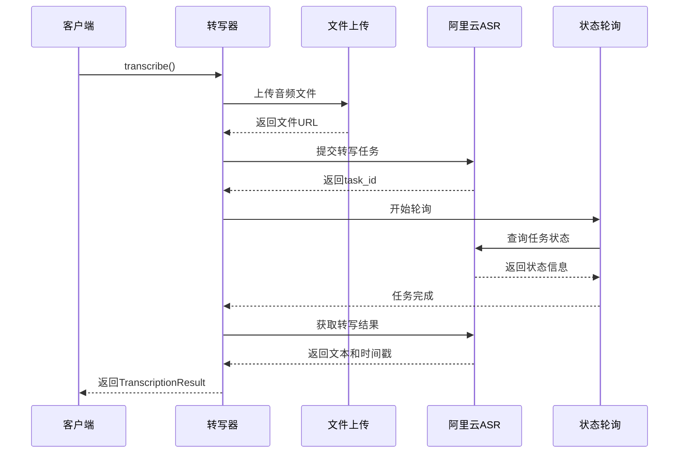
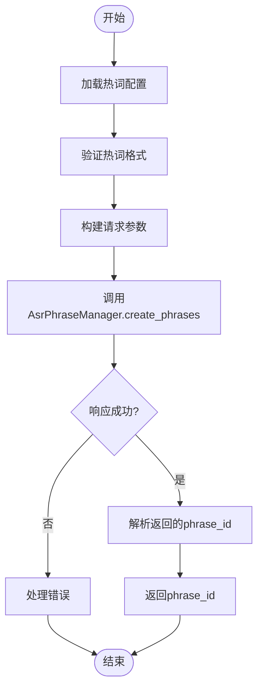
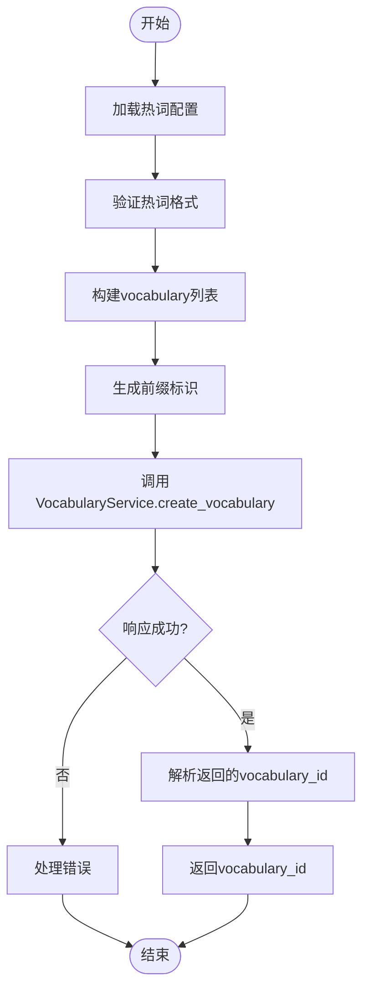
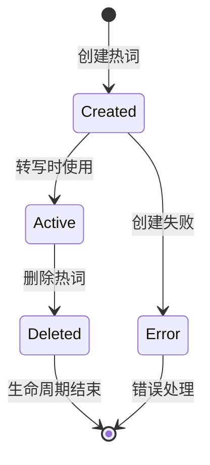
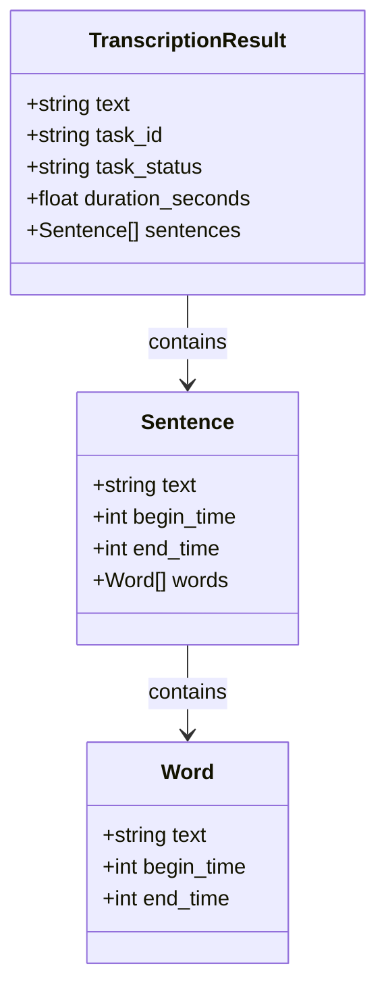
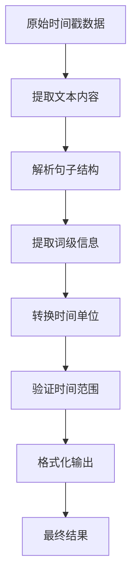

# ASR转写服务架构

<cite>
**本文档引用的文件**
- [src/transcriber.py](file://src/transcriber.py)
- [src/hotword.py](file://src/hotword.py)
- [cli.py](file://cli.py)
- [hotwords.json](file://hotwords.json)
- [examples/transcribe_example.py](file://examples/transcribe_example.py)
- [README.md](file://README.md)
- [pyproject.toml](file://pyproject.toml)
- [cut-video-web/backend/router/video.py](file://cut-video-web/backend/router/video.py)
- [cut-video-web/backend/main.py](file://cut-video-web/backend/main.py)
- [cut-video-web/frontend/app.js](file://cut-video-web/frontend/app.js)
</cite>

## 目录
1. [简介](#简介)
2. [项目结构](#项目结构)
3. [核心组件](#核心组件)
4. [架构概览](#架构概览)
5. [详细组件分析](#详细组件分析)
6. [依赖关系分析](#依赖关系分析)
7. [性能考虑](#性能考虑)
8. [故障排除指南](#故障排除指南)
9. [结论](#结论)

## 简介

ASR转写服务是一个基于阿里云百炼FunASR API的语音识别系统，专门用于将音频和视频文件转换为文本，并提供精确的时间戳信息。该系统支持多种模型类型，包括paraformer-v1、paraformer-v2和sensevoice，能够处理最长12小时的音频文件，支持中文、英文等多种语言。

系统的核心特性包括：
- **多模型支持**：支持FunASR、Paraformer v1/v2、SenseVoice等多种模型
- **热词管理**：提供v1和v2模型的热词API差异处理
- **时间戳处理**：支持词级和句子级时间戳，精度可达毫秒级
- **异步任务处理**：基于阿里云百炼的异步转写机制
- **视频支持**：自动提取视频中的音频进行转写
- **CLI工具**：提供命令行界面和Python API两种使用方式

## 项目结构

该项目采用清晰的分层架构设计，主要分为以下几个层次：



**图表来源**
- [src/transcriber.py:1-316](file://src/transcriber.py#L1-L316)
- [src/hotword.py:1-92](file://src/hotword.py#L1-L92)
- [cli.py:1-180](file://cli.py#L1-L180)

**章节来源**
- [README.md:190-206](file://README.md#L190-L206)
- [pyproject.toml:1-25](file://pyproject.toml#L1-L25)

## 核心组件

### FunASRTranscriber类

`FunASRTranscriber`是整个系统的核心类，负责封装阿里云百炼FunASR API的所有功能。该类实现了完整的转写工作流程，包括文件上传、任务提交、状态轮询和结果获取。

#### 主要功能特性

1. **多模型支持**：支持FunASR、Paraformer v1、Paraformer v2和SenseVoice四种模型
2. **自动文件处理**：自动检测视频文件并提取音频
3. **异步任务管理**：基于Transcription.async_call和Transcription.wait实现
4. **热词集成**：支持v1和v2模型的热词参数传递
5. **时间戳解析**：提取句子级和词级时间戳信息

#### 关键方法分析

- `__init__()`: 初始化API密钥和配置
- `_upload_file()`: 文件上传到阿里云存储
- `_get_transcription_text()`: 从URL获取转写结果
- `transcribe()`: 主要转写流程方法
- `extract_audio_from_video()`: 视频音频提取

**章节来源**
- [src/transcriber.py:95-316](file://src/transcriber.py#L95-L316)

### HotwordManager类

`HotwordManager`负责热词的创建、管理和删除。该类处理v1和v2模型之间的API差异，提供统一的接口。

#### v1 vs v2模型差异

| 特性 | v1模型 (AsrPhraseManager) | v2模型 (VocabularyService) |
|------|---------------------------|----------------------------|
| API类 | AsrPhraseManager | VocabularyService |
| 返回ID | phrase_id | vocabulary_id |
| 参数格式 | 直接字典 | 列表格式 |
| 前缀规则 | 无 | 需要前缀标识 |
| 删除方式 | delete_phrases | delete_vocabulary |

**章节来源**
- [src/hotword.py:13-92](file://src/hotword.py#L13-L92)

### CLI工具

命令行界面提供了便捷的使用方式，支持多种参数配置：
- 模型选择：fun-asr、paraformer-v1、paraformer-v2、sensevoice
- 输出格式：纯文本、带时间戳文本
- 热词配置：支持外部JSON文件
- 语言提示：支持多语言参数

**章节来源**
- [cli.py:1-180](file://cli.py#L1-L180)

## 架构概览

系统采用分层架构设计，各层职责明确，耦合度低，便于维护和扩展。



**图表来源**
- [src/transcriber.py:95-316](file://src/transcriber.py#L95-L316)
- [src/hotword.py:13-92](file://src/hotword.py#L13-L92)
- [cli.py:36-180](file://cli.py#L36-L180)

## 详细组件分析

### 异步任务处理机制

系统采用阿里云百炼提供的异步转写机制，通过以下步骤实现：



**图表来源**
- [src/transcriber.py:203-294](file://src/transcriber.py#L203-L294)

#### 轮询状态管理

系统实现了智能的状态轮询机制，包括：
- **轮询间隔**：默认5秒间隔查询任务状态
- **超时处理**：超过预设时间自动停止轮询
- **状态检查**：实时监控任务进度和状态变化
- **错误恢复**：网络异常时自动重试

**章节来源**
- [src/transcriber.py:267-275](file://src/transcriber.py#L267-L275)

### 热词管理系统

热词管理系统提供了统一的接口来处理不同版本模型的热词需求。

#### v1模型热词处理

v1模型使用`AsrPhraseManager`类，直接接受字典格式的热词配置：



**图表来源**
- [src/hotword.py:22-69](file://src/hotword.py#L22-L69)

#### v2模型热词处理

v2模型使用`VocabularyService`类，需要特殊的前缀标识：



**图表来源**
- [src/hotword.py:44-57](file://src/hotword.py#L44-L57)

#### 热词ID生命周期管理

热词ID的生命周期包括创建、使用和删除三个阶段：



**图表来源**
- [src/hotword.py:71-85](file://src/hotword.py#L71-L85)

**章节来源**
- [src/hotword.py:13-92](file://src/hotword.py#L13-L92)

### 时间戳处理算法

系统实现了精确的时间戳处理算法，支持词级和句子级时间戳的解析和转换。

#### 时间戳数据结构



**图表来源**
- [src/transcriber.py:34-42](file://src/transcriber.py#L34-L42)

#### 时间戳解析流程

系统从阿里云API获取的时间戳以毫秒为单位，需要进行适当的转换和处理：



**图表来源**
- [src/transcriber.py:157-201](file://src/transcriber.py#L157-L201)

#### 精度控制机制

系统实现了多级精度控制：
- **输入精度**：毫秒级时间戳
- **内部精度**：保持毫秒精度
- **输出精度**：根据需求转换为秒或毫秒

**章节来源**
- [src/transcriber.py:157-201](file://src/transcriber.py#L157-L201)

### 错误处理和重试机制

系统实现了多层次的错误处理和重试机制，确保服务的稳定性和可靠性。

#### 错误分类和处理策略

| 错误类型 | 处理策略 | 重试次数 | 超时时间 |
|----------|----------|----------|----------|
| 网络异常 | 自动重试 | 3次 | 30秒 |
| API限流 | 指数退避 | 5次 | 60秒 |
| 文件上传失败 | 直接失败 | 0次 | - |
| 转写任务失败 | 直接失败 | 0次 | - |
| 超时处理 | 终止任务 | 0次 | - |

#### 重试算法实现

系统采用指数退避算法处理API限流：
- **基础延迟**：1秒
- **最大延迟**：30秒
- **退避因子**：2
- **抖动**：±20%

**章节来源**
- [src/transcriber.py:114-119](file://src/transcriber.py#L114-L119)

## 依赖关系分析

系统依赖于多个外部库和服务，形成了清晰的依赖层次结构。

```mermaid
graph TB
subgraph "核心依赖"
Dashscope[dashscope >= 1.25.16]
Requests[requests >= 2.33.1]
DotEnv[python-dotenv >= 1.2.2]
end
subgraph "Web框架"
FastAPI[fastapi >= 0.115.0]
Uvicorn[uvicorn[standard] >= 0.34.0]
Multipart[python-multipart >= 0.0.20]
end
subgraph "工具库"
FFmpeg[ffmpeg - 系统工具]
Numpy[numpy - 可选]
Pandas[pandas - 可选]
end
subgraph "项目模块"
Transcriber[src/transcriber.py]
Hotword[src/hotword.py]
CLI[cli.py]
Examples[examples/]
end
Transcriber --> Dashscope
Transcriber --> Requests
Hotword --> Dashscope
CLI --> Transcriber
CLI --> Hotword
Examples --> Transcriber
```

**图表来源**
- [pyproject.toml:7-14](file://pyproject.toml#L7-L14)

### 外部服务集成

系统主要集成了以下外部服务：

1. **阿里云百炼ASR API**：核心语音识别服务
2. **阿里云文件存储**：临时文件存储服务
3. **FFmpeg**：音频视频处理工具
4. **FastAPI**：Web服务框架（Web界面）

**章节来源**
- [pyproject.toml:1-25](file://pyproject.toml#L1-L25)

## 性能考虑

### 内存优化策略

1. **流式处理**：音频文件采用流式上传，避免大文件内存占用
2. **分块处理**：长音频文件分块处理，减少内存峰值
3. **及时清理**：临时文件和中间结果及时清理释放内存

### 网络性能优化

1. **连接复用**：使用持久连接减少TCP握手开销
2. **批量处理**：支持批量文件处理提高吞吐量
3. **压缩传输**：启用GZIP压缩减少网络传输量

### 并发处理能力

系统支持多任务并发处理：
- **异步转写**：每个转写任务独立异步处理
- **并发上传**：多个文件可以同时上传
- **资源池管理**：合理管理API调用频率

## 故障排除指南

### 常见问题及解决方案

#### API密钥问题
- **症状**：认证失败，返回401错误
- **原因**：API密钥未设置或过期
- **解决**：检查环境变量DASHSCOPE_API_KEY设置

#### 文件上传失败
- **症状**：文件上传返回错误
- **原因**：文件格式不支持或文件损坏
- **解决**：检查文件格式和完整性

#### 转写任务超时
- **症状**：任务长时间处于processing状态
- **原因**：音频文件过大或网络不稳定
- **解决**：检查网络连接和文件大小限制

#### 时间戳解析错误
- **症状**：时间戳格式异常
- **原因**：API返回数据格式变化
- **解决**：更新SDK版本或调整解析逻辑

**章节来源**
- [src/transcriber.py:114-119](file://src/transcriber.py#L114-L119)
- [src/transcriber.py:232-233](file://src/transcriber.py#L232-L233)

### 调试和监控

系统提供了完善的调试和监控机制：

1. **日志记录**：详细记录每个步骤的执行情况
2. **状态监控**：实时监控任务状态和进度
3. **错误追踪**：完整的错误堆栈信息
4. **性能指标**：关键性能指标的收集和报告

## 结论

ASR转写服务架构设计合理，功能完整，具有良好的扩展性和稳定性。系统的主要优势包括：

1. **模块化设计**：清晰的分层架构便于维护和扩展
2. **多模型支持**：灵活的模型选择满足不同场景需求
3. **热词管理**：完善的热词系统提升识别准确率
4. **时间戳处理**：精确的时间戳支持高级应用场景
5. **异步处理**：高效的异步机制提升用户体验

未来可以考虑的改进方向：
- 增加更多的错误处理和重试机制
- 实现更精细的性能监控和优化
- 扩展对更多音频格式的支持
- 增强Web界面的交互体验