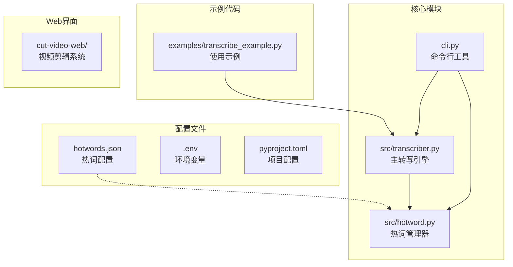
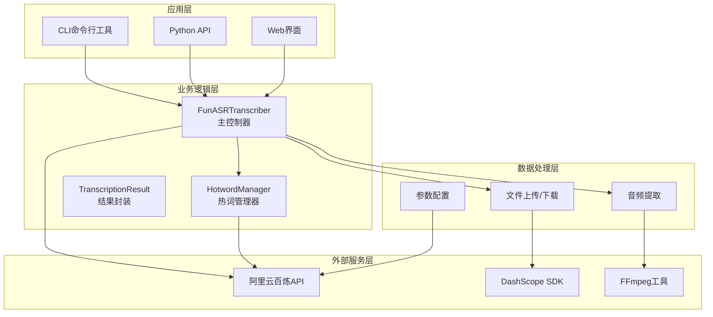
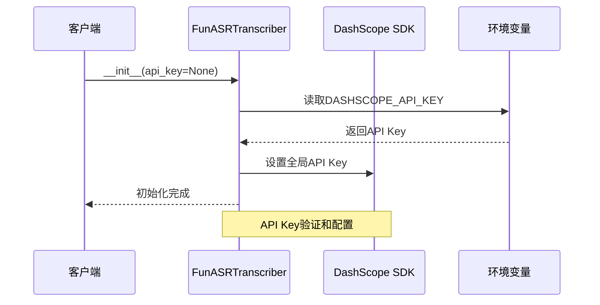
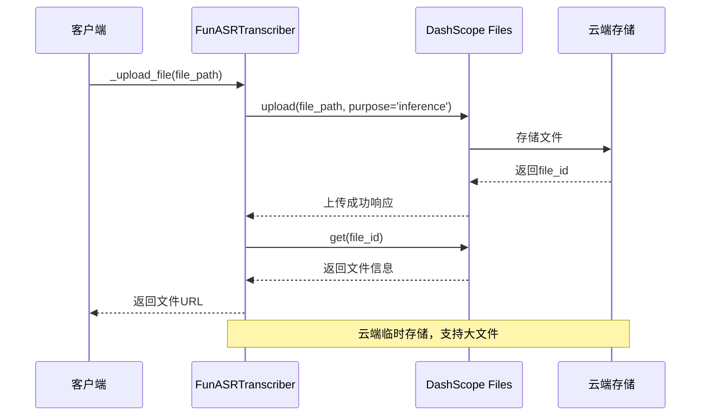
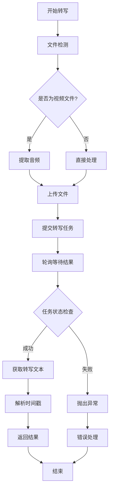
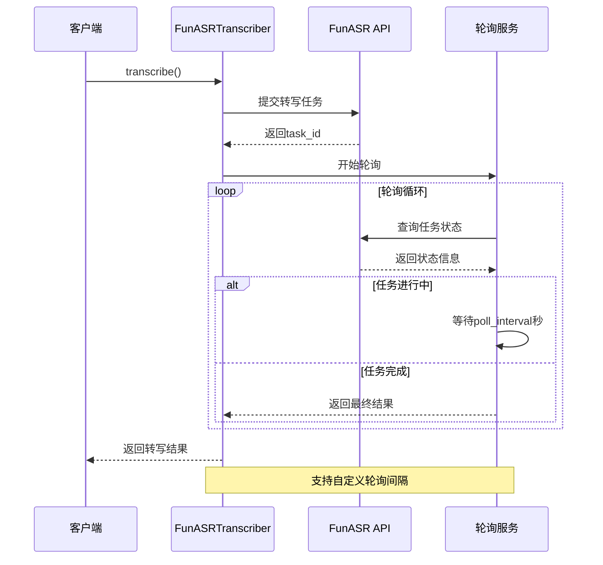
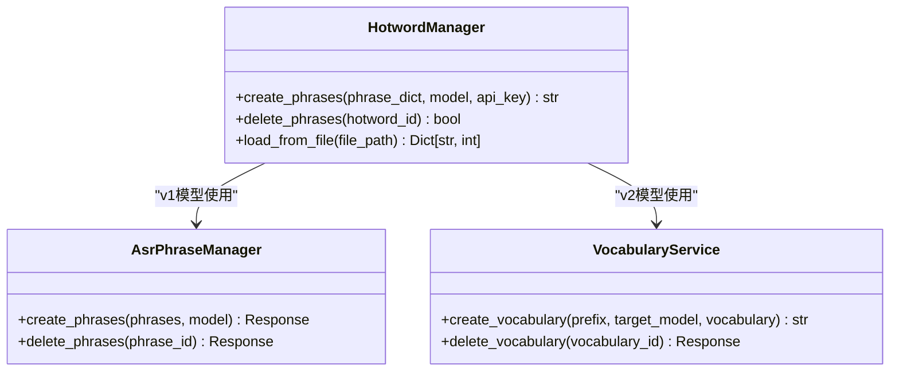

# ASR转写核心实现

<cite>
**本文档引用的文件**
- [src/transcriber.py](file://src/transcriber.py)
- [src/hotword.py](file://src/hotword.py)
- [cli.py](file://cli.py)
- [examples/transcribe_example.py](file://examples/transcribe_example.py)
- [README.md](file://README.md)
- [src/__init__.py](file://src/__init__.py)
- [hotwords.json](file://hotwords.json)
- [pyproject.toml](file://pyproject.toml)
</cite>

## 目录
1. [简介](#简介)
2. [项目结构](#项目结构)
3. [核心组件](#核心组件)
4. [架构概览](#架构概览)
5. [详细组件分析](#详细组件分析)
6. [依赖分析](#依赖分析)
7. [性能考虑](#性能考虑)
8. [故障排除指南](#故障排除指南)
9. [结论](#结论)
10. [附录](#附录)

## 简介

本项目是一个基于阿里云百炼 FunASR API 的ASR（自动语音识别）转写工具，支持长音频转写（最长12小时，2GB文件），提供多种模型类型和高级功能。项目采用模块化设计，包含命令行工具和Python API两种使用方式。

主要特性包括：
- 支持视频文件自动音频提取
- 多模型支持（fun-asr、paraformer-v1、paraformer-v2、sensevoice-v1）
- 热词功能增强识别准确性
- 词级时间戳输出
- 语气词过滤
- 异步任务处理机制

## 项目结构

项目采用清晰的模块化组织结构，主要包含以下核心模块：



**图表来源**
- [src/transcriber.py:1-316](file://src/transcriber.py#L1-L316)
- [src/hotword.py:1-92](file://src/hotword.py#L1-L92)
- [cli.py:1-180](file://cli.py#L1-L180)

**章节来源**
- [README.md:190-206](file://README.md#L190-L206)
- [pyproject.toml:1-25](file://pyproject.toml#L1-L25)

## 核心组件

### FunASRTranscriber类

`FunASRTranscriber`是整个系统的主控制器，负责协调整个转写流程。该类提供了完整的ASR转写功能，包括文件处理、API调用、结果解析等。

**主要职责**：
- 初始化和配置API密钥
- 处理音频/视频文件输入
- 管理文件上传和下载
- 提交转写任务并轮询结果
- 解析和返回转写结果

### ModelType枚举

定义了支持的所有ASR模型类型，每种模型都有其特定的应用场景和特点：

| 模型类型 | 值 | 特点 | 适用场景 |
|---------|----|------|----------|
| fun-asr | fun-asr | 基础ASR模型 | 通用语音识别 |
| paraformer-v1 | paraformer-v1 | 中文优化，热词支持更好 | 访谈、讲座等中英文混合场景 |
| paraformer-v2 | paraformer-v2 | 多语种支持更好 | 直播、会议等多语种场景 |
| sensevoice-v1 | sensevoice-v1 | 语音活动检测 | 语音活动检测和识别 |

### TranscriptionResult数据类

封装了转写结果的完整信息：

| 字段名 | 类型 | 描述 |
|--------|------|------|
| text | str | 转写后的纯文本内容 |
| task_id | str | 任务唯一标识符 |
| task_status | str | 任务执行状态 |
| duration_seconds | Optional[float] | 音频总时长（秒） |
| sentences | Optional[List[dict]] | 包含时间戳的句子列表 |

**章节来源**
- [src/transcriber.py:22-42](file://src/transcriber.py#L22-L42)
- [src/transcriber.py:95-316](file://src/transcriber.py#L95-L316)

## 架构概览

系统采用分层架构设计，从上到下分为应用层、业务逻辑层、数据访问层和外部服务层：



**图表来源**
- [src/transcriber.py:95-316](file://src/transcriber.py#L95-L316)
- [src/hotword.py:13-92](file://src/hotword.py#L13-L92)

## 详细组件分析

### FunASRTranscriber类详细分析

#### 初始化过程

初始化过程主要负责API密钥管理和环境配置：



**图表来源**
- [src/transcriber.py:107-121](file://src/transcriber.py#L107-L121)

#### 文件上传机制

文件上传采用分两步策略：先上传到云端存储，再获取访问URL：



**图表来源**
- [src/transcriber.py:122-155](file://src/transcriber.py#L122-L155)

#### 转写流程五步法

完整的转写流程包含五个关键步骤：



**图表来源**
- [src/transcriber.py:203-294](file://src/transcriber.py#L203-L294)

#### 异步任务处理机制

系统采用异步任务处理模式，支持任务ID管理、状态轮询和超时处理：



**图表来源**
- [src/transcriber.py:267-276](file://src/transcriber.py#L267-L276)

### ModelType枚举详解

#### 模型类型对比分析

| 特性 | fun-asr | paraformer-v1 | paraformer-v2 | sensevoice-v1 |
|------|---------|---------------|---------------|---------------|
| 语言支持 | 中文、英文 | 中文为主 | 多语种 | 中文、英文 |
| 热词支持 | 不支持 | 支持更好 | 支持 | 不支持 |
| 适用场景 | 通用基础 | 访谈、讲座 | 直播、会议 | 语音活动检测 |
| 性能特点 | 基础识别 | 中文优化 | 多语种优化 | 语音检测 |

#### 模型选择指南

```mermaid
flowchart TD
A[选择模型] --> B{应用场景}
B --> |中文访谈/讲座| C[推荐paraformer-v1]
B --> |多语种直播/会议| D[推荐paraformer-v2]
B --> |基础语音识别| E[可选fun-asr]
B --> |语音活动检测| F[推荐sensevoice-v1]
C --> G{是否需要热词}|是| H[启用热词功能]
C --> G|否| I[直接使用]
D --> J{是否需要热词}|是| K[启用热词功能]
D --> J|否| L[直接使用]
E --> M[直接使用]
F --> N[直接使用]
H --> O[开始转写]
I --> O
K --> P[开始转写]
L --> P
M --> Q[开始转写]
N --> Q
```

**图表来源**
- [README.md:70-76](file://README.md#L70-L76)

### HotwordManager热词管理器

热词功能是本系统的重要特色，通过增强特定词汇的识别权重来提高准确性：



**图表来源**
- [src/hotword.py:13-92](file://src/hotword.py#L13-L92)

**章节来源**
- [src/transcriber.py:22-28](file://src/transcriber.py#L22-L28)
- [src/transcriber.py:203-294](file://src/transcriber.py#L203-L294)
- [src/hotword.py:13-92](file://src/hotword.py#L13-L92)

## 依赖分析

项目依赖关系清晰明确，主要依赖包括：

```mermaid
graph TB
subgraph "核心依赖"
A[dashscope>=1.25.16<br/>阿里云百炼SDK]
B[requests>=2.33.1<br/>HTTP请求库]
C[python-dotenv>=1.2.2<br/>环境变量管理]
end
subgraph "可选依赖"
D[fastapi>=0.115.0<br/>Web框架]
E[uvicorn[standard]>=0.34.0<br/>ASGI服务器]
F[python-multipart>=0.0.20<br/>MIME处理]
end
subgraph "开发工具"
G[hatchling<br/>构建系统]
H[uv<br/>包管理]
end
A --> I[FunASRTranscriber]
B --> I
C --> I
D --> J[Web界面]
E --> J
F --> J
```

**图表来源**
- [pyproject.toml:7-14](file://pyproject.toml#L7-L14)

**章节来源**
- [pyproject.toml:1-25](file://pyproject.toml#L1-L25)

## 性能考虑

### 文件处理优化

1. **视频文件处理**：使用FFmpeg进行高效的音频提取，支持多种视频格式
2. **内存管理**：大文件采用流式处理，避免内存溢出
3. **并发处理**：支持多个转写任务并行处理

### 网络通信优化

1. **连接复用**：利用DashScope SDK的连接池机制
2. **超时控制**：合理的超时设置避免长时间阻塞
3. **重试机制**：网络异常时的自动重试策略

### 缓存策略

1. **热词缓存**：创建的热词ID可以重复使用
2. **中间文件**：视频转音频的中间文件可复用
3. **结果缓存**：相同文件的转写结果可缓存

## 故障排除指南

### 常见问题及解决方案

#### API密钥相关问题

**问题**：API密钥未设置或无效
**解决方案**：
1. 检查环境变量DASHSCOPE_API_KEY是否正确设置
2. 验证API密钥权限是否包含FunASR功能
3. 确认网络连接正常

#### 文件处理问题

**问题**：视频文件无法提取音频
**解决方案**：
1. 确认FFmpeg已正确安装
2. 检查视频文件格式是否受支持
3. 验证文件路径是否正确

#### 转写任务失败

**问题**：转写任务状态异常
**解决方案**：
1. 检查任务ID是否正确
2. 验证文件大小是否超过限制
3. 确认模型类型是否匹配

#### 热词功能异常

**问题**：热词创建或使用失败
**解决方案**：
1. 检查热词配置格式是否正确
2. 验证热词数量和权重是否符合限制
3. 确认模型版本兼容性

**章节来源**
- [src/transcriber.py:114-119](file://src/transcriber.py#L114-L119)
- [src/transcriber.py:232-233](file://src/transcriber.py#L232-L233)
- [src/hotword.py:65-66](file://src/hotword.py#L65-L66)

## 结论

本项目提供了一个功能完整、架构清晰的ASR转写解决方案。通过模块化设计和良好的错误处理机制，系统能够稳定地处理各种转写场景。

**主要优势**：
1. **多模型支持**：覆盖不同应用场景的识别需求
2. **热词增强**：显著提升特定词汇的识别准确率
3. **时间戳输出**：支持精确的时间定位
4. **异步处理**：高效的后台任务管理
5. **灵活配置**：支持多种参数和配置选项

**适用场景**：
- 视频内容转文字
- 会议记录整理
- 音频内容分析
- 内容二次创作
- 多媒体字幕制作

## 附录

### 使用示例

#### 基本转写示例

```python
from src.transcriber import FunASRTranscriber, ModelType

# 创建转写器实例
transcriber = FunASRTranscriber()

# 基本转写
result = transcriber.transcribe("audio.wav")
print(result.text)
```

#### 高级功能示例

```python
# 使用热词功能
result = transcriber.transcribe(
    "video.mp4",
    model=ModelType.PARAFORMER_V2,
    language="zh",
    output_audio_path="extracted.wav",
    vocabulary_id="your_vocabulary_id"
)
```

### 配置文件格式

#### 热词配置文件示例

```json
{
  "colleague": 3,
  "skill": 2,
  "反蒸馏": 4,
  "数字生命": 5,
  "HTTP": 2,
  "运维": 5,
  "网安": 5
}
```

### 错误处理最佳实践

1. **API密钥验证**：始终检查API密钥的有效性
2. **文件存在性检查**：转写前验证文件路径
3. **网络异常处理**：实现重试机制和超时处理
4. **资源清理**：及时清理临时文件和缓存
5. **日志记录**：详细的错误日志便于调试