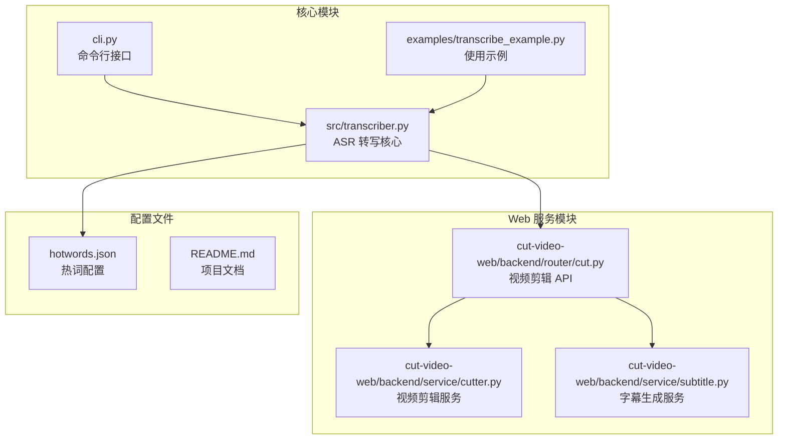
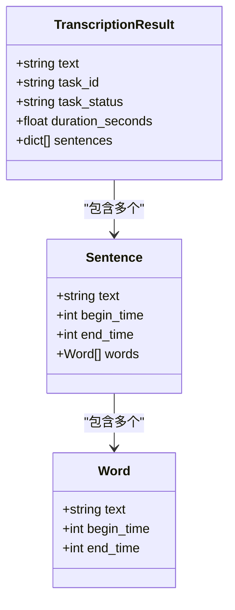
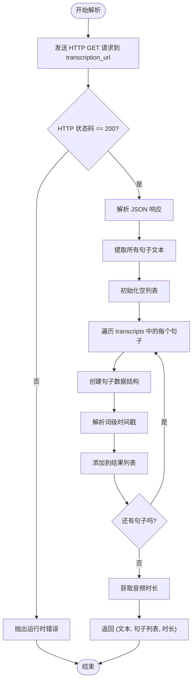
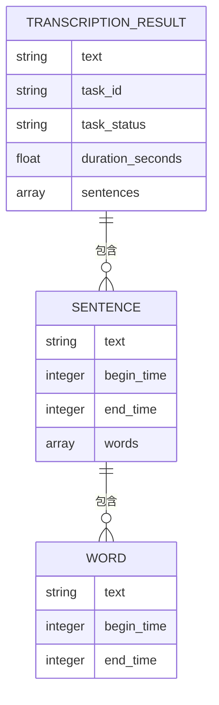
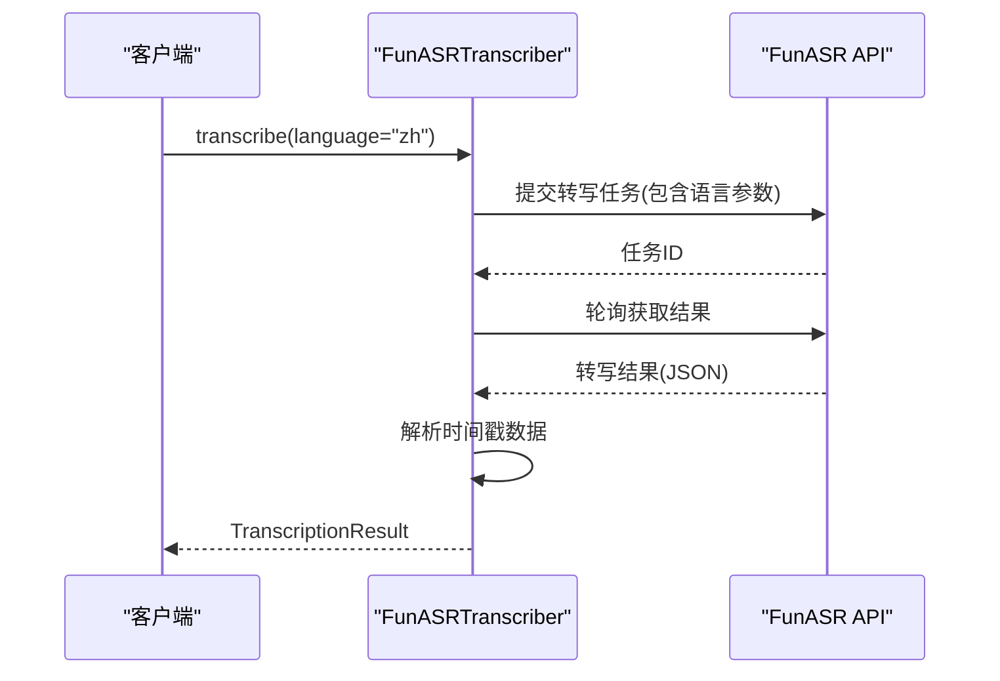
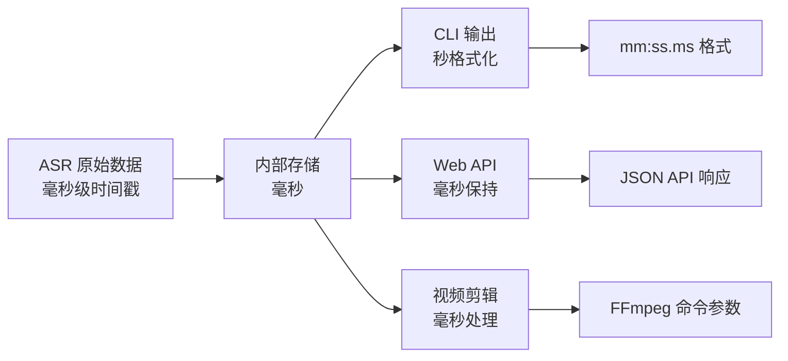
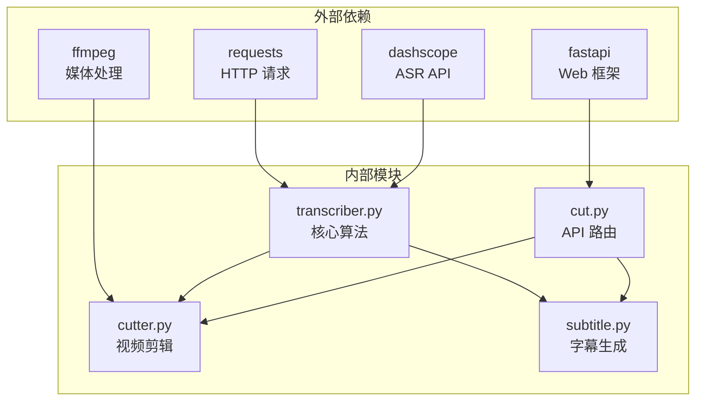

# 时间戳解析算法

<cite>
**本文档引用的文件**
- [src/transcriber.py](file://src/transcriber.py)
- [cut-video-web/backend/service/subtitle.py](file://cut-video-web/backend/service/subtitle.py)
- [cut-video-web/backend/router/cut.py](file://cut-video-web/backend/router/cut.py)
- [cut-video-web/backend/service/cutter.py](file://cut-video-web/backend/service/cutter.py)
- [cli.py](file://cli.py)
- [examples/transcribe_example.py](file://examples/transcribe_example.py)
- [README.md](file://README.md)
- [hotwords.json](file://hotwords.json)
- [cut-video-web/backend/uploads/12bcc08a_result.json](file://cut-video-web/backend/uploads/12bcc08a_result.json)
</cite>

## 目录
1. [简介](#简介)
2. [项目结构](#项目结构)
3. [核心组件](#核心组件)
4. [架构概览](#架构概览)
5. [详细组件分析](#详细组件分析)
6. [依赖关系分析](#依赖关系分析)
7. [性能考虑](#性能考虑)
8. [故障排除指南](#故障排除指南)
9. [结论](#结论)

## 简介

本项目是一个基于阿里云百炼 FunASR API 的时间戳解析算法系统，专门用于处理语音识别结果中的词级时间戳数据。该系统能够从音频或视频文件中提取精确的时间戳信息，支持多语言识别，并提供完整的视频剪辑和字幕生成功能。

时间戳解析算法的核心在于准确解析来自 ASR 服务的 JSON 数据，提取句子级别的整体时间戳以及词级别的精细时间戳，为后续的视频编辑、字幕生成和精确剪辑提供基础数据支持。

## 项目结构

该项目采用模块化设计，主要分为以下几个核心模块：



**图表来源**
- [src/transcriber.py:1-316](file://src/transcriber.py#L1-L316)
- [cli.py:1-180](file://cli.py#L1-L180)
- [cut-video-web/backend/router/cut.py:1-232](file://cut-video-web/backend/router/cut.py#L1-L232)

**章节来源**
- [README.md:190-310](file://README.md#L190-L310)

## 核心组件

### TranscriptionResult 数据结构

`TranscriptionResult` 是整个时间戳解析系统的核心数据结构，负责承载完整的转写结果信息：



**图表来源**
- [src/transcriber.py:34-42](file://src/transcriber.py#L34-L42)

### FunASRTranscriber 类

`FunASRTranscriber` 类是时间戳解析算法的主要实现者，提供了完整的 ASR 转写流程：

**章节来源**
- [src/transcriber.py:95-316](file://src/transcriber.py#L95-L316)

## 架构概览

整个系统采用分层架构设计，从底层的音频处理到上层的应用服务：

```mermaid
graph TB
subgraph "输入层"
A[音频/视频文件]
B[热词配置]
end
subgraph "处理层"
C[音频提取<br/>(FFmpeg)]
D[ASR 转写<br/>(FunASR API)]
E[时间戳解析<br/>(_get_transcription_text)]
end
subgraph "应用层"
F[CLI 工具]
G[Web API]
H[视频剪辑]
I[字幕生成]
end
subgraph "输出层"
J[转写文本]
K[时间戳数据]
L[剪辑视频]
M[SRT 字幕]
end
A --> C
B --> D
C --> D
D --> E
E --> F
E --> G
G --> H
G --> I
H --> L
I --> M
E --> J
E --> K
```

**图表来源**
- [src/transcriber.py:157-202](file://src/transcriber.py#L157-L202)
- [cut-video-web/backend/router/cut.py:51-106](file://cut-video-web/backend/router/cut.py#L51-L106)

## 详细组件分析

### _get_transcription_text 方法实现

这是时间戳解析算法的核心方法，负责从 ASR 服务返回的 JSON 数据中提取和解析时间戳信息。

#### 方法签名和参数
- **方法名**: `_get_transcription_text`
- **参数**: `transcription_url` (转写结果 URL)
- **返回值**: `(转写文本, 句子列表, 音频时长)`
- **作用**: 从 transcription_url 获取最终的转写文本和时间戳数据

#### 实现流程



**图表来源**
- [src/transcriber.py:157-202](file://src/transcriber.py#L157-L202)

#### 数据解析过程详解

1. **HTTP 请求处理**: 使用 `requests.get()` 获取转写结果
2. **JSON 解析**: 从响应中提取 `transcripts` 数组
3. **句子级时间戳提取**: 遍历每个 transcript 的 `sentences` 数组
4. **词级时间戳解析**: 对每个句子的 `words` 数组进行处理
5. **音频时长获取**: 从 `properties.original_duration_in_milliseconds` 获取时长

#### 时间戳数据结构

每个解析出的句子包含以下字段：
- `text`: 句子文本内容
- `begin_time`: 句子开始时间（毫秒）
- `end_time`: 句子结束时间（毫秒）
- `words`: 词级时间戳数组

每个词包含：
- `text`: 词文本
- `begin_time`: 词开始时间（毫秒）
- `end_time`: 词结束时间（毫秒）

**章节来源**
- [src/transcriber.py:157-202](file://src/transcriber.py#L157-L202)
- [cut-video-web/backend/uploads/12bcc08a_result.json:5-371](file://cut-video-web/backend/uploads/12bcc08a_result.json#L5-L371)

### TranscriptionResult 数据结构设计

`TranscriptionResult` 数据结构经过精心设计，确保了数据的完整性和可用性：



**图表来源**
- [src/transcriber.py:34-42](file://src/transcriber.py#L34-L42)

#### 字段详细说明

| 字段名 | 类型 | 必填 | 描述 | 单位 |
|--------|------|------|------|------|
| `text` | string | 是 | 完整的转写文本 | 文本字符 |
| `task_id` | string | 是 | ASR 任务标识符 | UUID字符串 |
| `task_status` | string | 是 | 任务执行状态 | 状态枚举 |
| `duration_seconds` | float | 否 | 音频总时长 | 秒 |
| `sentences` | List[dict] | 否 | 包含时间戳的句子列表 | 结构化数据 |

**章节来源**
- [src/transcriber.py:34-42](file://src/transcriber.py#L34-L42)
- [README.md:134-143](file://README.md#L134-L143)

### 多语言支持实现

系统支持多种语言的语音识别，主要通过 `language` 参数实现：

#### 语言参数使用



**图表来源**
- [src/transcriber.py:208-212](file://src/transcriber.py#L208-L212)
- [examples/transcribe_example.py:44-49](file://examples/transcribe_example.py#L44-L49)

#### 支持的语言类型

- **中文 (zh)**: 默认语言，支持普通话和方言
- **英文 (en)**: 支持标准英语发音
- **其他语言**: 根据具体模型支持情况而定

**章节来源**
- [examples/transcribe_example.py:44-49](file://examples/transcribe_example.py#L44-L49)
- [README.md:7-9](file://README.md#L7-L9)

### 时间戳精度和单位转换

时间戳系统采用毫秒级精度，这是通过 ASR 服务提供的原始数据实现的：

#### 时间戳单位转换



**图表来源**
- [cli.py:29-34](file://cli.py#L29-L34)
- [cut-video-web/backend/router/cut.py:191-218](file://cut-video-web/backend/router/cut.py#L191-L218)

#### 精度控制机制

1. **毫秒级精度**: ASR 服务提供毫秒级时间戳
2. **内部统一**: 系统内部统一使用毫秒表示
3. **格式化输出**: CLI 工具将毫秒转换为更易读的格式
4. **精确计算**: 视频剪辑时保持毫秒精度

**章节来源**
- [README.md:144-183](file://README.md#L144-L183)
- [cli.py:143-158](file://cli.py#L143-L158)

## 依赖关系分析

系统各组件之间的依赖关系如下：



**图表来源**
- [src/transcriber.py:16-19](file://src/transcriber.py#L16-L19)
- [cut-video-web/backend/service/cutter.py:7-11](file://cut-video-web/backend/service/cutter.py#L7-L11)

### 组件耦合度分析

- **低耦合**: 核心算法与应用层分离良好
- **高内聚**: 相关功能集中在相应模块中
- **清晰边界**: 每个模块职责明确，接口简单

**章节来源**
- [src/transcriber.py:1-316](file://src/transcriber.py#L1-L316)
- [cut-video-web/backend/router/cut.py:1-232](file://cut-video-web/backend/router/cut.py#L1-L232)

## 性能考虑

### 时间复杂度分析

1. **时间戳解析**: O(n)，其中 n 为句子数量
2. **词级时间戳处理**: O(m)，其中 m 为词数量
3. **视频剪辑**: O(k)，其中 k 为保留段数量

### 内存使用优化

- **流式处理**: 大文件通过流式方式处理
- **批量操作**: 合并相邻时间段减少内存占用
- **及时释放**: 处理完成后及时释放临时资源

### 并发处理

- **异步轮询**: ASR 任务轮询采用异步方式
- **多线程支持**: FFmpeg 操作支持并发处理
- **资源池管理**: 外部依赖连接池优化

## 故障排除指南

### 常见问题及解决方案

#### ASR API 错误

| 错误类型 | 可能原因 | 解决方案 |
|----------|----------|----------|
| API Key 无效 | 环境变量未设置或过期 | 检查 DASHSCOPE_API_KEY 环境变量 |
| 网络超时 | 网络连接不稳定 | 检查网络连接，重试请求 |
| 任务失败 | 输入文件格式不支持 | 确认音频/视频格式支持 |

#### 时间戳解析错误

| 错误类型 | 可能原因 | 解决方案 |
|----------|----------|----------|
| JSON 解析失败 | API 响应格式异常 | 检查 API 返回格式 |
| 时间戳缺失 | ASR 服务未启用时间戳 | 确认 timestamp_alignment_enabled 参数 |
| 单位转换错误 | 时间戳单位不正确 | 检查毫秒与秒的转换逻辑 |

#### 视频剪辑问题

| 错误类型 | 可能原因 | 解决方案 |
|----------|----------|----------|
| FFmpeg 未安装 | 系统缺少 FFmpeg | 安装 FFmpeg 并配置 PATH |
| 时间段重叠 | 保留时间段有重叠 | 合并相邻时间段 |
| 剪辑失败 | 输入文件损坏 | 检查输入文件完整性 |

**章节来源**
- [src/transcriber.py:167-171](file://src/transcriber.py#L167-L171)
- [cut-video-web/backend/service/cutter.py:121-129](file://cut-video-web/backend/service/cutter.py#L121-L129)

## 结论

时间戳解析算法系统通过精心设计的数据结构和高效的处理流程，成功实现了从 ASR 服务到应用层的完整时间戳数据链路。系统具有以下特点：

1. **准确性**: 采用毫秒级精度，确保时间戳的精确性
2. **可扩展性**: 模块化设计支持功能扩展和维护
3. **易用性**: 提供多种接口和工具，满足不同使用场景
4. **可靠性**: 完善的错误处理和故障恢复机制

该系统为视频编辑、字幕生成和精确剪辑等应用场景提供了坚实的技术基础，能够满足专业用户对时间戳精度和功能完整性的要求。