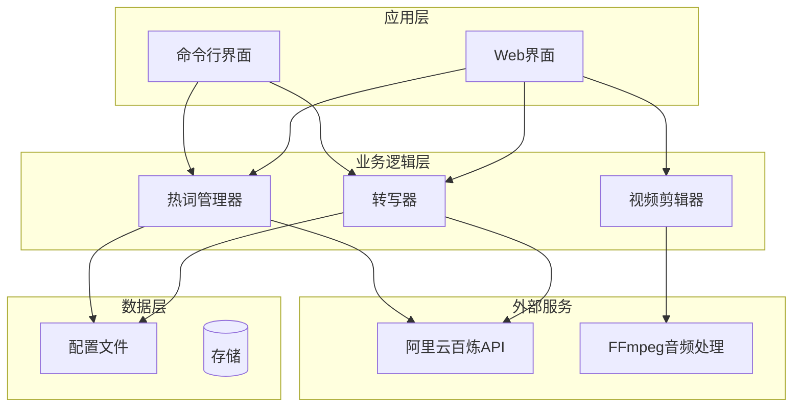
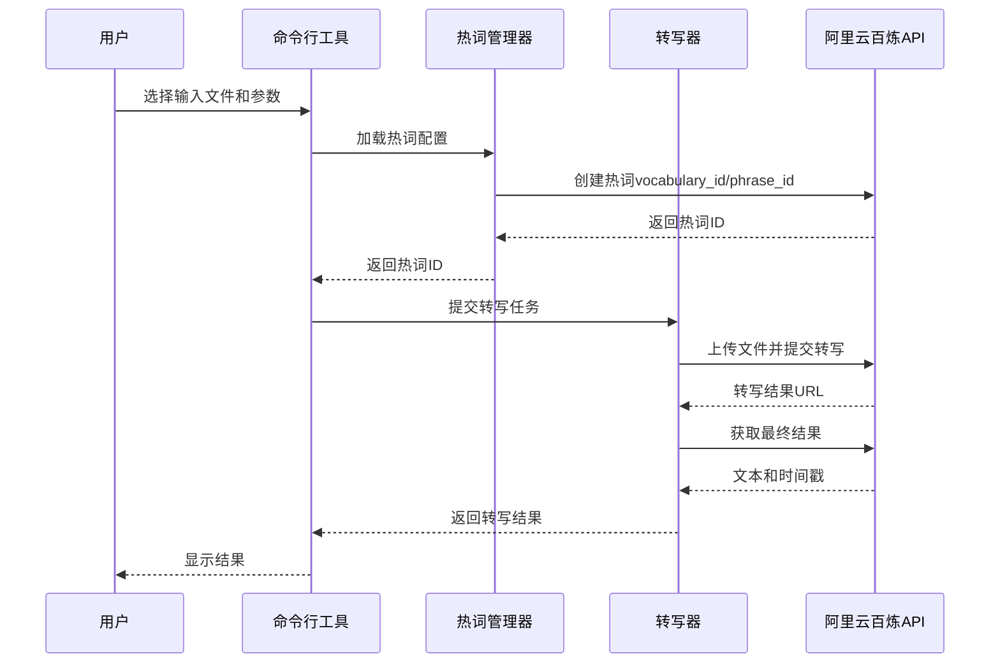
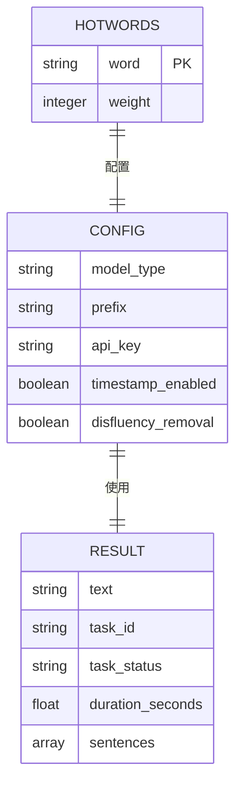
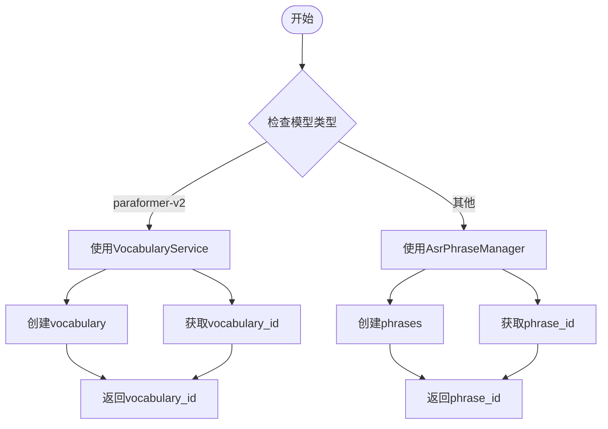
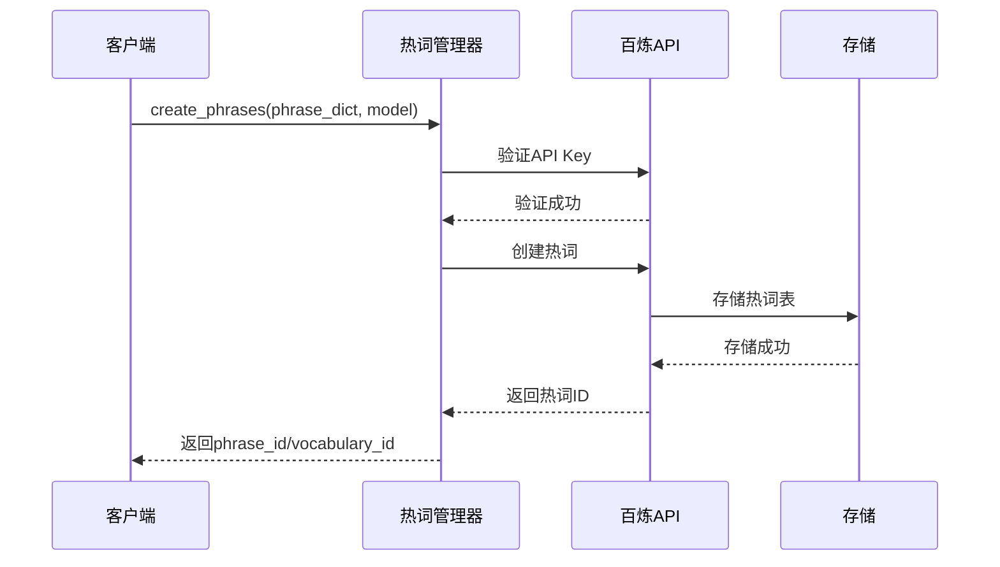
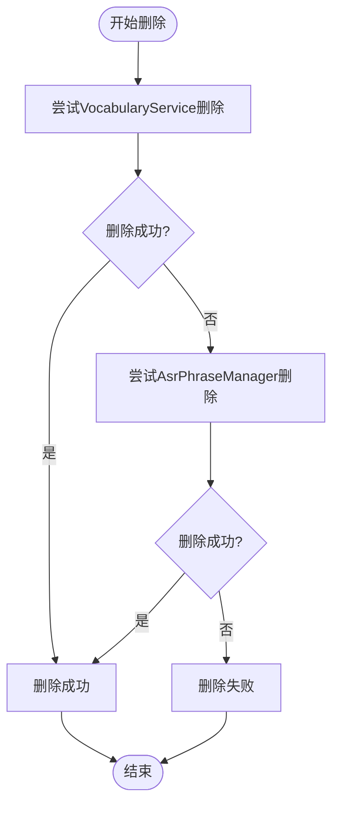
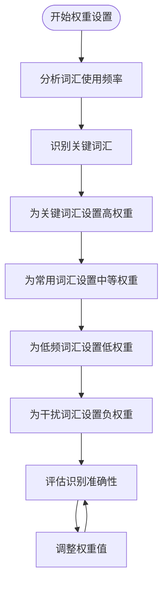
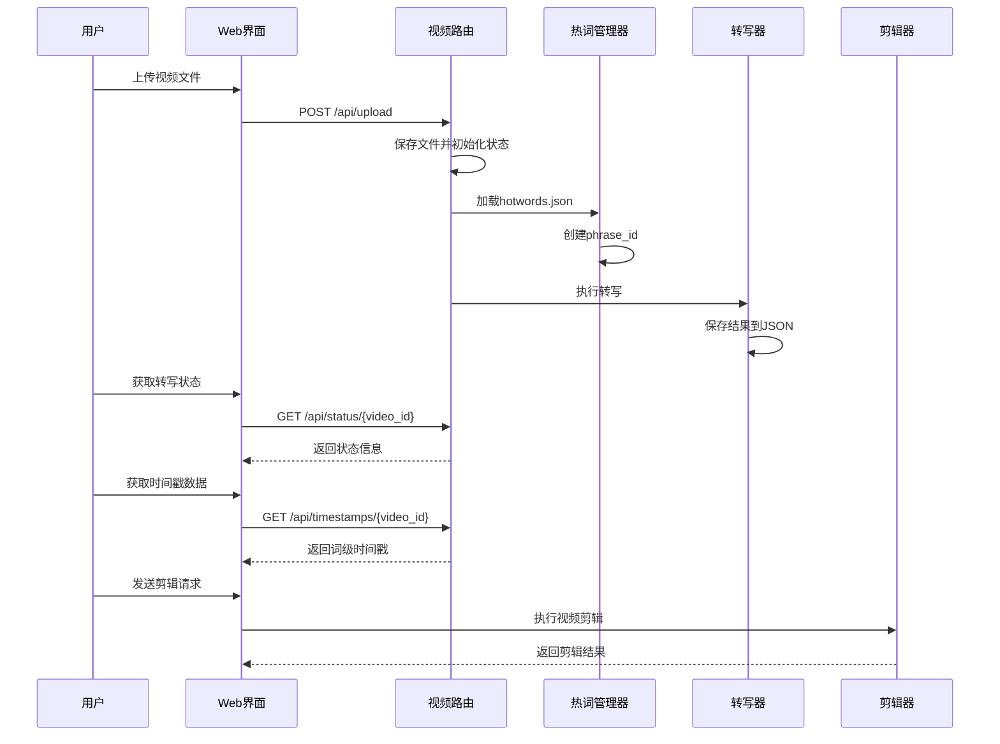
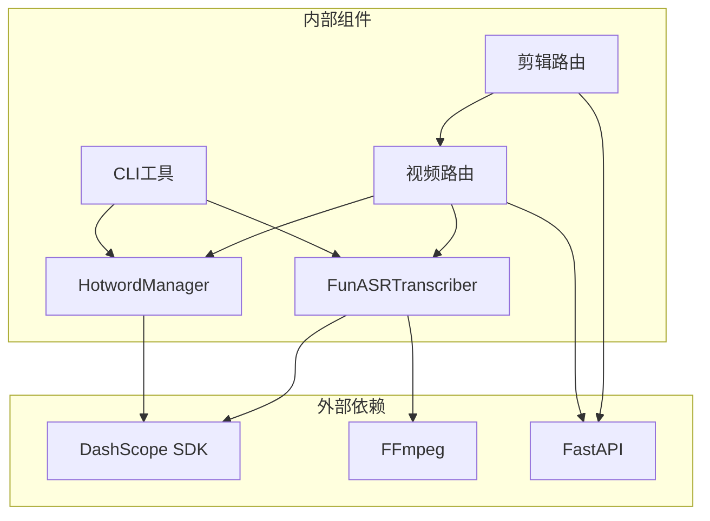

# 热词管理系统

<cite>
**本文档引用的文件**
- [hotword.py](file://src/hotword.py)
- [hotwords.json](file://hotwords.json)
- [cli.py](file://cli.py)
- [transcriber.py](file://src/transcriber.py)
- [README.md](file://README.md)
- [video.py](file://cut-video-web/backend/router/video.py)
- [cut.py](file://cut-video-web/backend/router/cut.py)
- [main.py](file://cut-video-web/backend/main.py)
- [transcribe_example.py](file://examples/transcribe_example.py)
</cite>

## 目录
1. [简介](#简介)
2. [项目结构](#项目结构)
3. [核心组件](#核心组件)
4. [架构概览](#架构概览)
5. [详细组件分析](#详细组件分析)
6. [依赖关系分析](#依赖关系分析)
7. [性能考虑](#性能考虑)
8. [故障排除指南](#故障排除指南)
9. [结论](#结论)
10. [附录](#附录)

## 简介

热词管理系统是一个基于阿里云百炼 DashScope API 的语音识别增强工具，专门用于提升特定词汇的识别准确率。该系统支持两种模型版本：Paraformer v1 和 Paraformer v2，每种模型都有不同的热词管理机制和API接口。

系统的核心功能包括：
- 热词配置文件管理（JSON格式）
- 热词ID生命周期管理（创建、查询、删除、更新）
- 权重管理机制（增强和减弱效果）
- 多模型支持（v1和v2）
- Web界面集成（视频剪辑和字幕生成）

## 项目结构

该项目采用分层架构设计，主要分为以下几个层次：

**图表来源**
- [hotword.py:1-92](file://src/hotword.py#L1-L92)
- [transcriber.py:95-316](file://src/transcriber.py#L95-L316)
- [cli.py:36-180](file://cli.py#L36-L180)

**章节来源**
- [README.md:190-206](file://README.md#L190-L206)
- [main.py:1-84](file://cut-video-web/backend/main.py#L1-L84)

## 核心组件

### 热词管理器（HotwordManager）

热词管理器是系统的核心组件，负责热词的创建、删除和配置文件加载。它支持两种模型版本的不同API调用方式。

**主要功能：**
- 热词创建（支持v1和v2模型）
- 热词删除（统一接口）
- 配置文件加载（JSON格式）
- API密钥管理

**章节来源**
- [hotword.py:13-92](file://src/hotword.py#L13-L92)

### 转写器（FunASRTranscriber）

转写器封装了阿里云百炼的ASR API，提供了统一的转写接口，支持多种模型类型和热词参数。

**主要功能：**
- 文件上传和管理
- 转写任务提交和轮询
- 结果解析和时间戳提取
- 多模型支持

**章节来源**
- [transcriber.py:95-316](file://src/transcriber.py#L95-L316)

### 命令行界面

提供了完整的命令行工具，支持各种转写选项和热词配置。

**主要功能：**
- 模型选择和配置
- 热词文件管理
- 输出格式控制
- 语言提示设置

**章节来源**
- [cli.py:36-180](file://cli.py#L36-L180)

## 架构概览

系统采用客户端-服务器架构，结合了命令行工具和Web界面两种使用方式：

**图表来源**
- [cli.py:104-137](file://cli.py#L104-L137)
- [hotword.py:23-69](file://src/hotword.py#L23-L69)
- [transcriber.py:203-294](file://src/transcriber.py#L203-L294)

## 详细组件分析

### 热词配置文件结构

热词配置文件采用JSON格式，支持中英文混合词汇，具有严格的格式要求：

#### 数据模型定义

**图表来源**
- [hotwords.json:1-17](file://hotwords.json#L1-L17)
- [hotword.py:88-92](file://src/hotword.py#L88-L92)

#### 字段定义和约束

| 字段名 | 类型 | 必需 | 说明 | 限制条件 |
|--------|------|------|------|----------|
| word | string | 是 | 热词文本 | 中文≤10字符，英文/混合≤5词 |
| weight | integer | 是 | 权重值 | [1,5]增强, [-6,-1]减弱 |
| model_type | string | 否 | 模型类型 | "paraformer-v1"或"paraformer-v2" |
| prefix | string | 否 | 热词表前缀 | 最长10字符，仅英文数字 |

**章节来源**
- [hotwords.json:1-17](file://hotwords.json#L1-L17)
- [README.md:99-104](file://README.md#L99-L104)

### v1和v2模型热词API差异

#### API端点对比

| 特性 | v1模型 (AsrPhraseManager) | v2模型 (VocabularyService) |
|------|---------------------------|---------------------------|
| API类 | AsrPhraseManager | VocabularyService |
| 返回ID | phrase_id | vocabulary_id |
| 参数名称 | phrase_id | vocabulary_id |
| 权重范围 | [1,5]增强, [-6,-1]减弱 | [1,5]增强, [-6,-1]减弱 |
| 热词数量 | 最多500个 | 最多500个 |
| 中文长度 | ≤10字符 | ≤10字符 |
| 英文长度 | ≤5词 | ≤5词 |

#### 模型选择逻辑

**图表来源**
- [hotword.py:44-69](file://src/hotword.py#L44-L69)
- [transcriber.py:30-31](file://src/transcriber.py#L30-L31)

**章节来源**
- [hotword.py:9-10](file://src/hotword.py#L9-L10)
- [README.md:220-226](file://README.md#L220-L226)

### 热词ID生命周期管理

#### 创建流程

**图表来源**
- [hotword.py:23-69](file://src/hotword.py#L23-L69)

#### 删除流程

**图表来源**
- [hotword.py:72-85](file://src/hotword.py#L72-L85)

**章节来源**
- [hotword.py:72-85](file://src/hotword.py#L72-L85)

### 权重管理机制

#### 权重值范围和效果

| 权重范围 | 效果 | 适用场景 | 示例 |
|----------|------|----------|------|
| [1,5] | 增强识别 | 重要词汇、专业术语 | "运维": 5, "HTTP": 2 |
| [-6,-1] | 减弱识别 | 语气词、填充词 | "-1"用于减少干扰词 |
| 0 | 不变 | 默认权重 | 不建议使用 |

#### 权重设置策略

**图表来源**
- [hotwords.json:1-17](file://hotwords.json#L1-L17)

**章节来源**
- [README.md:99-104](file://README.md#L99-L104)

### Web界面集成

#### 视频转写流程

**图表来源**
- [video.py:166-234](file://cut-video-web/backend/router/video.py#L166-L234)
- [cut.py:51-110](file://cut-video-web/backend/router/cut.py#L51-L110)

**章节来源**
- [video.py:166-234](file://cut-video-web/backend/router/video.py#L166-L234)
- [cut.py:51-110](file://cut-video-web/backend/router/cut.py#L51-L110)

## 依赖关系分析

### 组件依赖图

**图表来源**
- [hotword.py:6](file://src/hotword.py#L6)
- [transcriber.py:17-18](file://src/transcriber.py#L17-L18)
- [main.py:19-23](file://cut-video-web/backend/main.py#L19-L23)

### 外部API依赖

系统主要依赖以下外部服务：

| 服务 | 用途 | 版本要求 | 依赖项 |
|------|------|----------|--------|
| 阿里云百炼ASR | 语音识别和热词管理 | 最新版本 | dashscope |
| FFmpeg | 音频提取和视频处理 | 4.0+ | ffmpeg-python |
| FastAPI | Web服务框架 | 0.95+ | fastapi, uvicorn |

**章节来源**
- [transcriber.py:54-92](file://src/transcriber.py#L54-L92)
- [main.py:19-23](file://cut-video-web/backend/main.py#L19-L23)

## 性能考虑

### 热词优化策略

1. **权重优化**
   - 关键词汇使用较高权重（4-5）
   - 常用词汇使用中等权重（2-3）
   - 低频词汇使用较低权重（1）
   - 干扰词汇使用负权重（-1到-6）

2. **词汇选择原则**
   - 优先选择专业术语和品牌名称
   - 避免添加过于常见的通用词汇
   - 控制热词数量在合理范围内（建议不超过200个）

3. **模型选择**
   - 中文场景优先选择v1模型（热词效果更好）
   - 多语种场景选择v2模型（多语种支持更好）

### 内存和存储优化

- 热词配置文件大小控制在合理范围内
- 及时清理不再使用的热词ID
- 合理设置API超时时间

## 故障排除指南

### 常见问题及解决方案

#### API密钥问题

**问题症状：**
- "API key未设置"错误
- "DASHSCOPE_API_KEY环境变量未设置"

**解决方法：**
1. 设置环境变量：`export DASHSCOPE_API_KEY='your-api-key'`
2. 在项目根目录创建`.env`文件
3. 确保API密钥有效且有足够配额

#### 热词创建失败

**问题症状：**
- "热词创建失败"异常
- 权重超出范围错误

**解决方法：**
1. 检查权重值是否在允许范围内
2. 验证词汇格式是否正确
3. 确认热词数量未超过限制

#### 转写任务失败

**问题症状：**
- "转写失败"错误
- "提交任务失败"异常

**解决方法：**
1. 检查文件格式和大小
2. 验证网络连接
3. 确认模型类型正确

**章节来源**
- [hotword.py:65-66](file://src/hotword.py#L65-L66)
- [transcriber.py:114-120](file://src/transcriber.py#L114-L120)

### 调试技巧

1. **启用详细日志**
   - 在命令行中添加调试参数
   - 查看系统日志输出

2. **测试最小化配置**
   - 使用简单的热词配置进行测试
   - 逐步增加复杂度

3. **监控API使用情况**
   - 定期检查API配额
   - 监控错误率和响应时间

## 结论

热词管理系统提供了一个完整、高效的语音识别增强解决方案。通过合理的热词配置和权重管理，可以显著提升特定词汇的识别准确率。系统支持多种使用方式，包括命令行工具和Web界面，满足不同用户的需求。

关键优势：
- 支持v1和v2两种模型，适应不同场景需求
- 提供完整的热词生命周期管理
- 具备良好的扩展性和维护性
- 集成了Web界面，提供直观的操作体验

建议：
- 根据具体应用场景选择合适的模型版本
- 合理设置热词权重，避免过度依赖
- 定期清理不再使用的热词配置
- 监控API使用情况，确保服务稳定性

## 附录

### 最佳实践指南

#### 热词配置最佳实践

1. **词汇分类策略**
   - 专业术语：使用高权重（4-5）
   - 常用词汇：使用中等权重（2-3）
   - 低频词汇：使用低权重（1）
   - 干扰词汇：使用负权重（-1到-6）

2. **权重设置建议**
   - 避免使用0权重
   - 不要超过5的正权重
   - 负权重不要低于-6
   - 保持权重分布的合理性

3. **性能优化建议**
   - 控制热词数量在200个以内
   - 定期清理无效热词
   - 使用合适的模型版本
   - 优化词汇选择策略

#### 常见使用场景

1. **会议记录**
   - 重点关注专业术语和品牌名称
   - 适当减弱语气词和填充词
   - 使用v2模型支持多语种

2. **访谈节目**
   - 强调主持人和嘉宾的专业术语
   - 减弱现场噪音词汇
   - 使用v1模型获得更好的中文效果

3. **产品演示**
   - 重点突出产品名称和特性
   - 增强技术术语的识别
   - 适当减弱无关的背景词汇

**章节来源**
- [README.md:77-132](file://README.md#L77-L132)
- [hotwords.json:1-17](file://hotwords.json#L1-L17)