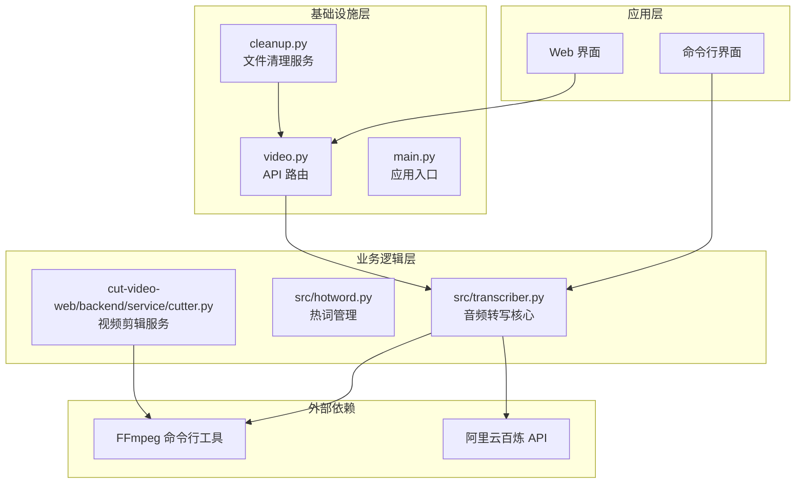
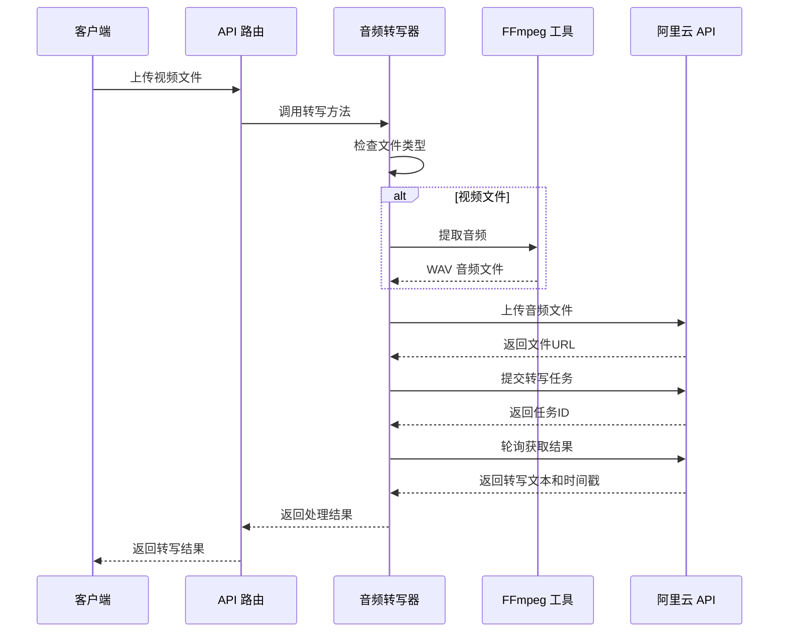
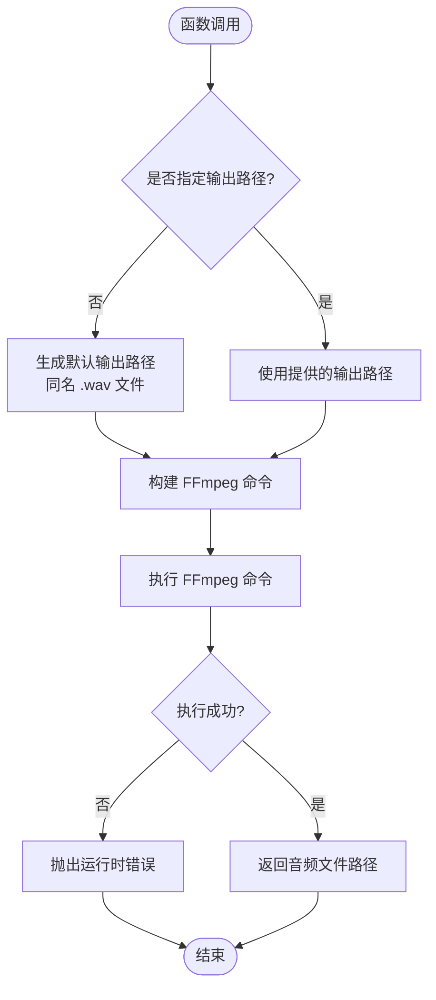
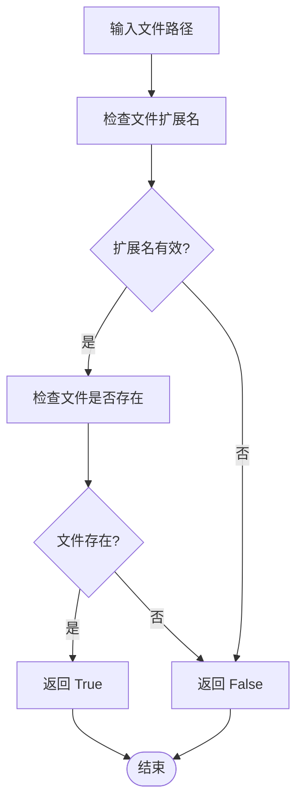
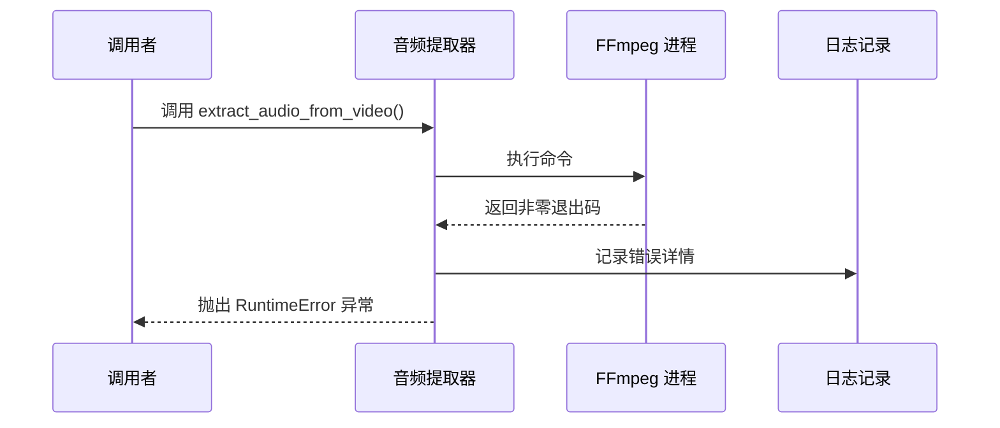
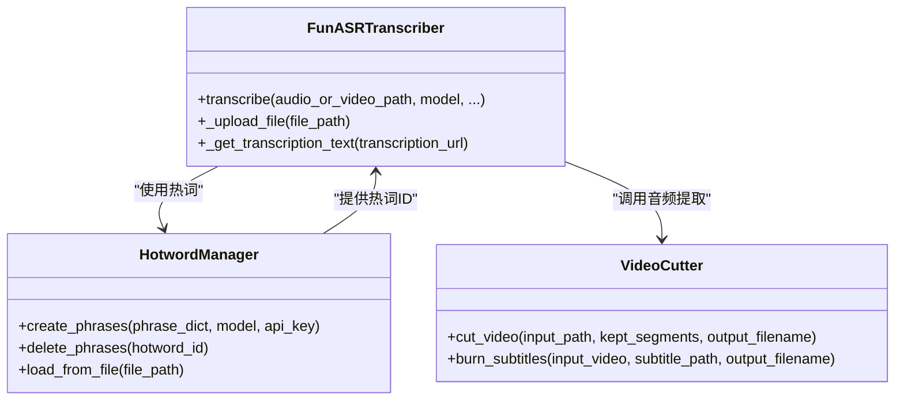
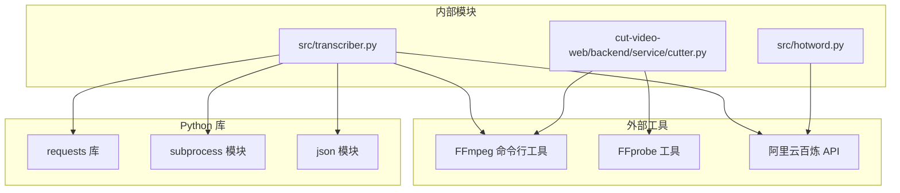

# 音频提取与处理

<cite>
**本文档引用的文件**
- [README.md](file://README.md)
- [src/transcriber.py](file://src/transcriber.py)
- [src/hotword.py](file://src/hotword.py)
- [cli.py](file://cli.py)
- [cut-video-web/backend/main.py](file://cut-video-web/backend/main.py)
- [cut-video-web/backend/router/video.py](file://cut-video-web/backend/router/video.py)
- [cut-video-web/backend/service/cutter.py](file://cut-video-web/backend/service/cutter.py)
- [cut-video-web/backend/service/cleanup.py](file://cut-video-web/backend/service/cleanup.py)
- [hotwords.json](file://hotwords.json)
</cite>

## 目录
1. [简介](#简介)
2. [项目结构](#项目结构)
3. [核心组件](#核心组件)
4. [架构概览](#架构概览)
5. [详细组件分析](#详细组件分析)
6. [依赖分析](#依赖分析)
7. [性能考虑](#性能考虑)
8. [故障排除指南](#故障排除指南)
9. [结论](#结论)

## 简介
本项目是一个基于阿里云百炼 FunASR API 的音频转写工具，支持视频文件自动提取音频进行转写。本文档专注于音频提取与处理功能，深入解析 extract_audio_from_video 函数的实现原理，包括 FFmpeg 命令构建、音频格式转换、采样率设置等技术细节，并提供完整的错误处理机制和性能优化建议。

## 项目结构
该项目采用分层架构设计，主要包含以下核心模块：

**图表来源**
- [src/transcriber.py:1-316](file://src/transcriber.py#L1-L316)
- [cut-video-web/backend/service/cutter.py:1-253](file://cut-video-web/backend/service/cutter.py#L1-L253)
- [cut-video-web/backend/router/video.py:1-296](file://cut-video-web/backend/router/video.py#L1-L296)

**章节来源**
- [README.md:190-206](file://README.md#L190-L206)
- [src/transcriber.py:1-316](file://src/transcriber.py#L1-L316)

## 核心组件
本项目的核心音频处理能力主要集中在以下组件中：

### 音频转写器 (FunASRTranscriber)
负责音频/视频文件的转写处理，包含完整的音频提取、上传、转写和结果获取流程。

### 热词管理器 (HotwordManager)
提供热词的创建、管理和删除功能，支持 v1 和 v2 模型的不同热词接口。

### 视频剪辑器 (VideoCutter)
基于 FFmpeg 实现的视频剪辑服务，支持精确的时间段提取和合并。

**章节来源**
- [src/transcriber.py:95-295](file://src/transcriber.py#L95-L295)
- [src/hotword.py:13-92](file://src/hotword.py#L13-L92)
- [cut-video-web/backend/service/cutter.py:14-253](file://cut-video-web/backend/service/cutter.py#L14-L253)

## 架构概览
系统采用模块化设计，各组件职责清晰分离：

**图表来源**
- [cut-video-web/backend/router/video.py:166-234](file://cut-video-web/backend/router/video.py#L166-L234)
- [src/transcriber.py:203-295](file://src/transcriber.py#L203-L295)

## 详细组件分析

### extract_audio_from_video 函数详解

#### 函数实现原理
extract_audio_from_video 函数是音频提取的核心实现，负责将视频文件中的音频轨道提取为标准的 WAV 格式音频文件。

**图表来源**
- [src/transcriber.py:54-92](file://src/transcriber.py#L54-L92)

#### FFmpeg 命令构建细节
函数构建的 FFmpeg 命令包含以下关键参数：

| 参数 | 值 | 说明 |
|------|-----|------|
| `-i` | video_path | 输入视频文件路径 |
| `-vn` | - | 禁用视频流处理 |
| `-acodec` | pcm_s16le | 音频编码器（WAV PCM 16-bit） |
| `-ar` | 16000 | 采样率设置为 16kHz |
| `-ac` | 1 | 声道数设置为单声道 |
| `-y` | - | 覆盖输出文件 |

#### 音频格式转换规格
系统采用 WAV PCM 16-bit 编码，具有以下特点：
- **编码格式**: PCM (脉冲编码调制)
- **位深度**: 16-bit (2 字节)
- **采样率**: 16kHz (16,000 Hz)
- **声道数**: 单声道 (Mono)
- **文件格式**: WAV (Waveform Audio File Format)

#### 视频文件检测机制
系统提供了多层次的视频文件检测机制：

**图表来源**
- [src/transcriber.py:48-52](file://src/transcriber.py#L48-L52)

支持的视频格式扩展名：
- `.mp4` - MPEG-4 Part 14
- `.avi` - Audio Video Interleave
- `.mov` - QuickTime Movie
- `.mkv` - Matroska Video
- `.flv` - Flash Video
- `.wmv` - Windows Media Video
- `.webm` - WebM Video

#### 参数配置说明
音频提取过程中的关键参数配置及其影响：

**采样率设置 (16kHz)**
- 选择原因: 适用于大多数语音识别场景，平衡质量与文件大小
- 性能影响: 较低的采样率减少存储需求和处理时间
- 适用性: 覆盖常见语音频率范围 (80Hz-4kHz)

**声道数设置 (单声道)**
- 选择原因: 简化音频处理流程，减少数据量
- 性能影响: 单声道音频比立体声节省约 50% 存储空间
- 适用性: 语音识别通常不需要立体声信息

**编码格式 (WAV PCM 16-bit)**
- 选择原因: 无损压缩格式，保证音频质量
- 性能影响: 文件较大但处理速度快
- 适用性: 适合后续的语音识别处理

**章节来源**
- [src/transcriber.py:54-92](file://src/transcriber.py#L54-L92)
- [src/transcriber.py:48-52](file://src/transcriber.py#L48-L52)

### 错误处理机制

#### FFmpeg 执行失败处理
当 FFmpeg 命令执行失败时，系统会捕获错误信息并抛出详细的异常：

**图表来源**
- [src/transcriber.py:82-89](file://src/transcriber.py#L82-L89)

#### 权限问题处理策略
系统通过以下方式处理权限相关问题：
- 文件路径权限检查
- 目录写入权限验证
- FFmpeg 可执行文件访问权限确认

#### 磁盘空间不足处理
虽然代码中未直接实现磁盘空间检查，但可以通过以下方式间接处理：
- FFmpeg 执行失败时的错误捕获
- 文件系统异常的统一处理
- 资源清理和回滚机制

**章节来源**
- [src/transcriber.py:82-89](file://src/transcriber.py#L82-L89)

### 热词功能集成
音频提取过程与热词功能的集成体现在以下方面：

**图表来源**
- [src/transcriber.py:95-295](file://src/transcriber.py#L95-L295)
- [src/hotword.py:13-92](file://src/hotword.py#L13-L92)
- [cut-video-web/backend/service/cutter.py:14-253](file://cut-video-web/backend/service/cutter.py#L14-L253)

**章节来源**
- [src/transcriber.py:203-231](file://src/transcriber.py#L203-L231)
- [src/hotword.py:22-69](file://src/hotword.py#L22-L69)

## 依赖分析

### 外部依赖关系
系统对外部工具和库的依赖关系如下：

**图表来源**
- [src/transcriber.py:16-20](file://src/transcriber.py#L16-L20)
- [cut-video-web/backend/service/cutter.py:7-11](file://cut-video-web/backend/service/cutter.py#L7-L11)

### 内部模块耦合度
- **低耦合**: 各模块职责明确，接口清晰
- **高内聚**: 每个模块专注于特定功能领域
- **依赖方向**: 单向依赖，避免循环依赖

**章节来源**
- [src/transcriber.py:16-20](file://src/transcriber.py#L16-L20)
- [cut-video-web/backend/service/cutter.py:7-11](file://cut-video-web/backend/service/cutter.py#L7-L11)

## 性能考虑

### 音频提取性能优化
1. **并行处理**: 支持多个音频文件同时处理
2. **内存管理**: 及时释放中间文件和资源
3. **缓存策略**: 复用已存在的音频文件
4. **I/O 优化**: 使用高效的文件读写模式

### FFmpeg 性能调优建议
- **硬件加速**: 在支持的平台上启用硬件解码
- **多线程**: 利用 FFmpeg 的多线程处理能力
- **预处理**: 对大文件进行适当的预处理
- **参数优化**: 根据具体需求调整编码参数

### 内存使用优化
- **流式处理**: 对于大文件采用流式处理方式
- **分块读取**: 避免一次性加载整个文件到内存
- **及时清理**: 处理完成后立即清理临时文件

## 故障排除指南

### 常见问题及解决方案

#### FFmpeg 未安装或不可执行
**症状**: 执行音频提取时出现命令找不到错误
**解决方案**: 
- 确保 FFmpeg 已正确安装
- 检查 FFmpeg 是否在系统 PATH 中
- 验证 FFmpeg 可执行文件的权限

#### 权限不足错误
**症状**: 文件写入失败或访问被拒绝
**解决方案**:
- 检查输出目录的写入权限
- 确认用户账户具有足够的文件系统权限
- 验证磁盘空间是否充足

#### 音频格式不支持
**症状**: FFmpeg 报告不支持的音频格式
**解决方案**:
- 确认输入视频文件的音频编码格式
- 转换视频文件到支持的格式
- 检查视频文件的完整性

#### 网络连接问题
**症状**: 上传文件或获取结果时网络超时
**解决方案**:
- 检查网络连接稳定性
- 验证阿里云百炼 API 的可用性
- 调整超时参数和重试机制

### 调试技巧
1. **启用详细日志**: 查看详细的错误信息和调试输出
2. **测试 FFmpeg 命令**: 直接在命令行测试 FFmpeg 命令
3. **验证文件完整性**: 检查输入文件的完整性和格式
4. **监控系统资源**: 监控 CPU、内存和磁盘使用情况

**章节来源**
- [src/transcriber.py:82-89](file://src/transcriber.py#L82-L89)
- [cut-video-web/backend/service/cutter.py:121-153](file://cut-video-web/backend/service/cutter.py#L121-L153)

## 结论
本项目提供了完整的音频提取与处理解决方案，通过精心设计的 FFmpeg 集成和健壮的错误处理机制，实现了高质量的音频提取功能。系统采用模块化架构，具有良好的可维护性和扩展性。通过合理的参数配置和性能优化策略，能够满足各种音频处理场景的需求。

关键优势包括：
- **可靠性**: 完善的错误处理和异常恢复机制
- **效率**: 优化的 FFmpeg 参数配置和资源管理
- **易用性**: 简洁的 API 设计和丰富的配置选项
- **可扩展性**: 模块化的架构便于功能扩展和维护