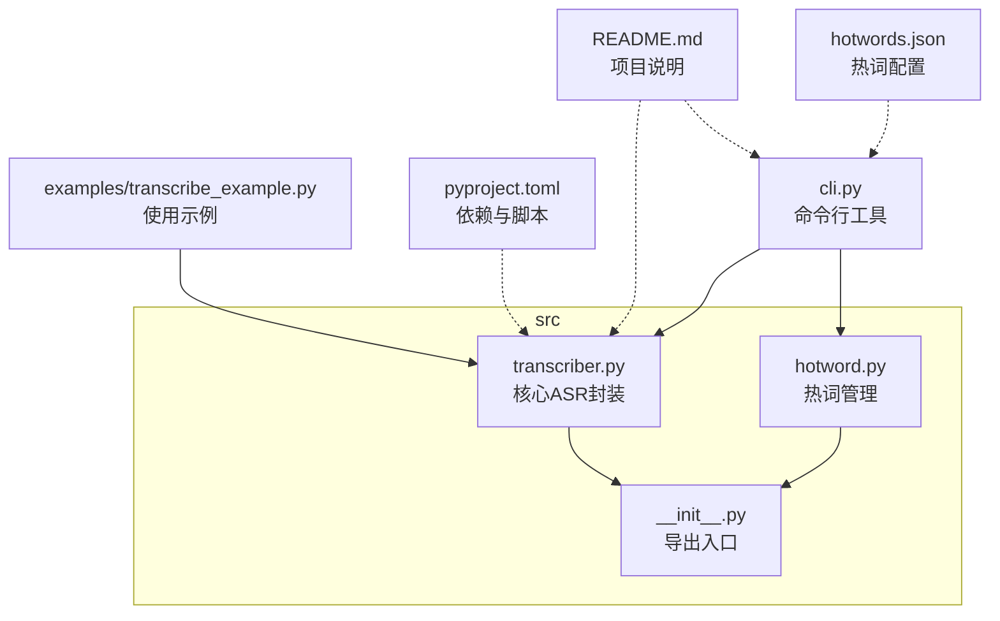
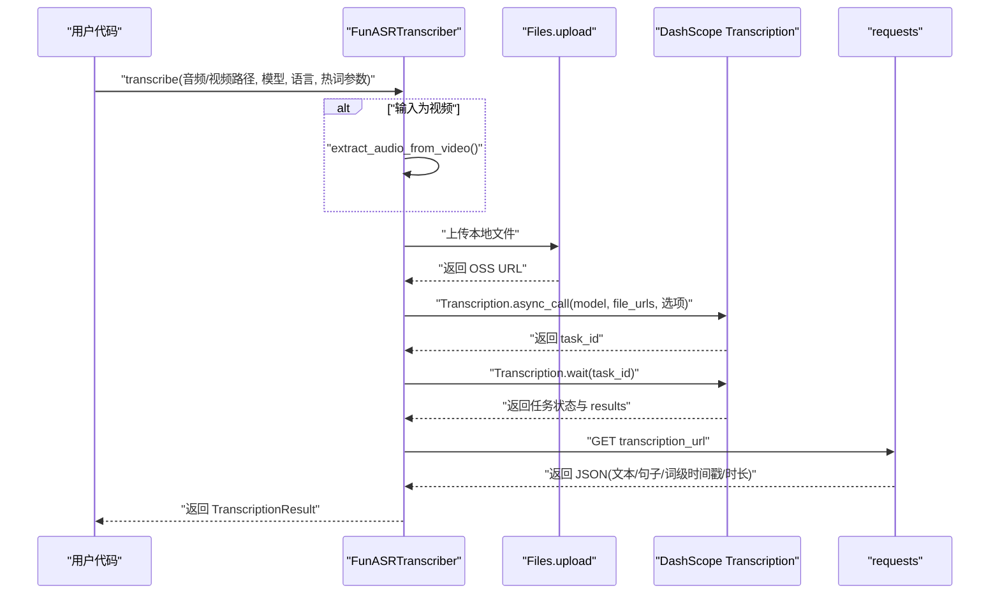
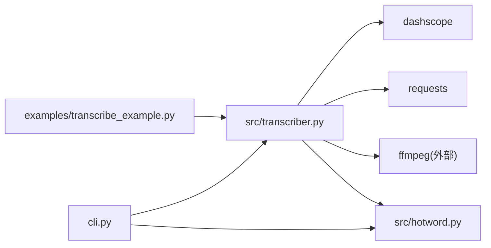

# Python API参考

<cite>
**本文档引用的文件**
- [src/transcriber.py](file://src/transcriber.py)
- [src/__init__.py](file://src/__init__.py)
- [examples/transcribe_example.py](file://examples/transcribe_example.py)
- [README.md](file://README.md)
- [pyproject.toml](file://pyproject.toml)
- [src/hotword.py](file://src/hotword.py)
- [hotwords.json](file://hotwords.json)
- [cli.py](file://cli.py)
</cite>

## 目录
1. [简介](#简介)
2. [项目结构](#项目结构)
3. [核心组件](#核心组件)
4. [架构总览](#架构总览)
5. [详细组件分析](#详细组件分析)
6. [依赖分析](#依赖分析)
7. [性能考虑](#性能考虑)
8. [故障排查指南](#故障排查指南)
9. [结论](#结论)
10. [附录](#附录)

## 简介
本文件为基于阿里云百炼 FunASR 的 Python API 参考文档，重点介绍以下内容：
- FunASRTranscriber 类的设计与使用方法，包括初始化参数、核心方法与返回值类型
- TranscriptionResult 数据结构的属性与使用方式（text、task_id、task_status、duration_seconds、sentences）
- ModelType 枚举的使用方法与各模型特点
- 在 Python 项目中集成 ASR 功能的示例与最佳实践
- 错误处理与异常情况的处理建议
- 性能考虑与优化建议

## 项目结构
该项目采用模块化设计，核心逻辑集中在 src/transcriber.py，提供面向用户的 Python API；CLI 工具位于 cli.py，便于命令行使用；示例位于 examples/transcribe_example.py；热词管理位于 src/hotword.py，并提供默认热词配置 hotwords.json。

图表来源
- [src/transcriber.py:1-316](file://src/transcriber.py#L1-L316)
- [src/hotword.py:1-92](file://src/hotword.py#L1-L92)
- [src/__init__.py:1-9](file://src/__init__.py#L1-L9)
- [examples/transcribe_example.py:1-66](file://examples/transcribe_example.py#L1-L66)
- [cli.py:1-180](file://cli.py#L1-L180)
- [hotwords.json:1-17](file://hotwords.json#L1-L17)
- [README.md:1-310](file://README.md#L1-L310)
- [pyproject.toml:1-25](file://pyproject.toml#L1-L25)

章节来源
- [src/transcriber.py:1-316](file://src/transcriber.py#L1-L316)
- [src/__init__.py:1-9](file://src/__init__.py#L1-L9)
- [README.md:1-310](file://README.md#L1-L310)

## 核心组件
本节概述 Python API 的核心类型与导出接口，帮助快速定位使用入口。

- 导出项（from src.transcriber import ...）
  - FunASRTranscriber：ASR 转写主类
  - ModelType：模型类型枚举
  - TranscriptionResult：转写结果数据结构
  - transcribe_audio：便捷函数（转写单个音频文件）

- 主要依赖
  - dashscope：FunASR 异步转写、文件上传、热词/词汇表服务
  - requests：获取转写结果 URL 的 JSON 数据
  - ffmpeg：视频文件音频提取（外部工具）

章节来源
- [src/__init__.py:1-9](file://src/__init__.py#L1-L9)
- [pyproject.toml:7-14](file://pyproject.toml#L7-L14)

## 架构总览
整体工作流分为四步：输入文件预处理（视频提取音频）、文件上传、异步提交转写任务、轮询获取结果并解析。

图表来源
- [src/transcriber.py:203-294](file://src/transcriber.py#L203-L294)

## 详细组件分析

### FunASRTranscriber 类
- 职责
  - 负责文件上传、异步提交转写任务、轮询任务状态、解析最终结果
  - 自动处理视频文件（调用 ffmpeg 提取 16kHz 单声道 WAV）
  - 支持 v1/v2 模型热词参数（phrase_id/vocabulary_id）的自动适配

- 初始化参数
  - api_key: 可选。若未提供，则从环境变量 DASHSCOPE_API_KEY 读取。若两者均未设置，抛出异常。

- 核心方法
  - transcribe(...)
    - 参数要点
      - audio_or_video_path: 本地音频或视频文件路径
      - model: ModelType（默认 PARA_FORMER_V1）
      - poll_interval: 轮询间隔（秒），当前实现中内部固定使用异步等待，未直接使用该参数
      - language: 语言提示字符串（如 "zh", "en"）
      - output_audio_path: 视频提取音频时的输出路径（默认与输入同名 wav）
      - phrase_id: v1 模型热词 ID
      - vocabulary_id: v2 模型热词 ID
    - 返回值: TranscriptionResult
    - 异常: 文件不存在、上传失败、任务提交失败、任务失败、结果为空、未获取到 transcription_url 等

  - _upload_file(file_path)
    - 作用: 通过 DashScope Files.upload 上传文件，返回 OSS URL
    - 异常: HTTP 非 200、未获取到文件信息

  - _get_transcription_text(transcription_url)
    - 作用: 请求 transcription_url，解析文本、句子级与词级时间戳、音频时长
    - 返回: (text, sentences, duration_seconds)

- 内部工具
  - is_video_file(path): 判断扩展名是否为视频
  - extract_audio_from_video(video_path, output_path=None): 使用 ffmpeg 提取音频为 16kHz 单声道 WAV

章节来源
- [src/transcriber.py:95-316](file://src/transcriber.py#L95-L316)

### ModelType 枚举
- 取值
  - FUN_ASR
  - PARAFORMER_V1
  - PARAFORMER_V2
  - SENSE_VOICE

- 使用建议
  - 默认推荐 PARA_FORMER_V1（热词效果更佳）
  - 多语种场景优先考虑 PARA_FORMER_V2
  - SENSE_VOICE 适合特定场景（见 README 模型说明）

章节来源
- [src/transcriber.py:22-28](file://src/transcriber.py#L22-L28)
- [README.md:70-76](file://README.md#L70-L76)

### TranscriptionResult 数据结构
- 字段
  - text: str，最终转写文本
  - task_id: str，任务 ID
  - task_status: str，任务状态（如 "SUCCEEDED"）
  - duration_seconds: float，音频时长（秒）
  - sentences: List[dict]，句子级与词级时间戳列表（可选）

- 字段含义与使用
  - text：直接使用即可获得全文本
  - sentences：包含每个句子的 begin_time/end_time（毫秒）以及 words 列表（词级 begin_time/end_time）
  - duration_seconds：可用于进度显示或统计
  - task_id/task_status：可用于调试与日志追踪

- 时间戳格式
  - 句子级：text/begin_time/end_time
  - 词级：words[i].text/begin_time/end_time

章节来源
- [src/transcriber.py:34-42](file://src/transcriber.py#L34-L42)
- [README.md:134-183](file://README.md#L134-L183)

### 热词与便捷函数
- 热词管理
  - HotwordManager.create_phrases(...)：创建热词，返回 phrase_id（v1）或 vocabulary_id（v2）
  - HotwordManager.delete_phrases(...)：删除热词
  - HotwordManager.load_from_file(...)：从 JSON 加载热词配置
- 便捷函数
  - transcribe_audio(...)：快速转写单个音频文件，返回纯文本

章节来源
- [src/hotword.py:13-92](file://src/hotword.py#L13-L92)
- [src/transcriber.py:297-316](file://src/transcriber.py#L297-L316)

### 使用示例与集成指南
- 示例一：命令行工具
  - 通过 cli.py 可直接运行，支持模型选择、热词、时间戳输出、语言提示等
- 示例二：Python 代码集成
  - 参考 examples/transcribe_example.py，展示如何实例化 FunASRTranscriber 并调用 transcribe
  - 也可直接使用 transcribe_audio 快速获取文本

章节来源
- [cli.py:1-180](file://cli.py#L1-L180)
- [examples/transcribe_example.py:1-66](file://examples/transcribe_example.py#L1-L66)
- [src/transcriber.py:297-316](file://src/transcriber.py#L297-L316)

## 依赖分析
- 外部依赖
  - dashscope：提供 Files.upload、Transcription.async_call/wait、AsrPhraseManager/VocabularyService
  - requests：请求 transcription_url 获取 JSON 结果
  - ffmpeg：视频转音频（外部可执行文件）
- 内部模块
  - src.transcriber：核心 ASR 封装
  - src.hotword：热词管理
  - src.__init__：统一导出

图表来源
- [src/transcriber.py:1-316](file://src/transcriber.py#L1-L316)
- [src/hotword.py:1-92](file://src/hotword.py#L1-L92)
- [cli.py:1-180](file://cli.py#L1-L180)
- [pyproject.toml:7-14](file://pyproject.toml#L7-L14)

章节来源
- [pyproject.toml:7-14](file://pyproject.toml#L7-L14)

## 性能考虑
- 模型选择
  - PARA_FORMER_V1：中文场景识别效果好，热词增强更明显
  - PARA_FORMER_V2：多语种支持更好，适合直播、会议等复杂场景
- 任务轮询
  - 当前实现使用 Transcription.wait(task_id)，避免频繁轮询
- 视频处理
  - 自动提取音频为 16kHz 单声道，减少带宽与存储压力
- 热词
  - 合理设置热词权重与数量，避免过度增强导致误识别
- I/O 与网络
  - 上传与下载均为网络 IO，建议在稳定网络环境下执行
  - 可结合断点续传策略（如本地缓存中间结果）以提升可靠性（需自行扩展）

## 故障排查指南
- 常见异常与处理建议
  - API Key 未设置
    - 现象：初始化时报错
    - 处理：设置 DASHSCOPE_API_KEY 环境变量或在构造函数传入 api_key
  - 文件不存在
    - 现象：transcribe 抛出 FileNotFoundError
    - 处理：确认路径正确且文件存在
  - 文件上传失败
    - 现象：_upload_file 抛出 RuntimeError
    - 处理：检查网络、权限与文件大小限制
  - 任务提交失败
    - 现象：未获取到 task_id
    - 处理：检查模型名称、热词参数、网络状况
  - 任务失败
    - 现象：task_status 非 SUCCEEDED
    - 处理：查看输出中的 code/message，调整参数或更换模型
  - 结果为空或未获取到 transcription_url
    - 现象：结果为空或 URL 缺失
    - 处理：重试或检查任务状态与网络

- 调试建议
  - 打印 task_id 与 task_status，便于定位问题
  - 开启语言提示与热词，观察识别效果差异
  - 使用 CLI 工具验证环境与参数

章节来源
- [src/transcriber.py:107-120](file://src/transcriber.py#L107-L120)
- [src/transcriber.py:232-234](file://src/transcriber.py#L232-L234)
- [src/transcriber.py:140-148](file://src/transcriber.py#L140-L148)
- [src/transcriber.py:259-263](file://src/transcriber.py#L259-L263)
- [src/transcriber.py:271-276](file://src/transcriber.py#L271-L276)
- [src/transcriber.py:279-285](file://src/transcriber.py#L279-L285)

## 结论
本项目提供了简洁易用的 Python API，覆盖从文件上传、异步转写到结果解析的完整链路，并支持视频文件自动提取音频、多模型选择、热词增强与时间戳输出。通过 FunASRTranscriber 与 TranscriptionResult，开发者可以快速在 Python 项目中集成高质量的 ASR 能力；结合 CLI 工具与示例代码，能够高效落地实际应用场景。

## 附录

### API 方法与返回值一览
- FunASRTranscriber.transcribe(...)
  - 输入：音频/视频路径、模型、语言、热词参数、输出音频路径
  - 输出：TranscriptionResult
- FunASRTranscriber._upload_file(file_path)
  - 输出：OSS URL
- FunASRTranscriber._get_transcription_text(transcription_url)
  - 输出：(text, sentences, duration_seconds)
- transcribe_audio(...)
  - 输出：纯文本

章节来源
- [src/transcriber.py:203-316](file://src/transcriber.py#L203-L316)

### ModelType 与模型特性对照
- FUN_ASR：通用模型
- PARAFORMER_V1：中文效果好，热词增强更佳
- PARAFORMER_V2：多语种支持更好
- SENSE_VOICE：特定场景适用

章节来源
- [src/transcriber.py:22-28](file://src/transcriber.py#L22-L28)
- [README.md:70-76](file://README.md#L70-L76)

### 热词配置与使用
- 配置文件：hotwords.json（键为词汇，值为权重）
- 管理流程：加载 JSON → 创建热词 → 转写时传入 phrase_id/vocabulary_id
- 注意：v1 与 v2 热词不互通

章节来源
- [hotwords.json:1-17](file://hotwords.json#L1-L17)
- [src/hotword.py:22-69](file://src/hotword.py#L22-L69)
- [README.md:220-238](file://README.md#L220-L238)