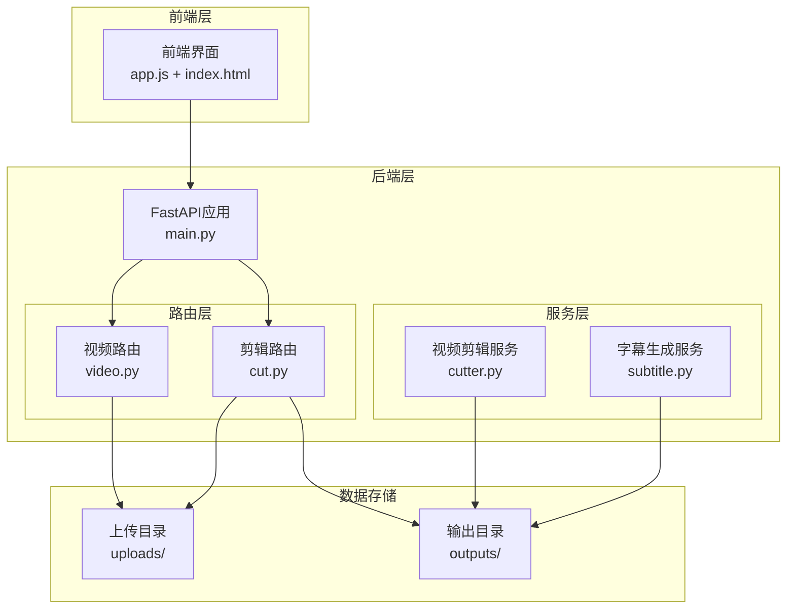
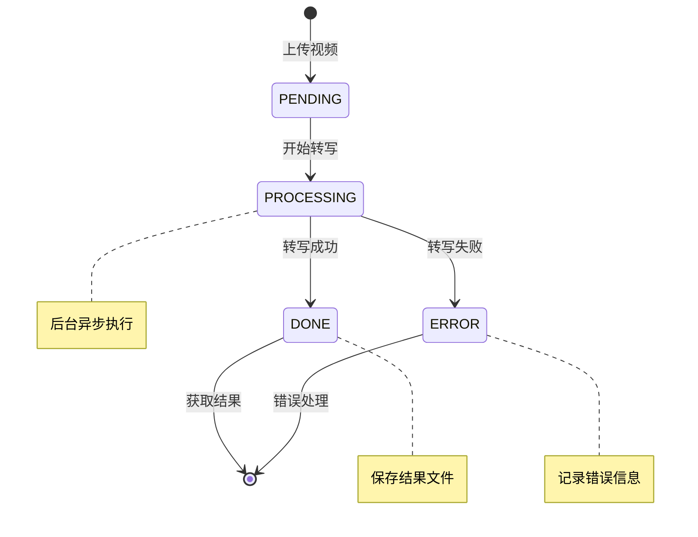
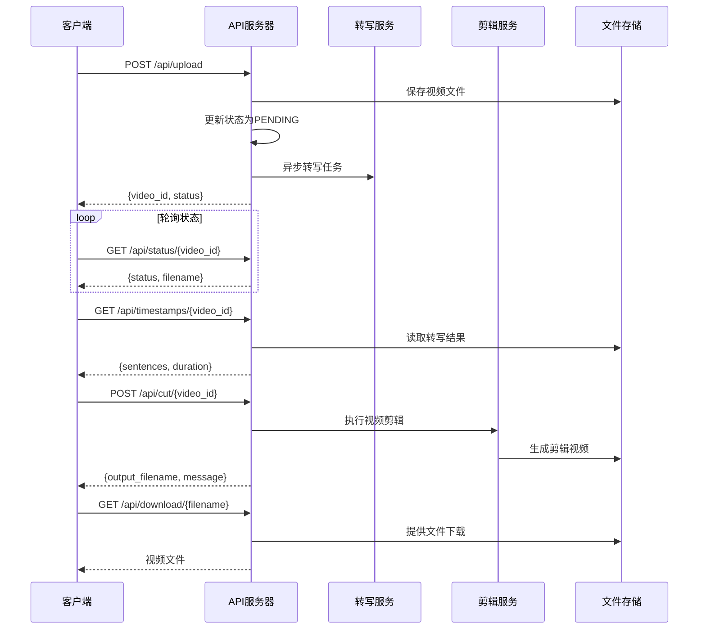
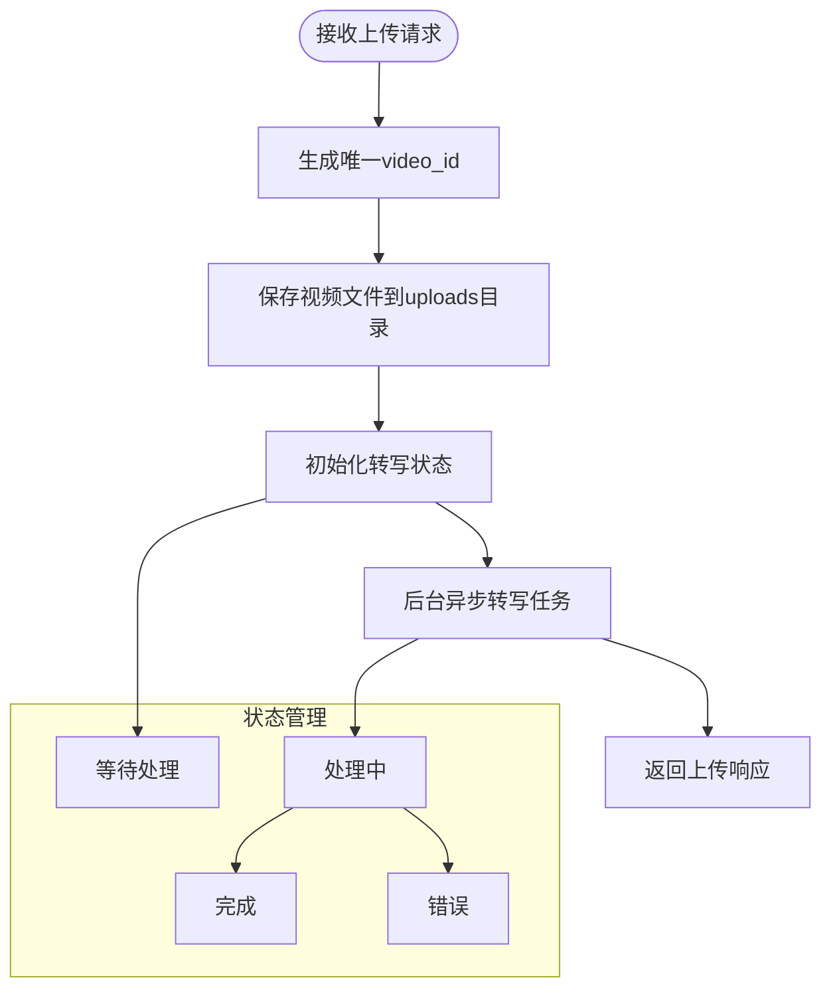
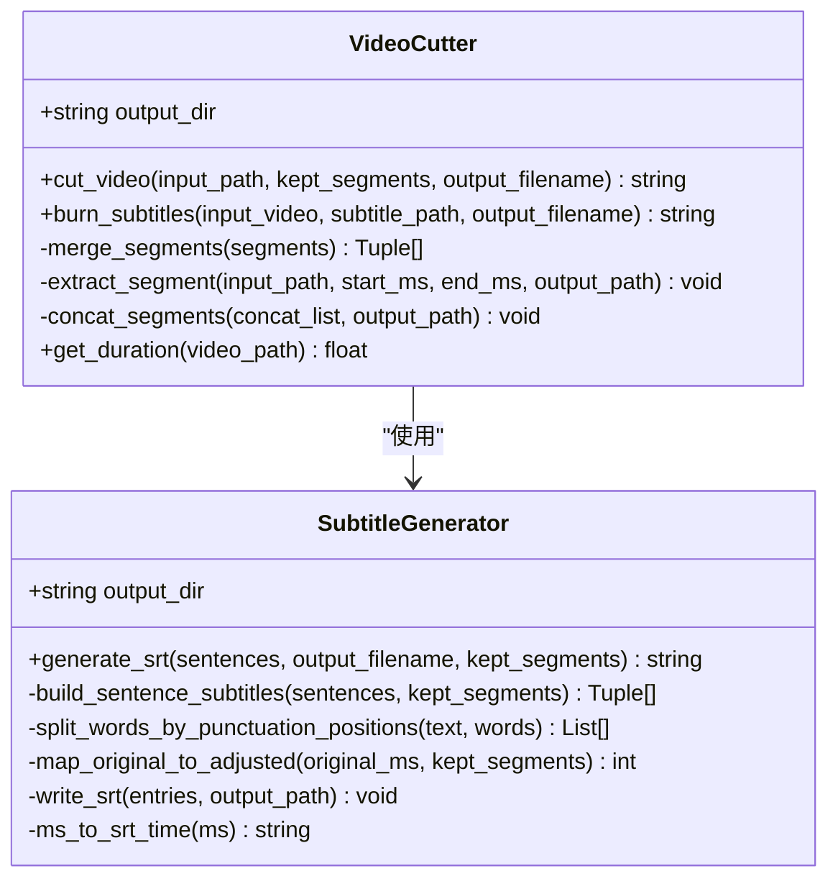
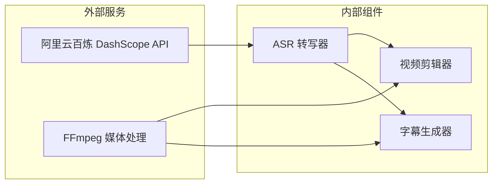
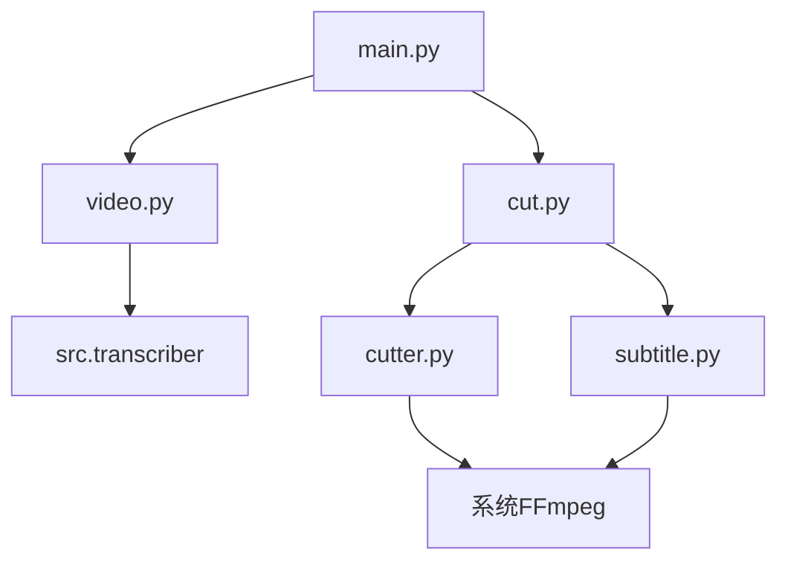

# API端点设计

<cite>
**本文档引用的文件**
- [main.py](file://cut-video-web/backend/main.py)
- [video.py](file://cut-video-web/backend/router/video.py)
- [cut.py](file://cut-video-web/backend/router/cut.py)
- [cutter.py](file://cut-video-web/backend/service/cutter.py)
- [subtitle.py](file://cut-video-web/backend/service/subtitle.py)
- [app.js](file://cut-video-web/frontend/app.js)
- [index.html](file://cut-video-web/frontend/index.html)
- [README.md](file://README.md)
- [pyproject.toml](file://pyproject.toml)
</cite>

## 目录
1. [简介](#简介)
2. [项目结构](#项目结构)
3. [核心组件](#核心组件)
4. [架构概览](#架构概览)
5. [详细组件分析](#详细组件分析)
6. [依赖关系分析](#依赖关系分析)
7. [性能考虑](#性能考虑)
8. [故障排除指南](#故障排除指南)
9. [结论](#结论)

## 简介

本项目是一个基于阿里云百炼FunASR API的ASR（自动语音识别）视频剪辑Web服务。该系统提供了完整的RESTful API端点设计，支持视频上传、自动转写、词级时间戳编辑和视频剪辑功能。API设计遵循RESTful原则，采用清晰的HTTP方法选择、URL路径设计和状态码使用规范。

## 项目结构

项目采用前后端分离的架构设计，主要分为以下层次：



**图表来源**
- [main.py:1-84](file://cut-video-web/backend/main.py#L1-L84)
- [video.py:1-296](file://cut-video-web/backend/router/video.py#L1-L296)
- [cut.py:1-232](file://cut-video-web/backend/router/cut.py#L1-L232)

**章节来源**
- [main.py:1-84](file://cut-video-web/backend/main.py#L1-L84)
- [README.md:281-300](file://README.md#L281-L300)

## 核心组件

### API路由器设计

系统采用模块化的API路由器设计，将不同功能域的端点进行分类管理：

- **视频路由 (/api/video)**: 处理视频上传、转写状态查询、时间戳获取等功能
- **剪辑路由 (/api/cut)**: 处理视频剪辑、字幕生成、文件下载等功能

每个路由器都设置了统一的前缀和标签，便于API文档生成和维护。

### 状态管理系统

系统实现了完整的异步状态管理机制：



**图表来源**
- [video.py:98-103](file://cut-video-web/backend/router/video.py#L98-L103)
- [video.py:166-234](file://cut-video-web/backend/router/video.py#L166-L234)

**章节来源**
- [video.py:38-96](file://cut-video-web/backend/router/video.py#L38-L96)
- [video.py:166-234](file://cut-video-web/backend/router/video.py#L166-L234)

## 架构概览

系统采用事件驱动的异步架构，结合轮询机制实现完整的视频处理流程：



**图表来源**
- [app.js:132-187](file://cut-video-web/frontend/app.js#L132-L187)
- [video.py:126-163](file://cut-video-web/backend/router/video.py#L126-L163)
- [cut.py:51-110](file://cut-video-web/backend/router/cut.py#L51-L110)

## 详细组件分析

### 视频上传与转写API

#### 上传端点设计

**端点**: `POST /api/upload`
**功能**: 接收视频文件上传并触发ASR转写任务



**图表来源**
- [video.py:126-163](file://cut-video-web/backend/router/video.py#L126-L163)
- [video.py:166-234](file://cut-video-web/backend/router/video.py#L166-L234)

#### 状态查询端点

**端点**: `GET /api/status/{video_id}`
**功能**: 查询视频转写状态

**响应格式**:
```json
{
  "video_id": "string",
  "status": "pending|processing|done|error",
  "filename": "string",
  "task_id": "string",
  "error": "string"
}
```

#### 时间戳获取端点

**端点**: `GET /api/timestamps/{video_id}`
**功能**: 获取词级时间戳数据

**响应格式**:
```json
{
  "video_id": "string",
  "filename": "string",
  "duration": 0.0,
  "sentences": [
    {
      "text": "string",
      "begin_time": 0,
      "end_time": 0,
      "words": [
        {
          "text": "string",
          "begin_time": 0,
          "end_time": 0,
          "deleted": false
        }
      ]
    }
  ]
}
```

**章节来源**
- [video.py:236-277](file://cut-video-web/backend/router/video.py#L236-L277)
- [video.py:105-124](file://cut-video-web/backend/router/video.py#L105-L124)

### 视频剪辑API

#### 剪辑执行端点

**端点**: `POST /api/cut/{video_id}`
**功能**: 根据删除的词组执行视频剪辑

**请求格式**:
```json
{
  "sentences": [
    {
      "text": "string",
      "begin_time": 0,
      "end_time": 0,
      "words": [
        {
          "text": "string",
          "begin_time": 0,
          "end_time": 0,
          "deleted": true
        }
      ]
    }
  ],
  "burn_subtitles": false
}
```

**响应格式**:
```json
{
  "output_id": "string",
  "output_filename": "string",
  "subtitle_filename": "string",
  "message": "string"
}
```

#### 文件下载端点

**端点**: `GET /api/download/{filename}`
**功能**: 下载剪辑后的视频文件

**章节来源**
- [cut.py:51-110](file://cut-video-web/backend/router/cut.py#L51-L110)
- [cut.py:112-124](file://cut-video-web/backend/router/cut.py#L112-L124)

### 服务层组件

#### 视频剪辑服务

VideoCutter类提供了完整的视频剪辑功能：



**图表来源**
- [cutter.py:14-253](file://cut-video-web/backend/service/cutter.py#L14-L253)
- [subtitle.py:11-219](file://cut-video-web/backend/service/subtitle.py#L11-L219)

**章节来源**
- [cutter.py:21-66](file://cut-video-web/backend/service/cutter.py#L21-L66)
- [subtitle.py:18-44](file://cut-video-web/backend/service/subtitle.py#L18-L44)

## 依赖关系分析

### 外部依赖

系统依赖于以下关键外部服务：



**图表来源**
- [video.py:201-208](file://cut-video-web/backend/router/video.py#L201-L208)
- [cutter.py:109-144](file://cut-video-web/backend/service/cutter.py#L109-L144)
- [subtitle.py:177-196](file://cut-video-web/backend/service/subtitle.py#L177-L196)

### 内部依赖关系



**图表来源**
- [main.py:23-51](file://cut-video-web/backend/main.py#L23-L51)
- [video.py:21-22](file://cut-video-web/backend/router/video.py#L21-L22)
- [cut.py:19-20](file://cut-video-web/backend/router/cut.py#L19-L20)

**章节来源**
- [main.py:23-51](file://cut-video-web/backend/main.py#L23-L51)
- [pyproject.toml:7-14](file://pyproject.toml#L7-L14)

## 性能考虑

### 异步处理策略

系统采用异步处理模式来提升用户体验：

1. **后台转写任务**: 视频上传后立即返回，转写在后台异步执行
2. **轮询机制**: 前端定期查询转写状态，避免长时间阻塞
3. **资源管理**: 实现定时清理服务，自动清理过期文件

### 文件处理优化

1. **分段处理**: 使用FFmpeg的分段提取和合并技术，避免全文件重编码
2. **临时文件管理**: 使用临时目录进行中间文件处理，减少磁盘碎片
3. **内存优化**: 状态信息存储在内存中，提高访问速度

### 并发处理

系统支持多用户并发操作：
- 每个用户的视频处理相互独立
- 状态管理采用字典存储，避免锁竞争
- 文件命名使用UUID确保唯一性

## 故障排除指南

### 常见错误处理

**HTTP状态码使用**:
- `200 OK`: 成功响应
- `400 Bad Request`: 请求参数错误或业务逻辑错误
- `404 Not Found`: 资源不存在
- `500 Internal Server Error`: 服务器内部错误

**错误响应格式**:
```json
{
  "detail": "错误描述信息"
}
```

### 调试最佳实践

1. **环境配置检查**
   - 确认`DASHSCOPE_API_KEY`环境变量正确设置
   - 验证FFmpeg安装和可用性
   - 检查上传和输出目录权限

2. **API测试方法**
   - 使用curl命令测试各个端点
   - 通过浏览器开发者工具监控网络请求
   - 检查服务器日志输出

3. **常见问题诊断**
   - 转写失败: 检查API密钥和网络连接
   - 剪辑失败: 验证输入视频格式和时间戳有效性
   - 文件下载失败: 确认文件存在且有读取权限

**章节来源**
- [video.py:240-241](file://cut-video-web/backend/router/video.py#L240-L241)
- [cut.py:108-109](file://cut-video-web/backend/router/cut.py#L108-L109)

## 结论

本API端点设计充分体现了现代Web服务的最佳实践：

1. **RESTful设计原则**: 采用标准的HTTP方法和URL设计，符合REST架构风格
2. **异步处理模式**: 通过后台任务和轮询机制提升用户体验
3. **模块化架构**: 清晰的路由分层和服务分离，便于维护和扩展
4. **错误处理机制**: 完善的状态管理和错误响应，提供良好的用户体验
5. **性能优化**: 异步处理、资源管理和并发控制确保系统高效运行

该设计为视频剪辑和ASR转写服务提供了稳定、可扩展的API基础，支持未来功能扩展和性能优化。