# FastAPI应用结构

<cite>
**本文档引用的文件**
- [cut-video-web/backend/main.py](file://cut-video-web/backend/main.py)
- [cut-video-web/backend/router/video.py](file://cut-video-web/backend/router/video.py)
- [cut-video-web/backend/router/cut.py](file://cut-video-web/backend/router/cut.py)
- [cut-video-web/backend/service/cleanup.py](file://cut-video-web/backend/service/cleanup.py)
- [cut-video-web/backend/service/cutter.py](file://cut-video-web/backend/service/cutter.py)
- [cut-video-web/backend/service/subtitle.py](file://cut-video-web/backend/service/subtitle.py)
- [pyproject.toml](file://pyproject.toml)
- [README.md](file://README.md)
- [hotwords.json](file://hotwords.json)
- [src/transcriber.py](file://src/transcriber.py)
- [src/hotword.py](file://src/hotword.py)
</cite>

## 目录
1. [简介](#简介)
2. [项目结构](#项目结构)
3. [核心组件](#核心组件)
4. [架构概览](#架构概览)
5. [详细组件分析](#详细组件分析)
6. [依赖分析](#依赖分析)
7. [性能考虑](#性能考虑)
8. [故障排除指南](#故障排除指南)
9. [结论](#结论)

## 简介

这是一个基于FastAPI的ASR（自动语音识别）视频剪辑Web服务应用。该应用提供了完整的视频上传、ASR转写、词级时间戳编辑和视频剪辑功能。应用采用前后端分离架构，后端使用FastAPI提供RESTful API，前端使用纯静态HTML/CSS/JavaScript。

## 项目结构

应用采用清晰的分层架构设计：

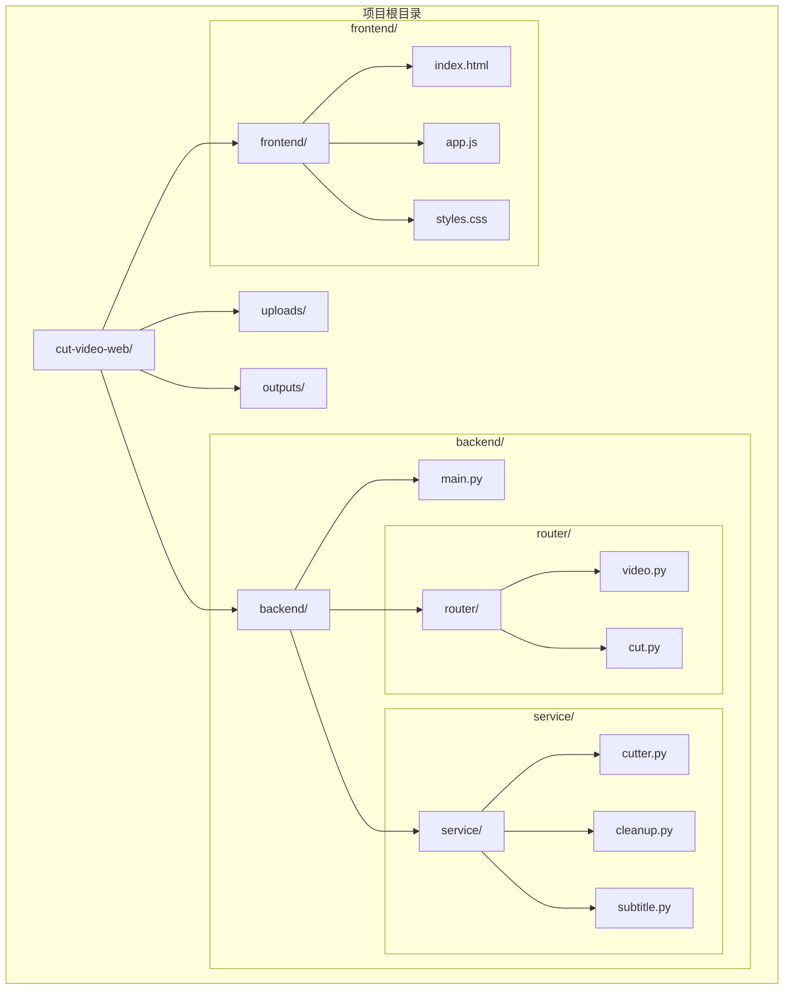

**图表来源**
- [cut-video-web/backend/main.py:1-84](file://cut-video-web/backend/main.py#L1-L84)
- [cut-video-web/backend/router/video.py:1-296](file://cut-video-web/backend/router/video.py#L1-L296)
- [cut-video-web/backend/router/cut.py:1-232](file://cut-video-web/backend/router/cut.py#L1-L232)

### 目录结构说明

- **backend/**: FastAPI应用的核心后端代码
  - **main.py**: 应用入口点，负责应用实例创建和配置
  - **router/**: API路由定义
  - **service/**: 业务服务实现
- **frontend/**: 前端静态资源
- **uploads/**: 用户上传的视频文件存储目录
- **outputs/**: 处理后的视频输出目录

**章节来源**
- [cut-video-web/backend/main.py:32-47](file://cut-video-web/backend/main.py#L32-L47)
- [README.md:281-299](file://README.md#L281-L299)

## 核心组件

### 应用入口点设计

应用入口点位于`cut-video-web/backend/main.py`，采用标准的FastAPI应用创建模式：

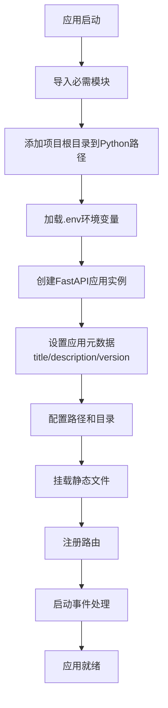

**图表来源**
- [cut-video-web/backend/main.py:25-84](file://cut-video-web/backend/main.py#L25-L84)

### 配置参数设置

应用使用FastAPI构造函数设置核心配置：

- **标题**: "ASR 词级视频剪辑"
- **描述**: "基于阿里云百炼 FunASR API 的词级时间戳视频剪辑工具"
- **版本**: "1.0.0"

这些配置信息会在Swagger UI和ReDoc中显示，为用户提供清晰的应用信息。

**章节来源**
- [cut-video-web/backend/main.py:26-30](file://cut-video-web/backend/main.py#L26-L30)

### 目录结构和文件组织

应用采用基于位置的路径配置策略：

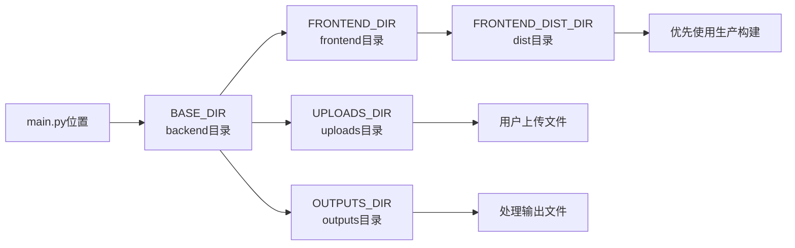

**图表来源**
- [cut-video-web/backend/main.py:32-47](file://cut-video-web/backend/main.py#L32-L47)

**章节来源**
- [cut-video-web/backend/main.py:32-47](file://cut-video-web/backend/main.py#L32-L47)

## 架构概览

应用采用分层架构设计，清晰分离关注点：

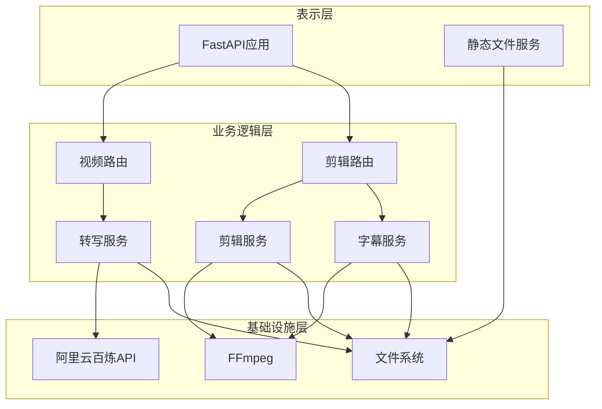

**图表来源**
- [cut-video-web/backend/main.py:49-51](file://cut-video-web/backend/main.py#L49-L51)
- [cut-video-web/backend/router/video.py:21](file://cut-video-web/backend/router/video.py#L21)
- [cut-video-web/backend/router/cut.py:19](file://cut-video-web/backend/router/cut.py#L19)

## 详细组件分析

### 启动事件处理机制

应用在启动时执行三个关键流程：

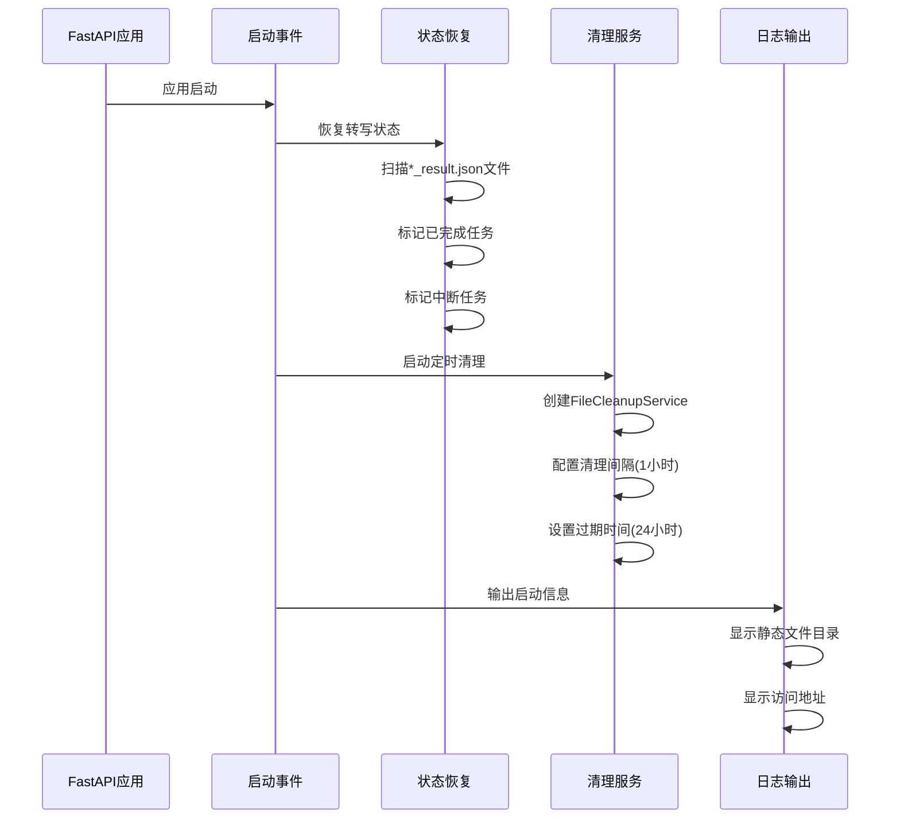

**图表来源**
- [cut-video-web/backend/main.py:61-80](file://cut-video-web/backend/main.py#L61-L80)

#### 状态恢复机制

状态恢复功能确保应用重启后能够正确处理之前的任务：

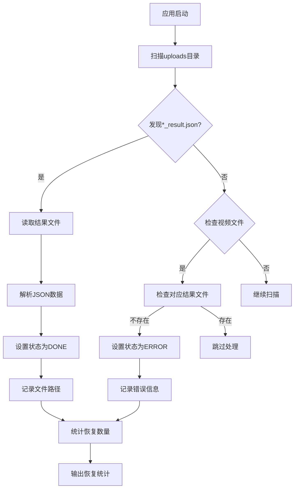

**图表来源**
- [cut-video-web/backend/router/video.py:38-96](file://cut-video-web/backend/router/video.py#L38-L96)

**章节来源**
- [cut-video-web/backend/main.py:61-80](file://cut-video-web/backend/main.py#L61-L80)
- [cut-video-web/backend/router/video.py:38-96](file://cut-video-web/backend/router/video.py#L38-L96)

### 环境变量加载和项目路径配置

应用采用多层路径配置策略：

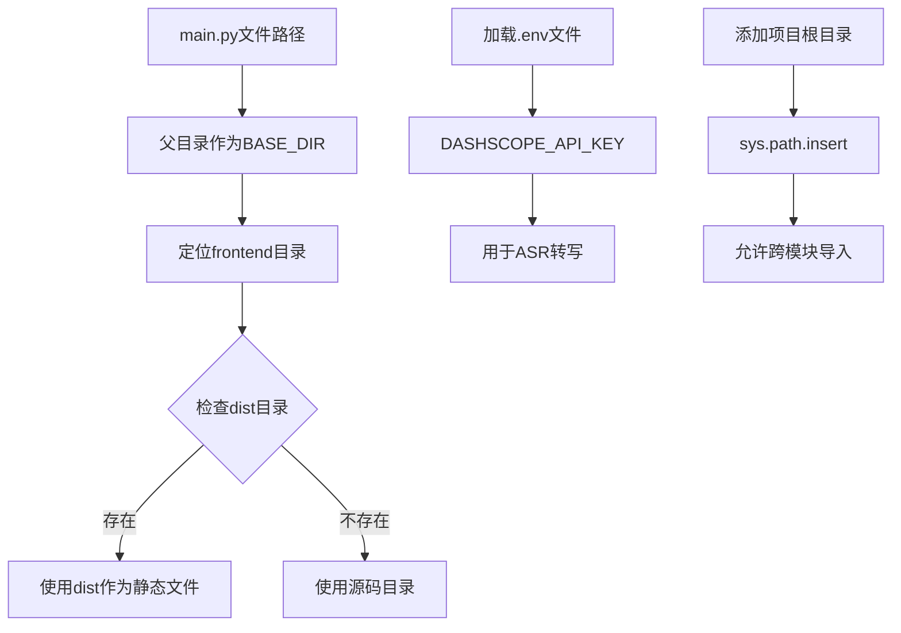

**图表来源**
- [cut-video-web/backend/main.py:12-17](file://cut-video-web/backend/main.py#L12-L17)
- [cut-video-web/backend/main.py:32-47](file://cut-video-web/backend/main.py#L32-L47)

**章节来源**
- [cut-video-web/backend/main.py:12-17](file://cut-video-web/backend/main.py#L12-L17)
- [cut-video-web/backend/main.py:32-47](file://cut-video-web/backend/main.py#L32-L47)

### 应用生命周期管理

应用实现了完整的生命周期管理：

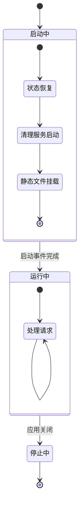

**图表来源**
- [cut-video-web/backend/main.py:61-84](file://cut-video-web/backend/main.py#L61-L84)

**章节来源**
- [cut-video-web/backend/main.py:61-84](file://cut-video-web/backend/main.py#L61-L84)

## 依赖分析

### 外部依赖关系

应用使用以下核心依赖：

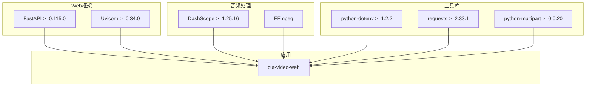

**图表来源**
- [pyproject.toml:7-14](file://pyproject.toml#L7-L14)

### 内部模块依赖

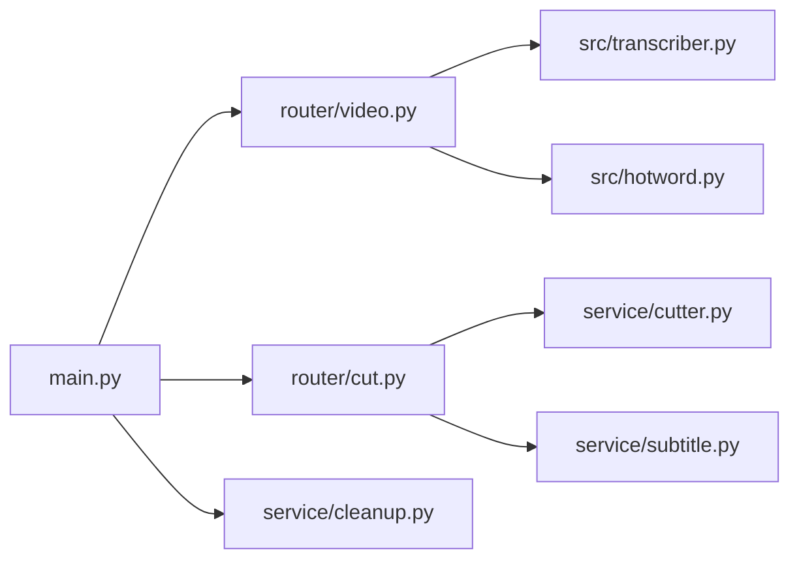

**图表来源**
- [cut-video-web/backend/main.py:23](file://cut-video-web/backend/main.py#L23)
- [cut-video-web/backend/router/video.py:21](file://cut-video-web/backend/router/video.py#L21)
- [cut-video-web/backend/router/cut.py:19](file://cut-video-web/backend/router/cut.py#L19)

**章节来源**
- [pyproject.toml:1-25](file://pyproject.toml#L1-L25)

## 性能考虑

### 文件清理策略

应用实现了智能的文件清理机制：

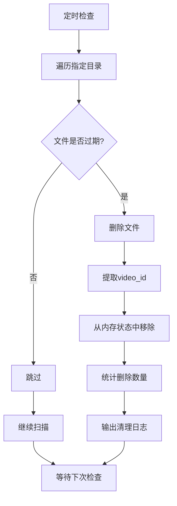

**图表来源**
- [cut-video-web/backend/service/cleanup.py:35-74](file://cut-video-web/backend/service/cleanup.py#L35-L74)

### 视频剪辑优化

剪辑服务采用了高效的FFmpeg工作流：

- **分段提取**: 使用临时目录存储中间片段
- **智能合并**: 通过concat demuxer高效合并片段
- **时间容差**: 100ms容差处理相邻片段的无缝拼接

**章节来源**
- [cut-video-web/backend/service/cleanup.py:76-96](file://cut-video-web/backend/service/cleanup.py#L76-L96)
- [cut-video-web/backend/service/cutter.py:41-66](file://cut-video-web/backend/service/cutter.py#L41-L66)

## 故障排除指南

### 常见问题诊断

1. **环境变量未设置**
   - 确保设置了`DASHSCOPE_API_KEY`环境变量
   - 检查`.env`文件是否正确放置在项目根目录

2. **FFmpeg相关错误**
   - 确认FFmpeg已正确安装
   - 检查`/opt/homebrew/opt/ffmpeg-full/bin/ffmpeg`路径是否存在

3. **文件权限问题**
   - 确保uploads和outputs目录具有写入权限
   - 检查磁盘空间是否充足

4. **网络连接问题**
   - 验证阿里云百炼API的网络连通性
   - 检查API Key的有效性

**章节来源**
- [cut-video-web/backend/router/video.py:180-184](file://cut-video-web/backend/router/video.py#L180-L184)
- [cut-video-web/backend/service/cutter.py:175](file://cut-video-web/backend/service/cutter.py#L175)

## 结论

该FastAPI应用展现了良好的架构设计和工程实践：

### 设计优势

1. **清晰的分层架构**: 清晰分离了表示层、业务逻辑层和基础设施层
2. **完善的生命周期管理**: 包含启动状态恢复和定时清理机制
3. **灵活的配置管理**: 支持多种部署环境和配置方式
4. **健壮的错误处理**: 提供了全面的异常处理和故障恢复机制

### 最佳实践建议

1. **环境管理**: 建议使用`.env.example`文件提供配置模板
2. **日志记录**: 可以考虑集成更完善的日志系统
3. **监控告警**: 建议添加应用健康检查和性能监控
4. **安全加固**: 可以添加API限流和访问控制机制

该应用为视频处理类Web服务提供了一个优秀的参考实现，具有良好的可扩展性和维护性。