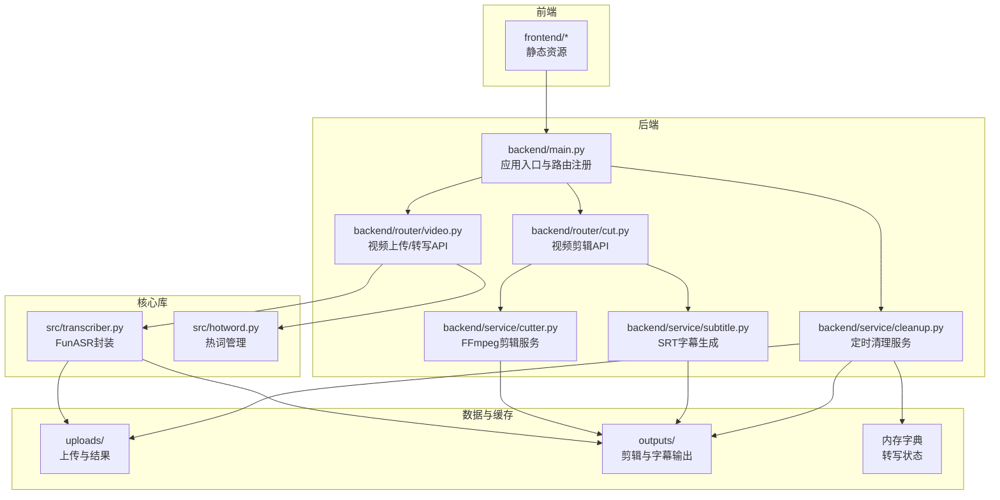
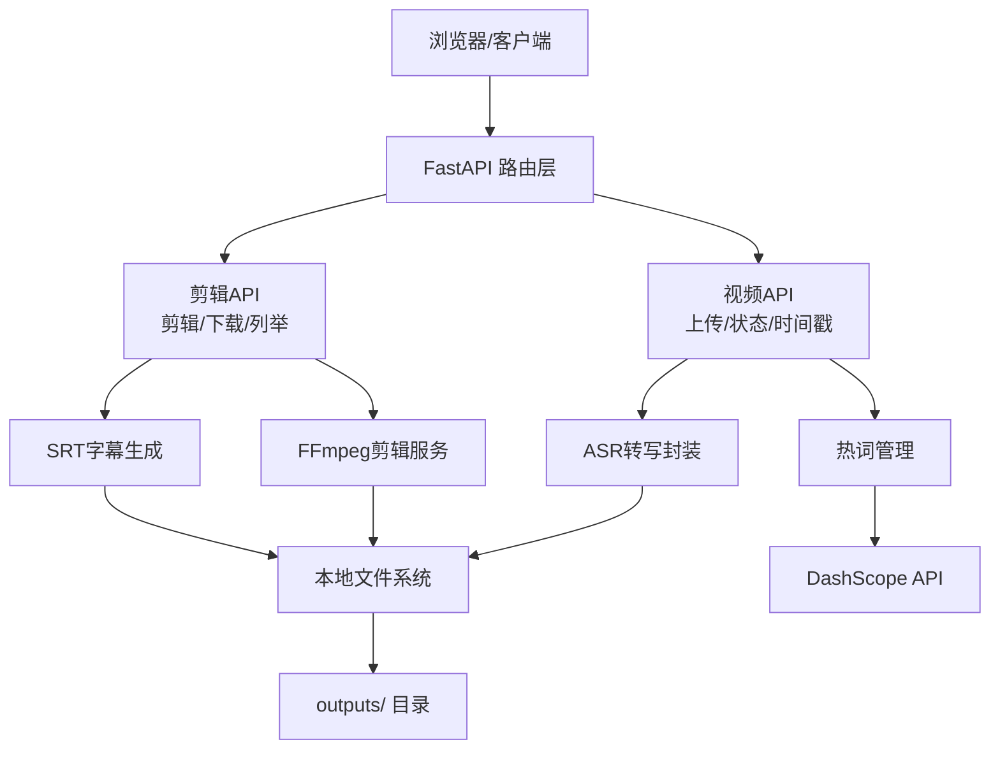
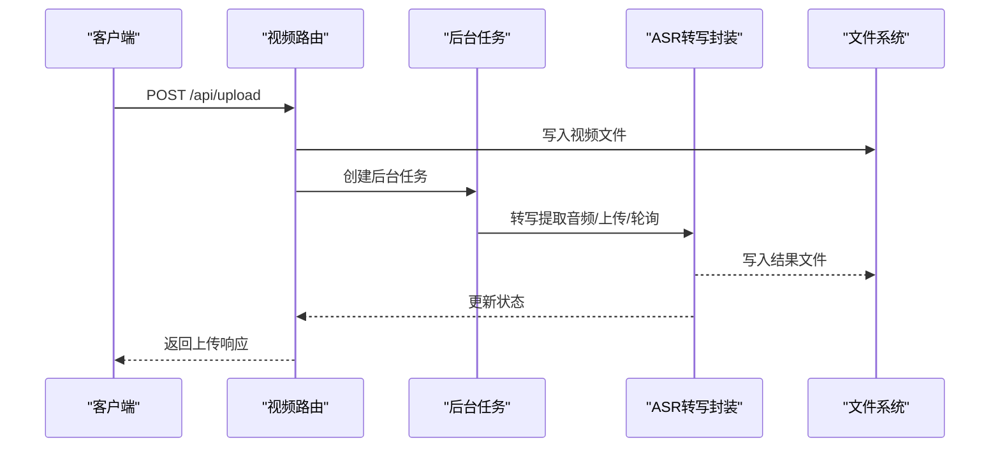
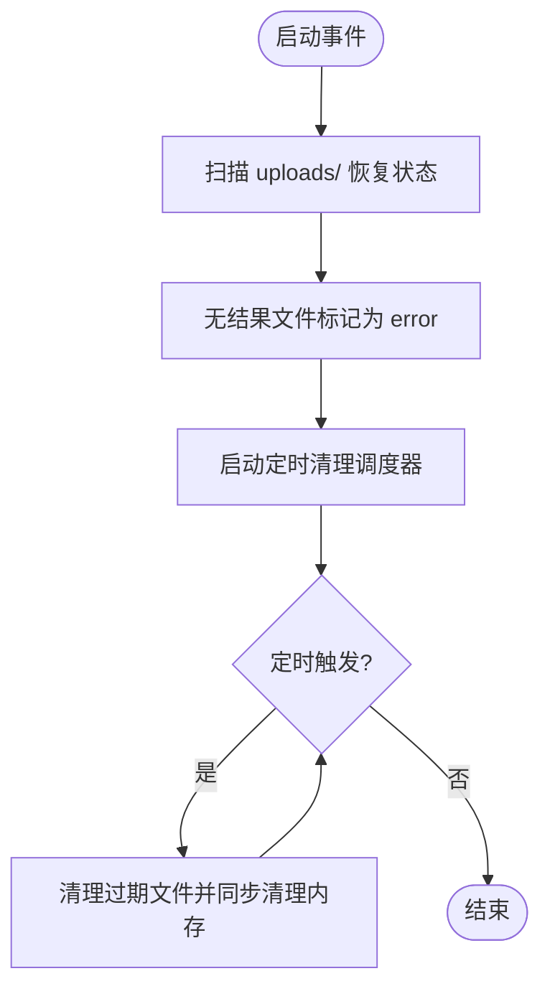
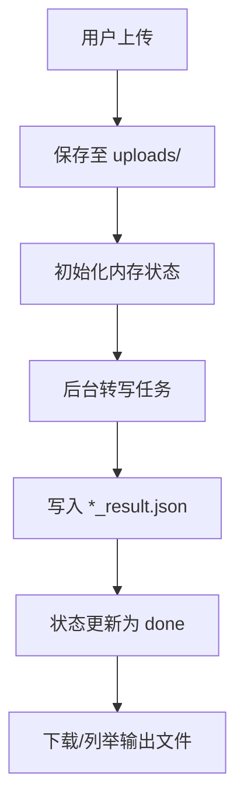
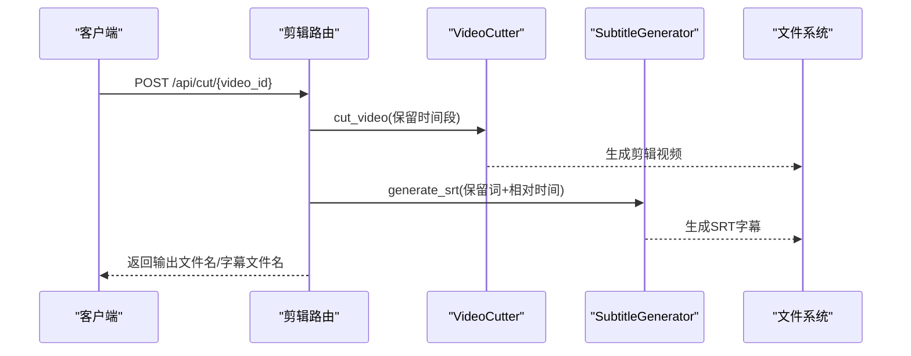
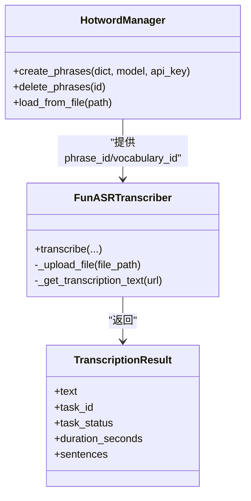
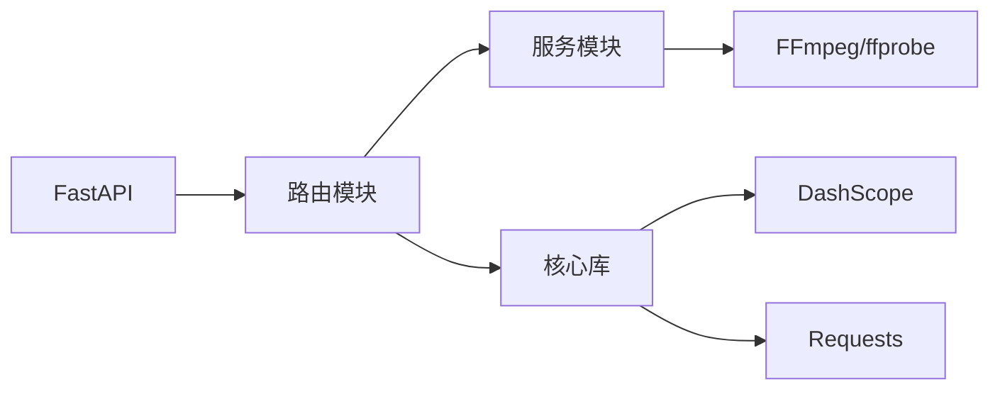

# Web服务架构设计

<cite>
**本文档引用的文件**
- [backend/main.py](file://cut-video-web/backend/main.py)
- [backend/router/video.py](file://cut-video-web/backend/router/video.py)
- [backend/router/cut.py](file://cut-video-web/backend/router/cut.py)
- [backend/service/cleanup.py](file://cut-video-web/backend/service/cleanup.py)
- [backend/service/cutter.py](file://cut-video-web/backend/service/cutter.py)
- [backend/service/subtitle.py](file://cut-video-web/backend/service/subtitle.py)
- [src/transcriber.py](file://src/transcriber.py)
- [src/hotword.py](file://src/hotword.py)
- [hotwords.json](file://hotwords.json)
- [pyproject.toml](file://pyproject.toml)
- [README.md](file://README.md)
</cite>

## 目录
1. [简介](#简介)
2. [项目结构](#项目结构)
3. [核心组件](#核心组件)
4. [架构概览](#架构概览)
5. [详细组件分析](#详细组件分析)
6. [依赖分析](#依赖分析)
7. [性能考虑](#性能考虑)
8. [故障排查指南](#故障排查指南)
9. [结论](#结论)
10. [附录](#附录)

## 简介
本项目是一个基于 FastAPI 的 Web 服务，提供视频上传、ASR 转写（词级时间戳）、交互式词删除与视频剪辑、字幕生成与烧录等功能。系统采用模块化设计，前端静态资源由 FastAPI 挂载提供，后端通过路由模块组织 API，服务层封装底层操作（FFmpeg 剪辑、字幕生成、定时清理等）。系统支持热词增强、异步转写、状态持久化与定时清理，具备良好的可扩展性与可维护性。

## 项目结构
项目采用前后端分离与模块化组织相结合的方式：
- 后端（FastAPI）：入口文件负责应用初始化、路由注册、静态文件挂载与启动事件处理
- 路由层：按功能划分为视频上传与转写、视频剪辑两个 API 模块
- 服务层：封装 FFmpeg 剪辑、SRT 字幕生成、定时清理等业务能力
- 核心库：ASR 转写与热词管理封装，供路由层调用
- 前端：静态页面与样式，由 FastAPI 挂载提供
- 数据与缓存：本地磁盘目录（uploads/、outputs/）用于文件存储，内存字典用于转写状态管理

**图表来源**
- [backend/main.py:1-84](file://cut-video-web/backend/main.py#L1-L84)
- [backend/router/video.py:1-296](file://cut-video-web/backend/router/video.py#L1-L296)
- [backend/router/cut.py:1-232](file://cut-video-web/backend/router/cut.py#L1-L232)
- [backend/service/cutter.py:1-253](file://cut-video-web/backend/service/cutter.py#L1-L253)
- [backend/service/subtitle.py:1-219](file://cut-video-web/backend/service/subtitle.py#L1-L219)
- [backend/service/cleanup.py:1-103](file://cut-video-web/backend/service/cleanup.py#L1-L103)
- [src/transcriber.py:1-316](file://src/transcriber.py#L1-L316)
- [src/hotword.py:1-92](file://src/hotword.py#L1-L92)

**章节来源**
- [backend/main.py:1-84](file://cut-video-web/backend/main.py#L1-L84)
- [README.md:281-310](file://README.md#L281-L310)

## 核心组件
- 应用入口与生命周期
  - 应用初始化：设置标题、描述、版本，加载 .env，挂载 outputs 目录用于下载，注册路由，提供健康检查端点
  - 启动事件：恢复转写状态、启动定时清理服务
  - 静态文件挂载：优先 dist 目录，否则回退到源码目录，最后作为 catch-all
- 路由模块
  - 视频路由：上传、转写状态查询、词级时间戳获取、原始视频下载
  - 剪辑路由：根据删除的词生成剪辑片段、下载输出、列举输出文件
- 服务模块
  - 剪辑服务：基于 FFmpeg 的分段提取与合并，支持字幕烧录
  - 字幕服务：按标点分割生成 SRT，映射相对时间戳
  - 清理服务：定时清理过期文件并同步清理内存状态
- 核心库
  - ASR 转写：封装 FunASR API，支持视频转音频、上传、异步任务轮询、词级时间戳解析
  - 热词管理：v1/v2 模型热词创建与删除，支持从 JSON 加载

**章节来源**
- [backend/main.py:25-84](file://cut-video-web/backend/main.py#L25-L84)
- [backend/router/video.py:24-296](file://cut-video-web/backend/router/video.py#L24-L296)
- [backend/router/cut.py:22-232](file://cut-video-web/backend/router/cut.py#L22-L232)
- [backend/service/cutter.py:14-253](file://cut-video-web/backend/service/cutter.py#L14-L253)
- [backend/service/subtitle.py:11-219](file://cut-video-web/backend/service/subtitle.py#L11-L219)
- [backend/service/cleanup.py:15-103](file://cut-video-web/backend/service/cleanup.py#L15-L103)
- [src/transcriber.py:95-316](file://src/transcriber.py#L95-L316)
- [src/hotword.py:13-92](file://src/hotword.py#L13-L92)

## 架构概览
系统采用“路由层-服务层-核心库”的分层架构，结合本地文件系统与内存状态实现高内聚低耦合的服务设计。前端静态资源由 FastAPI 统一托管，后端通过 API 提供数据与处理能力。

**图表来源**
- [backend/router/video.py:126-296](file://cut-video-web/backend/router/video.py#L126-L296)
- [backend/router/cut.py:51-125](file://cut-video-web/backend/router/cut.py#L51-L125)
- [backend/service/cutter.py:21-196](file://cut-video-web/backend/service/cutter.py#L21-L196)
- [backend/service/subtitle.py:18-219](file://cut-video-web/backend/service/subtitle.py#L18-L219)
- [src/transcriber.py:203-294](file://src/transcriber.py#L203-L294)
- [src/hotword.py:23-85](file://src/hotword.py#L23-L85)

## 详细组件分析

### 路由设计与API规范
- 视频上传与转写
  - POST /api/upload：上传视频文件，生成 video_id，保存至 uploads/，后台异步执行转写
  - GET /api/status/{video_id}：查询转写状态（pending/processing/done/error）
  - GET /api/timestamps/{video_id}：获取词级时间戳数据（需状态为 done）
  - GET /api/video/{video_id}：下载原始视频
- 视频剪辑
  - POST /api/cut/{video_id}：根据删除的词生成剪辑片段，支持字幕烧录
  - GET /api/download/{filename}：下载剪辑后的视频
  - GET /api/outputs：列举 outputs/ 目录下的剪辑文件
- 响应模型
  - UploadResponse、StatusResponse、TimestampsResponse、CutResponse 等 Pydantic 模型确保请求/响应格式一致
- 错误处理
  - 404：资源不存在
  - 400：输入无效或前置条件不满足（如所有词被删除、转写未完成）
  - 500：内部异常

**图表来源**
- [backend/router/video.py:126-163](file://cut-video-web/backend/router/video.py#L126-L163)
- [backend/router/video.py:166-234](file://cut-video-web/backend/router/video.py#L166-L234)
- [src/transcriber.py:203-294](file://src/transcriber.py#L203-L294)

**章节来源**
- [backend/router/video.py:126-296](file://cut-video-web/backend/router/video.py#L126-L296)
- [backend/router/cut.py:51-125](file://cut-video-web/backend/router/cut.py#L51-L125)

### 服务状态管理
- 内存状态字典
  - transcription_status：键为 video_id，值包含状态、文件名、文件路径、任务ID、错误信息
  - 启动时扫描 uploads/ 目录恢复已完成任务与中断任务
- 后台任务
  - 异步执行转写，避免阻塞请求
  - 转写完成后写入 *_result.json，并更新状态为 done
- 定时清理
  - 按小时调度清理过期文件（默认24小时），同步清理内存状态

**图表来源**
- [backend/router/video.py:38-96](file://cut-video-web/backend/router/video.py#L38-L96)
- [backend/service/cleanup.py:76-96](file://cut-video-web/backend/service/cleanup.py#L76-L96)

**章节来源**
- [backend/router/video.py:38-96](file://cut-video-web/backend/router/video.py#L38-L96)
- [backend/service/cleanup.py:15-103](file://cut-video-web/backend/service/cleanup.py#L15-L103)

### 文件上传与存储处理
- 上传流程
  - 生成唯一 video_id，保存文件至 uploads/，初始化内存状态
  - 后台任务触发转写，转写结果写入 uploads/ 下的 *_result.json
- 下载与列举
  - /api/download/{filename} 提供 outputs/ 目录下载
  - /api/outputs 列举剪辑文件信息
- 安全与校验
  - 通过 HTTP 异常处理 404/400/500 场景
  - 上传文件名以 video_id 前缀命名，便于关联与清理
  - 通过 .env 与环境变量控制 API Key

**图表来源**
- [backend/router/video.py:126-163](file://cut-video-web/backend/router/video.py#L126-L163)
- [backend/router/cut.py:112-125](file://cut-video-web/backend/router/cut.py#L112-L125)

**章节来源**
- [backend/router/video.py:126-163](file://cut-video-web/backend/router/video.py#L126-L163)
- [backend/router/cut.py:112-125](file://cut-video-web/backend/router/cut.py#L112-L125)

### 视频剪辑与字幕生成
- 剪辑流程
  - 收集未删除词的时间段，合并相邻片段，使用 FFmpeg 分段提取与 concat 合并
  - 可选字幕烧录：生成 SRT 并通过 FFmpeg 将字幕嵌入视频
- 字幕生成
  - 按标点符号分割句子为多条字幕
  - 过滤被删除词，映射相对时间戳，生成 SRT 文件
- 时间戳映射
  - 将原始时间戳映射到剪辑后视频的相对时间，保证字幕与视频同步

**图表来源**
- [backend/router/cut.py:51-110](file://cut-video-web/backend/router/cut.py#L51-L110)
- [backend/service/cutter.py:21-66](file://cut-video-web/backend/service/cutter.py#L21-L66)
- [backend/service/subtitle.py:18-44](file://cut-video-web/backend/service/subtitle.py#L18-L44)

**章节来源**
- [backend/router/cut.py:51-125](file://cut-video-web/backend/router/cut.py#L51-L125)
- [backend/service/cutter.py:14-253](file://cut-video-web/backend/service/cutter.py#L14-L253)
- [backend/service/subtitle.py:11-219](file://cut-video-web/backend/service/subtitle.py#L11-L219)

### ASR 转写与热词增强
- 转写流程
  - 视频自动提取音频（WAV，16kHz，单声道）
  - 上传至 DashScope，提交异步转写任务，轮询获取结果
  - 解析词级时间戳，写入 *_result.json
- 热词管理
  - v1 使用 phrase_id，v2 使用 vocabulary_id
  - 支持从 hotwords.json 加载热词，自动创建并传入转写参数
- 模型选择
  - 默认 paraformer-v1（热词效果更好），可切换 v2

**图表来源**
- [src/transcriber.py:95-316](file://src/transcriber.py#L95-L316)
- [src/hotword.py:13-92](file://src/hotword.py#L13-L92)

**章节来源**
- [src/transcriber.py:95-316](file://src/transcriber.py#L95-L316)
- [src/hotword.py:13-92](file://src/hotword.py#L13-L92)
- [hotwords.json:1-17](file://hotwords.json#L1-L17)

## 依赖分析
- 外部依赖
  - FastAPI：Web 框架与路由
  - DashScope：FunASR 与热词 API
  - Requests：HTTP 请求获取转写结果
  - python-multipart：多部分上传支持
  - ffmpeg/ffprobe：视频剪辑与时长探测
- 内部模块依赖
  - 路由依赖服务层与核心库
  - 服务层依赖文件系统与 FFmpeg
  - 核心库依赖 DashScope 与网络请求

**图表来源**
- [pyproject.toml:7-14](file://pyproject.toml#L7-L14)
- [backend/router/video.py:21-22](file://cut-video-web/backend/router/video.py#L21-L22)
- [backend/router/cut.py:19-20](file://cut-video-web/backend/router/cut.py#L19-L20)
- [backend/service/cutter.py:8-11](file://cut-video-web/backend/service/cutter.py#L8-L11)
- [src/transcriber.py:16-19](file://src/transcriber.py#L16-L19)

**章节来源**
- [pyproject.toml:1-25](file://pyproject.toml#L1-L25)

## 性能考虑
- 并发与异步
  - 使用 asyncio.create_task 触发转写，避免阻塞请求
  - 清理服务以异步任务循环运行，不影响主请求处理
- 资源管理
  - 临时目录用于分段提取与合并，结束后自动清理
  - 通过定时清理策略控制磁盘占用
- 编码与格式
  - FFmpeg 输出使用 libx264（视频）+ aac（音频），兼容性与压缩比平衡
  - 视频转写前统一提取为 16kHz 单声道 WAV，提升识别质量
- 可扩展性建议
  - 使用消息队列（如 Celery/RQ）替代 asyncio.create_task，便于分布式扩展
  - 引入 Redis 缓存词级时间戳与中间结果，减少重复计算
  - 数据库存储转写结果与状态，配合清理服务实现持久化
  - 前端 CDN 与静态资源缓存，减少带宽压力
  - 负载均衡与容器编排（Kubernetes/Docker），支持水平扩展

[本节为通用性能建议，不直接分析具体文件，故无“章节来源”]

## 故障排查指南
- 常见错误与定位
  - 404：检查 video_id 是否正确、文件是否存在
  - 400：确认转写已完成（状态为 done）、保留时间段非空
  - 500：查看后台转写日志，检查 FFmpeg 命令返回码与 DashScope API Key
- 日志与监控
  - 启动时打印清理与静态文件目录信息，便于确认运行状态
  - 转写异常会记录错误信息并更新状态为 error
  - 建议接入结构化日志（如 JSON）与集中式日志系统（如 ELK/Cloud Logging）
- 安全与合规
  - 通过 .env 管理敏感配置，避免硬编码
  - 限制上传文件大小与类型，结合 Nginx/网关进行防护
  - 定时清理过期文件，防止磁盘膨胀与数据泄露

**章节来源**
- [backend/router/video.py:236-249](file://cut-video-web/backend/router/video.py#L236-L249)
- [backend/router/cut.py:108-110](file://cut-video-web/backend/router/cut.py#L108-L110)
- [backend/service/cleanup.py:92-96](file://cut-video-web/backend/service/cleanup.py#L92-L96)

## 结论
本项目以 FastAPI 为核心，结合本地文件系统与内存状态，实现了从视频上传、ASR 转写、交互式剪辑到字幕生成的完整工作流。通过异步任务与定时清理保障了系统的稳定性与可维护性。建议在生产环境中引入消息队列、缓存与数据库，配合 CDN 与负载均衡，进一步提升性能与可靠性。

[本节为总结性内容，不直接分析具体文件，故无“章节来源”]

## 附录
- 快速启动
  - 安装依赖：在 cut-video-web 目录执行安装命令
  - 设置 API Key：导出 DASHSCOPE_API_KEY 或在 .env 中配置
  - 启动服务：uvicorn backend.main:app --reload --port 8000
  - 访问地址：http://localhost:8000
- 默认行为
  - 模型：paraformer-v1（热词效果更好）
  - 热词：使用项目内置 hotwords.json
  - 时间戳：词级精度
  - 清理：默认每小时检查一次，清理超过24小时的文件

**章节来源**
- [README.md:248-274](file://README.md#L248-L274)
- [backend/main.py:61-84](file://cut-video-web/backend/main.py#L61-L84)