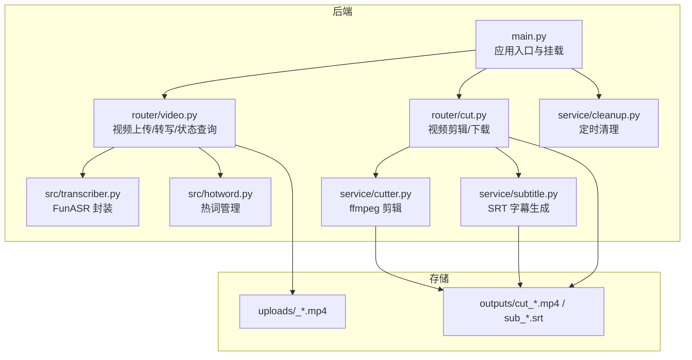
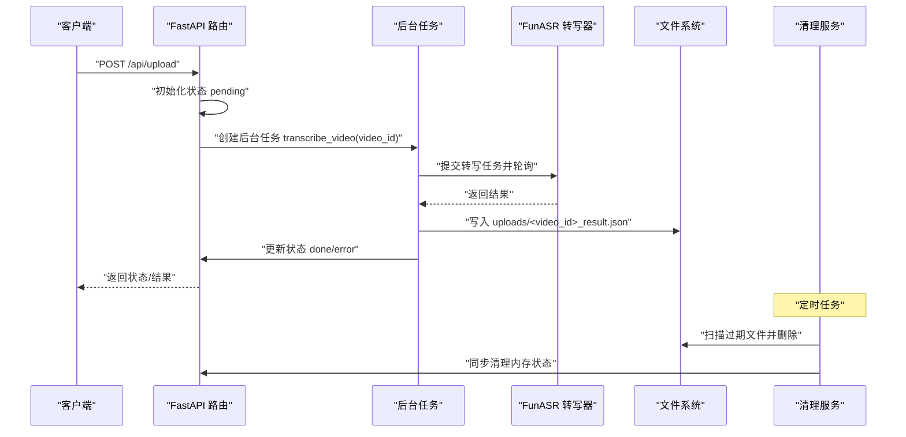
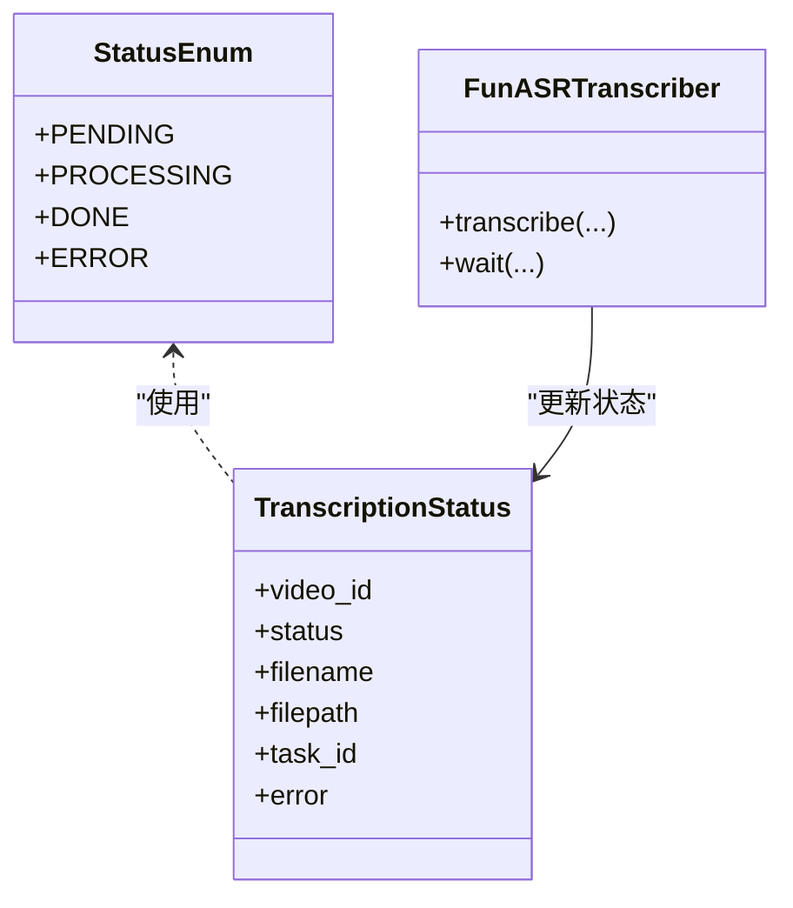
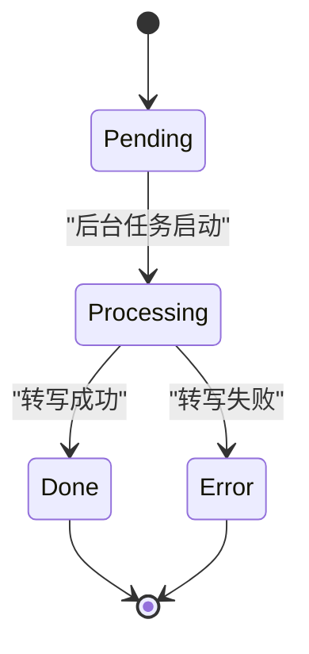
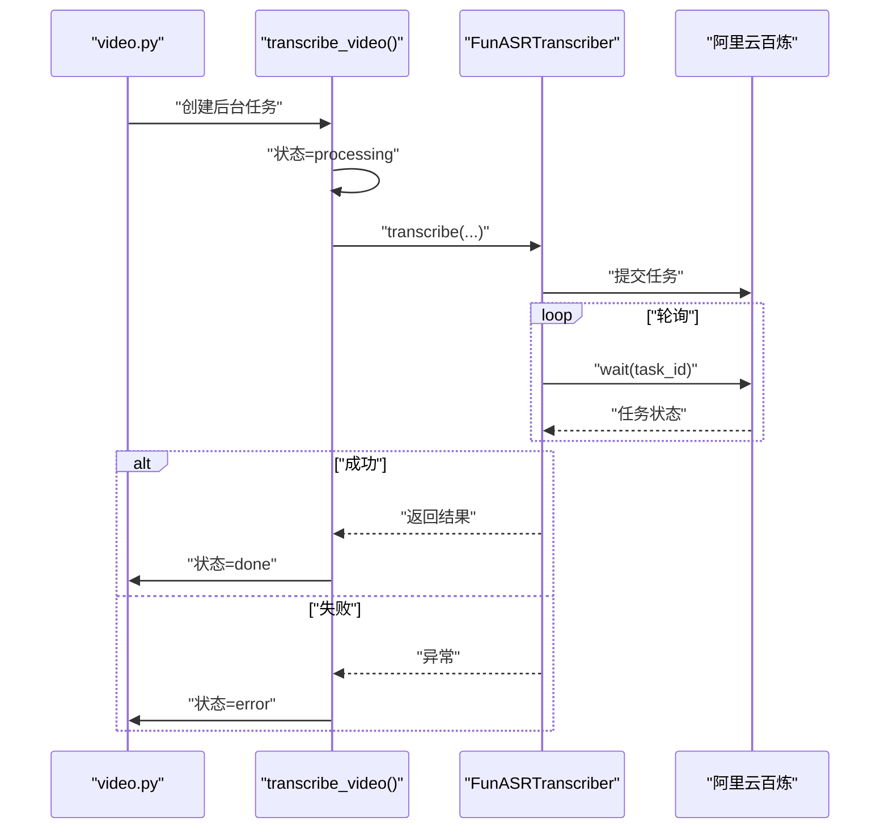
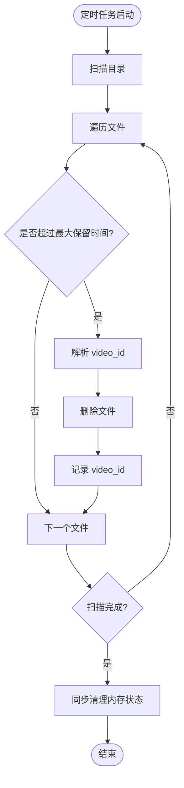
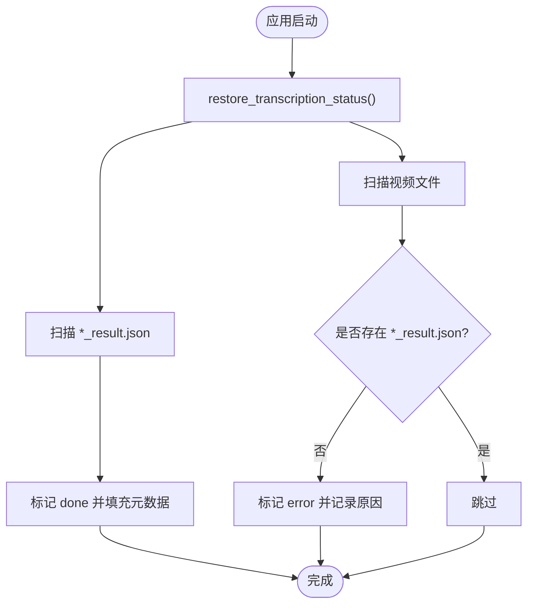
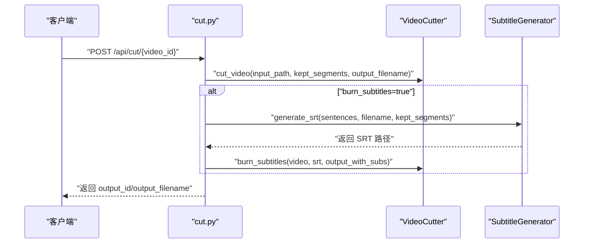
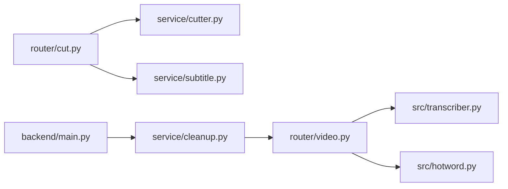

# 状态管理系统

<cite>
**本文引用的文件**
- [main.py](file://cut-video-web/backend/main.py)
- [video.py](file://cut-video-web/backend/router/video.py)
- [cut.py](file://cut-video-web/backend/router/cut.py)
- [cutter.py](file://cut-video-web/backend/service/cutter.py)
- [subtitle.py](file://cut-video-web/backend/service/subtitle.py)
- [cleanup.py](file://cut-video-web/backend/service/cleanup.py)
- [transcriber.py](file://src/transcriber.py)
- [hotword.py](file://src/hotword.py)
- [README.md](file://README.md)
- [hotwords.json](file://hotwords.json)
- [cli.py](file://cli.py)
</cite>

## 目录
1. [简介](#简介)
2. [项目结构](#项目结构)
3. [核心组件](#核心组件)
4. [架构总览](#架构总览)
5. [详细组件分析](#详细组件分析)
6. [依赖分析](#依赖分析)
7. [性能考量](#性能考量)
8. [故障排查指南](#故障排查指南)
9. [结论](#结论)
10. [附录](#附录)

## 简介
本系统是一个基于阿里云百炼 FunASR 的视频处理与剪辑平台，提供视频上传、ASR 转写（词级时间戳）、交互式词删除、视频剪辑与字幕烧录等功能。本文档聚焦于“状态管理系统”，涵盖以下主题：
- 视频处理状态的数据结构设计（状态枚举、状态转换规则、状态持久化机制）
- 异步任务的状态跟踪（任务队列管理、状态轮询机制、超时处理）
- 文件清理服务（定时清理策略、文件生命周期管理、内存状态同步）
- 状态恢复机制（应用重启后的状态重建、异常情况下的状态修复）
- 状态监控与调试（状态查询接口、日志记录策略）

## 项目结构
系统采用前后端分离的 FastAPI 后端 + 前端静态资源的结构，核心业务集中在 backend 目录，状态管理主要分布在视频路由与清理服务中。

图表来源
- [main.py:60-84](file://cut-video-web/backend/main.py#L60-L84)
- [video.py:26-35](file://cut-video-web/backend/router/video.py#L26-L35)
- [cut.py:24-28](file://cut-video-web/backend/router/cut.py#L24-L28)
- [cutter.py:17-19](file://cut-video-web/backend/service/cutter.py#L17-L19)
- [subtitle.py:14-16](file://cut-video-web/backend/service/subtitle.py#L14-L16)
- [cleanup.py:18-32](file://cut-video-web/backend/service/cleanup.py#L18-L32)

章节来源
- [main.py:25-84](file://cut-video-web/backend/main.py#L25-L84)
- [README.md:281-299](file://README.md#L281-L299)

## 核心组件
- 状态存储与恢复：内存字典 transcription_status，启动时从 uploads 目录扫描恢复已完成/中断任务。
- 状态枚举：StatusEnum（pending、processing、done、error）。
- 异步转写：后台任务触发 FunASR 转写，轮询获取结果，完成后持久化到 uploads/<video_id>_result.json。
- 剪辑与字幕：根据删除的词生成保留时间段，调用 ffmpeg 剪辑，可选生成 SRT 并烧录到视频。
- 定时清理：周期性扫描 uploads/ 与 outputs/，删除过期文件并同步内存状态。

章节来源
- [video.py:38-96](file://cut-video-web/backend/router/video.py#L38-L96)
- [video.py:98-103](file://cut-video-web/backend/router/video.py#L98-L103)
- [video.py:166-234](file://cut-video-web/backend/router/video.py#L166-L234)
- [cut.py:51-110](file://cut-video-web/backend/router/cut.py#L51-L110)
- [cleanup.py:15-103](file://cut-video-web/backend/service/cleanup.py#L15-L103)

## 架构总览
系统通过 FastAPI 路由暴露状态查询与剪辑接口，后台任务负责转写与清理，存储层负责文件生命周期管理。

图表来源
- [video.py:126-163](file://cut-video-web/backend/router/video.py#L126-L163)
- [video.py:166-234](file://cut-video-web/backend/router/video.py#L166-L234)
- [transcriber.py:203-294](file://src/transcriber.py#L203-L294)
- [cleanup.py:76-96](file://cut-video-web/backend/service/cleanup.py#L76-L96)

## 详细组件分析

### 状态数据结构与枚举
- 状态存储：内存字典 transcription_status，键为 video_id，值包含 status、filename、filepath、task_id、error 等字段。
- 状态枚举：StatusEnum 定义 pending、processing、done、error 四种状态。
- 状态持久化：转写成功后写入 uploads/<video_id>_result.json，包含 filename、duration、sentences、task_id 等。

图表来源
- [video.py:98-103](file://cut-video-web/backend/router/video.py#L98-L103)
- [video.py:32](file://cut-video-web/backend/router/video.py#L32)
- [transcriber.py:203-294](file://src/transcriber.py#L203-L294)

章节来源
- [video.py:32](file://cut-video-web/backend/router/video.py#L32)
- [video.py:98-103](file://cut-video-web/backend/router/video.py#L98-L103)
- [video.py:210-226](file://cut-video-web/backend/router/video.py#L210-L226)

### 状态转换规则
- 上传阶段：写入 uploads/<video_id>_*.mp4，状态初始化为 pending。
- 转写阶段：后台任务将状态切换为 processing，成功后写入结果文件并置为 done，失败则置为 error。
- 剪辑阶段：根据删除的词生成保留时间段，调用 ffmpeg 剪辑，生成 outputs/cut_*.mp4。
- 字幕阶段：可选生成 SRT 并烧录到视频，生成 outputs/sub_*.srt 与 outputs/cut_sub_*.mp4。

图表来源
- [video.py:148-154](file://cut-video-web/backend/router/video.py#L148-L154)
- [video.py:178](file://cut-video-web/backend/router/video.py#L178)
- [video.py:224-233](file://cut-video-web/backend/router/video.py#L224-L233)

章节来源
- [video.py:126-163](file://cut-video-web/backend/router/video.py#L126-L163)
- [video.py:166-234](file://cut-video-web/backend/router/video.py#L166-L234)

### 异步任务状态跟踪与轮询机制
- 任务队列管理：使用 asyncio.create_task 创建后台任务，避免阻塞主请求。
- 状态轮询：FunASRTranscriber.transcribe 内部调用 Transcription.wait 轮询任务状态，直到完成或失败。
- 超时处理：当前实现未显式设置超时参数，建议在 transcribe 调用处增加超时控制（例如通过 wait 的参数或外部超时装饰器）。

图表来源
- [video.py:166-234](file://cut-video-web/backend/router/video.py#L166-L234)
- [transcriber.py:203-294](file://src/transcriber.py#L203-L294)

章节来源
- [video.py:157](file://cut-video-web/backend/router/video.py#L157)
- [transcriber.py:269](file://src/transcriber.py#L269)

### 文件清理服务与生命周期管理
- 定时清理策略：启动时创建定时任务，按固定间隔扫描 uploads/ 与 outputs/ 目录，删除超过 max_age 的文件。
- 文件生命周期：上传的视频与中间结果在 uploads/，剪辑与字幕产物在 outputs/。
- 内存状态同步：清理过程中解析文件名前缀 video_id，同步从 transcription_status 中移除对应记录。

图表来源
- [cleanup.py:35-74](file://cut-video-web/backend/service/cleanup.py#L35-L74)
- [cleanup.py:76-96](file://cut-video-web/backend/service/cleanup.py#L76-L96)
- [main.py:67-74](file://cut-video-web/backend/main.py#L67-L74)

章节来源
- [cleanup.py:15-103](file://cut-video-web/backend/service/cleanup.py#L15-L103)
- [main.py:67-74](file://cut-video-web/backend/main.py#L67-L74)

### 状态恢复机制
- 应用重启后恢复：startup 事件中调用 restore_transcription_status，扫描 uploads/ 目录：
  - 存在 *_result.json：标记为 done，填充 filename、filepath、task_id。
  - 不存在 *_result.json 的视频文件：标记为 error，提示服务重启前任务未完成。
- 异常修复：当检测到中断任务时，可在前端重新上传或触发转写，系统会覆盖写入新的 *_result.json 并更新状态。

图表来源
- [video.py:38-96](file://cut-video-web/backend/router/video.py#L38-L96)
- [main.py:64-65](file://cut-video-web/backend/main.py#L64-L65)

章节来源
- [video.py:38-96](file://cut-video-web/backend/router/video.py#L38-L96)
- [main.py:64-65](file://cut-video-web/backend/main.py#L64-L65)

### 剪辑与字幕生成的状态联动
- 剪辑流程：根据请求体 sentences 中的 deleted 标记收集保留时间段，调用 VideoCutter.cut_video 生成 outputs/cut_*.mp4。
- 字幕流程：可选生成 SRT 并烧录到视频，生成 outputs/sub_*.srt 与 outputs/cut_sub_*.mp4。
- 时间戳调整：提供 _adjust_timestamps_for_edit 与 _map_original_to_adjusted 方法，确保字幕与剪辑后视频时间对齐。

图表来源
- [cut.py:51-110](file://cut-video-web/backend/router/cut.py#L51-L110)
- [cutter.py:21-66](file://cut-video-web/backend/service/cutter.py#L21-L66)
- [subtitle.py:18-44](file://cut-video-web/backend/service/subtitle.py#L18-L44)

章节来源
- [cut.py:51-110](file://cut-video-web/backend/router/cut.py#L51-L110)
- [cutter.py:14-253](file://cut-video-web/backend/service/cutter.py#L14-L253)
- [subtitle.py:11-219](file://cut-video-web/backend/service/subtitle.py#L11-219)

## 依赖分析
- 组件耦合：
  - video.py 与 transcriber.py、hotword.py 通过 API Key 与模型参数耦合。
  - cut.py 依赖 cutter.py 与 subtitle.py，二者均依赖 outputs 目录。
  - cleanup.py 依赖 uploads/ 与 outputs/ 目录，并与 transcription_status 同步。
- 外部依赖：
  - 阿里云百炼 FunASR API（dashscope）。
  - ffmpeg/ffprobe（用于视频/音频处理与时长查询）。
  - Python 标准库与 FastAPI。

图表来源
- [video.py:21-22](file://cut-video-web/backend/router/video.py#L21-L22)
- [cut.py:19-20](file://cut-video-web/backend/router/cut.py#L19-L20)
- [main.py:68-74](file://cut-video-web/backend/main.py#L68-L74)

章节来源
- [video.py:21-22](file://cut-video-web/backend/router/video.py#L21-L22)
- [cut.py:19-20](file://cut-video-web/backend/router/cut.py#L19-L20)
- [main.py:68-74](file://cut-video-web/backend/main.py#L68-L74)

## 性能考量
- I/O 密集：转写与剪辑均为 I/O 密集操作，建议：
  - 合理设置轮询间隔（transcriber.poll_interval）以平衡实时性与资源消耗。
  - 控制同时进行的转写/剪辑任务数量，避免磁盘与 CPU 抢占。
- 存储策略：定期清理过期文件，避免磁盘空间膨胀。
- 编解码性能：ffmpeg 参数已设置为常用高质量配置，可根据硬件能力调整编码器参数。

## 故障排查指南
- 健康检查：GET /api/health 返回服务可用状态。
- 状态查询：GET /api/status/{video_id} 返回当前状态与错误信息。
- 结果查询：GET /api/timestamps/{video_id} 返回词级时间戳数据（需 done 状态）。
- 视频下载：GET /api/video/{video_id} 返回原始视频文件。
- 输出文件列表：GET /api/outputs 列出 outputs 目录中的剪辑产物。
- 日志与错误：
  - 后台转写异常会记录错误信息并置为 error。
  - 清理服务异常会被捕获并打印，不影响主服务运行。
  - 建议在生产环境接入结构化日志与错误追踪系统。

章节来源
- [main.py:54-57](file://cut-video-web/backend/main.py#L54-L57)
- [video.py:236-249](file://cut-video-web/backend/router/video.py#L236-L249)
- [video.py:252-277](file://cut-video-web/backend/router/video.py#L252-L277)
- [video.py:280-295](file://cut-video-web/backend/router/video.py#L280-L295)
- [cut.py:221-231](file://cut-video-web/backend/router/cut.py#L221-L231)
- [cleanup.py:92-94](file://cut-video-web/backend/service/cleanup.py#L92-L94)

## 结论
本状态管理系统以内存字典为核心，结合文件系统持久化与定时清理，实现了视频处理全流程的状态跟踪与恢复。通过后台任务与轮询机制，系统能够可靠地完成转写、剪辑与字幕生成，并在重启后自动恢复已完成/中断任务。建议在生产环境中进一步完善超时控制、并发限制与监控告警，以提升稳定性与可观测性。

## 附录
- 环境变量：DASHSCOPE_API_KEY（阿里云百炼 API Key）。
- 默认热词：hotwords.json（项目根目录）。
- CLI 工具：cli.py 支持命令行转写与时间戳输出。
- Web 启动：uvicorn backend.main:app --reload --port 8000。

章节来源
- [README.md:22-29](file://README.md#L22-L29)
- [hotwords.json:1-17](file://hotwords.json#L1-L17)
- [cli.py:36-176](file://cli.py#L36-L176)
- [README.md:250-259](file://README.md#L250-L259)