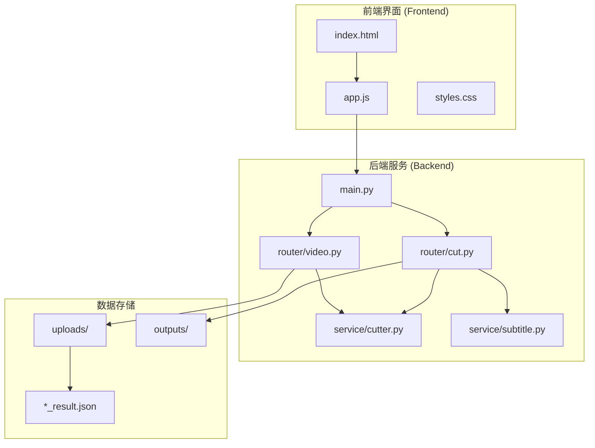
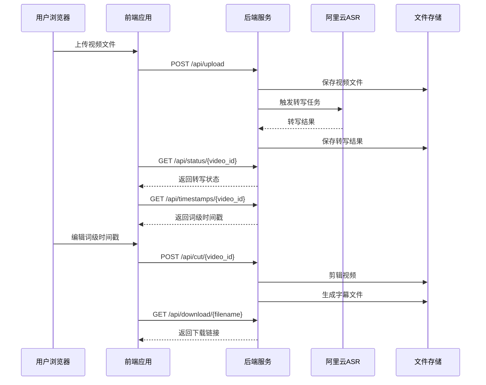
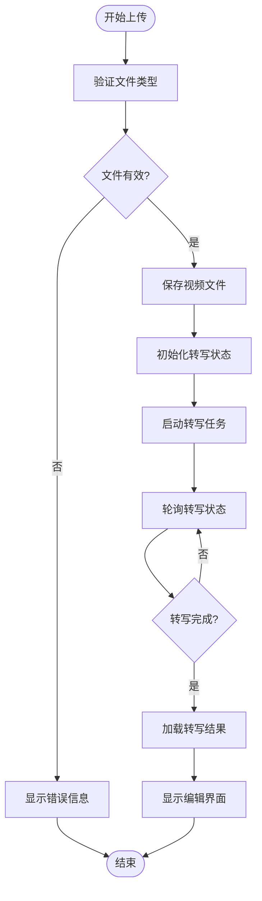
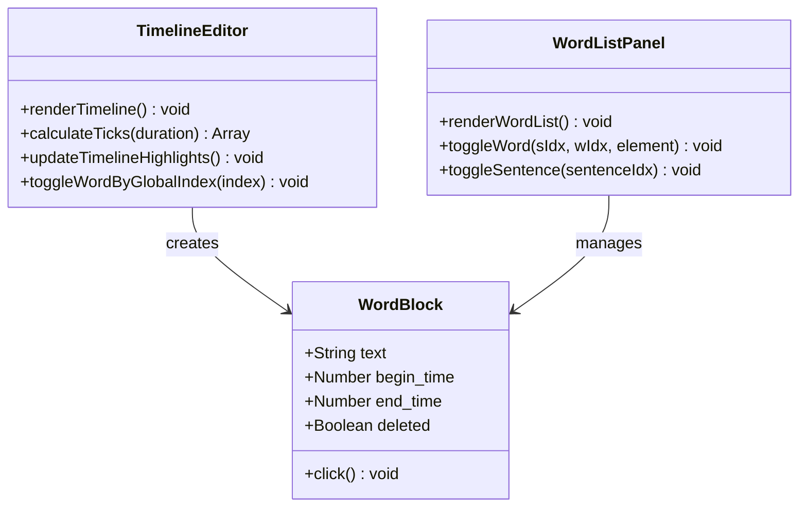
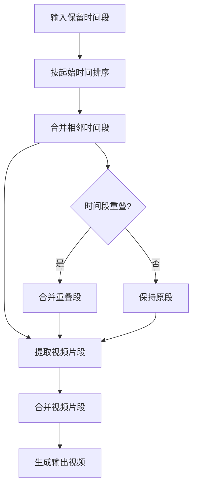
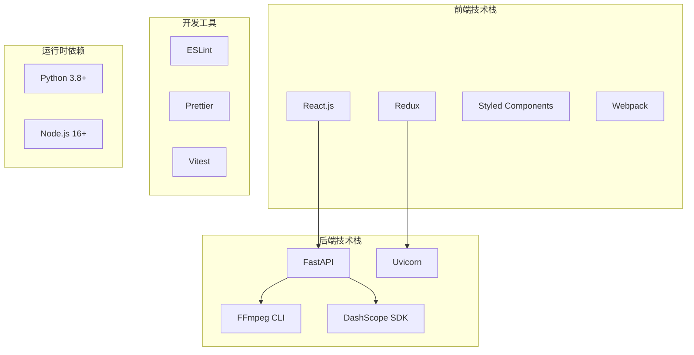
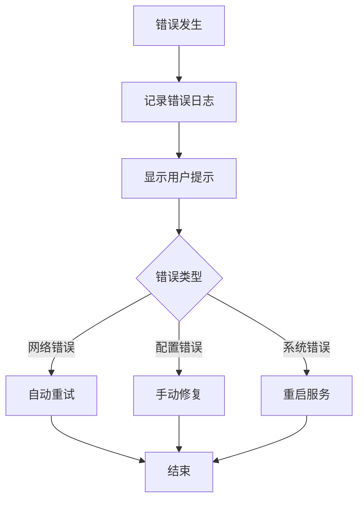

# Web界面使用指南

<cite>
**本文档引用的文件**
- [index.html](file://cut-video-web/frontend/index.html)
- [app.js](file://cut-video-web/frontend/app.js)
- [styles.css](file://cut-video-web/frontend/styles.css)
- [main.py](file://cut-video-web/backend/main.py)
- [video.py](file://cut-video-web/backend/router/video.py)
- [cut.py](file://cut-video-web/backend/router/cut.py)
- [cutter.py](file://cut-video-web/backend/service/cutter.py)
- [subtitle.py](file://cut-video-web/backend/service/subtitle.py)
- [README.md](file://README.md)
- [7813fb3b_result.json](file://cut-video-web/backend/uploads/7813fb3b_result.json)
- [hotwords.json](file://hotwords.json)
</cite>

## 目录
1. [简介](#简介)
2. [项目结构](#项目结构)
3. [核心组件](#核心组件)
4. [架构概览](#架构概览)
5. [详细组件分析](#详细组件分析)
6. [依赖关系分析](#依赖关系分析)
7. [性能考虑](#性能考虑)
8. [故障排除指南](#故障排除指南)
9. [结论](#结论)
10. [附录](#附录)

## 简介

ASR 视频剪辑工作室是一个基于 Web 的视频编辑工具，利用阿里云百炼 FunASR API 实现词级时间戳的视频剪辑功能。该工具提供了直观的用户界面，支持视频上传、自动转写、词级时间戳编辑和精确剪辑等功能。

主要功能特性：
- AI 词级转写：自动识别视频中的语音内容并生成词级时间戳
- 精准时间戳：毫秒级的时间精度，支持精确剪辑
- 一键导出：支持直接导出剪辑后的视频文件
- 字幕烧录：可选择将字幕烧录到最终视频中
- 热词优化：内置热词系统，提升特定词汇的识别准确率

## 项目结构

该项目采用前后端分离的架构设计，主要分为以下模块：

**图表来源**
- [main.py:1-84](file://cut-video-web/backend/main.py#L1-L84)
- [index.html:1-277](file://cut-video-web/frontend/index.html#L1-L277)

**章节来源**
- [main.py:1-84](file://cut-video-web/backend/main.py#L1-L84)
- [README.md:281-300](file://README.md#L281-L300)

## 核心组件

### 用户界面组件

Web 界面由三个主要视图组成，每个视图都有特定的功能和交互方式：

#### 上传视图 (Upload View)
- **上传卡片**：支持拖拽和点击两种文件选择方式
- **格式支持**：MP4、MOV、AVI 等常见视频格式
- **功能展示**：AI 词级转写、精准时间戳、一键导出
- **自动热词优化**：使用内置热词系统提升识别准确率

#### 加载视图 (Loading View)
- **进度指示**：实时显示转写进度百分比
- **状态更新**：从上传到转写再到加载的完整流程
- **动画效果**：流畅的加载动画和进度条

#### 编辑视图 (Editor View)
- **视频预览区**：播放视频并显示当前播放的词标记
- **时间轴编辑器**：词级时间戳的可视化编辑界面
- **词列表面板**：显示完整的词级时间戳列表
- **统计信息**：显示已删除词数和总词数

**章节来源**
- [index.html:68-237](file://cut-video-web/frontend/index.html#L68-L237)
- [app.js:80-88](file://cut-video-web/frontend/app.js#L80-L88)

### 后端服务组件

#### API 路由层
- **视频上传路由**：处理视频文件上传和转写任务
- **状态查询路由**：提供转写进度查询接口
- **时间戳路由**：返回词级时间戳数据
- **剪辑路由**：执行视频剪辑和字幕烧录

#### 服务层
- **视频剪辑服务**：使用 ffmpeg 实现精确的视频剪辑
- **字幕生成服务**：根据保留的词生成 SRT 字幕文件
- **清理服务**：自动清理过期的临时文件

**章节来源**
- [video.py:24-296](file://cut-video-web/backend/router/video.py#L24-L296)
- [cut.py:22-232](file://cut-video-web/backend/router/cut.py#L22-L232)

## 架构概览

系统采用现代 Web 架构，结合了前端交互和后端服务的优势：

**图表来源**
- [app.js:119-212](file://cut-video-web/frontend/app.js#L119-L212)
- [video.py:126-296](file://cut-video-web/backend/router/video.py#L126-L296)
- [cut.py:51-125](file://cut-video-web/backend/router/cut.py#L51-L125)

## 详细组件分析

### 视频上传与转写流程

#### 上传处理流程

**图表来源**
- [app.js:119-186](file://cut-video-web/frontend/app.js#L119-L186)
- [video.py:126-234](file://cut-video-web/backend/router/video.py#L126-L234)

#### 转写状态管理
系统使用内存中的状态字典来跟踪每个视频的转写进度：

| 状态值 | 描述 | 用途 |
|--------|------|------|
| PENDING | 待处理 | 文件已上传但尚未开始转写 |
| PROCESSING | 转写中 | 正在进行 ASR 转写 |
| DONE | 完成 | 转写成功，结果可用 |
| ERROR | 错误 | 转写失败，包含错误信息 |

**章节来源**
- [video.py:98-103](file://cut-video-web/backend/router/video.py#L98-L103)
- [video.py:147-154](file://cut-video-web/backend/router/video.py#L147-L154)

### 词级时间戳编辑界面

#### 时间轴编辑器
时间轴编辑器提供了直观的词级时间戳可视化编辑功能：

**图表来源**
- [app.js:300-362](file://cut-video-web/frontend/app.js#L300-L362)
- [app.js:364-406](file://cut-video-web/frontend/app.js#L364-L406)

#### 编辑交互功能
用户可以通过多种方式编辑词级时间戳：

1. **点击删除**：点击词块或词列表中的词进行删除
2. **整句删除**：点击句子块的空白区域删除整个句子
3. **撤销操作**：使用撤销按钮恢复到上一步状态
4. **重置功能**：清除所有编辑操作回到初始状态

**章节来源**
- [app.js:448-521](file://cut-video-web/frontend/app.js#L448-L521)
- [app.js:522-550](file://cut-video-web/frontend/app.js#L522-L550)

### 视频剪辑与导出流程

#### 剪辑算法实现
系统使用精确的时间段合并算法来处理视频剪辑：

**图表来源**
- [cutter.py:68-92](file://cut-video-web/backend/service/cutter.py#L68-L92)
- [cutter.py:21-66](file://cut-video-web/backend/service/cutter.py#L21-L66)

#### 字幕烧录功能
字幕烧录功能提供了灵活的字幕生成和视频合成能力：

| 功能特性 | 实现方式 | 效果 |
|----------|----------|------|
| 按标点分割 | 分析句子文本中的标点符号位置 | 自动生成符合语法的字幕片段 |
| 智能过滤 | 自动过滤被删除的词 | 确保字幕内容与剪辑结果一致 |
| 时间戳对齐 | 将原始时间戳映射到新视频 | 实现精确的时间同步 |
| 字幕渲染 | 使用 ffmpeg 的字幕渲染引擎 | 生成高质量的烧录字幕 |

**章节来源**
- [subtitle.py:101-171](file://cut-video-web/backend/service/subtitle.py#L101-L171)
- [cut.py:88-100](file://cut-video-web/backend/router/cut.py#L88-L100)

### 用户界面交互设计

#### 主要交互元素
Web 界面采用了现代化的设计理念，提供了丰富的交互体验：

| 组件 | 功能描述 | 快捷键支持 |
|------|----------|------------|
| 视频播放器 | 播放、暂停、快进、快退 | Space(播放/暂停), ←→(跳转) |
| 进度条 | 点击跳转到指定时间 | 鼠标点击 |
| 时间轴编辑器 | 可视化词级时间戳编辑 | 点击删除词 |
| 编辑面板 | 词列表和统计信息 | 直接点击操作 |
| 导航按钮 | 撤销、重置、导出 | 按钮点击 |

#### 响应式设计
界面采用响应式布局，适配不同屏幕尺寸：

- **桌面端**：完整的双面板布局，左右分区显示
- **平板端**：自适应调整，确保操作便利性
- **移动端**：触摸友好的交互设计

**章节来源**
- [styles.css:107-133](file://cut-video-web/frontend/styles.css#L107-L133)
- [app.js:666-692](file://cut-video-web/frontend/app.js#L666-L692)

## 依赖关系分析

### 技术栈依赖

**图表来源**
- [main.py:19-30](file://cut-video-web/backend/main.py#L19-L30)
- [README.md:31-36](file://README.md#L31-L36)

### 外部服务集成

#### 阿里云百炼 API
系统集成了阿里云百炼的 FunASR 服务，提供高质量的语音识别能力：

- **API Key 管理**：通过环境变量配置
- **模型选择**：默认使用 paraformer-v1 模型
- **热词支持**：集成热词优化功能
- **时间戳精度**：毫秒级词级时间戳

#### FFmpeg 集成
视频处理完全依赖 FFmpeg 强大的多媒体处理能力：

- **视频剪辑**：精确的时间段提取和合并
- **格式转换**：支持多种视频格式的编码
- **字幕渲染**：高质量的字幕烧录效果
- **性能优化**：硬件加速支持

**章节来源**
- [video.py:180-208](file://cut-video-web/backend/router/video.py#L180-L208)
- [cutter.py:109-154](file://cut-video-web/backend/service/cutter.py#L109-L154)

## 性能考虑

### 前端性能优化

#### 内存管理
- **状态管理**：使用轻量级状态对象避免不必要的重渲染
- **DOM 操作**：批量更新 DOM 节点，减少重排重绘
- **事件监听**：合理绑定和解绑事件监听器

#### 渲染优化
- **虚拟滚动**：对于大量词列表使用虚拟滚动技术
- **懒加载**：延迟加载视频资源和字幕文件
- **缓存策略**：缓存转写结果和中间文件

### 后端性能优化

#### 异步处理
- **后台任务**：转写任务在后台异步执行
- **并发控制**：限制同时进行的转写任务数量
- **资源池**：管理 FFmpeg 进程池

#### 文件管理
- **临时文件清理**：定期清理过期的临时文件
- **存储优化**：合理组织文件存储结构
- **压缩策略**：对输出文件进行适当的压缩

### 网络性能

#### 请求优化
- **轮询间隔**：合理的转写状态轮询间隔
- **缓存策略**：缓存常用的 API 响应
- **连接复用**：使用持久连接减少握手开销

**章节来源**
- [app.js:153-186](file://cut-video-web/frontend/app.js#L153-L186)
- [main.py:61-75](file://cut-video-web/backend/main.py#L61-L75)

## 故障排除指南

### 常见问题及解决方案

#### 视频上传失败
**问题症状**：上传过程中出现错误提示
**可能原因**：
- 文件格式不支持
- 网络连接不稳定
- 服务器空间不足

**解决步骤**：
1. 检查文件格式是否为 MP4、MOV 或 AVI
2. 确认网络连接稳定
3. 清理服务器磁盘空间
4. 重新尝试上传

#### 转写任务超时
**问题症状**：转写进度长时间停留在 20%
**可能原因**：
- API Key 配置错误
- 网络连接问题
- 视频文件过大

**解决步骤**：
1. 验证 DASHSCOPE_API_KEY 环境变量
2. 检查网络连接质量
3. 优化视频文件大小
4. 重启服务后重试

#### 剪辑结果异常
**问题症状**：剪辑后的视频质量不佳或字幕错位
**可能原因**：
- FFmpeg 版本不兼容
- 字幕时间戳计算错误
- 视频编码参数不当

**解决步骤**：
1. 升级 FFmpeg 到最新版本
2. 检查字幕生成逻辑
3. 调整视频编码参数
4. 重新生成剪辑文件

### 错误监控与日志

系统提供了完善的错误监控机制：

**图表来源**
- [app.js:694-705](file://cut-video-web/frontend/app.js#L694-L705)

**章节来源**
- [app.js:147-150](file://cut-video-web/frontend/app.js#L147-L150)
- [video.py:229-234](file://cut-video-web/backend/router/video.py#L229-L234)

## 结论

ASR 视频剪辑工作室提供了一个功能完整、用户体验优秀的视频编辑解决方案。通过词级时间戳的精确编辑能力和高效的视频处理技术，用户可以轻松实现高质量的视频剪辑和字幕制作。

### 主要优势
- **精确编辑**：毫秒级的时间精度，支持精细的视频编辑
- **智能转写**：AI 驱动的语音识别，支持热词优化
- **直观界面**：现代化的 Web 界面，操作简单易用
- **高效处理**：基于 FFmpeg 的高性能视频处理

### 技术特色
- **前后端分离**：清晰的架构设计，便于维护和扩展
- **异步处理**：后台任务处理，提升用户体验
- **响应式设计**：适配多种设备和屏幕尺寸
- **错误处理**：完善的错误监控和恢复机制

## 附录

### 使用流程详解

#### 完整操作流程
1. **启动服务**：运行后端服务并访问 Web 界面
2. **上传视频**：选择支持格式的视频文件进行上传
3. **等待转写**：系统自动进行词级时间戳转写
4. **编辑词级时间戳**：点击删除不需要的词或句子
5. **预览效果**：播放视频查看编辑效果
6. **导出视频**：确认编辑结果并导出最终视频

#### 快捷键参考
- **Space**：播放/暂停视频
- **← →**：向前/向后跳转 1 秒
- **Ctrl/Cmd + Z**：撤销上一步操作

#### 浏览器兼容性
- **Chrome 90+**：完全支持
- **Firefox 88+**：完全支持  
- **Safari 14+**：完全支持
- **Edge 90+**：完全支持

#### 性能优化建议
- **硬件要求**：至少 8GB RAM，推荐 16GB+
- **网络要求**：稳定的宽带连接
- **存储空间**：预留足够的临时存储空间
- **视频格式**：优先使用 MP4 格式

**章节来源**
- [README.md:266-274](file://README.md#L266-L274)
- [README.md:275-280](file://README.md#L275-L280)