# CSS样式系统

<cite>
**本文档引用的文件**
- [styles.css](file://cut-video-web/frontend/styles.css)
- [index.html](file://cut-video-web/frontend/index.html)
- [app.js](file://cut-video-web/frontend/app.js)
- [package.json](file://cut-video-web/frontend/package.json)
- [vite.config.js](file://cut-video-web/frontend/vite.config.js)
- [main.py](file://cut-video-web/backend/main.py)
- [video.py](file://cut-video-web/backend/router/video.py)
- [cut.py](file://cut-video-web/backend/router/cut.py)
- [README.md](file://README.md)
</cite>

## 目录
1. [简介](#简介)
2. [项目结构](#项目结构)
3. [核心组件](#核心组件)
4. [架构概览](#架构概览)
5. [详细组件分析](#详细组件分析)
6. [依赖关系分析](#依赖关系分析)
7. [性能考量](#性能考量)
8. [故障排除指南](#故障排除指南)
9. [结论](#结论)

## 简介

这是一个基于阿里云百炼FunASR API的ASR视频剪辑工作室的前端样式系统。该系统采用现代化的CSS架构设计，实现了专业的暗色主题界面，支持词级时间戳的视频剪辑功能。系统通过CSS变量实现主题化设计，采用BEM命名规范进行组件化样式组织，并提供了完整的响应式设计方案。

## 项目结构

前端项目采用简洁的三层架构：
- **样式层**：集中式的CSS样式文件，包含所有UI组件的样式定义
- **模板层**：HTML结构文件，定义页面骨架和组件结构
- **逻辑层**：JavaScript文件，处理用户交互和动态内容更新

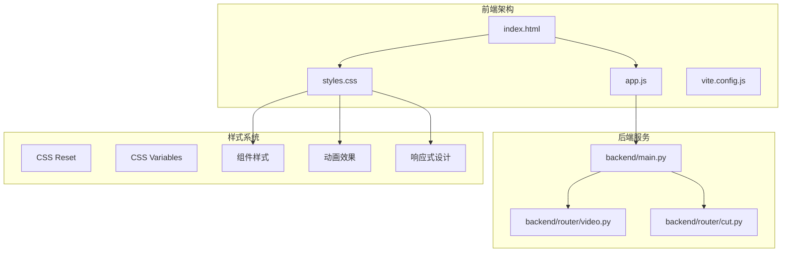

**图表来源**
- [index.html:1-282](file://cut-video-web/frontend/index.html#L1-L282)
- [styles.css:1-1063](file://cut-video-web/frontend/styles.css#L1-L1063)
- [app.js:1-892](file://cut-video-web/frontend/app.js#L1-L892)

**章节来源**
- [package.json:1-15](file://cut-video-web/frontend/package.json#L1-L15)
- [vite.config.js:1-23](file://cut-video-web/frontend/vite.config.js#L1-L23)

## 核心组件

### 主题系统架构

系统采用CSS自定义属性实现主题化设计，建立了完整的颜色、间距、字体和阴影系统：

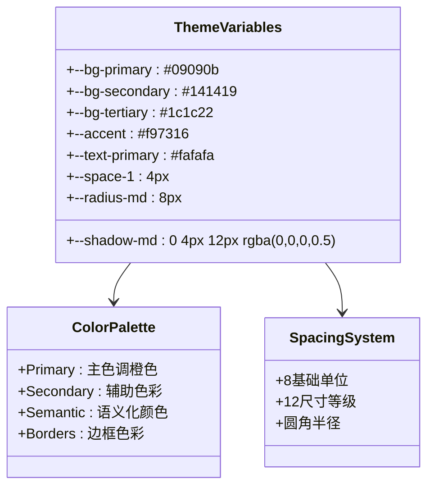

**图表来源**
- [styles.css:40-105](file://cut-video-web/frontend/styles.css#L40-L105)

### 组件化样式组织

系统采用BEM（Block Element Modifier）命名规范，实现了高度模块化的组件结构：

| 组件类别 | Block前缀 | Element示例 | Modifier示例 |
|---------|-----------|-------------|-------------|
| 布局容器 | .app, .header, .main | .header-left, .main-view | .active, .visible |
| 按钮系统 | .btn, .transport-btn | .btn-primary, .btn-secondary | .disabled, .hover |
| 表单控件 | .upload-card, .subtitle-toggle | .upload-icon, .format-badge | .dragover, :checked |
| 数据展示 | .timeline, .word-block, .sentence-block | .word-list, .progress-bar | .current, .deleted |

**章节来源**
- [styles.css:107-1063](file://cut-video-web/frontend/styles.css#L107-L1063)

## 架构概览

### 样式架构设计原则

系统遵循以下设计原则：

1. **一致性**：通过CSS变量确保全局色彩和间距的一致性
2. **可维护性**：采用BEM规范便于理解和维护
3. **可扩展性**：模块化设计支持新组件的快速添加
4. **性能优化**：最小化重绘和回流，优化动画性能

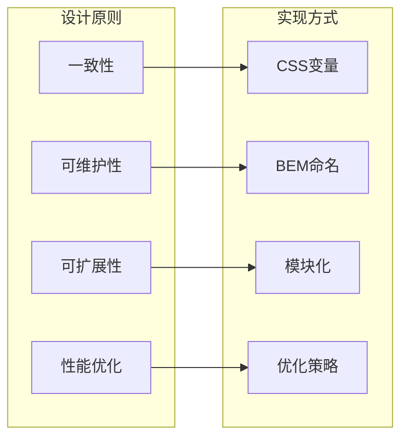

**图表来源**
- [styles.css:1-1063](file://cut-video-web/frontend/styles.css#L1-L1063)

## 详细组件分析

### 头部导航组件

头部导航采用Flex布局实现响应式设计，支持品牌标识、操作按钮和字幕切换功能。

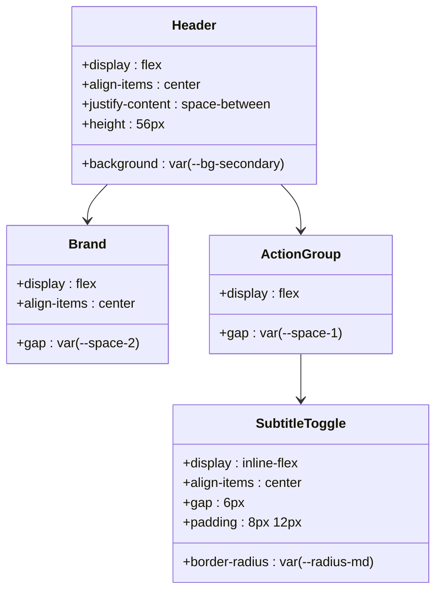

**图表来源**
- [styles.css:115-314](file://cut-video-web/frontend/styles.css#L115-L314)
- [index.html:21-63](file://cut-video-web/frontend/index.html#L21-L63)

### 上传界面组件

上传界面采用卡片式设计，支持拖拽上传和文件格式提示功能。

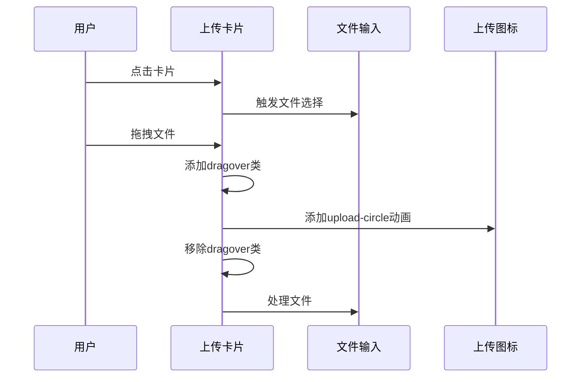

**图表来源**
- [styles.css:334-463](file://cut-video-web/frontend/styles.css#L334-L463)
- [index.html:68-125](file://cut-video-web/frontend/index.html#L68-L125)

**章节来源**
- [styles.css:334-463](file://cut-video-web/frontend/styles.css#L334-L463)
- [index.html:68-125](file://cut-video-web/frontend/index.html#L68-L125)

### 加载界面组件

加载界面包含进度条和旋转动画，提供清晰的处理状态反馈。

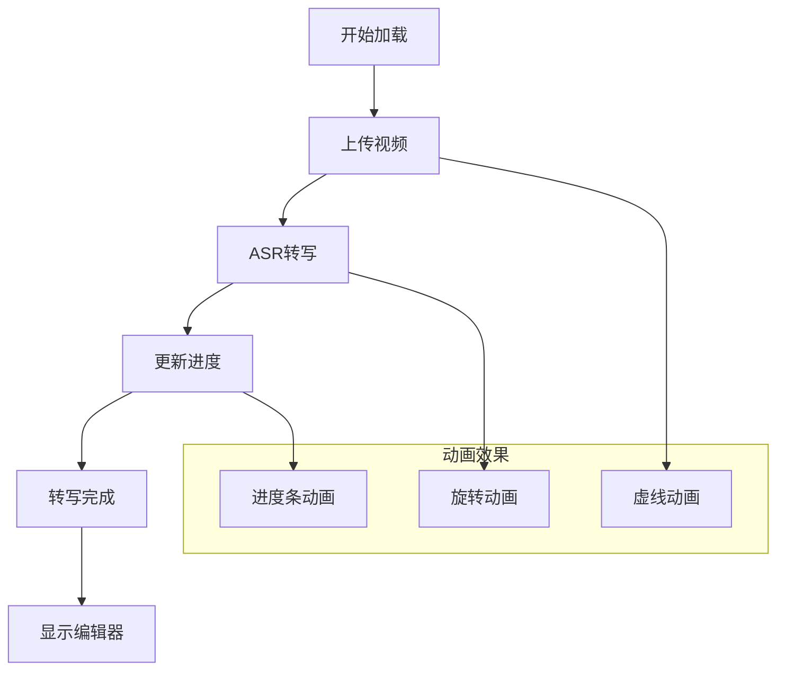

**图表来源**
- [styles.css:464-524](file://cut-video-web/frontend/styles.css#L464-L524)
- [index.html:127-141](file://cut-video-web/frontend/index.html#L127-L141)

**章节来源**
- [styles.css:464-524](file://cut-video-web/frontend/styles.css#L464-L524)
- [index.html:127-141](file://cut-video-web/frontend/index.html#L127-L141)

### 编辑器界面组件

编辑器界面采用网格布局，包含视频预览和字幕编辑面板。

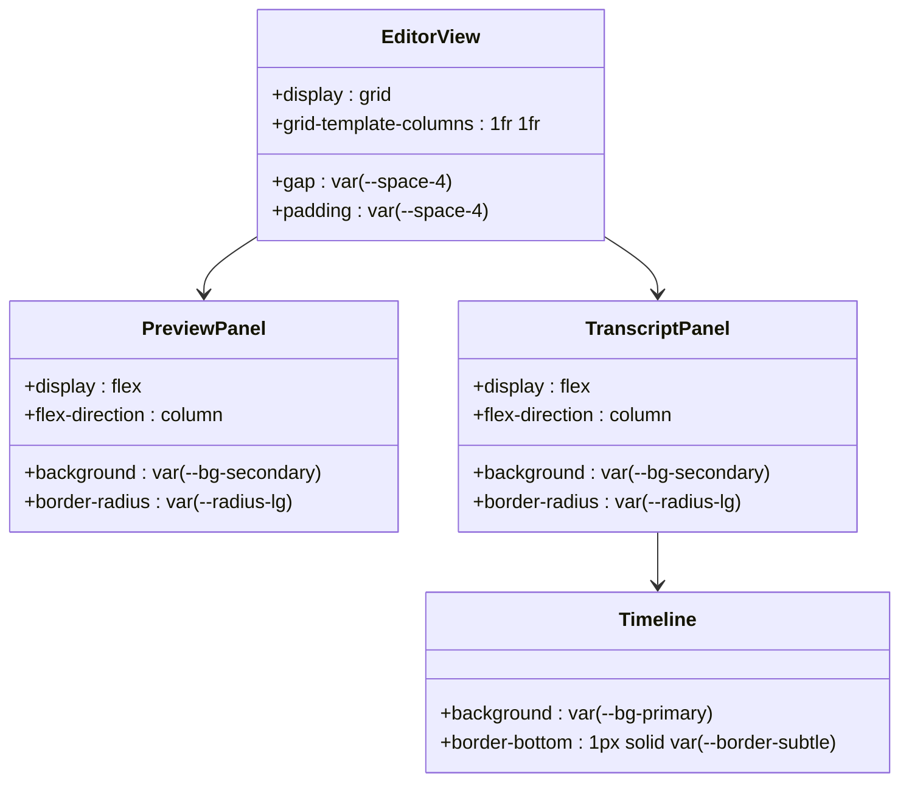

**图表来源**
- [styles.css:525-713](file://cut-video-web/frontend/styles.css#L525-L713)
- [index.html:143-242](file://cut-video-web/frontend/index.html#L143-L242)

**章节来源**
- [styles.css:525-713](file://cut-video-web/frontend/styles.css#L525-L713)
- [index.html:143-242](file://cut-video-web/frontend/index.html#L143-L242)

### 时间轴组件

时间轴组件实现了词级时间戳的可视化编辑功能。

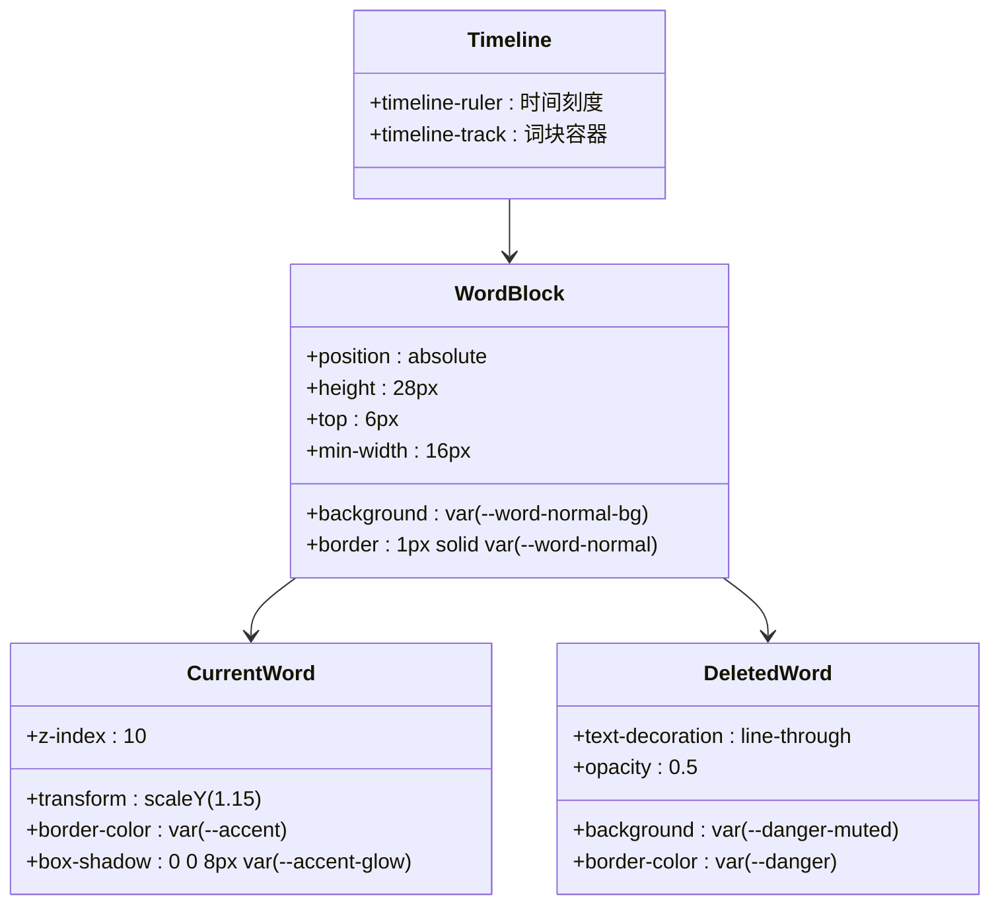

**图表来源**
- [styles.css:713-812](file://cut-video-web/frontend/styles.css#L713-L812)
- [app.js:302-335](file://cut-video-web/frontend/app.js#L302-L335)

**章节来源**
- [styles.css:713-812](file://cut-video-web/frontend/styles.css#L713-L812)
- [app.js:302-335](file://cut-video-web/frontend/app.js#L302-L335)

### 模态框组件

模态框组件提供了导出完成的确认界面。

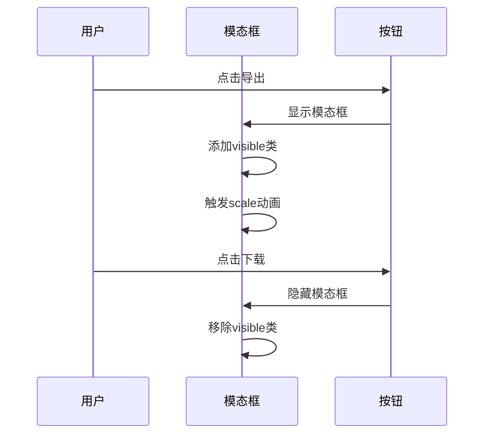

**图表来源**
- [styles.css:935-1004](file://cut-video-web/frontend/styles.css#L935-L1004)
- [index.html:246-269](file://cut-video-web/frontend/index.html#L246-L269)

**章节来源**
- [styles.css:935-1004](file://cut-video-web/frontend/styles.css#L935-L1004)
- [index.html:246-269](file://cut-video-web/frontend/index.html#L246-L269)

## 依赖关系分析

### 样式依赖关系

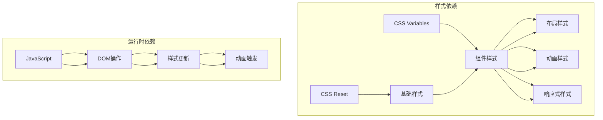

**图表来源**
- [styles.css:1-1063](file://cut-video-web/frontend/styles.css#L1-L1063)
- [app.js:1-892](file://cut-video-web/frontend/app.js#L1-L892)

### 前后端集成

系统通过Vite开发服务器代理API请求，实现了前后端分离的架构模式。

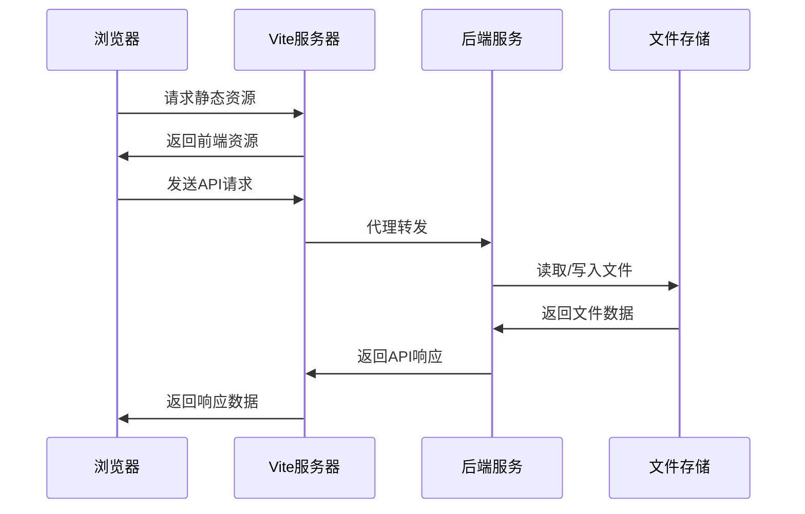

**图表来源**
- [vite.config.js:7-16](file://cut-video-web/frontend/vite.config.js#L7-L16)
- [main.py:46-83](file://cut-video-web/backend/main.py#L46-L83)

**章节来源**
- [vite.config.js:7-16](file://cut-video-web/frontend/vite.config.js#L7-L16)
- [main.py:46-83](file://cut-video-web/backend/main.py#L46-L83)

## 性能考量

### 样式性能优化

系统采用了多项性能优化策略：

1. **CSS变量缓存**：通过CSS自定义属性减少重复计算
2. **硬件加速**：合理使用transform和opacity属性
3. **动画优化**：使用will-change属性提升动画性能
4. **选择器优化**：避免深层嵌套选择器

### 响应式性能

系统在不同设备上的性能表现：

- **桌面端**：完整的两列布局，支持所有功能
- **平板端**：网格布局调整为单列，保持功能完整性
- **移动端**：隐藏部分按钮文字，优化触摸交互

## 故障排除指南

### 常见样式问题

1. **主题颜色不生效**
   - 检查CSS变量是否正确声明
   - 确认变量作用域是否正确

2. **动画效果异常**
   - 检查浏览器兼容性
   - 验证关键帧定义是否正确

3. **响应式布局问题**
   - 确认媒体查询断点设置
   - 检查flexbox属性兼容性

### 性能问题诊断

1. **页面渲染缓慢**
   - 使用浏览器开发者工具分析重绘
   - 检查CSS选择器复杂度
   - 优化动画频率

2. **内存泄漏**
   - 检查事件监听器是否正确移除
   - 确认DOM节点及时清理

**章节来源**
- [styles.css:1044-1063](file://cut-video-web/frontend/styles.css#L1044-L1063)

## 结论

该CSS样式系统展现了现代前端开发的最佳实践，通过合理的架构设计和组件化组织，实现了高度可维护和可扩展的样式体系。系统采用的主题化设计、BEM命名规范和响应式布局策略，为类似的专业视频编辑应用提供了优秀的样式解决方案参考。

系统的主要优势包括：
- 清晰的架构层次和模块化设计
- 完善的主题变量系统
- 优秀的响应式适配能力
- 丰富的动画和交互效果
- 良好的性能优化策略

这些特性使得该样式系统不仅满足当前的功能需求，也为未来的功能扩展和技术演进奠定了坚实的基础。