# HTML结构设计

<cite>
**本文档引用的文件**
- [index.html](file://cut-video-web/frontend/index.html)
- [styles.css](file://cut-video-web/frontend/styles.css)
- [app.js](file://cut-video-web/frontend/app.js)
- [main.py](file://cut-video-web/backend/main.py)
- [package.json](file://cut-video-web/frontend/package.json)
- [vite.config.js](file://cut-video-web/frontend/vite.config.js)
</cite>

## 目录
1. [简介](#简介)
2. [项目结构](#项目结构)
3. [核心组件](#核心组件)
4. [架构概览](#架构概览)
5. [详细组件分析](#详细组件分析)
6. [依赖关系分析](#依赖关系分析)
7. [性能考虑](#性能考虑)
8. [故障排除指南](#故障排除指南)
9. [结论](#结论)
10. [附录](#附录)

## 简介

这是一个基于Web的ASR词级时间戳视频剪辑工具，采用现代化的HTML5、CSS3和JavaScript技术栈构建。该应用提供了完整的视频上传、自动转写、时间轴编辑和视频导出功能，具有专业的用户界面设计和优秀的用户体验。

## 项目结构

该项目采用前后端分离的架构设计，前端使用现代Web技术栈，后端基于Python的FastAPI框架。

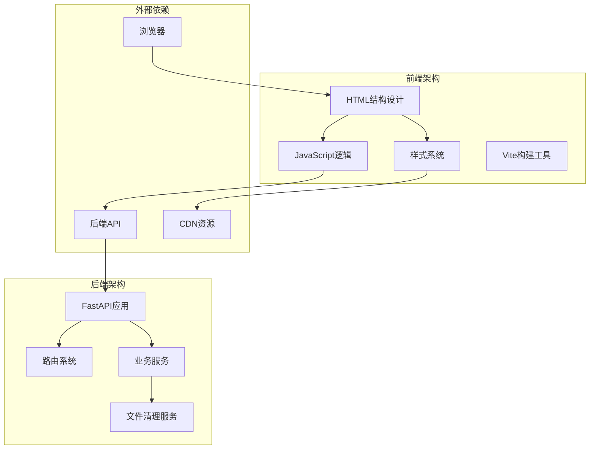

**图表来源**
- [index.html:1-282](file://cut-video-web/frontend/index.html#L1-L282)
- [main.py:19-84](file://cut-video-web/backend/main.py#L19-L84)

**章节来源**
- [index.html:1-282](file://cut-video-web/frontend/index.html#L1-L282)
- [main.py:19-84](file://cut-video-web/backend/main.py#L19-L84)

## 核心组件

### 应用容器结构

应用采用单一的`
`容器作为根元素，内部包含完整的页面结构：

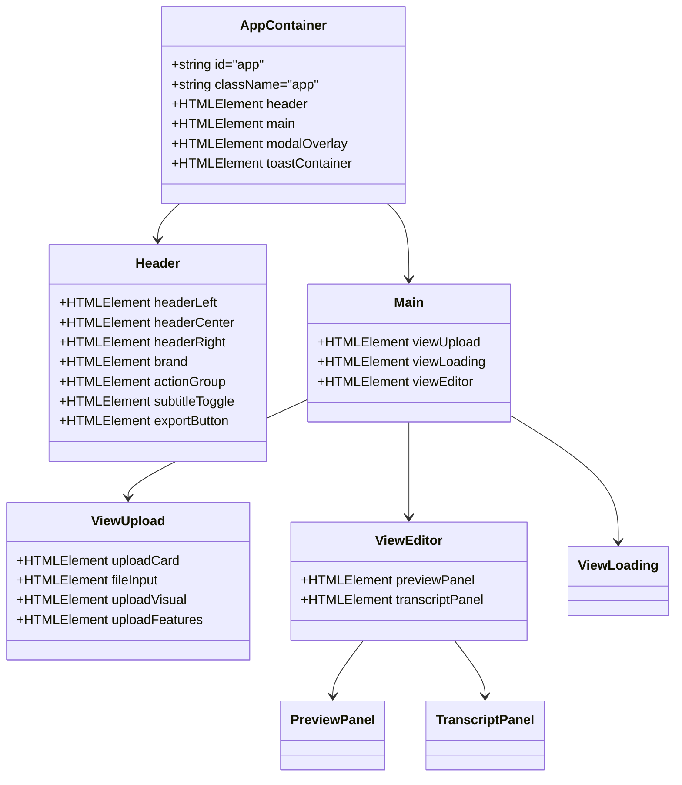

**图表来源**
- [index.html:18-244](file://cut-video-web/frontend/index.html#L18-L244)

### 视图容器设计理念

应用实现了三种主要视图模式，通过CSS类切换实现视图间的平滑过渡：

1. **上传视图** (`view-upload`): 提供文件上传和格式说明
2. **加载视图** (`view-loading`): 显示处理进度和状态
3. **编辑器视图** (`view-editor`): 主要的编辑界面

每个视图都采用绝对定位和CSS Grid布局，在激活状态下显示，未激活状态隐藏。

**章节来源**
- [index.html:68-242](file://cut-video-web/frontend/index.html#L68-L242)
- [styles.css:322-333](file://cut-video-web/frontend/styles.css#L322-L333)

## 架构概览

### 整体布局架构

应用采用经典的三段式布局设计：

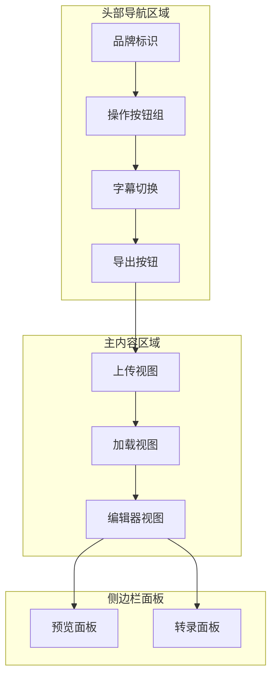

**图表来源**
- [index.html:21-244](file://cut-video-web/frontend/index.html#L21-L244)

### 数据流架构

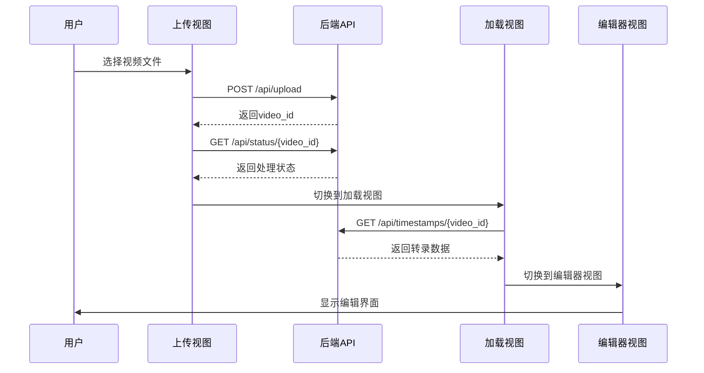

**图表来源**
- [app.js:120-213](file://cut-video-web/frontend/app.js#L120-L213)

**章节来源**
- [app.js:80-89](file://cut-video-web/frontend/app.js#L80-L89)
- [app.js:215-238](file://cut-video-web/frontend/app.js#L215-L238)

## 详细组件分析

### 头部导航区域设计

头部导航采用Flexbox布局，实现了响应式的三栏布局：

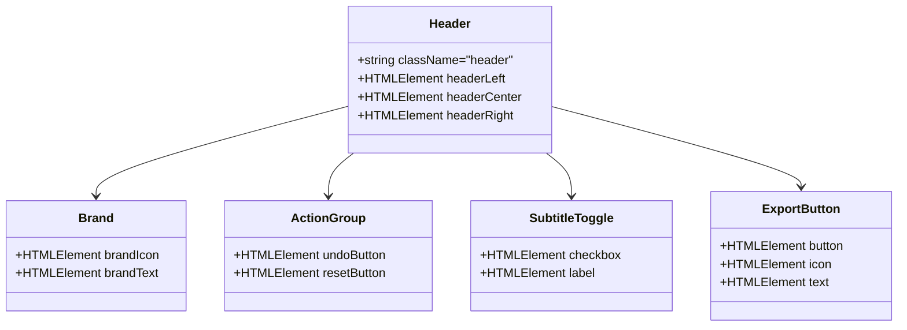

**图表来源**
- [index.html:22-63](file://cut-video-web/frontend/index.html#L22-L63)

#### 品牌标识设计

品牌标识采用SVG图标与文本的组合设计，图标使用了简洁的几何形状：
- 主图标：矩形框加三角形箭头，体现视频播放的概念
- 颜色方案：使用主题的橙色强调色(#f97316)
- 响应式设计：在小屏幕设备上保持清晰度

#### 操作按钮组

按钮组包含了撤销、重置和导出功能，采用了统一的设计语言：
- 按钮尺寸：基础按钮32px，主按钮38px
- 状态管理：根据应用状态动态启用/禁用
- 图标配合：每个按钮都配有相应的SVG图标

**章节来源**
- [index.html:22-63](file://cut-video-web/frontend/index.html#L22-L63)
- [styles.css:116-142](file://cut-video-web/frontend/styles.css#L116-L142)

### 主内容区域结构

主内容区域采用相对定位，内部包含三个视图容器：

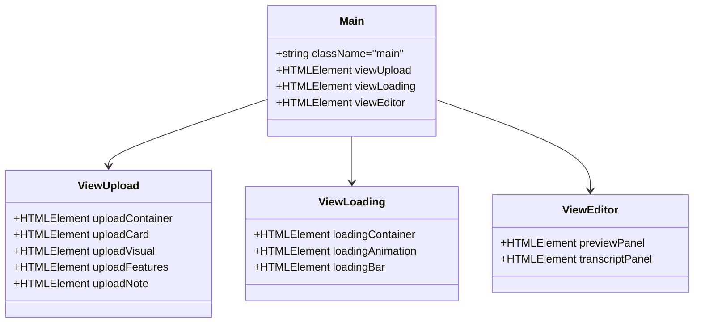

**图表来源**
- [index.html:66-244](file://cut-video-web/frontend/index.html#L66-L244)

#### 上传视图设计

上传视图采用了卡片式设计，提供了直观的文件拖拽和选择功能：

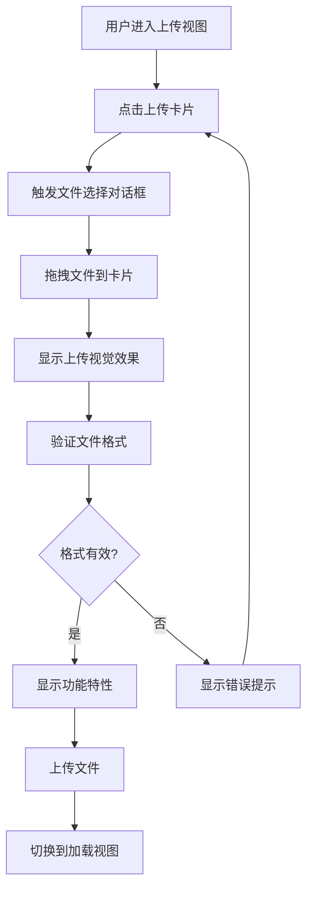

**图表来源**
- [app.js:92-118](file://cut-video-web/frontend/app.js#L92-L118)

#### 加载视图设计

加载视图提供了实时的处理进度反馈：
- 旋转动画：使用CSS动画实现流畅的加载指示
- 进度条：动态更新的进度条显示处理状态
- 状态文本：实时更新的处理状态描述

#### 编辑器视图设计

编辑器视图采用CSS Grid布局，实现了响应式的双面板设计：

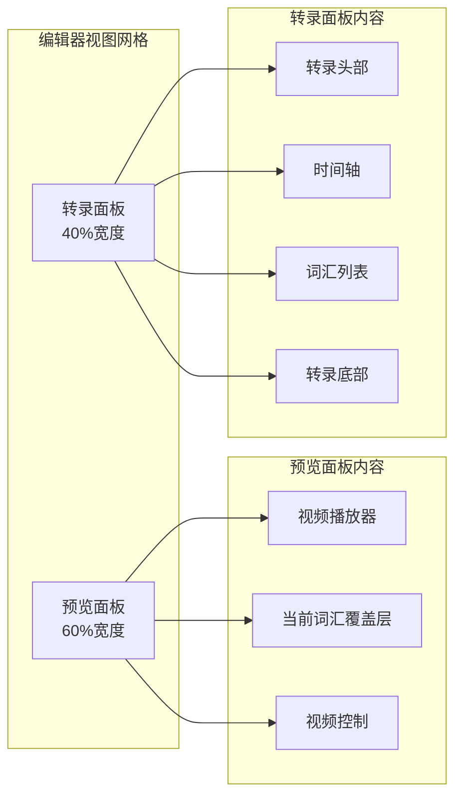

**图表来源**
- [index.html:144-242](file://cut-video-web/frontend/index.html#L144-L242)

**章节来源**
- [index.html:68-242](file://cut-video-web/frontend/index.html#L68-L242)

### 侧边栏面板设计

#### 预览面板

预览面板包含了完整的视频播放功能：
- 视频播放器：支持播放、暂停、跳转等标准功能
- 当前词汇显示：实时显示当前播放的词汇
- 进度控制：可视化的时间轴和进度条
- 传输控制：播放、后退、前进等快捷操作

#### 转录面板

转录面板提供了丰富的编辑功能：
- 时间轴：可视化的时间线显示所有词汇
- 词汇列表：可交互的词汇列表，支持删除和编辑
- 统计信息：实时显示删除、编辑和总计词汇数量
- 快捷键支持：键盘快捷键操作

**章节来源**
- [index.html:146-241](file://cut-video-web/frontend/index.html#L146-L241)

### SVG图标系统

应用广泛使用了SVG图标，实现了高质量的矢量图形：

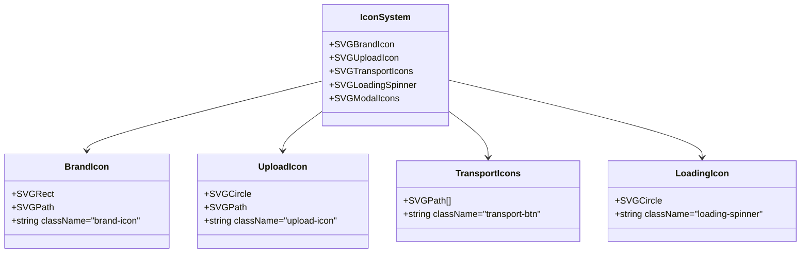

**图表来源**
- [index.html:25-59](file://cut-video-web/frontend/index.html#L25-L59)

#### 图标设计特点

1. **一致性**：所有图标使用相同的`viewBox`和`stroke-width`规范
2. **响应式**：图标使用百分比尺寸，适应不同屏幕密度
3. **语义化**：图标与功能紧密相关，便于用户理解
4. **性能优化**：内联SVG减少HTTP请求，提高加载速度

**章节来源**
- [index.html:25-59](file://cut-video-web/frontend/index.html#L25-L59)

## 依赖关系分析

### 前端依赖关系

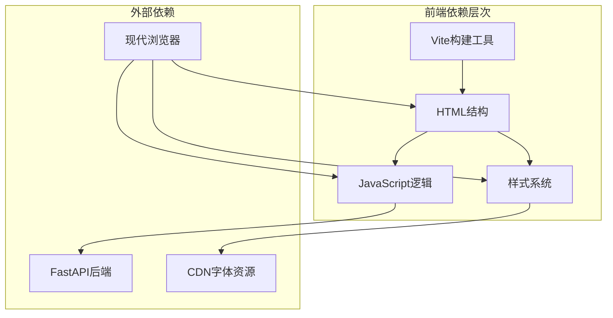

**图表来源**
- [package.json:1-15](file://cut-video-web/frontend/package.json#L1-L15)
- [vite.config.js:1-23](file://cut-video-web/frontend/vite.config.js#L1-L23)

### 后端依赖关系

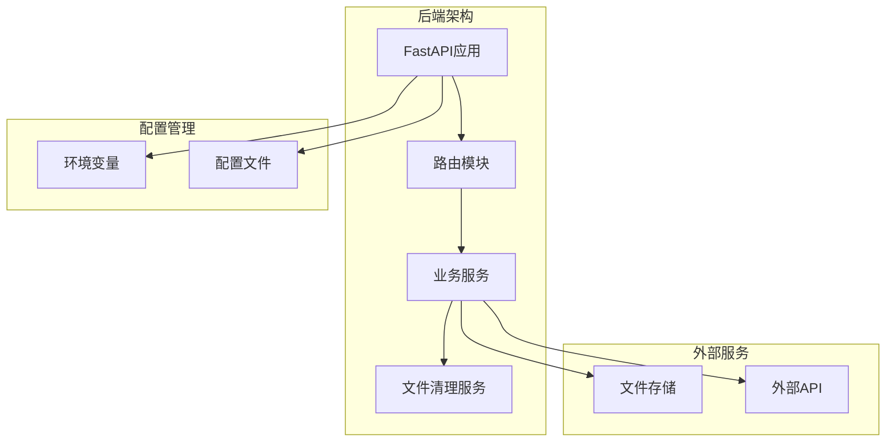

**图表来源**
- [main.py:19-84](file://cut-video-web/backend/main.py#L19-L84)

**章节来源**
- [main.py:19-84](file://cut-video-web/backend/main.py#L19-L84)

## 性能考虑

### 响应式设计策略

应用采用了渐进增强的响应式设计：

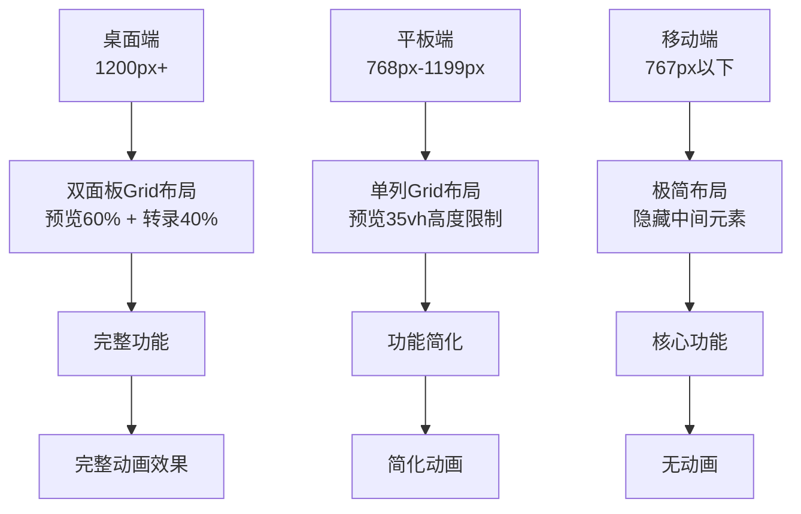

**图表来源**
- [styles.css:1041-1060](file://cut-video-web/frontend/styles.css#L1041-L1060)

### 性能优化措施

1. **CSS变量优化**：使用CSS自定义属性实现主题统一和性能优化
2. **SVG内联**：减少HTTP请求，提高渲染性能
3. **懒加载**：图片和资源按需加载
4. **动画优化**：使用transform和opacity属性实现硬件加速
5. **内存管理**：及时清理事件监听器和DOM引用

**章节来源**
- [styles.css:41-105](file://cut-video-web/frontend/styles.css#L41-L105)
- [styles.css:1041-1060](file://cut-video-web/frontend/styles.css#L1041-L1060)

## 故障排除指南

### 常见问题诊断

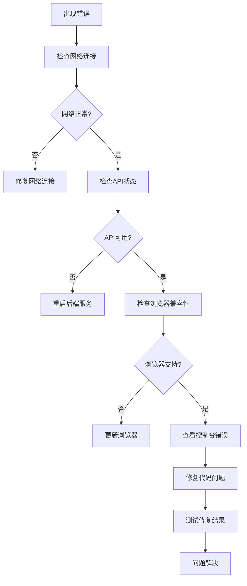

### 错误处理机制

应用实现了多层次的错误处理：

1. **前端错误处理**：使用try-catch和Promise.catch捕获异常
2. **用户友好提示**：通过Toast组件显示错误信息
3. **状态回滚**：错误发生时自动回滚到上一个稳定状态
4. **重试机制**：对网络请求实现智能重试

**章节来源**
- [app.js:148-152](file://cut-video-web/frontend/app.js#L148-L152)
- [app.js:744-754](file://cut-video-web/frontend/app.js#L744-L754)

## 结论

这个HTML结构设计展现了现代Web应用的最佳实践：

1. **架构清晰**：采用模块化的组件设计，职责分离明确
2. **用户体验优秀**：响应式设计和流畅的动画效果
3. **性能优化到位**：合理的资源管理和性能优化策略
4. **可维护性强**：清晰的代码结构和文档化程度高

该设计为视频编辑类应用提供了优秀的前端架构参考，特别是在实时处理和用户交互方面展现了出色的技术实现。

## 附录

### 最佳实践建议

1. **语义化HTML**：使用适当的HTML5语义标签
2. **可访问性**：确保键盘导航和屏幕阅读器支持
3. **性能监控**：建立性能指标监控体系
4. **安全考虑**：实施CSP和XSS防护措施
5. **国际化**：支持多语言和本地化需求

### 维护建议

1. **版本管理**：使用语义化版本控制
2. **代码审查**：建立严格的代码审查流程
3. **测试覆盖**：完善单元测试和集成测试
4. **文档更新**：保持技术文档与代码同步
5. **依赖管理**：定期更新和审查第三方依赖