# JavaScript逻辑实现

<cite>
**本文档引用的文件**
- [app.js](file://cut-video-web/frontend/app.js)
- [index.html](file://cut-video-web/frontend/index.html)
- [styles.css](file://cut-video-web/frontend/styles.css)
- [main.py](file://cut-video-web/backend/main.py)
- [video.py](file://cut-video-web/backend/router/video.py)
- [cut.py](file://cut-video-web/backend/router/cut.py)
- [transcriber.py](file://src/transcriber.py)
- [hotword.py](file://src/hotword.py)
- [hotwords.json](file://hotwords.json)
- [package.json](file://cut-video-web/frontend/package.json)
- [vite.config.js](file://cut-video-web/frontend/vite.config.js)
</cite>

## 目录
1. [简介](#简介)
2. [项目结构](#项目结构)
3. [核心组件](#核心组件)
4. [架构概览](#架构概览)
5. [详细组件分析](#详细组件分析)
6. [依赖关系分析](#依赖关系分析)
7. [性能考虑](#性能考虑)
8. [故障排除指南](#故障排除指南)
9. [结论](#结论)

## 简介

这是一个基于JavaScript的视频剪辑工作室应用，实现了完整的前端状态管理和事件驱动交互系统。该应用提供了视频上传、ASR转写、时间轴编辑、字幕烧录等功能，采用模块化的JavaScript架构设计，具有良好的可维护性和扩展性。

## 项目结构

项目采用前后端分离的架构设计，主要分为以下层次：

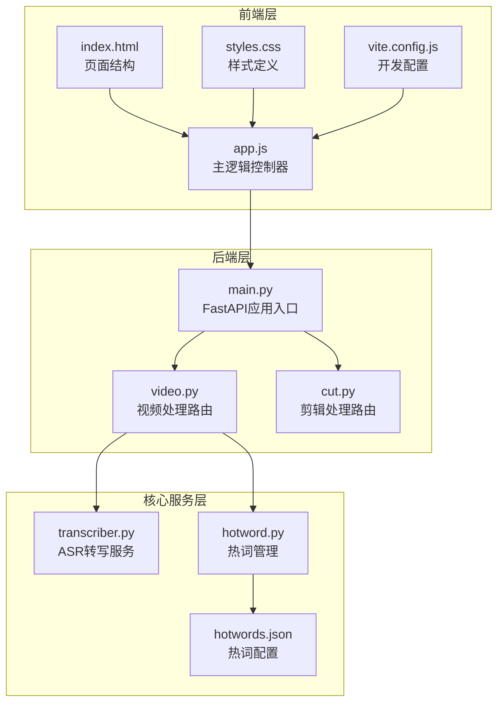

**图表来源**
- [app.js:1-774](file://cut-video-web/frontend/app.js#L1-L774)
- [main.py:1-84](file://cut-video-web/backend/main.py#L1-L84)

**章节来源**
- [app.js:1-774](file://cut-video-web/frontend/app.js#L1-L774)
- [main.py:1-84](file://cut-video-web/backend/main.py#L1-L84)

## 核心组件

### 状态管理系统

应用采用单一状态对象管理所有UI状态和业务数据：

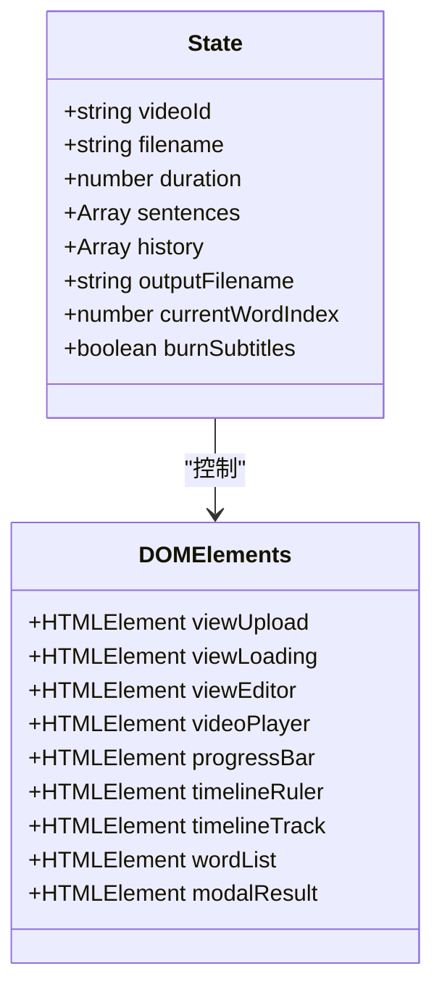

**图表来源**
- [app.js:8-78](file://cut-video-web/frontend/app.js#L8-L78)

状态管理特性：
- **集中式状态**：所有UI状态统一存储在state对象中
- **历史记录**：支持撤销操作的历史栈管理
- **实时同步**：DOM元素与状态保持双向同步

### 事件驱动交互模式

应用采用事件驱动的设计模式，通过事件监听器处理用户交互：

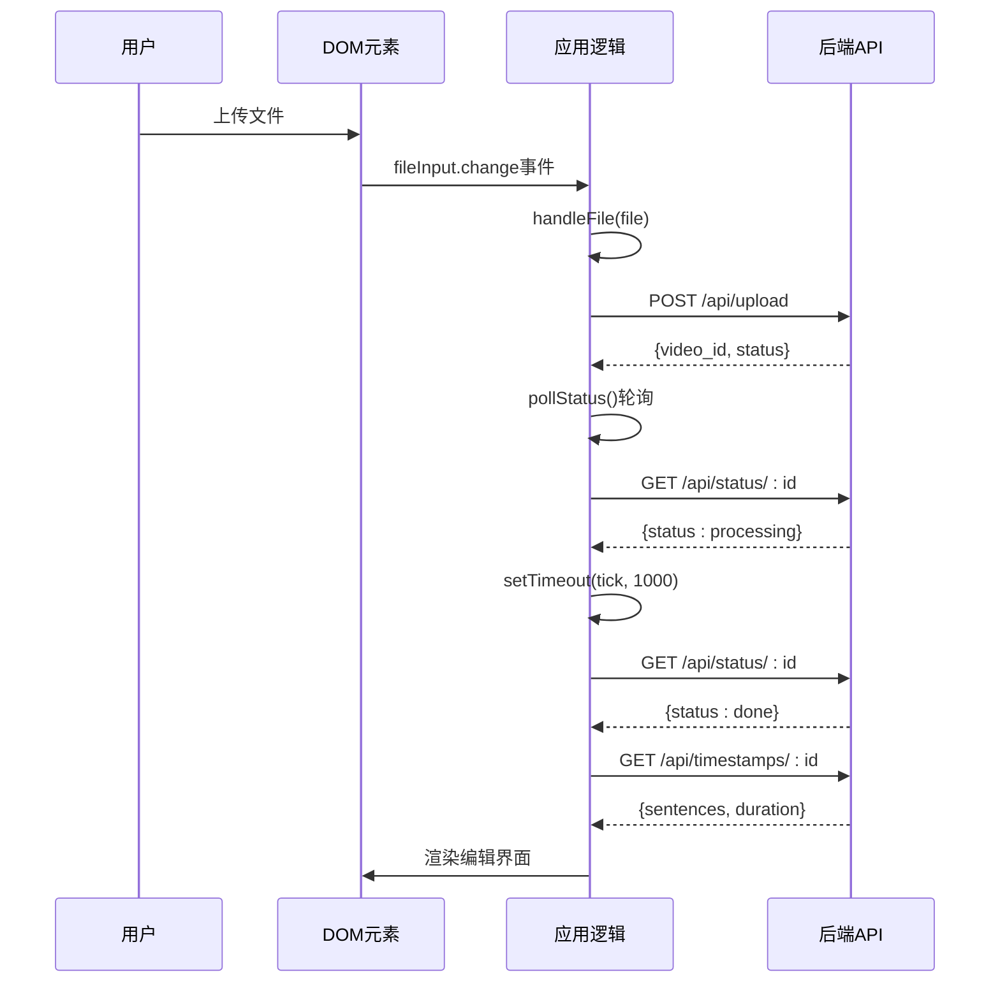

**图表来源**
- [app.js:120-187](file://cut-video-web/frontend/app.js#L120-L187)
- [video.py:126-163](file://cut-video-web/backend/router/video.py#L126-L163)

**章节来源**
- [app.js:8-78](file://cut-video-web/frontend/app.js#L8-L78)
- [app.js:120-187](file://cut-video-web/frontend/app.js#L120-L187)

## 架构概览

应用采用三层架构设计，从前端到后端形成完整的数据流：

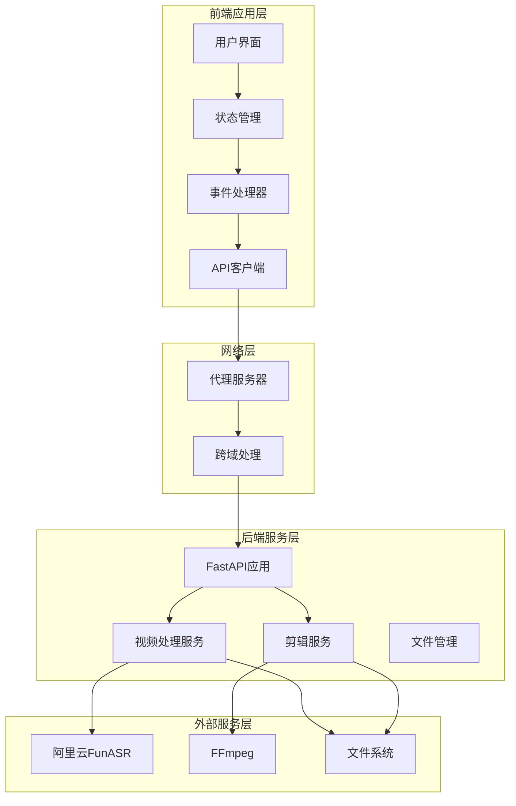

**图表来源**
- [app.js:770-774](file://cut-video-web/frontend/app.js#L770-L774)
- [main.py:19-51](file://cut-video-web/backend/main.py#L19-L51)

## 详细组件分析

### 文件上传处理组件

文件上传处理实现了完整的拖拽上传和进度反馈机制：

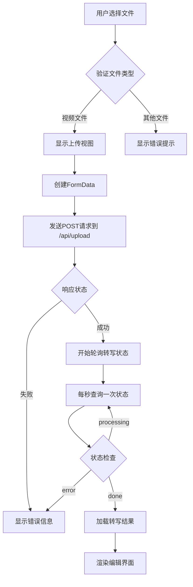

**图表来源**
- [app.js:92-152](file://cut-video-web/frontend/app.js#L92-L152)
- [video.py:126-163](file://cut-video-web/backend/router/video.py#L126-L163)

关键特性：
- **拖拽支持**：支持拖拽文件到上传区域
- **进度反馈**：实时显示上传进度
- **错误处理**：完善的异常捕获和用户提示
- **状态轮询**：自动轮询转写状态直到完成

**章节来源**
- [app.js:92-152](file://cut-video-web/frontend/app.js#L92-L152)
- [video.py:126-163](file://cut-video-web/backend/router/video.py#L126-L163)

### 播放器控制系统

播放器控制实现了完整的媒体播放和时间轴交互功能：

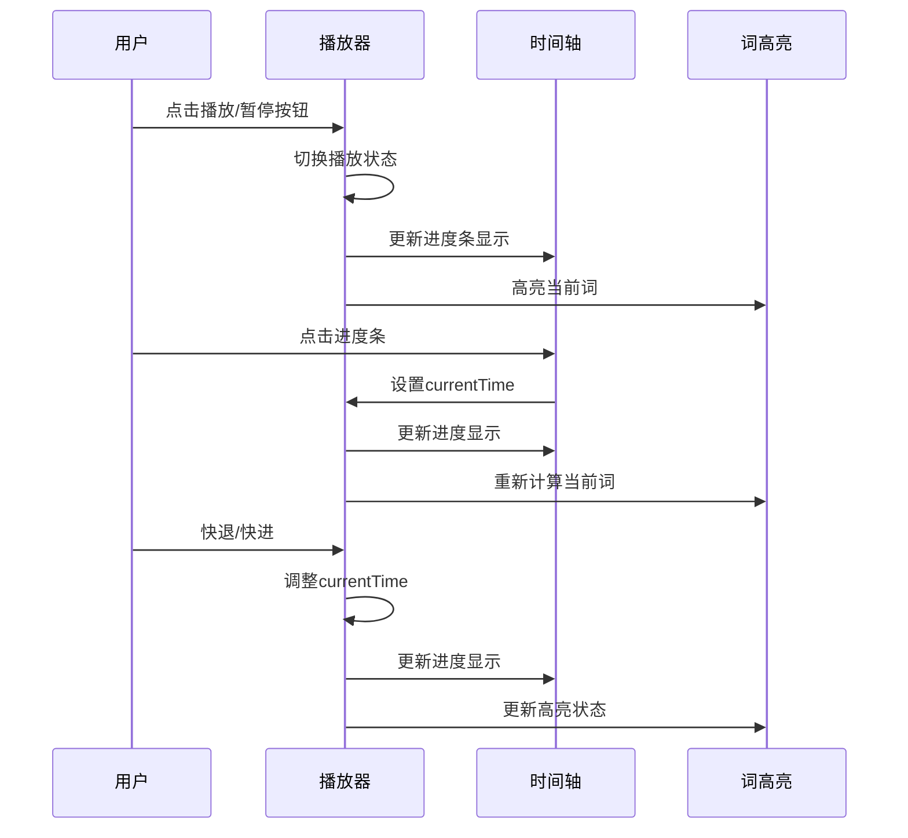

**图表来源**
- [app.js:240-298](file://cut-video-web/frontend/app.js#L240-L298)
- [app.js:415-453](file://cut-video-web/frontend/app.js#L415-L453)

播放器功能特性：
- **时间轴点击**：支持精确跳转到指定时间
- **播放状态管理**：动态切换播放/暂停图标
- **实时高亮**：根据播放位置自动高亮对应词
- **键盘快捷键**：支持空格键播放/暂停、方向键跳转

**章节来源**
- [app.js:240-298](file://cut-video-web/frontend/app.js#L240-L298)
- [app.js:415-453](file://cut-video-web/frontend/app.js#L415-L453)

### 时间轴编辑组件

时间轴编辑实现了词级精确编辑和可视化操作：

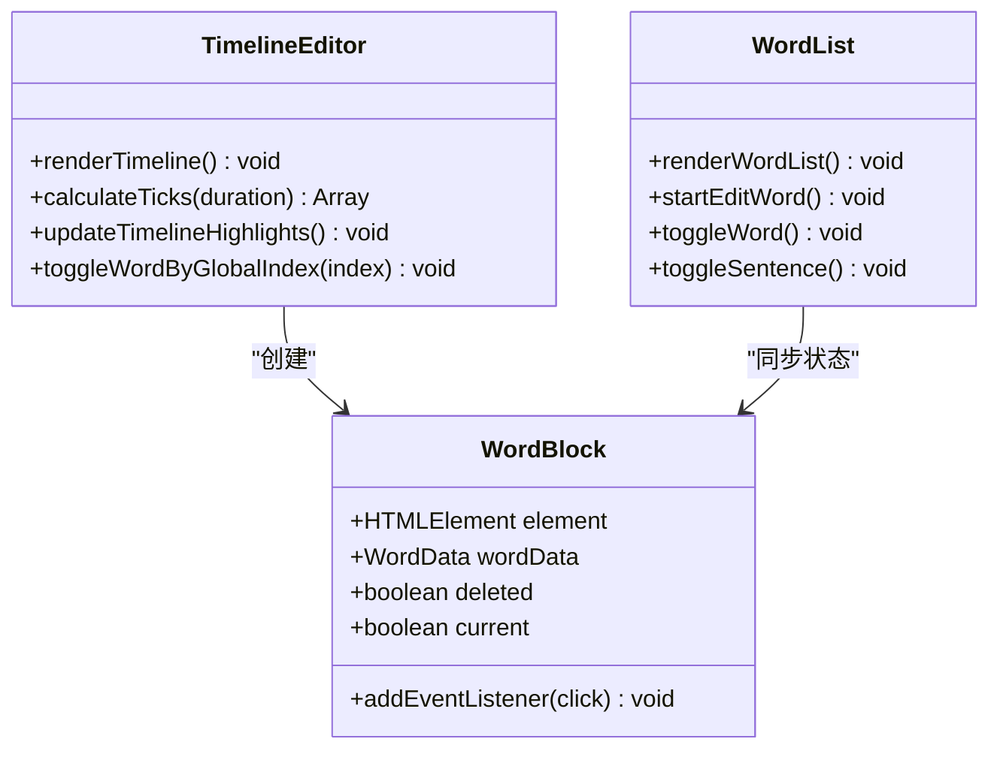

**图表来源**
- [app.js:300-362](file://cut-video-web/frontend/app.js#L300-L362)
- [app.js:364-413](file://cut-video-web/frontend/app.js#L364-L413)

编辑功能特性：
- **词级删除**：点击词块删除对应词汇
- **句子批量操作**：点击句子区域删除整个句子
- **双击编辑**：支持词级文本编辑
- **视觉反馈**：删除状态的视觉高亮显示

**章节来源**
- [app.js:300-362](file://cut-video-web/frontend/app.js#L300-L362)
- [app.js:364-413](file://cut-video-web/frontend/app.js#L364-L413)

### 异步操作处理策略

应用实现了多种异步操作的处理策略：

#### 轮询机制

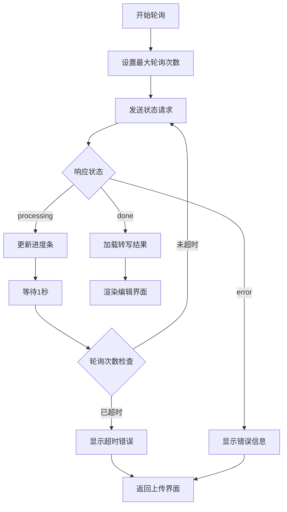

**图表来源**
- [app.js:154-187](file://cut-video-web/frontend/app.js#L154-L187)

#### 错误处理机制

应用采用多层次的错误处理策略：

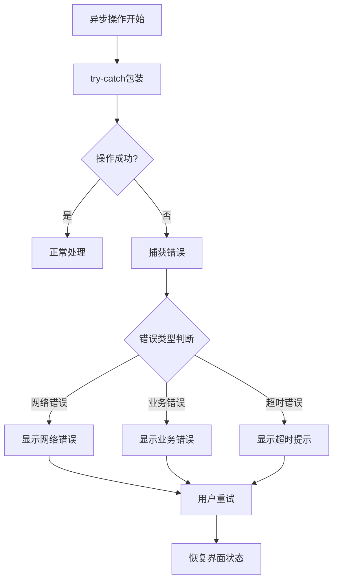

**图表来源**
- [app.js:148-151](file://cut-video-web/frontend/app.js#L148-L151)
- [app.js:655-659](file://cut-video-web/frontend/app.js#L655-L659)

**章节来源**
- [app.js:154-187](file://cut-video-web/frontend/app.js#L154-L187)
- [app.js:148-151](file://cut-video-web/frontend/app.js#L148-L151)

### WebSocket连接处理

当前版本未实现WebSocket连接，但具备良好的扩展性。如果需要添加WebSocket支持，可以按照以下模式进行：

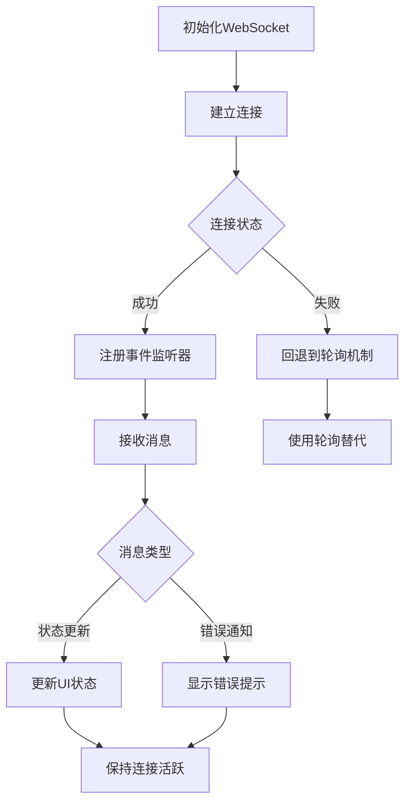

[此图为概念性图表，展示WebSocket集成的可能性]

## 依赖关系分析

### 前端依赖关系

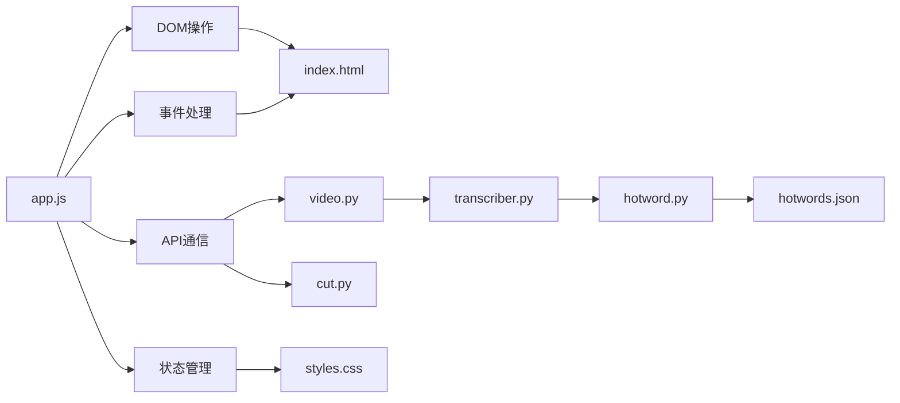

**图表来源**
- [app.js:1-774](file://cut-video-web/frontend/app.js#L1-L774)
- [video.py:1-296](file://cut-video-web/backend/router/video.py#L1-L296)

### 后端依赖关系

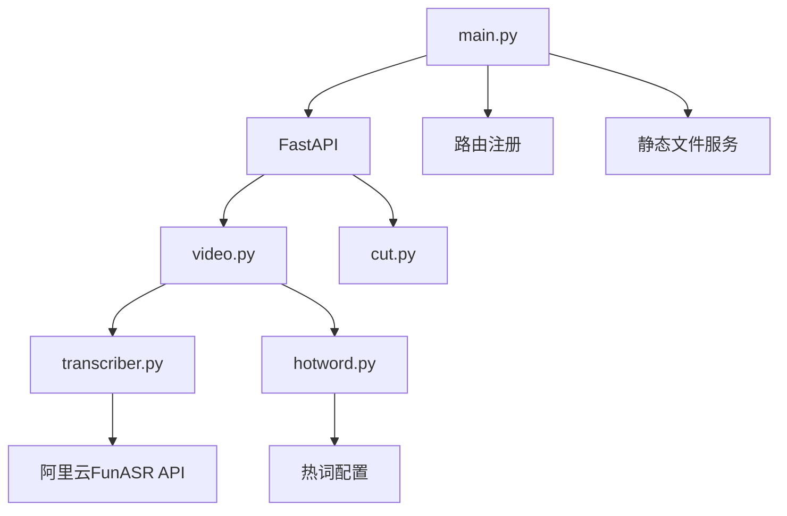

**图表来源**
- [main.py:19-51](file://cut-video-web/backend/main.py#L19-L51)
- [transcriber.py:95-316](file://src/transcriber.py#L95-L316)

**章节来源**
- [app.js:1-774](file://cut-video-web/frontend/app.js#L1-L774)
- [main.py:19-51](file://cut-video-web/backend/main.py#L19-L51)

## 性能考虑

### 内存管理优化

应用采用了多项内存管理策略：

1. **DOM元素复用**：时间轴和词列表采用动态创建和销毁策略
2. **事件监听器管理**：在适当时机移除不再使用的事件监听器
3. **状态对象优化**：使用JSON序列化进行深度复制，避免循环引用

### 渲染性能优化

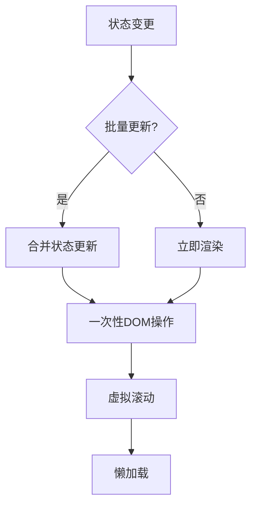

### 网络性能优化

- **请求去重**：避免重复的相同请求
- **缓存策略**：合理利用浏览器缓存
- **并发控制**：限制同时进行的异步操作数量

## 故障排除指南

### 常见问题及解决方案

#### 上传失败
**症状**：文件上传后显示错误
**原因**：
- 文件类型不支持
- 网络连接异常
- 后端服务不可用

**解决方法**：
1. 检查文件格式是否为视频文件
2. 确认网络连接正常
3. 验证后端服务运行状态

#### 转写超时
**症状**：转写状态长时间停留在processing
**原因**：
- ASR服务响应慢
- 网络延迟
- 视频文件过大

**解决方法**：
1. 检查DASHSCOPE_API_KEY配置
2. 确认视频文件大小合理
3. 稍后重试或联系技术支持

#### 编辑功能异常
**症状**：词删除或编辑功能失效
**原因**：
- 状态不同步
- DOM元素未正确渲染
- 事件监听器冲突

**解决方法**：
1. 刷新页面重新加载
2. 检查浏览器控制台错误
3. 清除浏览器缓存

**章节来源**
- [app.js:148-151](file://cut-video-web/frontend/app.js#L148-L151)
- [app.js:171-174](file://cut-video-web/frontend/app.js#L171-L174)

## 结论

该JavaScript逻辑实现展现了现代Web应用的优秀设计实践：

### 技术优势
- **模块化架构**：清晰的功能模块划分，便于维护和扩展
- **事件驱动设计**：响应式的用户交互体验
- **状态管理**：集中式状态管理确保数据一致性
- **异步处理**：完善的异步操作处理策略

### 最佳实践总结
1. **函数分离**：每个功能模块职责单一，便于测试和维护
2. **事件绑定**：合理的事件绑定和解绑机制
3. **内存管理**：有效的内存使用和垃圾回收策略
4. **错误处理**：全面的异常捕获和用户友好的错误提示

### 扩展建议
1. **WebSocket集成**：可考虑添加实时状态推送功能
2. **缓存优化**：实现更智能的数据缓存策略
3. **性能监控**：添加应用性能监控和分析
4. **国际化支持**：扩展多语言支持功能

该应用为视频编辑领域的JavaScript实现提供了优秀的参考范例，其模块化设计和事件驱动架构值得在类似项目中借鉴和学习。