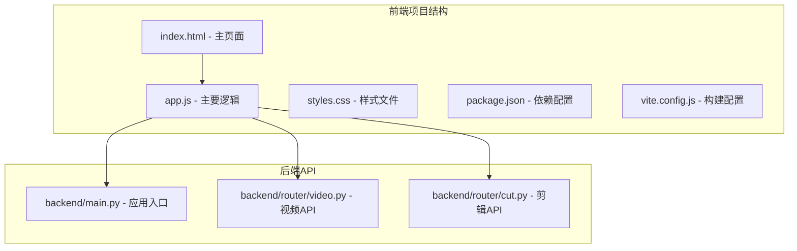
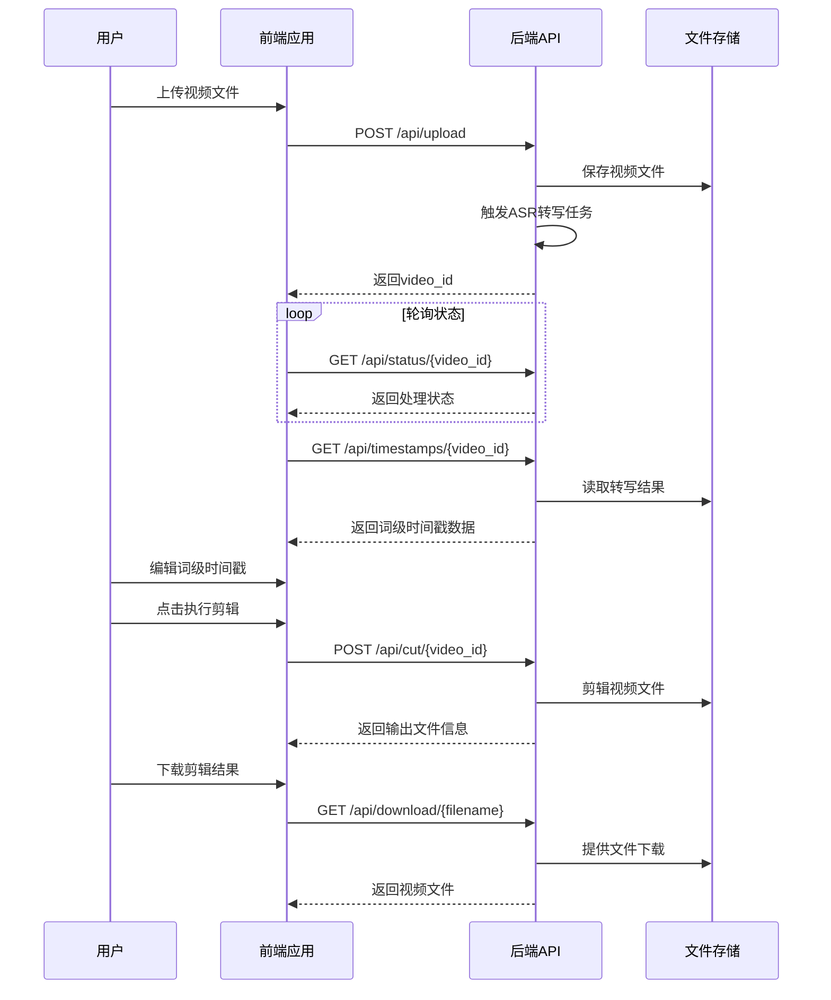
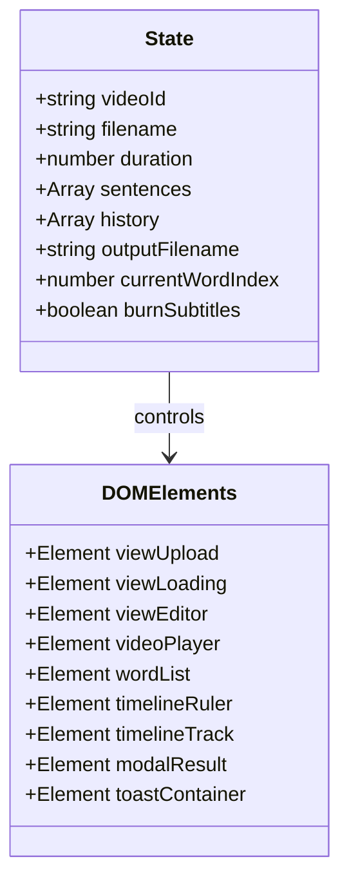
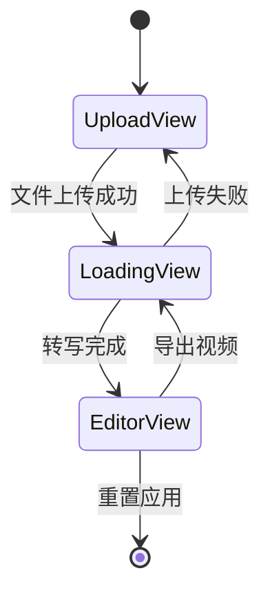
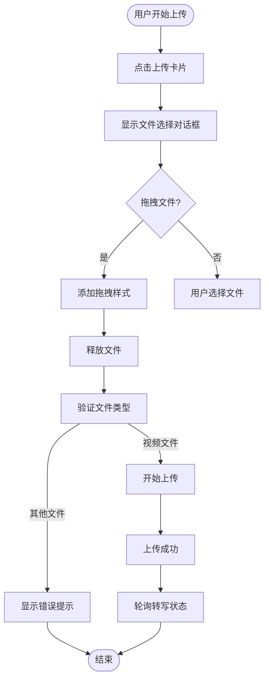
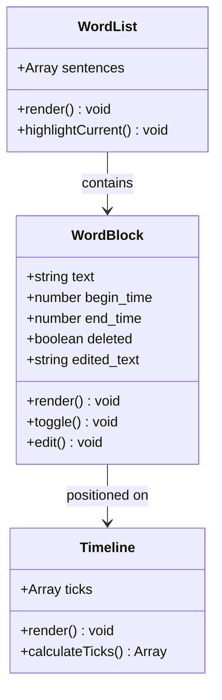
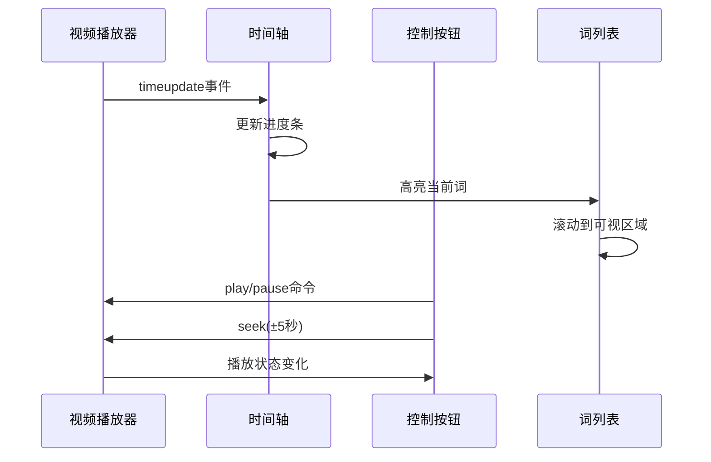
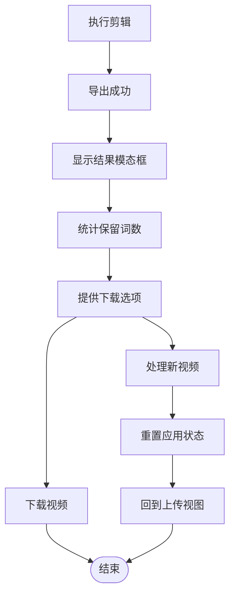
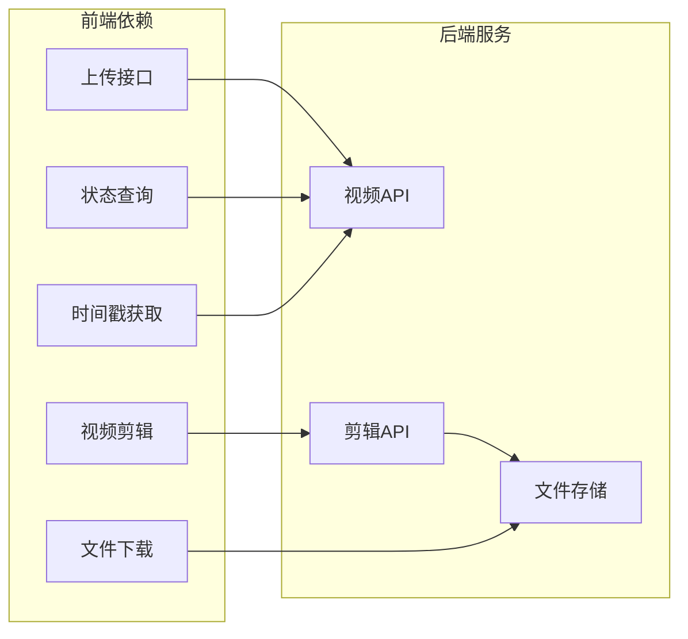

# 前端界面架构设计

<cite>
**本文档引用的文件**
- [index.html](file://cut-video-web/frontend/index.html)
- [app.js](file://cut-video-web/frontend/app.js)
- [styles.css](file://cut-video-web/frontend/styles.css)
- [package.json](file://cut-video-web/frontend/package.json)
- [vite.config.js](file://cut-video-web/frontend/vite.config.js)
- [main.py](file://cut-video-web/backend/main.py)
- [video.py](file://cut-video-web/backend/router/video.py)
- [cut.py](file://cut-video-web/backend/router/cut.py)
- [README.md](file://README.md)
</cite>

## 目录
1. [简介](#简介)
2. [项目结构](#项目结构)
3. [核心组件](#核心组件)
4. [架构概览](#架构概览)
5. [详细组件分析](#详细组件分析)
6. [依赖关系分析](#依赖关系分析)
7. [性能考虑](#性能考虑)
8. [故障排除指南](#故障排除指南)
9. [结论](#结论)

## 简介

这是一个基于阿里云百炼 FunASR API 的 ASR 词级时间戳视频剪辑工作室的前端界面架构设计文档。该系统提供了完整的视频上传、自动语音识别、词级时间戳编辑和视频剪辑功能，采用现代化的前端技术栈和响应式设计理念。

## 项目结构

前端项目采用模块化的单页应用架构，主要由以下核心文件组成：

**图表来源**
- [index.html:1-282](file://cut-video-web/frontend/index.html#L1-L282)
- [app.js:1-774](file://cut-video-web/frontend/app.js#L1-L774)
- [main.py:1-84](file://cut-video-web/backend/main.py#L1-L84)

**章节来源**
- [index.html:1-282](file://cut-video-web/frontend/index.html#L1-L282)
- [app.js:1-774](file://cut-video-web/frontend/app.js#L1-L774)
- [styles.css:1-1060](file://cut-video-web/frontend/styles.css#L1-L1060)
- [package.json:1-15](file://cut-video-web/frontend/package.json#L1-L15)
- [vite.config.js:1-23](file://cut-video-web/frontend/vite.config.js#L1-L23)

## 核心组件

### 技术栈选择

前端采用现代 JavaScript 开发模式，主要技术栈包括：

- **原生 JavaScript (ES6+)**: 使用立即执行函数表达式(IIFE)进行模块化封装
- **Vite 构建工具**: 提供快速开发服务器和生产构建
- **原生 CSS**: 使用 CSS 变量和现代布局技术
- **HTML5 API**: 利用原生视频播放器和文件上传功能

### 架构设计原则

1. **模块化组织**: 通过 IIFE 封装状态和方法，避免全局污染
2. **响应式设计**: 支持桌面和移动设备的自适应布局
3. **渐进式增强**: 基础功能在所有现代浏览器中可用
4. **性能优化**: 采用懒加载和虚拟滚动等技术

**章节来源**
- [app.js:5-89](file://cut-video-web/frontend/app.js#L5-L89)
- [package.json:1-15](file://cut-video-web/frontend/package.json#L1-L15)
- [vite.config.js:1-23](file://cut-video-web/frontend/vite.config.js#L1-L23)

## 架构概览

系统采用前后端分离架构，前端负责用户界面和交互逻辑，后端提供 RESTful API 服务。

**图表来源**
- [app.js:120-213](file://cut-video-web/frontend/app.js#L120-L213)
- [video.py:126-277](file://cut-video-web/backend/router/video.py#L126-L277)
- [cut.py:51-110](file://cut-video-web/backend/router/cut.py#L51-L110)

## 详细组件分析

### 1. 状态管理系统

前端使用集中式状态管理，通过一个全局状态对象维护应用状态：

**图表来源**
- [app.js:8-78](file://cut-video-web/frontend/app.js#L8-L78)

状态管理特点：
- 单一真相源：所有状态变更都通过统一的状态对象
- 历史记录：支持撤销操作的历史栈管理
- 实时同步：DOM 元素与状态保持实时同步

**章节来源**
- [app.js:8-78](file://cut-video-web/frontend/app.js#L8-L78)

### 2. 视图切换系统

应用采用视图切换模式，支持三种主要视图：

**图表来源**
- [app.js:215-238](file://cut-video-web/frontend/app.js#L215-L238)

视图切换逻辑：
- 上传视图：文件选择和拖拽上传
- 加载视图：ASR 转写进度显示
- 编辑视图：词级时间戳编辑界面

**章节来源**
- [app.js:215-238](file://cut-video-web/frontend/app.js#L215-L238)
- [index.html:68-242](file://cut-video-web/frontend/index.html#L68-L242)

### 3. 文件上传组件

文件上传组件支持多种交互方式：

**图表来源**
- [app.js:92-152](file://cut-video-web/frontend/app.js#L92-L152)

上传特性：
- 支持拖拽上传和点击选择
- 文件类型验证
- 异步上传处理
- 实时进度反馈

**章节来源**
- [app.js:92-152](file://cut-video-web/frontend/app.js#L92-L152)

### 4. 词级编辑界面

词级编辑界面提供精确的时间戳控制：

**图表来源**
- [app.js:300-413](file://cut-video-web/frontend/app.js#L300-L413)
- [app.js:455-567](file://cut-video-web/frontend/app.js#L455-L567)

编辑功能：
- 点击删除词
- 双击编辑词文本
- 实时高亮当前播放词
- 句子级批量操作

**章节来源**
- [app.js:300-567](file://cut-video-web/frontend/app.js#L300-L567)

### 5. 视频播放器组件

集成原生 HTML5 视频播放器，提供完整的播放控制：

**图表来源**
- [app.js:240-298](file://cut-video-web/frontend/app.js#L240-L298)
- [app.js:415-453](file://cut-video-web/frontend/app.js#L415-L453)

播放器特性：
- 精确时间控制
- 进度条拖拽
- 快捷键支持
- 实时词高亮

**章节来源**
- [app.js:240-453](file://cut-video-web/frontend/app.js#L240-L453)

### 6. 结果展示界面

导出完成后显示结果模态框：

**图表来源**
- [app.js:626-704](file://cut-video-web/frontend/app.js#L626-L704)

**章节来源**
- [app.js:626-704](file://cut-video-web/frontend/app.js#L626-L704)

## 依赖关系分析

前端与后端的依赖关系通过 API 接口实现松耦合：

**图表来源**
- [video.py:126-277](file://cut-video-web/backend/router/video.py#L126-L277)
- [cut.py:51-124](file://cut-video-web/backend/router/cut.py#L51-L124)

**章节来源**
- [video.py:126-277](file://cut-video-web/backend/router/video.py#L126-L277)
- [cut.py:51-124](file://cut-video-web/backend/router/cut.py#L51-L124)

## 性能考虑

### 1. 资源优化策略

- **懒加载**: 仅在需要时加载视频和转写数据
- **虚拟滚动**: 对于大量词列表使用虚拟滚动技术
- **缓存策略**: 利用浏览器缓存和 CDN 加速静态资源
- **压缩优化**: 生产构建时自动进行代码压缩和资源优化

### 2. 内存管理

- **状态清理**: 导出完成后清理视频和转写数据
- **事件解绑**: 组件销毁时移除事件监听器
- **DOM 优化**: 使用文档片段批量更新 DOM

### 3. 网络优化

- **轮询优化**: 适配后端状态查询频率
- **并发控制**: 限制同时进行的网络请求数量
- **错误重试**: 实现智能的错误重试机制

## 故障排除指南

### 常见问题及解决方案

1. **上传失败**
   - 检查文件类型是否为视频格式
   - 确认后端服务正常运行
   - 查看浏览器控制台错误信息

2. **转写超时**
   - 检查网络连接稳定性
   - 确认阿里云 API Key 配置正确
   - 查看后端日志获取详细错误信息

3. **播放器无法播放**
   - 检查视频编码格式兼容性
   - 确认文件传输完整性
   - 尝试刷新页面重新加载

4. **编辑功能异常**
   - 确认浏览器支持 ES6+ 语法
   - 检查 JavaScript 错误日志
   - 清除浏览器缓存后重试

**章节来源**
- [app.js:148-151](file://cut-video-web/frontend/app.js#L148-L151)
- [app.js:179-183](file://cut-video-web/frontend/app.js#L179-L183)

## 结论

该前端界面架构设计充分体现了现代 Web 应用的最佳实践：

### 技术优势
- **简洁高效**: 使用原生 JavaScript 实现，无第三方框架依赖
- **响应式设计**: 完美适配各种设备尺寸
- **用户体验**: 提供流畅的交互体验和即时反馈
- **可维护性**: 模块化设计便于功能扩展和维护

### 架构特色
- **前后端分离**: 明确的职责划分和接口约定
- **状态管理**: 集中式状态控制确保数据一致性
- **异步处理**: 优雅处理长时间运行的操作
- **错误处理**: 完善的错误捕获和用户提示机制

### 发展建议
- 可考虑引入测试框架提升代码质量
- 增加更多的键盘快捷键支持
- 实现更丰富的视觉反馈效果
- 考虑添加国际化支持

该架构为 ASR 词级时间戳视频剪辑应用提供了坚实的技术基础，能够满足专业用户的使用需求。