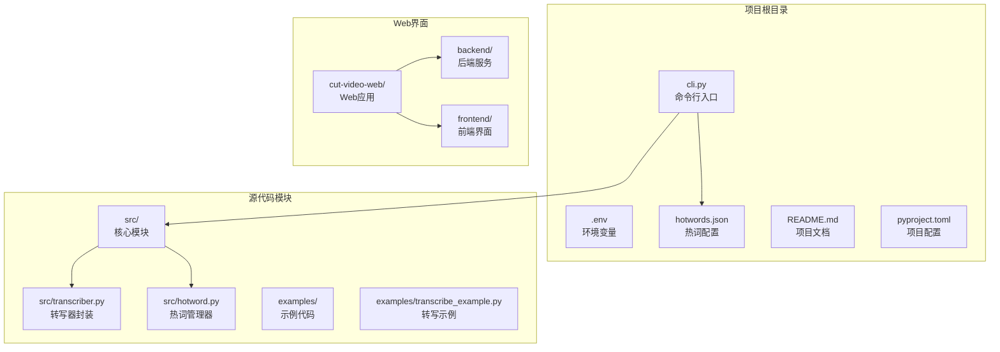
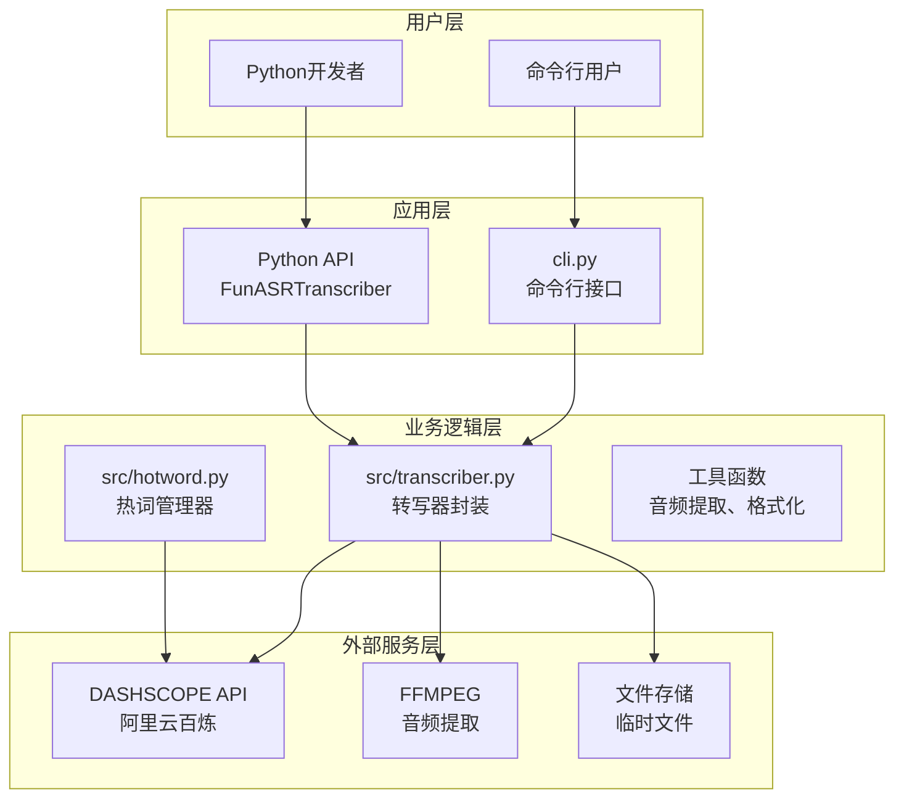
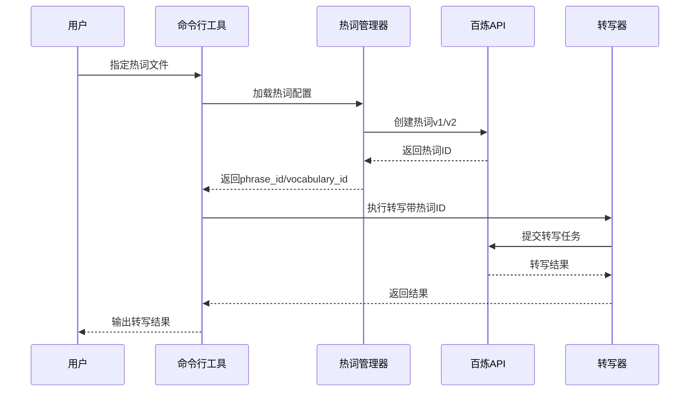

# 命令行工具使用指南

<cite>
**本文档引用的文件**
- [cli.py](file://cli.py)
- [README.md](file://README.md)
- [src/transcriber.py](file://src/transcriber.py)
- [src/hotword.py](file://src/hotword.py)
- [hotwords.json](file://hotwords.json)
- [examples/transcribe_example.py](file://examples/transcribe_example.py)
- [pyproject.toml](file://pyproject.toml)
</cite>

## 目录
1. [简介](#简介)
2. [项目结构](#项目结构)
3. [核心组件](#核心组件)
4. [架构概览](#架构概览)
5. [详细组件分析](#详细组件分析)
6. [依赖关系分析](#依赖关系分析)
7. [性能考虑](#性能考虑)
8. [故障排除指南](#故障排除指南)
9. [结论](#结论)
10. [附录](#附录)

## 简介

cut-video-asr 是一个基于阿里云百炼 FunASR API 的命令行音频转写工具，支持长音频转写（最长12小时，2GB文件），具备时间戳输出、语气词过滤、视频文件支持（自动用ffmpeg提取音频）、热词支持等功能。该工具提供了直观的命令行界面，支持多种模型选择和参数配置，适用于访谈、讲座、直播、会议等多种场景的音频转写需求。

## 项目结构

该项目采用清晰的模块化设计，主要包含以下核心组件：



**图表来源**
- [cli.py:1-180](file://cli.py#L1-L180)
- [src/transcriber.py:1-316](file://src/transcriber.py#L1-L316)
- [src/hotword.py:1-92](file://src/hotword.py#L1-L92)

**章节来源**
- [cli.py:1-180](file://cli.py#L1-L180)
- [README.md:190-206](file://README.md#L190-L206)

## 核心组件

### 命令行接口 (CLI)

命令行工具提供了简洁直观的参数接口，支持多种转写模式和配置选项：

| 参数 | 短选项 | 长选项 | 描述 | 默认值 |
|------|--------|--------|------|--------|
| 必需参数 | - | - | 输入文件路径（音频或视频） | - |
| 输出控制 | -o | --output | 输出文件路径 | stdout |
| 时间戳 | -t | --timestamp | 输出带时间戳的结果 | 关闭 |
| 模型选择 | -m | --model | 模型类型 | paraformer-v1 |
| 热词配置 | -w | --hotword-file | 热词配置文件路径 | 自动查找 |
| 语言提示 | -l | --language | 语言提示，如 zh, en | - |
| API密钥 | -k | --api-key | API Key | DASHSCOPE_API_KEY |

### 转写器核心功能

转写器封装了FunASR API的复杂性，提供了简化的Python API：

- **视频文件支持**：自动检测视频文件并使用ffmpeg提取音频
- **异步转写**：支持长时间音频文件的异步处理
- **时间戳输出**：提供句子级和词级时间戳
- **语气词过滤**：自动过滤语气词，提高转写质量
- **多模型支持**：支持fun-asr、paraformer-v1、paraformer-v2、sensevoice

**章节来源**
- [cli.py:40-80](file://cli.py#L40-L80)
- [src/transcriber.py:95-295](file://src/transcriber.py#L95-L295)

## 架构概览

系统采用分层架构设计，从上到下分为命令行层、业务逻辑层和外部服务层：



**图表来源**
- [cli.py:36-176](file://cli.py#L36-L176)
- [src/transcriber.py:95-295](file://src/transcriber.py#L95-L295)
- [src/hotword.py:13-86](file://src/hotword.py#L13-L86)

## 详细组件分析

### 命令行参数详解

#### 基础参数

**输入文件参数**
- 作用：指定要转写的音频或视频文件路径
- 支持格式：音频文件（wav、mp3等）和视频文件（mp4、avi、mov等）
- 示例：`audio.wav`、`video.mp4`

**输出文件参数 (-o/--output)**
- 作用：指定转写结果的输出文件路径
- 行为：如果未指定，则输出到标准输出
- 示例：`-o result.txt`、`--output output.srt`

#### 高级参数

**时间戳输出 (-t/--timestamp)**
- 作用：启用时间戳输出模式
- 输出格式：包含句子级和词级时间戳
- 时间格式：分钟:秒.毫秒（如 00:04.42）
- 示例：`-t` 启用时间戳输出

**模型选择 (-m/--model)**
- 作用：指定使用的ASR模型类型
- 可选值：fun-asr、paraformer-v1、paraformer-v2、sensevoice
- 默认值：paraformer-v1（配合热词效果最佳）

**热词配置 (-w/--hotword-file)**
- 作用：指定热词配置文件路径
- 默认行为：自动查找项目根目录的hotwords.json
- 格式要求：JSON文件，键为词汇，值为权重
- 示例：`-w hotwords.json`

**语言提示 (-l/--language)**
- 作用：提供语言提示信息
- 支持值：如 zh（中文）、en（英文）
- 使用场景：多语言混合场景的辅助识别

**API密钥 (-k/--api-key)**
- 作用：指定阿里云百炼API密钥
- 优先级：命令行参数 > 环境变量 > .env文件
- 环境变量：DASHSCOPE_API_KEY

### 模型类型对比

| 模型 | 特点 | 适用场景 | 热词支持 |
|------|------|----------|----------|
| fun-asr | 通用模型，支持多语言 | 通用转写任务 | 支持 |
| paraformer-v1 | 中文优化，热词效果好 | 访谈、讲座等中英文混合 | ✅ 支持 |
| paraformer-v2 | 多语种优化 | 直播、会议等多语种场景 | ✅ 支持 |
| sensevoice | 最新模型 | 高精度要求场景 | 支持 |

### 热词功能详解

热词功能通过以下工作流程实现：



**图表来源**
- [cli.py:104-126](file://cli.py#L104-L126)
- [src/hotword.py:22-69](file://src/hotword.py#L22-L69)

**章节来源**
- [cli.py:42-79](file://cli.py#L42-L79)
- [src/hotword.py:13-86](file://src/hotword.py#L13-L86)

## 依赖关系分析

项目依赖关系清晰，主要依赖包括：

```mermaid
graph LR
subgraph "核心依赖"
DASH[dashscope>=1.25.16<br/>阿里云百炼SDK]
REQUESTS[requests>=2.33.1<br/>HTTP请求]
DOTENV[python-dotenv>=1.2.2<br/>环境变量]
end
subgraph "开发依赖"
FASTAPI[fastapi>=0.115.0<br/>Web框架]
UVICORN[uvicorn[standard]>=0.34.0<br/>ASGI服务器]
MULTI[python-multipart>=0.0.20<br/>文件上传]
end
subgraph "系统依赖"
FFMPEG[ffmpeg<br/>音频提取]
PYTHON[Python>=3.12<br/>运行环境]
end
CLI[cli.py] --> DASH
TRANS[src/transcriber.py] --> DASH
TRANS --> REQUESTS
CLI --> DOTENV
WEB[cut-video-web] --> FASTAPI
WEB --> UVICORN
WEB --> MULTI
TRANS --> FFMPEG
ALL[PYTHON项目] --> PYTHON
```

**图表来源**
- [pyproject.toml:7-14](file://pyproject.toml#L7-L14)
- [src/transcriber.py:16-19](file://src/transcriber.py#L16-L19)

**章节来源**
- [pyproject.toml:1-25](file://pyproject.toml#L1-L25)

## 性能考虑

### 处理效率

- **异步处理**：支持长时间音频文件的异步转写，避免阻塞
- **缓存机制**：热词ID缓存，避免重复创建
- **批量处理**：支持多个音频文件的批量转写

### 内存管理

- **流式处理**：大文件采用流式处理方式
- **临时文件**：视频转音频时使用临时文件管理
- **资源清理**：自动清理临时文件和缓存

### 网络优化

- **断线重试**：网络异常时自动重试
- **超时控制**：合理的超时设置
- **并发限制**：避免过度并发导致的资源竞争

## 故障排除指南

### 常见问题及解决方案

**API密钥配置问题**
- 问题：`错误: 请设置 DASHSCOPE_API_KEY 环境变量`
- 解决方案：设置环境变量或在命令行中指定API密钥
- 示例：`export DASHSCOPE_API_KEY='your-api-key'`

**视频文件处理失败**
- 问题：音频提取失败
- 解决方案：确保系统安装了ffmpeg，并且版本兼容
- 检查命令：`ffmpeg -version`

**热词创建失败**
- 问题：热词创建API调用失败
- 解决方案：检查热词配置格式和权重范围
- 限制：最多500个热词，中文≤10字符，英文/混合≤5词

**内存不足**
- 问题：长时间音频文件处理失败
- 解决方案：增加系统内存或分段处理音频文件

**章节来源**
- [cli.py:83-88](file://cli.py#L83-L88)
- [src/transcriber.py:88-89](file://src/transcriber.py#L88-L89)
- [README.md:99-104](file://README.md#L99-L104)

## 结论

cut-video-asr命令行工具提供了功能完整、易于使用的音频转写解决方案。其特点包括：

- **多模型支持**：支持四种不同的ASR模型，满足不同场景需求
- **智能热词**：通过热词增强特定词汇的识别准确率
- **时间戳输出**：提供精确的时间戳信息，便于后续处理
- **视频支持**：自动处理视频文件，提取音频进行转写
- **易用性强**：简洁的命令行接口和丰富的配置选项

该工具特别适合需要高质量音频转写服务的用户，无论是个人使用还是企业级应用都能提供可靠的解决方案。

## 附录

### 使用示例

**基础音频转写**
```bash
python cli.py audio.wav -o result.txt
```

**带时间戳输出**
```bash
python cli.py audio.wav -t -o result.txt
```

**使用v2模型**
```bash
python cli.py audio.wav -m paraformer-v2 -t -o result.txt
```

**自定义热词配置**
```bash
python cli.py audio.wav -m paraformer-v1 -w hotwords.json -t -o result.txt
```

**视频文件处理**
```bash
python cli.py video.mp4 -t -o result.txt
```

### 配置文件格式

**热词配置文件 (hotwords.json)**
```json
{
  "词汇1": 权重1,
  "词汇2": 权重2,
  "词汇3": 权重3
}
```

**权重规则**
- 增强权重：[1,5]
- 减弱权重：[-6,-1]
- 最大热词数量：500个
- 中文热词长度：≤10字符
- 英文/混合热词长度：≤5词

### 环境变量

**必需环境变量**
- `DASHSCOPE_API_KEY`：阿里云百炼API密钥

**可选环境变量**
- `PYTHONPATH`：Python模块路径
- `FFMPEG_PATH`：ffmpeg可执行文件路径