# 字幕生成服务架构

<cite>
**本文档引用的文件**
- [cut-video-web/backend/service/subtitle.py](file://cut-video-web/backend/service/subtitle.py)
- [cut-video-web/backend/service/cutter.py](file://cut-video-web/backend/service/cutter.py)
- [cut-video-web/backend/router/cut.py](file://cut-video-web/backend/router/cut.py)
- [cut-video-web/backend/router/video.py](file://cut-video-web/backend/router/video.py)
- [cut-video-web/backend/main.py](file://cut-video-web/backend/main.py)
- [src/transcriber.py](file://src/transcriber.py)
- [cli.py](file://cli.py)
- [cut-video-web/backend/outputs/sub_12bcc08a_0c35f860.srt](file://cut-video-web/backend/outputs/sub_12bcc08a_0c35f860.srt)
- [cut-video-web/backend/uploads/12bcc08a_result.json](file://cut-video-web/backend/uploads/12bcc08a_result.json)
- [hotwords.json](file://hotwords.json)
- [cut-video-web/backend/service/cleanup.py](file://cut-video-web/backend/service/cleanup.py)
</cite>

## 目录
1. [简介](#简介)
2. [项目结构](#项目结构)
3. [核心组件](#核心组件)
4. [架构概览](#架构概览)
5. [详细组件分析](#详细组件分析)
6. [依赖关系分析](#依赖关系分析)
7. [性能考虑](#性能考虑)
8. [故障排除指南](#故障排除指南)
9. [结论](#结论)

## 简介

字幕生成服务是一个基于阿里云百炼 FunASR API 的视频剪辑和字幕生成系统。该系统提供了完整的端到端解决方案，从音频/视频转写、时间戳分析、精确剪辑到字幕生成和烧录。

系统的核心特性包括：
- 基于词级时间戳的精确视频剪辑
- 智能标点分割的字幕生成
- 实时字幕烧录到视频中
- 热词增强的语音识别
- 自动化的文件清理和状态管理

## 项目结构

项目采用前后端分离的架构设计，主要分为以下层次：

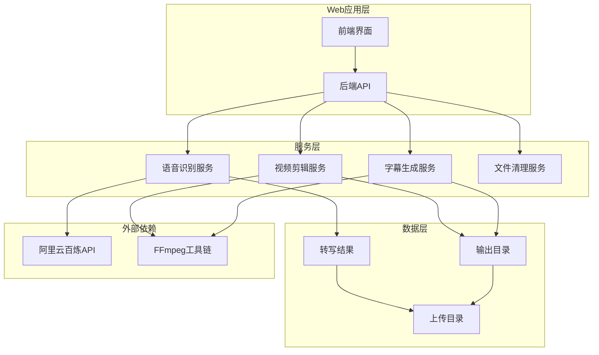

**图表来源**
- [cut-video-web/backend/main.py:25-51](file://cut-video-web/backend/main.py#L25-L51)
- [cut-video-web/backend/router/video.py:24-35](file://cut-video-web/backend/router/video.py#L24-L35)
- [cut-video-web/backend/router/cut.py:22-28](file://cut-video-web/backend/router/cut.py#L22-L28)

**章节来源**
- [cut-video-web/backend/main.py:1-84](file://cut-video-web/backend/main.py#L1-L84)
- [cut-video-web/backend/router/video.py:1-296](file://cut-video-web/backend/router/video.py#L1-L296)
- [cut-video-web/backend/router/cut.py:1-232](file://cut-video-web/backend/router/cut.py#L1-L232)

## 核心组件

### 语音识别组件
- **FunASRTranscriber**: 封装阿里云百炼 FunASR API，支持多种模型类型
- **热词管理**: 支持 v1 和 v2 模型的热词配置和管理
- **音频提取**: 自动从视频文件中提取 WAV 音频

### 视频剪辑组件
- **VideoCutter**: 基于 FFmpeg 的视频剪辑服务
- **时间戳映射**: 将原始时间戳映射到剪辑后视频的相对时间
- **字幕烧录**: 将 SRT 字幕直接烧录到视频中

### 字幕生成组件
- **SubtitleGenerator**: 生成标准 SRT 格式的字幕文件
- **智能分割**: 基于标点符号的智能文本分割
- **过滤机制**: 自动过滤被删除的词

**章节来源**
- [src/transcriber.py:95-316](file://src/transcriber.py#L95-L316)
- [cut-video-web/backend/service/cutter.py:14-253](file://cut-video-web/backend/service/cutter.py#L14-L253)
- [cut-video-web/backend/service/subtitle.py:11-219](file://cut-video-web/backend/service/subtitle.py#L11-L219)

## 架构概览

系统采用微服务架构，各组件职责明确，通过清晰的接口进行交互：

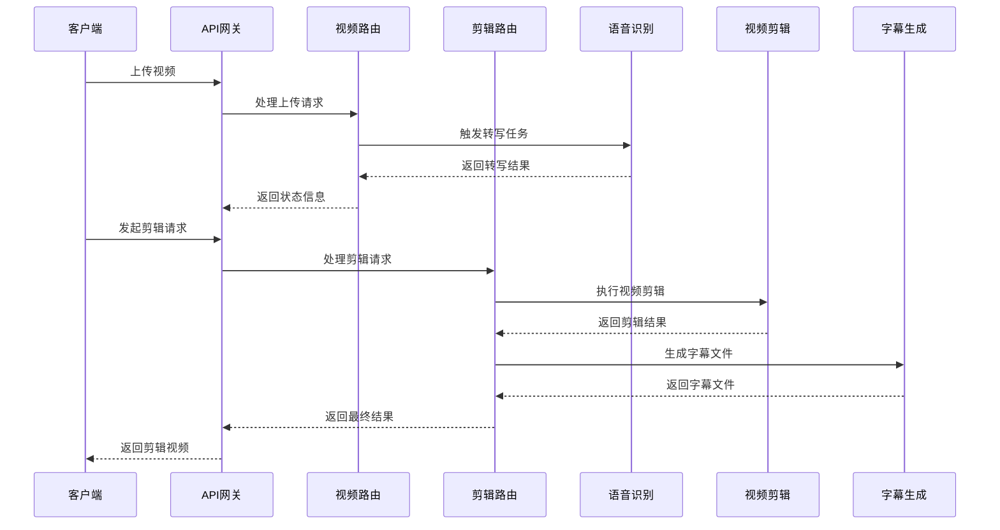

**图表来源**
- [cut-video-web/backend/router/video.py:126-234](file://cut-video-web/backend/router/video.py#L126-L234)
- [cut-video-web/backend/router/cut.py:51-109](file://cut-video-web/backend/router/cut.py#L51-L109)

## 详细组件分析

### 语音识别服务

语音识别服务是整个系统的核心，负责将音频转换为带有精确时间戳的文本。

#### 核心功能
- **多模型支持**: 支持 fun-asr、paraformer-v1、paraformer-v2、sensevoice 四种模型
- **热词增强**: 通过热词配置提高特定词汇的识别准确率
- **时间戳输出**: 提供句子级和词级的毫秒级时间戳
- **自动音频提取**: 支持直接处理视频文件，自动提取音频

#### 数据结构设计

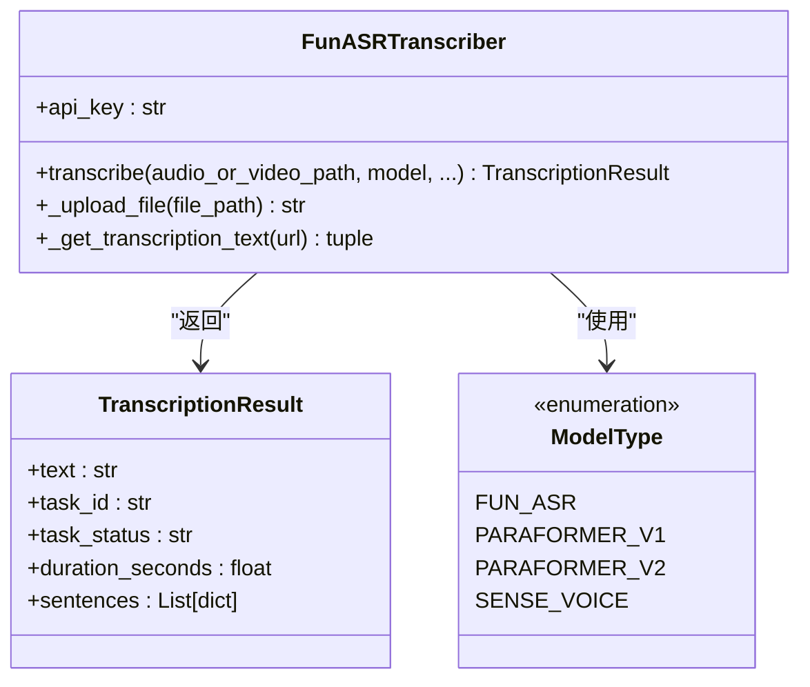

**图表来源**
- [src/transcriber.py:95-316](file://src/transcriber.py#L95-L316)
- [src/transcriber.py:34-42](file://src/transcriber.py#L34-L42)

**章节来源**
- [src/transcriber.py:95-316](file://src/transcriber.py#L95-L316)
- [hotwords.json:1-17](file://hotwords.json#L1-L17)

### 视频剪辑服务

视频剪辑服务基于 FFmpeg 实现，提供精确的时间戳映射和高质量的视频处理。

#### 核心算法

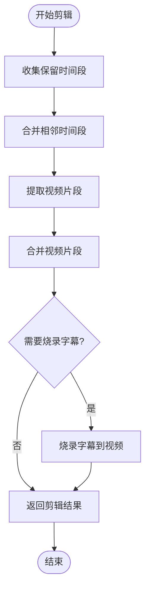

**图表来源**
- [cut-video-web/backend/service/cutter.py:21-66](file://cut-video-web/backend/service/cutter.py#L21-L66)
- [cut-video-web/backend/service/cutter.py:155-196](file://cut-video-web/backend/service/cutter.py#L155-L196)

#### 时间戳映射算法

时间戳映射是视频剪辑的核心算法，确保字幕与视频内容精确同步：

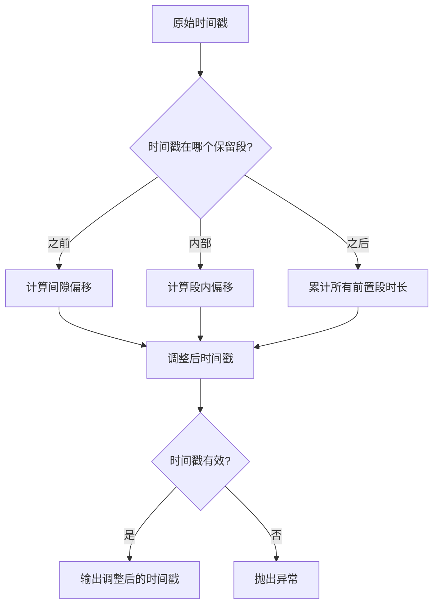

**图表来源**
- [cut-video-web/backend/service/cutter.py:191-218](file://cut-video-web/backend/service/cutter.py#L191-L218)
- [cut-video-web/backend/service/subtitle.py:173-198](file://cut-video-web/backend/service/subtitle.py#L173-L198)

**章节来源**
- [cut-video-web/backend/service/cutter.py:14-253](file://cut-video-web/backend/service/cutter.py#L14-L253)

### 字幕生成服务

字幕生成服务实现了完整的 SRT 格式生成流程，包括智能分割、过滤和时间戳映射。

#### 标点分割策略

系统采用智能的标点分割算法，确保字幕的自然断句：

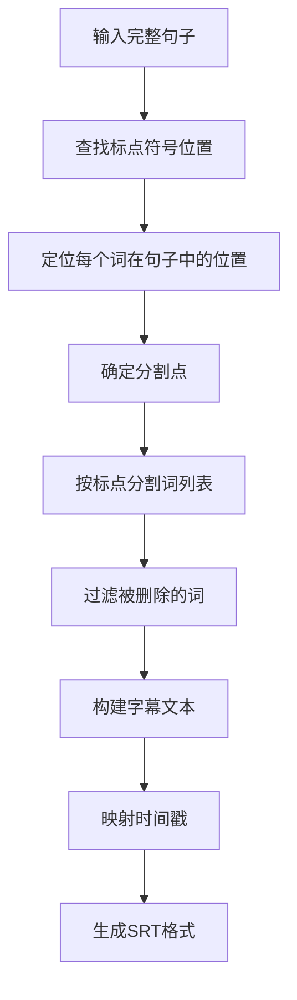

**图表来源**
- [cut-video-web/backend/service/subtitle.py:101-171](file://cut-video-web/backend/service/subtitle.py#L101-L171)

#### SRT 格式生成

SRT 字幕文件遵循标准格式，包含序号、时间戳和文本内容：

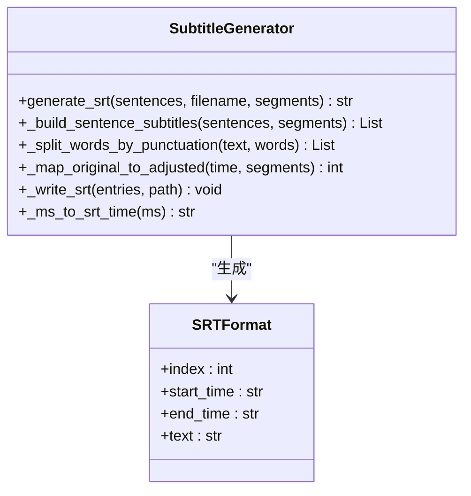

**图表来源**
- [cut-video-web/backend/service/subtitle.py:18-44](file://cut-video-web/backend/service/subtitle.py#L18-L44)
- [cut-video-web/backend/service/subtitle.py:200-219](file://cut-video-web/backend/service/subtitle.py#L200-L219)

**章节来源**
- [cut-video-web/backend/service/subtitle.py:11-219](file://cut-video-web/backend/service/subtitle.py#L11-L219)

### API 路由层

API 路由层提供 RESTful 接口，协调各个服务组件的工作。

#### 视频上传和转写流程

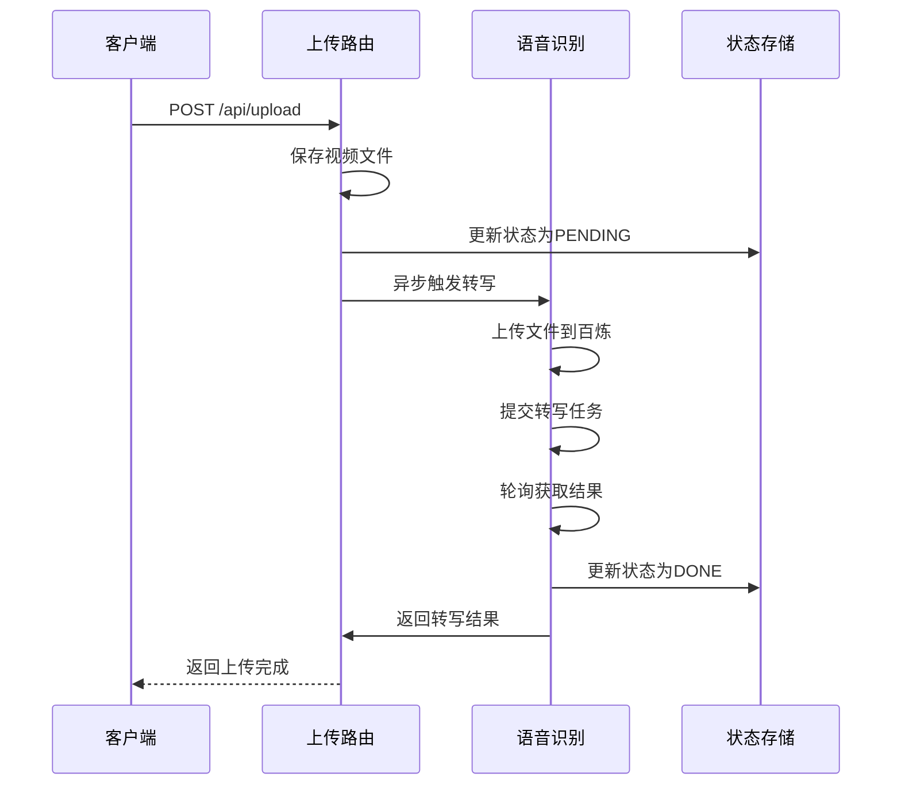

**图表来源**
- [cut-video-web/backend/router/video.py:126-234](file://cut-video-web/backend/router/video.py#L126-L234)

#### 视频剪辑流程

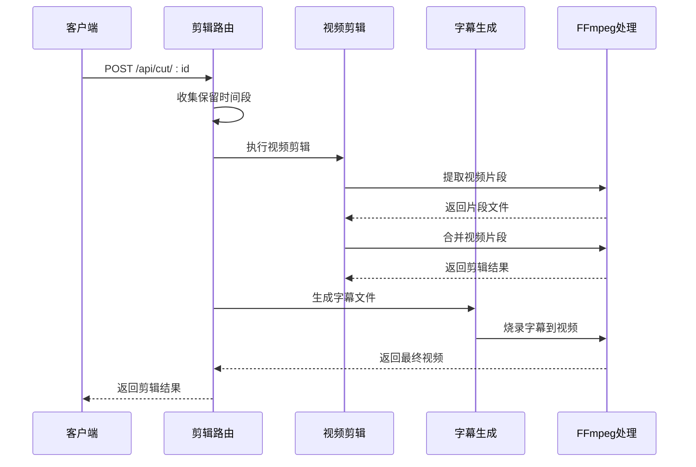

**图表来源**
- [cut-video-web/backend/router/cut.py:51-109](file://cut-video-web/backend/router/cut.py#L51-L109)

**章节来源**
- [cut-video-web/backend/router/video.py:1-296](file://cut-video-web/backend/router/video.py#L1-L296)
- [cut-video-web/backend/router/cut.py:1-232](file://cut-video-web/backend/router/cut.py#L1-L232)

## 依赖关系分析

系统采用模块化设计，各组件之间的依赖关系清晰明确：

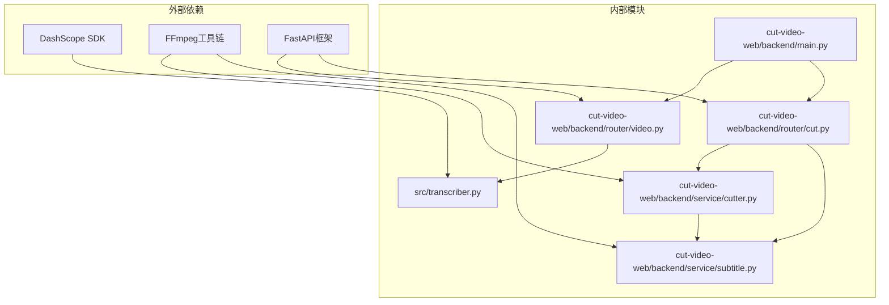

**图表来源**
- [src/transcriber.py:16-20](file://src/transcriber.py#L16-L20)
- [cut-video-web/backend/service/cutter.py:7-11](file://cut-video-web/backend/service/cutter.py#L7-L11)
- [cut-video-web/backend/router/video.py:13-23](file://cut-video-web/backend/router/video.py#L13-L23)

**章节来源**
- [src/transcriber.py:1-316](file://src/transcriber.py#L1-L316)
- [cut-video-web/backend/service/cutter.py:1-253](file://cut-video-web/backend/service/cutter.py#L1-L253)

## 性能考虑

### 时间复杂度分析

1. **语音识别**: O(n log n)，其中 n 是音频帧数
2. **时间戳映射**: O(m × k)，其中 m 是保留段数量，k 是词数量
3. **字幕分割**: O(p × q)，其中 p 是标点符号数量，q 是词位置匹配次数
4. **视频剪辑**: O(r × t)，其中 r 是视频段数量，t 是处理时间

### 内存优化策略

- **流式处理**: 大文件采用流式读取，避免内存溢出
- **增量生成**: 字幕和视频片段按需生成，及时释放内存
- **状态管理**: 使用内存字典存储转写状态，定期清理过期数据

### 并发处理

系统采用异步编程模式：
- **后台任务**: 转写任务在后台异步执行
- **并发请求**: 支持多用户同时访问
- **资源池**: FFmpeg 进程池管理，避免资源耗尽

## 故障排除指南

### 常见问题及解决方案

#### 1. 语音识别失败
**症状**: 转写状态长时间停留在 PENDING 或出现 ERROR
**原因**: 
- API Key 配置错误
- 网络连接问题
- 文件格式不支持

**解决方案**:
- 检查 DASHSCOPE_API_KEY 环境变量
- 验证网络连接稳定性
- 确认文件格式支持情况

#### 2. 视频剪辑异常
**症状**: 剪辑过程中出现 FFmpeg 错误
**原因**:
- 时间戳不连续
- 视频文件损坏
- FFmpeg 版本不兼容

**解决方案**:
- 验证时间戳的连续性和有效性
- 检查视频文件完整性
- 更新 FFmpeg 到最新版本

#### 3. 字幕生成错误
**症状**: SRT 文件格式不正确或内容缺失
**原因**:
- 标点分割算法异常
- 时间戳映射错误
- 编码问题

**解决方案**:
- 检查标点符号集合配置
- 验证时间戳映射逻辑
- 确认 UTF-8 编码设置

**章节来源**
- [cut-video-web/backend/service/cutter.py:121-153](file://cut-video-web/backend/service/cutter.py#L121-L153)
- [cut-video-web/backend/router/video.py:229-233](file://cut-video-web/backend/router/video.py#L229-L233)

### 监控和日志

系统提供了完善的监控机制：

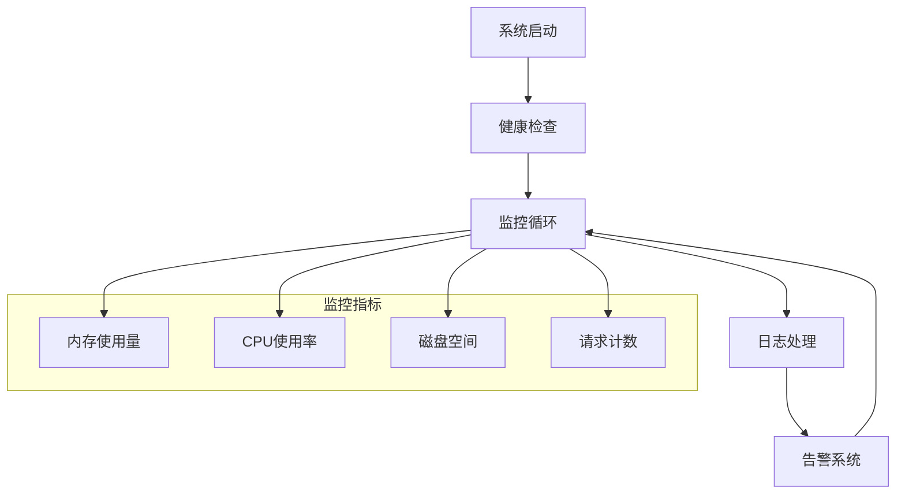

**图表来源**
- [cut-video-web/backend/main.py:61-79](file://cut-video-web/backend/main.py#L61-L79)
- [cut-video-web/backend/service/cleanup.py:76-96](file://cut-video-web/backend/service/cleanup.py#L76-L96)

## 结论

字幕生成服务架构设计合理，功能完整，具有以下特点：

### 技术优势
- **模块化设计**: 各组件职责明确，易于维护和扩展
- **高性能处理**: 采用异步编程和流式处理，提升系统性能
- **精确同步**: 基于词级时间戳的精确剪辑和字幕生成
- **智能化处理**: 智能标点分割和热词增强提升识别准确率

### 应用价值
- **用户体验**: 提供直观的 Web 界面和实时状态反馈
- **开发效率**: 完善的 API 接口和错误处理机制
- **可扩展性**: 模块化架构支持功能扩展和技术升级

### 改进建议
1. **缓存机制**: 添加热点数据缓存，提升重复查询性能
2. **负载均衡**: 支持多实例部署，提升系统可用性
3. **监控完善**: 增加更详细的性能指标和告警机制
4. **安全加固**: 添加访问控制和数据加密功能

该系统为视频内容处理提供了完整的解决方案，具有良好的技术基础和应用前景。