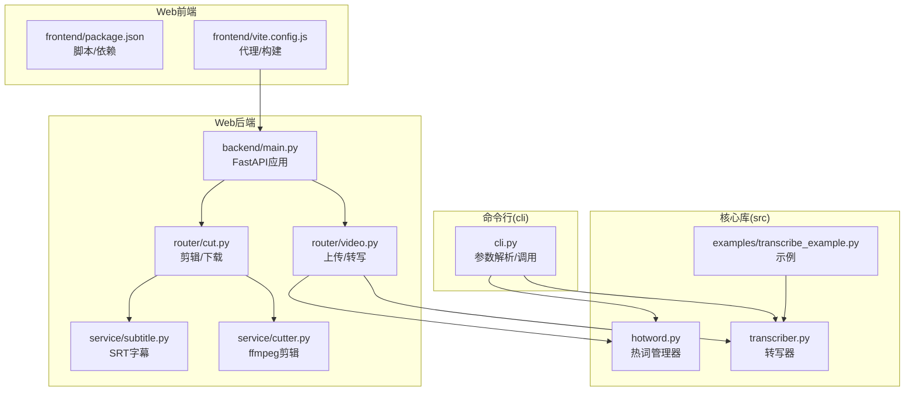
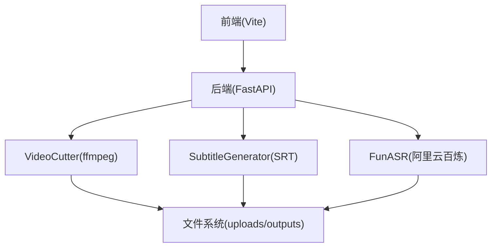
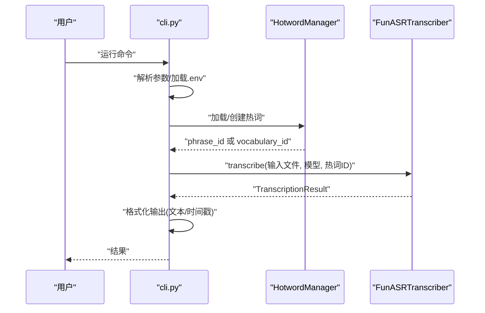
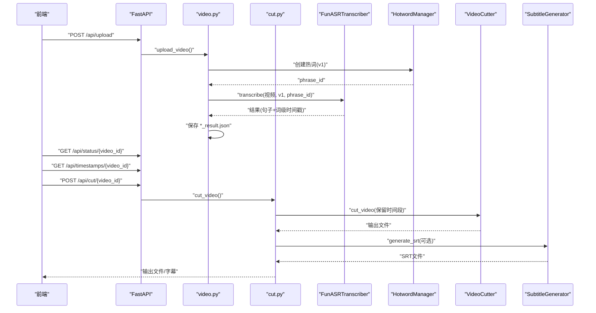
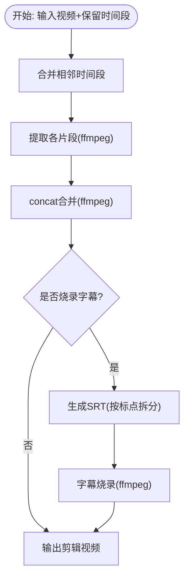
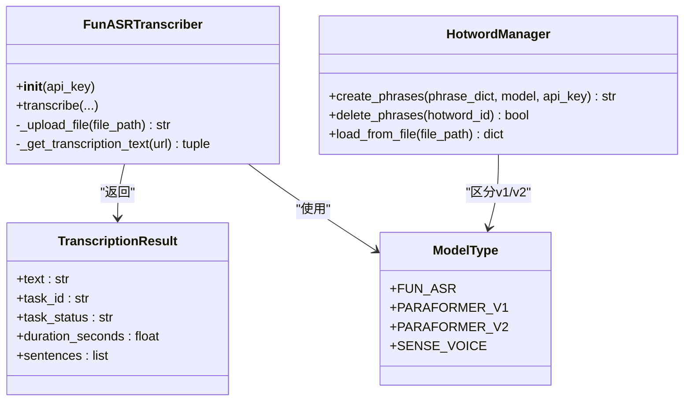
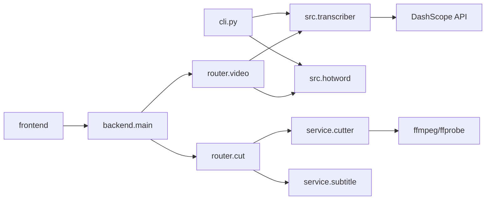

# 开发者指南

<cite>
**本文档引用的文件**
- [README.md](file://README.md)
- [pyproject.toml](file://pyproject.toml)
- [cli.py](file://cli.py)
- [src/__init__.py](file://src/__init__.py)
- [src/transcriber.py](file://src/transcriber.py)
- [src/hotword.py](file://src/hotword.py)
- [examples/transcribe_example.py](file://examples/transcribe_example.py)
- [cut-video-web/backend/main.py](file://cut-video-web/backend/main.py)
- [cut-video-web/backend/router/video.py](file://cut-video-web/backend/router/video.py)
- [cut-video-web/backend/router/cut.py](file://cut-video-web/backend/router/cut.py)
- [cut-video-web/backend/service/cutter.py](file://cut-video-web/backend/service/cutter.py)
- [cut-video-web/backend/service/subtitle.py](file://cut-video-web/backend/service/subtitle.py)
- [cut-video-web/frontend/package.json](file://cut-video-web/frontend/package.json)
- [cut-video-web/frontend/vite.config.js](file://cut-video-web/frontend/vite.config.js)
- [hotwords.json](file://hotwords.json)
</cite>

## 目录
1. [简介](#简介)
2. [项目结构](#项目结构)
3. [核心组件](#核心组件)
4. [架构总览](#架构总览)
5. [详细组件分析](#详细组件分析)
6. [依赖分析](#依赖分析)
7. [性能考量](#性能考量)
8. [故障排查指南](#故障排查指南)
9. [结论](#结论)
10. [附录](#附录)

## 简介
本项目是一个基于阿里云百炼 FunASR 的视频剪辑与字幕生成工具，支持：
- 命令行与 Python API 调用
- 词级时间戳输出
- 语气词过滤
- 视频文件自动提取音频进行转写
- 热词增强（v1/v2 模型）
- Web 界面：上传视频、自动转写、词级删除、视频剪辑、字幕烧录

开发目标包括：搭建开发环境、理解代码结构与模块职责、掌握调试与测试方法、遵循贡献与代码规范、扩展新功能与集成第三方服务。

## 项目结构
项目采用“核心库 + Web 前后端”的分层组织方式：
- 核心库（src）：转写器、热词管理器、数据结构与工具函数
- 命令行（cli.py）：参数解析、热词加载、调用转写器
- Web 后端（cut-video-web/backend）：FastAPI 应用、路由、服务层（剪辑、字幕）
- Web 前端（cut-video-web/frontend）：Vite 构建、代理配置
- 示例与配置：examples、hotwords.json、pyproject.toml、README.md

图表来源
- [src/transcriber.py:1-316](file://src/transcriber.py#L1-L316)
- [src/hotword.py:1-92](file://src/hotword.py#L1-L92)
- [cli.py:1-180](file://cli.py#L1-L180)
- [cut-video-web/backend/main.py:1-84](file://cut-video-web/backend/main.py#L1-L84)
- [cut-video-web/backend/router/video.py:1-296](file://cut-video-web/backend/router/video.py#L1-L296)
- [cut-video-web/backend/router/cut.py:1-232](file://cut-video-web/backend/router/cut.py#L1-L232)
- [cut-video-web/backend/service/cutter.py:1-253](file://cut-video-web/backend/service/cutter.py#L1-L253)
- [cut-video-web/backend/service/subtitle.py:1-219](file://cut-video-web/backend/service/subtitle.py#L1-L219)
- [cut-video-web/frontend/package.json:1-15](file://cut-video-web/frontend/package.json#L1-L15)
- [cut-video-web/frontend/vite.config.js:1-23](file://cut-video-web/frontend/vite.config.js#L1-L23)

章节来源
- [README.md:190-310](file://README.md#L190-L310)
- [pyproject.toml:1-25](file://pyproject.toml#L1-L25)

## 核心组件
- 转写器（FunASRTranscriber）：封装 DashScope ASR API，负责文件上传、异步任务提交、轮询结果、解析时间戳与句子结构
- 热词管理器（HotwordManager）：根据模型类型创建/删除热词，返回 v1 的 phrase_id 或 v2 的 vocabulary_id
- 命令行（cli.py）：解析参数、加载热词、调用转写器、输出结果
- Web 后端：FastAPI 应用，路由处理上传、转写、剪辑、下载；服务层负责剪辑与字幕生成
- 前端：Vite 开发服务器与构建，代理到后端 /api 与 /outputs

章节来源
- [src/transcriber.py:95-295](file://src/transcriber.py#L95-L295)
- [src/hotword.py:13-92](file://src/hotword.py#L13-L92)
- [cli.py:36-176](file://cli.py#L36-L176)
- [cut-video-web/backend/main.py:19-84](file://cut-video-web/backend/main.py#L19-L84)
- [cut-video-web/backend/router/video.py:126-277](file://cut-video-web/backend/router/video.py#L126-L277)
- [cut-video-web/backend/router/cut.py:51-110](file://cut-video-web/backend/router/cut.py#L51-L110)
- [cut-video-web/backend/service/cutter.py:14-197](file://cut-video-web/backend/service/cutter.py#L14-L197)
- [cut-video-web/backend/service/subtitle.py:11-219](file://cut-video-web/backend/service/subtitle.py#L11-L219)

## 架构总览
系统分为三层：
- 表现层：Web 前端（Vite）与静态资源
- 控制层：FastAPI 路由与业务编排
- 服务层：ASR 转写、ffmpeg 剪辑、SRT 字幕生成

图表来源
- [cut-video-web/backend/main.py:25-84](file://cut-video-web/backend/main.py#L25-L84)
- [cut-video-web/backend/router/video.py:166-234](file://cut-video-web/backend/router/video.py#L166-L234)
- [cut-video-web/backend/router/cut.py:74-106](file://cut-video-web/backend/router/cut.py#L74-L106)
- [cut-video-web/backend/service/cutter.py:21-66](file://cut-video-web/backend/service/cutter.py#L21-L66)
- [cut-video-web/backend/service/subtitle.py:18-44](file://cut-video-web/backend/service/subtitle.py#L18-L44)

## 详细组件分析

### 组件一：命令行工具（cli.py）
- 职责：解析参数、加载 .env、自动发现热词文件、调用转写器、格式化输出
- 关键流程：参数校验 → 热词创建（v1/v2）→ 调用转写器 → 输出文本/时间戳

图表来源
- [cli.py:36-176](file://cli.py#L36-L176)
- [src/hotword.py:22-69](file://src/hotword.py#L22-L69)
- [src/transcriber.py:203-294](file://src/transcriber.py#L203-L294)

章节来源
- [cli.py:36-176](file://cli.py#L36-L176)

### 组件二：Web 后端（FastAPI）
- 应用入口：加载 .env、挂载静态文件、注册路由、启动清理服务
- 视频路由：上传视频 → 异步转写（v1 + 热词 + 词级时间戳）→ 保存结果 → 更新状态
- 剪辑路由：收集保留时间段 → 调用 VideoCutter → 可选字幕烧录 → 生成 SRT → 下载输出

图表来源
- [cut-video-web/backend/main.py:54-84](file://cut-video-web/backend/main.py#L54-L84)
- [cut-video-web/backend/router/video.py:126-234](file://cut-video-web/backend/router/video.py#L126-L234)
- [cut-video-web/backend/router/cut.py:51-110](file://cut-video-web/backend/router/cut.py#L51-L110)
- [src/transcriber.py:203-294](file://src/transcriber.py#L203-L294)
- [src/hotword.py:22-69](file://src/hotword.py#L22-L69)
- [cut-video-web/backend/service/cutter.py:21-66](file://cut-video-web/backend/service/cutter.py#L21-L66)
- [cut-video-web/backend/service/subtitle.py:18-44](file://cut-video-web/backend/service/subtitle.py#L18-L44)

章节来源
- [cut-video-web/backend/main.py:19-84](file://cut-video-web/backend/main.py#L19-L84)
- [cut-video-web/backend/router/video.py:126-277](file://cut-video-web/backend/router/video.py#L126-L277)
- [cut-video-web/backend/router/cut.py:51-232](file://cut-video-web/backend/router/cut.py#L51-L232)

### 组件三：服务层（VideoCutter 与 SubtitleGenerator）
- VideoCutter：按保留时间段提取片段、合并（concat demuxer）、可选字幕烧录
- SubtitleGenerator：按标点拆分句子、生成 SRT、时间戳映射到剪辑后相对时间

图表来源
- [cut-video-web/backend/service/cutter.py:21-66](file://cut-video-web/backend/service/cutter.py#L21-L66)
- [cut-video-web/backend/service/subtitle.py:18-44](file://cut-video-web/backend/service/subtitle.py#L18-L44)

章节来源
- [cut-video-web/backend/service/cutter.py:14-253](file://cut-video-web/backend/service/cutter.py#L14-L253)
- [cut-video-web/backend/service/subtitle.py:11-219](file://cut-video-web/backend/service/subtitle.py#L11-L219)

### 组件四：核心库（transcriber.py 与 hotword.py）
- ModelType/TranscriptionResult：枚举与数据类，统一模型与结果结构
- FunASRTranscriber：封装上传、任务提交、轮询、结果解析（含词级时间戳）
- HotwordManager：v1/v2 热词创建/删除，支持从 JSON 加载

图表来源
- [src/transcriber.py:22-42](file://src/transcriber.py#L22-L42)
- [src/transcriber.py:95-295](file://src/transcriber.py#L95-L295)
- [src/hotword.py:13-92](file://src/hotword.py#L13-L92)

章节来源
- [src/transcriber.py:1-316](file://src/transcriber.py#L1-L316)
- [src/hotword.py:1-92](file://src/hotword.py#L1-L92)

## 依赖分析
- 项目依赖（pyproject.toml）：dashscope、requests、fastapi、uvicorn、python-multipart、python-dotenv 等
- 模块耦合：
  - cli.py 依赖 src.transcriber 与 src.hotword
  - web 路由依赖 src.transcriber 与 src.hotword，以及 service.cutter 与 service.subtitle
  - service.cutter 依赖 ffmpeg/ffprobe
  - service.subtitle 依赖时间戳映射算法
- 外部集成：阿里云百炼 ASR API、ffmpeg/ffprobe

图表来源
- [pyproject.toml:7-14](file://pyproject.toml#L7-L14)
- [cli.py:25-26](file://cli.py#L25-L26)
- [cut-video-web/backend/main.py:19-23](file://cut-video-web/backend/main.py#L19-L23)
- [cut-video-web/backend/router/video.py:21-22](file://cut-video-web/backend/router/video.py#L21-L22)
- [cut-video-web/backend/router/cut.py:19-20](file://cut-video-web/backend/router/cut.py#L19-L20)
- [cut-video-web/backend/service/cutter.py:10-11](file://cut-video-web/backend/service/cutter.py#L10-L11)
- [src/transcriber.py:16-19](file://src/transcriber.py#L16-L19)

章节来源
- [pyproject.toml:1-25](file://pyproject.toml#L1-L25)

## 性能考量
- 转写性能：ASR 为异步任务，需轮询等待；建议合理设置轮询间隔与超时
- 视频剪辑：按保留时间段提取与合并，避免多次重编码；合并时使用 concat demuxer
- 字幕生成：按标点拆分，减少无效片段；时间戳映射为 O(n) 遍历
- I/O 优化：批量处理、临时目录清理、输出目录预创建

## 故障排查指南
- 环境变量缺失
  - 现象：启动时报错提示未设置 DASHSCOPE_API_KEY
  - 处理：设置环境变量或在 .env/.env.example 中配置
- ffmpeg/ffprobe 缺失
  - 现象：视频剪辑/时长获取失败
  - 处理：安装 ffmpeg/ffprobe，并确保 PATH 可用
- 热词创建失败
  - 现象：v1/v2 热词创建返回非 200
  - 处理：检查热词格式、权重范围、模型类型
- Web 启动异常
  - 现象：端口占用、静态文件未挂载
  - 处理：修改端口、确认 uploads/outputs 目录存在
- 转写失败
  - 现象：任务状态非 SUCCEEDED
  - 处理：查看任务状态与错误信息，检查网络与 API Key

章节来源
- [cli.py:83-88](file://cli.py#L83-L88)
- [src/transcriber.py:114-120](file://src/transcriber.py#L114-L120)
- [cut-video-web/backend/service/cutter.py:109-129](file://cut-video-web/backend/service/cutter.py#L109-L129)
- [cut-video-web/backend/router/video.py:180-184](file://cut-video-web/backend/router/video.py#L180-L184)

## 结论
本项目通过清晰的模块划分与前后端分离架构，提供了从命令行到 Web 界面的完整视频剪辑与字幕生成能力。开发者可基于现有组件快速扩展新功能，如增加更多模型、优化剪辑算法、完善前端交互等。

## 附录

### 开发环境搭建
- 安装依赖
  - 使用 uv 同步依赖
- 环境变量
  - 设置 DASHSCOPE_API_KEY，或在 .env 中配置
- 命令行使用
  - 基本转写、时间戳输出、模型切换、热词文件指定
- Web 启动
  - 后端：uvicorn 启动 FastAPI 应用
  - 前端：Vite 开发服务器，代理到后端

章节来源
- [README.md:16-31](file://README.md#L16-L31)
- [README.md:248-274](file://README.md#L248-L274)
- [pyproject.toml:16-17](file://pyproject.toml#L16-L17)

### 贡献指南与代码规范
- 代码风格
  - 使用类型注解与 dataclass/Enum 统一结构
  - 函数与类保持单一职责，异常明确抛出
- 命名约定
  - 模型枚举使用大写 + 下划线
  - 方法与变量使用小驼峰或下划线
- 注释标准
  - 公共接口与复杂逻辑添加说明
  - 错误处理与边界条件明确注释
- 提交规范
  - 分支命名：feat/fix/docs/chore
  - 提交信息：类型(作用域): 描述

### 测试策略与质量保证
- 单元测试
  - 转写器：模拟 DashScope 响应，验证时间戳解析与异常处理
  - 热词管理器：模拟 v1/v2 API 返回，验证 ID 生成与删除
  - 剪辑器：构造保留时间段，断言输出文件存在与时长
  - 字幕生成：构造句子与标点，断言 SRT 内容与时间戳
- 集成测试
  - 端到端：上传视频 → 转写 → 剪辑 → 下载 → 验证
  - Web 前后端联调：Vite 代理、静态资源、下载链接
- 性能测试
  - 大文件转写耗时、剪辑时长与 CPU 占用
  - 并发上传与转写任务的稳定性

### 调试技巧与问题排查
- 日志与追踪
  - 使用 print/日志记录关键步骤与错误堆栈
  - 在异常捕获中打印详细信息
- 环境与依赖
  - 确认 API Key、ffmpeg/ffprobe、Python 版本满足要求
- Web 调试
  - 前端代理配置正确，后端端口开放
  - 检查 uploads/outputs 目录权限与磁盘空间

### 扩展新功能与集成第三方服务
- 新增模型
  - 在 ModelType 中新增枚举值，在转写器中适配参数
- 新增剪辑策略
  - 在 service.cutter 中扩展提取/合并逻辑
- 新增字幕样式
  - 在 service.subtitle 中扩展样式与字体渲染
- 第三方服务
  - 通过 API 封装接入，保持与现有接口一致的数据结构与异常处理