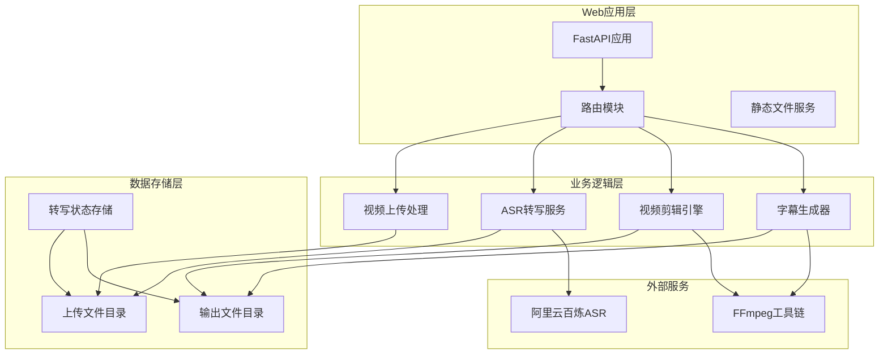
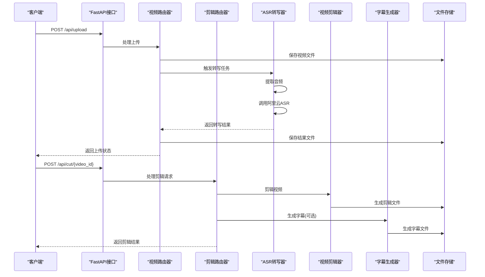
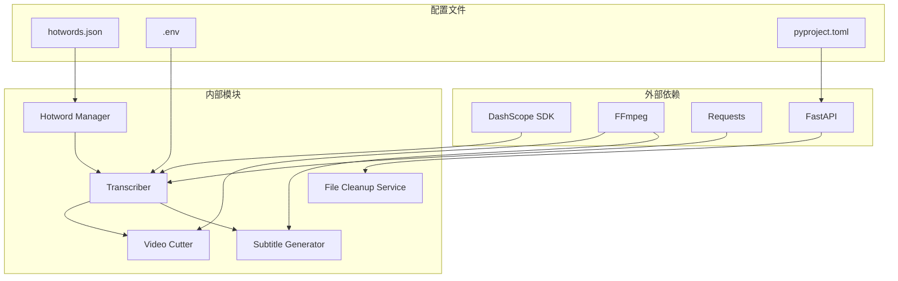
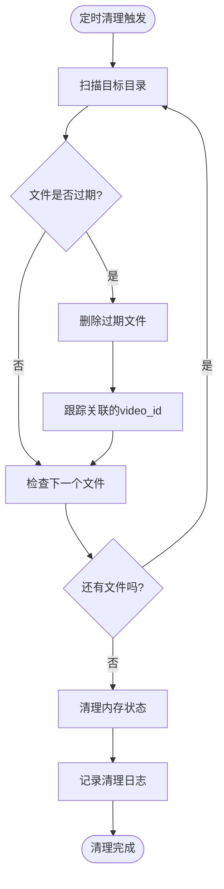

# API端点参考

<cite>
**本文档引用的文件**
- [main.py](file://cut-video-web/backend/main.py)
- [video.py](file://cut-video-web/backend/router/video.py)
- [cut.py](file://cut-video-web/backend/router/cut.py)
- [cutter.py](file://cut-video-web/backend/service/cutter.py)
- [subtitle.py](file://cut-video-web/backend/service/subtitle.py)
- [cleanup.py](file://cut-video-web/backend/service/cleanup.py)
- [transcriber.py](file://src/transcriber.py)
- [hotword.py](file://src/hotword.py)
- [README.md](file://README.md)
- [pyproject.toml](file://pyproject.toml)
- [hotwords.json](file://hotwords.json)
</cite>

## 目录
1. [简介](#简介)
2. [项目结构](#项目结构)
3. [核心组件](#核心组件)
4. [架构概览](#架构概览)
5. [详细组件分析](#详细组件分析)
6. [依赖关系分析](#依赖关系分析)
7. [性能考虑](#性能考虑)
8. [故障排除指南](#故障排除指南)
9. [结论](#结论)
10. [附录](#附录)

## 简介

本API端点参考文档详细记录了基于阿里云百炼FunASR API的词级时间戳视频剪辑Web服务的所有RESTful API端点。该服务提供了完整的视频上传、ASR转写、时间戳管理和视频剪辑功能，支持词级精度的时间戳标注和精确的视频剪辑操作。

## 项目结构

该项目采用前后端分离的架构设计，主要包含以下核心组件：



**图表来源**
- [main.py:25-51](file://cut-video-web/backend/main.py#L25-L51)
- [video.py:24](file://cut-video-web/backend/router/video.py#L24)
- [cut.py:22](file://cut-video-web/backend/router/cut.py#L22)

**章节来源**
- [main.py:1-84](file://cut-video-web/backend/main.py#L1-L84)
- [README.md:281-300](file://README.md#L281-L300)

## 核心组件

### API路由器
系统包含两个主要的API路由器：
- **视频路由器** (`/api/video`): 处理视频上传、转写状态查询和时间戳获取
- **剪辑路由器** (`/api/cut`): 处理视频剪辑和文件下载

### 服务组件
- **VideoCutter**: 基于FFmpeg的视频剪辑服务
- **SubtitleGenerator**: SRT字幕生成服务
- **FileCleanupService**: 文件定时清理服务

**章节来源**
- [video.py:24](file://cut-video-web/backend/router/video.py#L24)
- [cut.py:22](file://cut-video-web/backend/router/cut.py#L22)
- [cutter.py:14](file://cut-video-web/backend/service/cutter.py#L14)
- [subtitle.py:11](file://cut-video-web/backend/service/subtitle.py#L11)

## 架构概览



**图表来源**
- [video.py:126-163](file://cut-video-web/backend/router/video.py#L126-L163)
- [cut.py:51-110](file://cut-video-web/backend/router/cut.py#L51-L110)
- [transcriber.py:203-294](file://src/transcriber.py#L203-L294)

## 详细组件分析

### 健康检查端点

#### GET /api/health
**功能**: 健康检查，验证服务可用性

**请求参数**: 无

**响应格式**:
```json
{
  "status": "ok"
}
```

**状态码**:
- 200: 服务正常运行

**使用场景**: 
- 服务监控和负载均衡检测
- 容器编排平台的就绪探针

**章节来源**
- [main.py:54-57](file://cut-video-web/backend/main.py#L54-L57)

### 视频上传端点

#### POST /api/upload
**功能**: 上传视频文件并触发ASR转写

**请求参数**:
- Content-Type: multipart/form-data
- 参数: file (必填) - 视频文件

**请求示例**:
```bash
curl -X POST "http://localhost:8000/api/upload" \
  -H "Content-Type: multipart/form-data" \
  -F "file=@video.mp4"
```

**响应格式**:
```json
{
  "video_id": "string",
  "filename": "string",
  "status": "pending"
}
```

**状态码**:
- 200: 上传成功
- 400: 文件大小超限或格式不支持
- 500: 服务器内部错误

**使用场景**:
- 视频内容分析的初始步骤
- 批量视频处理的入口

**章节来源**
- [video.py:126-163](file://cut-video-web/backend/router/video.py#L126-L163)

### 转写状态查询端点

#### GET /api/status/{video_id}
**功能**: 查询视频转写状态

**请求参数**:
- 路径参数: video_id (必填) - 视频唯一标识符

**响应格式**:
```json
{
  "video_id": "string",
  "status": "pending|processing|done|error",
  "filename": "string",
  "task_id": "string",
  "error": "string"
}
```

**状态码**:
- 200: 状态查询成功
- 404: 视频不存在

**使用场景**:
- 异步任务状态轮询
- 用户界面的状态显示

**章节来源**
- [video.py:236-249](file://cut-video-web/backend/router/video.py#L236-L249)

### 词级时间戳获取端点

#### GET /api/timestamps/{video_id}
**功能**: 获取词级时间戳数据

**请求参数**:
- 路径参数: video_id (必填) - 视频唯一标识符

**响应格式**:
```json
{
  "video_id": "string",
  "filename": "string",
  "duration": "number",
  "sentences": [
    {
      "text": "string",
      "begin_time": "number",
      "end_time": "number",
      "words": [
        {
          "text": "string",
          "begin_time": "number",
          "end_time": "number"
        }
      ]
    }
  ]
}
```

**状态码**:
- 200: 时间戳数据获取成功
- 400: 转写尚未完成
- 404: 视频或结果文件不存在

**使用场景**:
- 视频编辑和剪辑
- 字幕生成和同步
- 内容分析和检索

**章节来源**
- [video.py:252-277](file://cut-video-web/backend/router/video.py#L252-L277)

### 视频文件获取端点

#### GET /api/video/{video_id}
**功能**: 获取原始视频文件

**请求参数**:
- 路径参数: video_id (必填) - 视频唯一标识符

**响应格式**: 视频文件流

**状态码**:
- 200: 视频文件获取成功
- 404: 视频文件不存在

**使用场景**:
- 原始素材备份
- 重新处理和转写

**章节来源**
- [video.py:280-295](file://cut-video-web/backend/router/video.py#L280-L295)

### 视频剪辑端点

#### POST /api/cut/{video_id}
**功能**: 根据删除的词剪辑视频

**请求参数**:
- 路径参数: video_id (必填) - 视频唯一标识符
- 请求体: CutRequest对象

**请求体格式**:
```json
{
  "sentences": [
    {
      "text": "string",
      "begin_time": "number",
      "end_time": "number",
      "words": [
        {
          "text": "string",
          "begin_time": "number",
          "end_time": "number",
          "deleted": "boolean"
        }
      ]
    }
  ],
  "burn_subtitles": "boolean"
}
```

**响应格式**:
```json
{
  "output_id": "string",
  "output_filename": "string",
  "subtitle_filename": "string",
  "message": "string"
}
```

**状态码**:
- 200: 剪辑成功
- 400: 所有词都被删除或输入无效
- 404: 视频文件不存在
- 500: 剪辑过程中的服务器错误

**使用场景**:
- 视频内容精修
- 字幕同步和编辑
- 片段提取和重组

**章节来源**
- [cut.py:51-110](file://cut-video-web/backend/router/cut.py#L51-L110)

### 文件下载端点

#### GET /api/download/{filename}
**功能**: 下载剪辑后的视频文件

**请求参数**:
- 路径参数: filename (必填) - 输出文件名

**响应格式**: 视频文件流

**状态码**:
- 200: 文件下载成功
- 404: 文件不存在

**使用场景**:
- 剪辑结果的下载
- 文件分享和传输

**章节来源**
- [cut.py:112-124](file://cut-video-web/backend/router/cut.py#L112-L124)

### 输出文件列表端点

#### GET /api/outputs
**功能**: 列出所有输出文件

**请求参数**: 无

**响应格式**:
```json
{
  "outputs": [
    {
      "filename": "string",
      "size": "number",
      "created": "number"
    }
  ]
}
```

**状态码**:
- 200: 文件列表获取成功

**使用场景**:
- 文件管理界面
- 存储空间监控

**章节来源**
- [cut.py:221-231](file://cut-video-web/backend/router/cut.py#L221-L231)

## 依赖关系分析



**图表来源**
- [pyproject.toml:7-14](file://pyproject.toml#L7-L14)
- [transcriber.py:16-19](file://src/transcriber.py#L16-L19)
- [hotword.py:5](file://src/hotword.py#L5)

### 外部服务集成

#### 阿里云百炼ASR服务
- **服务类型**: 录音文件识别
- **支持模型**: fun-asr, paraformer-v1, paraformer-v2, sensevoice-v1
- **功能特性**: 
  - 词级时间戳输出
  - 语气词过滤
  - 多语言支持
  - 热词增强

**章节来源**
- [transcriber.py:22-28](file://src/transcriber.py#L22-L28)
- [README.md:70-76](file://README.md#L70-L76)

### FFmpeg工具链
- **视频剪辑**: 使用concat demuxer方式合并保留段
- **字幕烧录**: 使用libass渲染SRT字幕
- **音频提取**: 从视频文件提取WAV音频

**章节来源**
- [cutter.py:109-153](file://cut-video-web/backend/service/cutter.py#L109-L153)
- [subtitle.py:177-194](file://cut-video-web/backend/service/subtitle.py#L177-L194)

## 性能考虑

### 文件清理策略
系统实现了智能的文件清理机制，防止存储空间无限增长：



**图表来源**
- [cleanup.py:35-74](file://cut-video-web/backend/service/cleanup.py#L35-L74)

### 存储管理
- **默认保留时间**: 24小时
- **清理间隔**: 1小时
- **清理范围**: uploads/ 和 outputs/ 目录
- **内存同步**: 同步清理转写状态记录

**章节来源**
- [main.py:68-74](file://cut-video-web/backend/main.py#L68-L74)
- [cleanup.py:18-33](file://cut-video-web/backend/service/cleanup.py#L18-L33)

### 性能优化建议
1. **批量处理**: 对于大量视频文件，建议使用异步处理和队列系统
2. **缓存策略**: 对频繁访问的转写结果进行缓存
3. **并发控制**: 限制同时进行的转写任务数量
4. **资源监控**: 监控CPU、内存和磁盘I/O使用情况

## 故障排除指南

### 常见错误和解决方案

#### ASR转写失败
**错误原因**:
- 缺少DASHSCOPE_API_KEY环境变量
- 网络连接问题
- 文件格式不支持

**解决方法**:
1. 确认环境变量设置正确
2. 检查网络连接稳定性
3. 验证文件格式是否在支持列表中

**章节来源**
- [video.py:180-184](file://cut-video-web/backend/router/video.py#L180-L184)
- [transcriber.py:114-120](file://src/transcriber.py#L114-L120)

#### 视频剪辑失败
**错误原因**:
- 所有词都被删除导致没有保留内容
- FFmpeg命令执行失败
- 文件权限问题

**解决方法**:
1. 确保至少有一个词保持不变
2. 检查FFmpeg安装和权限
3. 验证输入文件完整性

**章节来源**
- [cut.py:83-84](file://cut-video-web/backend/router/cut.py#L83-L84)
- [cutter.py:127-128](file://cut-video-web/backend/service/cutter.py#L127-L128)

### 调试工具和方法

#### 日志记录
系统提供了详细的日志输出，包括：
- 转写任务状态变化
- 文件操作记录
- 错误信息和堆栈跟踪

#### 监控指标
- 任务队列长度
- 文件大小分布
- 处理时间统计
- 错误率统计

**章节来源**
- [video.py:227-233](file://cut-video-web/backend/router/video.py#L227-L233)
- [cleanup.py:92-94](file://cut-video-web/backend/service/cleanup.py#L92-L94)

## 结论

本API端点参考文档全面覆盖了基于阿里云百炼FunASR API的视频剪辑服务的所有功能。系统提供了完整的视频处理工作流，从上传、转写到剪辑和导出，支持词级精度的时间戳标注和精确的视频编辑操作。

### 主要特性
- **完整的ASR转写**: 支持多种模型和热词增强
- **精确的时间戳**: 词级精度的时间标注
- **灵活的剪辑功能**: 基于词删除的精确剪辑
- **智能字幕生成**: 按标点符号分割的SRT字幕
- **自动清理机制**: 防止存储空间无限增长
- **健康监控**: 完善的健康检查和状态查询

### 最佳实践
1. **合理设置环境变量**: 确保API密钥和配置正确
2. **监控存储使用**: 定期检查清理策略的有效性
3. **错误处理**: 实现完善的异常处理和重试机制
4. **性能优化**: 根据实际需求调整并发和缓存策略

## 附录

### 环境变量配置

| 变量名 | 必需 | 描述 | 示例值 |
|--------|------|------|--------|
| DASHSCOPE_API_KEY | 是 | 阿里云百炼API密钥 | `sk-xxxxxxxxxxxxxxxx` |
| UVICORN_RELOAD | 否 | 开发模式自动重载 | `true` |

### 支持的文件格式

**视频文件**:
- MP4, MOV, AVI, MKV, WEBM, FLV, WMV

**音频文件**:
- WAV, MP3, M4A, FLAC

**字幕文件**:
- SRT, ASS, VTT

### API版本控制

当前版本: 1.0.0

**版本策略**:
- 向后兼容性保证
- 新功能通过扩展端点实现
- 错误处理标准化

**章节来源**
- [main.py:29](file://cut-video-web/backend/main.py#L29)
- [README.md:240-274](file://README.md#L240-L274)