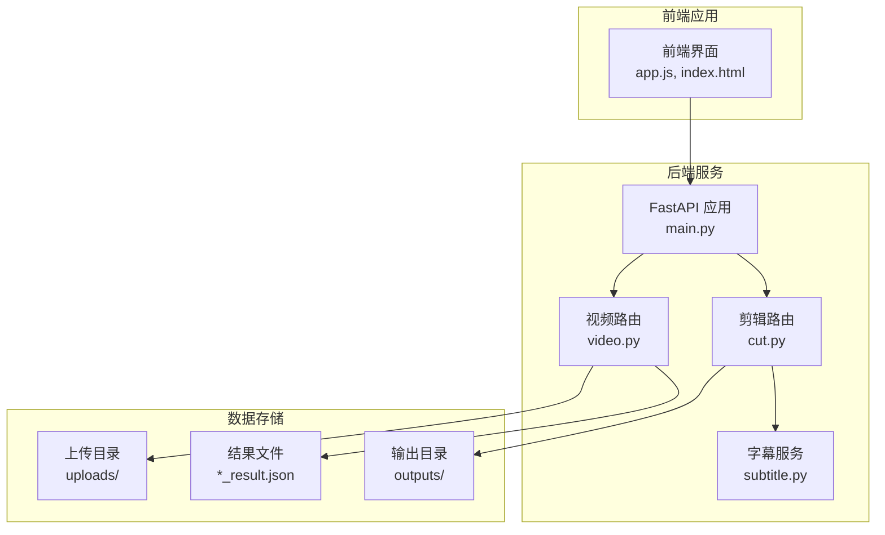
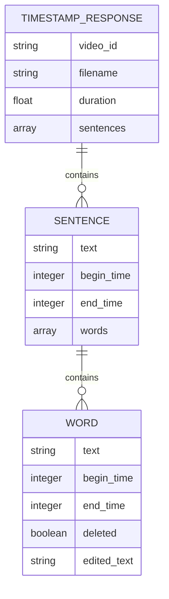
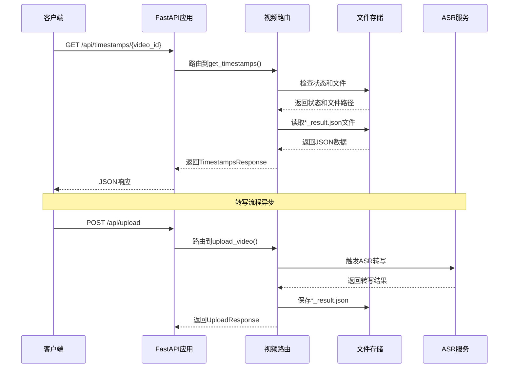
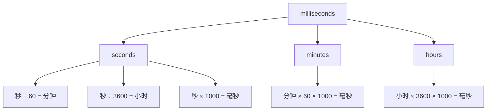
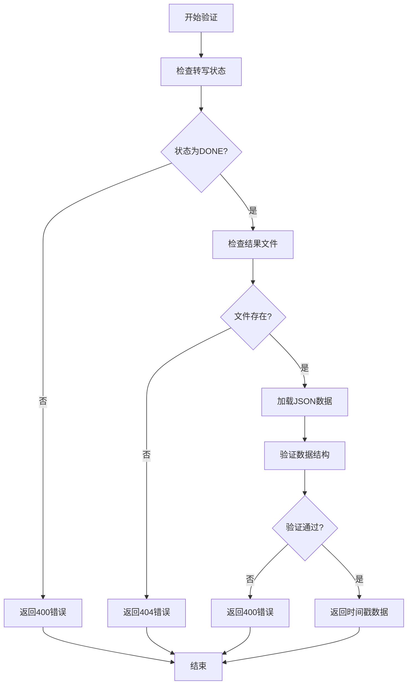
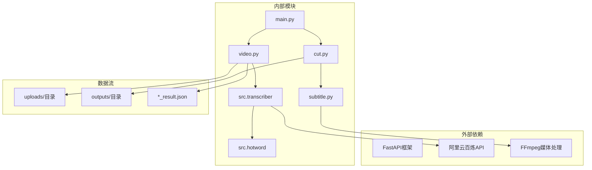
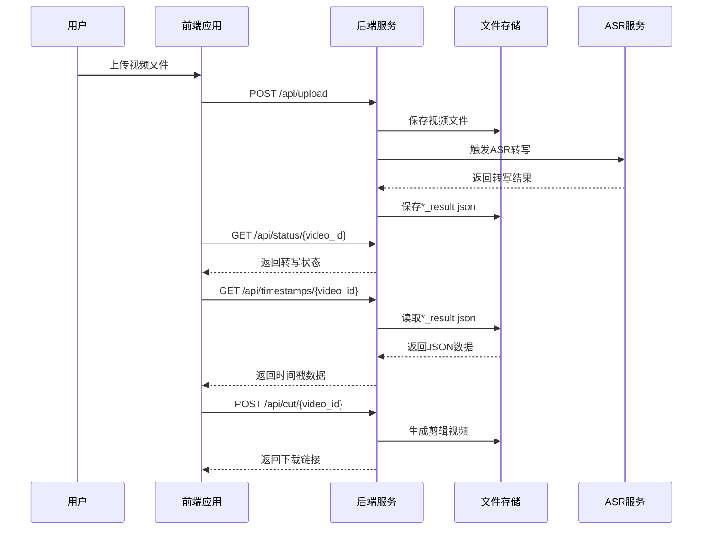

# 时间戳数据API

<cite>
**本文档引用的文件**
- [main.py](file://cut-video-web/backend/main.py)
- [video.py](file://cut-video-web/backend/router/video.py)
- [cut.py](file://cut-video-web/backend/router/cut.py)
- [subtitle.py](file://cut-video-web/backend/service/subtitle.py)
- [app.js](file://cut-video-web/frontend/app.js)
- [index.html](file://cut-video-web/frontend/index.html)
- [12bcc08a_result.json](file://cut-video-web/backend/uploads/12bcc08a_result.json)
- [README.md](file://README.md)
- [hotwords.json](file://hotwords.json)
</cite>

## 目录
1. [简介](#简介)
2. [项目结构](#项目结构)
3. [核心组件](#核心组件)
4. [架构概览](#架构概览)
5. [详细组件分析](#详细组件分析)
6. [依赖关系分析](#依赖关系分析)
7. [性能考虑](#性能考虑)
8. [故障排除指南](#故障排除指南)
9. [结论](#结论)

## 简介

时间戳数据API是ASR词级时间戳视频剪辑系统的核心组件，负责提供精确到词级的时间戳数据。该API允许用户获取视频转写结果中的时间戳信息，支持精确的视频编辑和字幕生成。

本API基于阿里云百炼FunASR API，提供毫秒级精度的时间戳数据，支持词级和句子级的时间信息。用户可以通过词级时间戳实现精确的视频剪辑、字幕生成和时间轴同步等功能。

## 项目结构

该项目采用前后端分离的架构设计，主要包含以下组件：

**图表来源**
- [main.py:25-51](file://cut-video-web/backend/main.py#L25-L51)
- [video.py:24-296](file://cut-video-web/backend/router/video.py#L24-L296)
- [cut.py:22-232](file://cut-video-web/backend/router/cut.py#L22-L232)

**章节来源**
- [main.py:1-84](file://cut-video-web/backend/main.py#L1-L84)
- [README.md:281-300](file://README.md#L281-L300)

## 核心组件

### API端点概述

时间戳数据API提供以下核心端点：

| 端点 | 方法 | 描述 | 响应格式 |
|------|------|------|----------|
| `/api/timestamps/{video_id}` | GET | 获取词级时间戳数据 | JSON |
| `/api/upload` | POST | 上传视频文件并触发ASR转写 | JSON |
| `/api/status/{video_id}` | GET | 获取转写状态 | JSON |
| `/api/cut/{video_id}` | POST | 根据删除的词剪辑视频 | JSON |

### 时间戳数据结构

时间戳数据采用层次化的JSON结构，包含完整的句子和词级时间信息：

**图表来源**
- [video.py:119-124](file://cut-video-web/backend/router/video.py#L119-L124)
- [video.py:170-183](file://cut-video-web/backend/router/video.py#L170-L183)

**章节来源**
- [video.py:119-124](file://cut-video-web/backend/router/video.py#L119-L124)
- [video.py:170-183](file://cut-video-web/backend/router/video.py#L170-L183)

## 架构概览

时间戳数据API的架构设计体现了清晰的分层原则：

**图表来源**
- [main.py:49-51](file://cut-video-web/backend/main.py#L49-L51)
- [video.py:252-277](file://cut-video-web/backend/router/video.py#L252-L277)
- [video.py:166-234](file://cut-video-web/backend/router/video.py#L166-L234)

## 详细组件分析

### GET /api/timestamps/{video_id} 端点

#### 功能说明

该端点用于获取指定视频的词级时间戳数据，是整个时间戳API的核心功能。

#### 参数说明

| 参数 | 类型 | 必需 | 描述 |
|------|------|------|------|
| video_id | string | 是 | 视频文件的唯一标识符 |

#### 响应格式

响应采用TimestampsResponse模型，包含以下字段：

| 字段名 | 类型 | 描述 | 示例值 |
|--------|------|------|--------|
| video_id | string | 视频ID | "12bcc08a" |
| filename | string | 原始文件名 | "12bcc08a_testvideo1.mov" |
| duration | float | 视频总时长（秒） | 34.41 |
| sentences | array | 句子数组 | - |

#### 时间戳数据结构详解

每个句子对象包含：
- `text`: 句子文本内容
- `begin_time`: 句子开始时间（毫秒）
- `end_time`: 句子结束时间（毫秒）
- `words`: 词数组，每个词包含：
  - `text`: 词语文本
  - `begin_time`: 词开始时间（毫秒）
  - `end_time`: 词结束时间（毫秒）

#### 数据验证规则

1. **状态检查**：仅当转写状态为DONE时才允许访问
2. **文件存在性**：必须存在对应的*_result.json文件
3. **时间戳连续性**：词级时间戳必须按顺序排列且不重叠
4. **边界完整性**：每个句子的begin_time应该等于第一个词的begin_time，end_time应该等于最后一个词的end_time

#### 错误处理

| 状态码 | 错误原因 | 描述 |
|--------|----------|------|
| 404 | 视频不存在 | video_id无效或文件不存在 |
| 400 | 转写未完成 | 当前状态不是DONE |
| 500 | 文件读取错误 | JSON文件损坏或格式不正确 |

**章节来源**
- [video.py:252-277](file://cut-video-web/backend/router/video.py#L252-L277)
- [video.py:38-96](file://cut-video-web/backend/router/video.py#L38-L96)

### 时间戳精度和单位换算

#### 精度规格

- **时间单位**：毫秒（ms）
- **精度范围**：毫秒级
- **数值类型**：整数

#### 单位换算

**图表来源**
- [video.py:211-217](file://cut-video-web/backend/router/video.py#L211-L217)

#### 时间戳验证算法

**图表来源**
- [video.py:252-277](file://cut-video-web/backend/router/video.py#L252-L277)

**章节来源**
- [video.py:211-217](file://cut-video-web/backend/router/video.py#L211-L217)

### 前端集成和应用场景

#### 前端数据使用

前端应用通过以下方式使用时间戳数据：

1. **实时高亮**：根据播放进度动态高亮当前词
2. **精确跳转**：点击词块直接跳转到对应时间点
3. **字幕预览**：实时显示对应时间点的字幕内容
4. **统计分析**：计算已删除、已编辑、总计词数

#### 应用场景

1. **视频编辑**：精确删除特定词语而不影响其他部分
2. **字幕生成**：根据词级时间戳生成精确的SRT字幕
3. **教学材料**：为学习者提供精确的时间定位
4. **内容审核**：快速定位和删除不当内容
5. **多语言处理**：支持多语言视频的精确时间对齐

**章节来源**
- [app.js:190-215](file://cut-video-web/frontend/app.js#L190-L215)
- [app.js:417-461](file://cut-video-web/frontend/app.js#L417-L461)

## 依赖关系分析

### 组件依赖图

**图表来源**
- [main.py:23-24](file://cut-video-web/backend/main.py#L23-L24)
- [video.py:21-22](file://cut-video-web/backend/router/video.py#L21-L22)
- [cut.py:19-20](file://cut-video-web/backend/router/cut.py#L19-L20)

### 数据流分析

**图表来源**
- [app.js:133-153](file://cut-video-web/frontend/app.js#L133-L153)
- [video.py:126-163](file://cut-video-web/backend/router/video.py#L126-L163)
- [cut.py:51-110](file://cut-video-web/backend/router/cut.py#L51-L110)

**章节来源**
- [main.py:23-24](file://cut-video-web/backend/main.py#L23-L24)
- [video.py:21-22](file://cut-video-web/backend/router/video.py#L21-L22)

## 性能考虑

### 时间复杂度分析

1. **数据读取**：O(n) - n为词的数量
2. **数据验证**：O(n) - 需要验证每个词的时间戳
3. **数据序列化**：O(n) - JSON序列化成本与数据量成正比

### 内存使用优化

- **流式处理**：使用生成器模式处理大型JSON文件
- **增量加载**：仅在需要时加载相关数据
- **缓存策略**：对频繁访问的数据进行内存缓存

### 并发处理

- **异步转写**：使用asyncio处理长时间运行的ASR任务
- **并发控制**：限制同时进行的转写任务数量
- **资源管理**：合理管理文件句柄和网络连接

## 故障排除指南

### 常见问题及解决方案

#### 1. 获取时间戳失败

**症状**：返回404错误
**可能原因**：
- video_id不存在
- 转写结果文件损坏
- 文件权限问题

**解决方法**：
1. 验证video_id是否正确
2. 检查*_result.json文件是否存在
3. 确认文件权限设置

#### 2. 转写状态异常

**症状**：返回400错误，提示转写未完成
**可能原因**：
- 转写仍在进行中
- 服务重启导致状态丢失
- API密钥配置错误

**解决方法**：
1. 使用/status接口检查转写状态
2. 等待转写完成后重试
3. 检查DASHSCOPE_API_KEY配置

#### 3. 时间戳数据异常

**症状**：时间戳不连续或重叠
**可能原因**：
- ASR服务返回数据异常
- 文件损坏
- 版本兼容性问题

**解决方法**：
1. 重新进行ASR转写
2. 检查输入文件质量
3. 更新到最新版本

**章节来源**
- [video.py:252-277](file://cut-video-web/backend/router/video.py#L252-L277)
- [video.py:38-96](file://cut-video-web/backend/router/video.py#L38-L96)

## 结论

时间戳数据API为视频编辑和字幕生成提供了精确的时间定位能力。通过毫秒级精度的时间戳数据，用户可以实现精确的视频剪辑、字幕生成和内容编辑。

该API的设计充分考虑了实际应用场景的需求，提供了完整的错误处理机制和性能优化策略。配合前端的可视化界面，用户可以直观地进行视频编辑操作。

未来的发展方向包括：
- 支持更多格式的时间戳输出
- 增强数据验证和错误恢复机制
- 优化大规模数据的处理性能
- 扩展到音频文件的支持