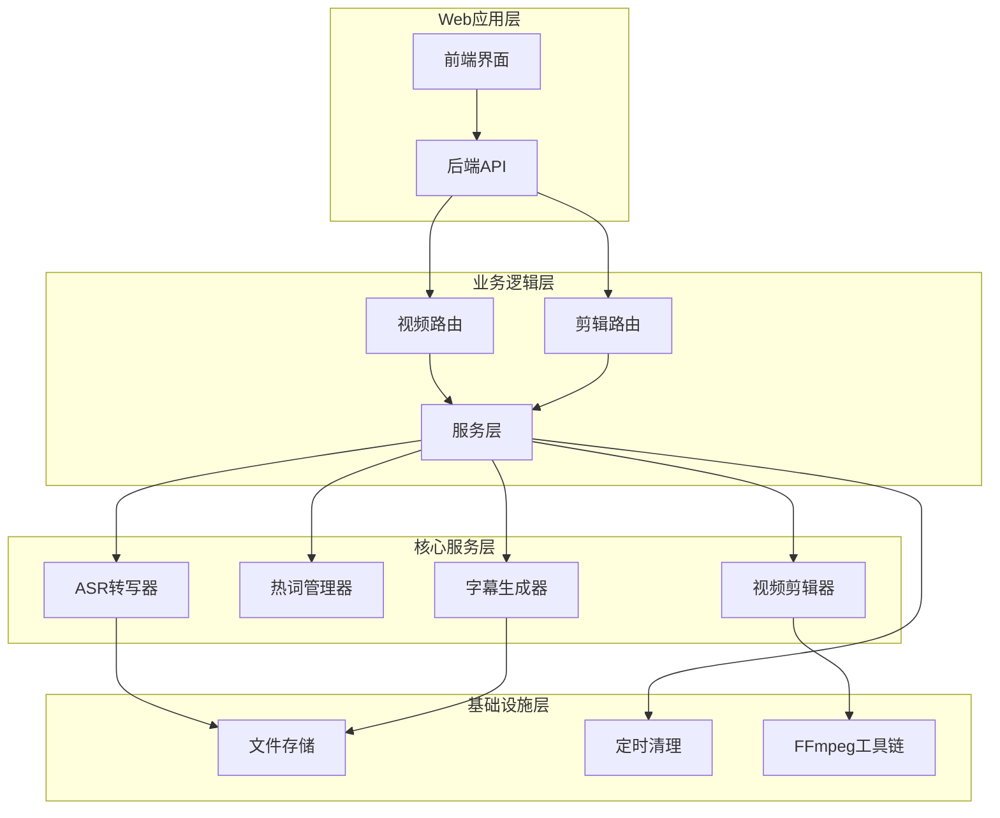
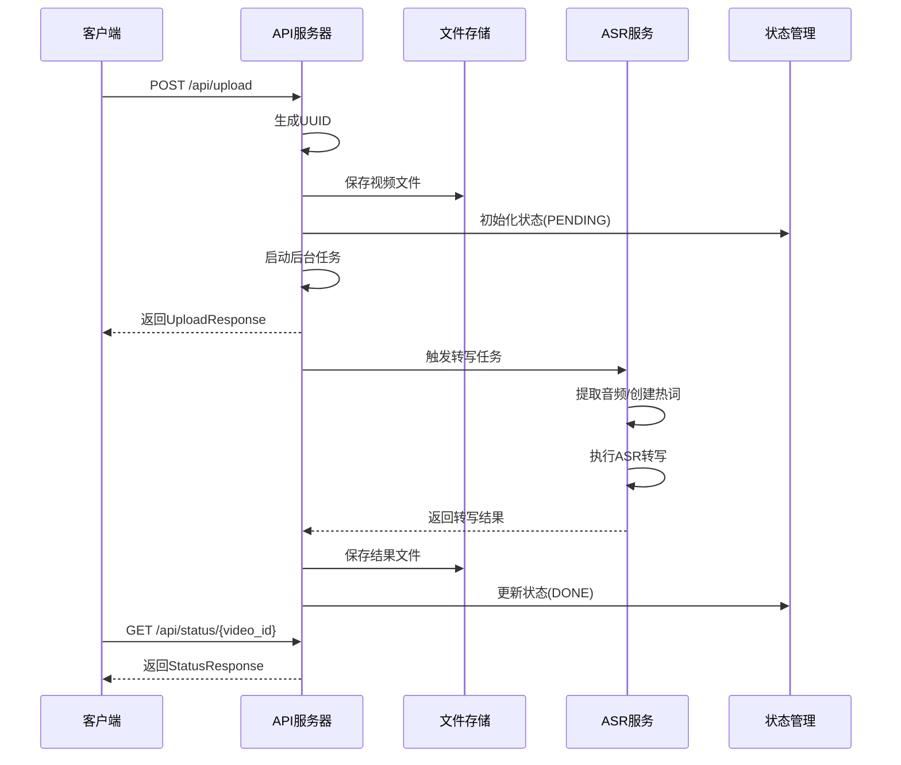
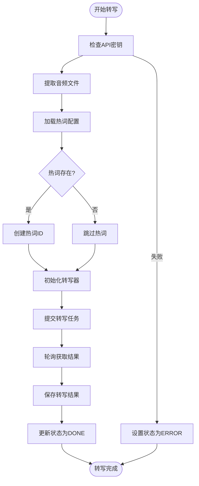
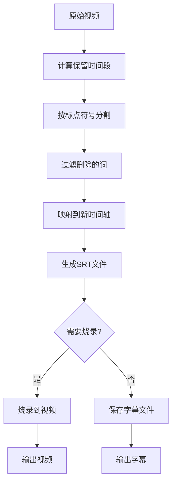
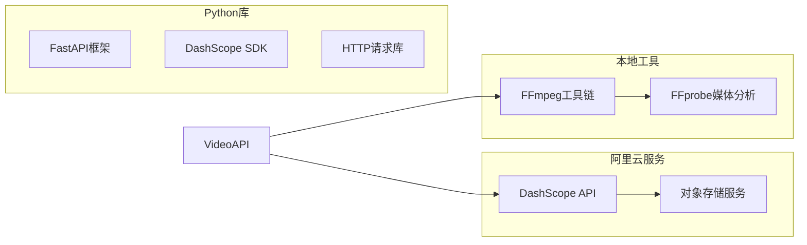
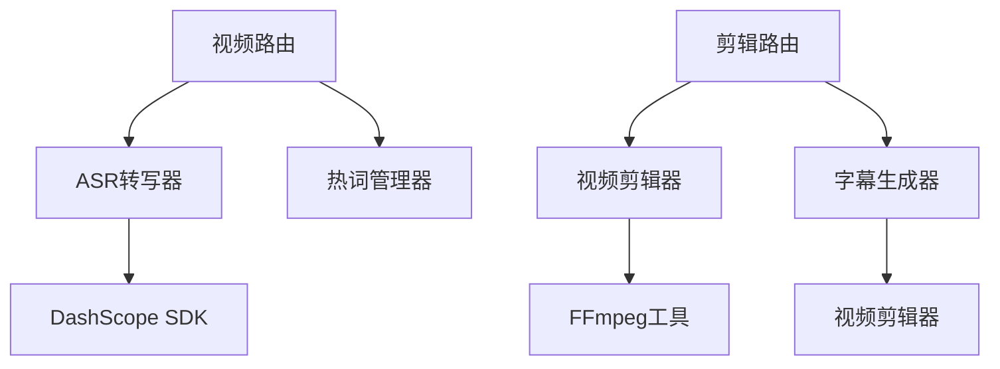

# 视频上传API

<cite>
**本文档引用的文件**
- [main.py](file://cut-video-web/backend/main.py)
- [video.py](file://cut-video-web/backend/router/video.py)
- [cut.py](file://cut-video-web/backend/router/cut.py)
- [transcriber.py](file://src/transcriber.py)
- [hotword.py](file://src/hotword.py)
- [cutter.py](file://cut-video-web/backend/service/cutter.py)
- [subtitle.py](file://cut-video-web/backend/service/subtitle.py)
- [cleanup.py](file://cut-video-web/backend/service/cleanup.py)
- [hotwords.json](file://hotwords.json)
- [README.md](file://README.md)
- [cli.py](file://cli.py)
</cite>

## 目录
1. [简介](#简介)
2. [项目结构](#项目结构)
3. [核心组件](#核心组件)
4. [架构概览](#架构概览)
5. [详细组件分析](#详细组件分析)
6. [依赖关系分析](#依赖关系分析)
7. [性能考虑](#性能考虑)
8. [故障排除指南](#故障排除指南)
9. [结论](#结论)
10. [附录](#附录)

## 简介

视频上传API是基于阿里云百炼FunASR API的词级时间戳视频剪辑工具的核心组件。该API提供了完整的视频上传、自动转写、状态管理和视频剪辑功能。系统支持多种视频格式，具备热词增强识别能力，并能够生成精确到词级的时间戳数据。

主要功能特性：
- 视频文件上传和存储
- 自动ASR转写（词级时间戳）
- 实时状态跟踪和查询
- 基于删除词的精确视频剪辑
- 字幕生成和烧录功能
- 自动文件清理机制

## 项目结构

该项目采用前后端分离的架构设计，主要分为以下层次：



**图表来源**
- [main.py:25-51](file://cut-video-web/backend/main.py#L25-L51)
- [video.py:24-32](file://cut-video-web/backend/router/video.py#L24-L32)
- [cut.py:22-28](file://cut-video-web/backend/router/cut.py#L22-L28)

**章节来源**
- [main.py:25-51](file://cut-video-web/backend/main.py#L25-L51)
- [README.md:281-299](file://README.md#L281-L299)

## 核心组件

### API路由组件

系统包含两个主要的API路由模块：

1. **视频路由** (`/api/video`): 处理视频上传、转写和状态查询
2. **剪辑路由** (`/api/cut`): 处理视频剪辑和字幕生成

### 服务组件

- **ASR转写服务**: 基于阿里云百炼FunASR API的语音识别服务
- **热词管理服务**: 热词创建、管理和删除功能
- **视频剪辑服务**: 基于ffmpeg的视频剪辑和合并功能
- **字幕生成服务**: SRT格式字幕文件生成和时间戳映射

**章节来源**
- [video.py:24-32](file://cut-video-web/backend/router/video.py#L24-L32)
- [cut.py:22-28](file://cut-video-web/backend/router/cut.py#L22-L28)

## 架构概览

视频上传API采用异步处理架构，确保高并发场景下的稳定性和性能：



**图表来源**
- [video.py:126-163](file://cut-video-web/backend/router/video.py#L126-L163)
- [video.py:166-234](file://cut-video-web/backend/router/video.py#L166-L234)

## 详细组件分析

### 视频上传端点

#### 端点定义
- **URL**: `POST /api/upload`
- **功能**: 上传视频文件并触发ASR转写
- **请求类型**: multipart/form-data
- **响应类型**: JSON

#### 请求参数

| 参数名 | 类型 | 必需 | 描述 | 示例 |
|--------|------|------|------|------|
| file | file | 是 | 视频文件 | mp4/mov/avi等 |

#### 响应格式

```json
{
  "video_id": "字符串",
  "filename": "字符串", 
  "status": "枚举(PENDING)"
}
```

#### 状态管理

系统维护四种状态：
- `PENDING`: 文件已接收，等待处理
- `PROCESSING`: 正在进行ASR转写
- `DONE`: 转写完成，可获取结果
- `ERROR`: 处理过程中发生错误

**章节来源**
- [video.py:126-163](file://cut-video-web/backend/router/video.py#L126-L163)
- [video.py:98-103](file://cut-video-web/backend/router/video.py#L98-L103)

### 转写流程详解

#### 文件验证和处理

1. **UUID生成**: 使用UUID4的前8位作为视频ID
2. **文件保存**: 采用安全的文件命名策略
3. **状态初始化**: 设置初始状态为PENDING

#### ASR转写流程



**图表来源**
- [video.py:166-234](file://cut-video-web/backend/router/video.py#L166-L234)
- [transcriber.py:203-294](file://src/transcriber.py#L203-L294)

#### 错误处理机制

系统实现了多层次的错误处理：

1. **文件上传错误**: 捕获文件读取和保存异常
2. **ASR服务错误**: 处理API调用失败和超时
3. **状态管理错误**: 确保状态一致性
4. **资源清理**: 异常情况下清理临时文件

**章节来源**
- [video.py:229-233](file://cut-video-web/backend/router/video.py#L229-L233)

### 状态查询端点

#### 端点定义
- **URL**: `GET /api/status/{video_id}`
- **功能**: 查询视频转写状态
- **响应类型**: JSON

#### 响应格式

```json
{
  "video_id": "字符串",
  "status": "枚举(PENDING|PROCESSING|DONE|ERROR)",
  "filename": "字符串(可选)",
  "task_id": "字符串(可选)",
  "error": "字符串(可选)"
}
```

**章节来源**
- [video.py:236-249](file://cut-video-web/backend/router/video.py#L236-L249)

### 词级时间戳端点

#### 端点定义
- **URL**: `GET /api/timestamps/{video_id}`
- **功能**: 获取词级时间戳数据
- **响应类型**: JSON

#### 响应格式

```json
{
  "video_id": "字符串",
  "filename": "字符串",
  "duration": "浮点数(秒)",
  "sentences": "数组(包含词级时间戳的句子)"
}
```

**章节来源**
- [video.py:252-277](file://cut-video-web/backend/router/video.py#L252-L277)

### 视频剪辑端点

#### 端点定义
- **URL**: `POST /api/cut/{video_id}`
- **功能**: 根据删除的词剪辑视频
- **请求类型**: JSON

#### 请求参数

```json
{
  "sentences": "数组(更新了deleted状态的句子)",
  "burn_subtitles": "布尔值(是否烧录字幕)"
}
```

#### 响应格式

```json
{
  "output_id": "字符串",
  "output_filename": "字符串",
  "subtitle_filename": "字符串(可选)",
  "message": "字符串"
}
```

**章节来源**
- [cut.py:51-110](file://cut-video-web/backend/router/cut.py#L51-L110)

### 字幕生成和烧录

系统支持两种字幕处理方式：

1. **字幕文件生成**: 生成独立的SRT字幕文件
2. **字幕烧录**: 将字幕直接嵌入到输出视频中

#### 字幕时间戳映射



**图表来源**
- [cut.py:127-218](file://cut-video-web/backend/router/cut.py#L127-L218)
- [subtitle.py:173-198](file://cut-video-web/backend/service/subtitle.py#L173-L198)

**章节来源**
- [subtitle.py:18-44](file://cut-video-web/backend/service/subtitle.py#L18-L44)

## 依赖关系分析

### 外部依赖

系统依赖以下外部服务和工具：



**图表来源**
- [transcriber.py:16-19](file://src/transcriber.py#L16-L19)
- [cutter.py:10-11](file://cut-video-web/backend/service/cutter.py#L10-L11)

### 内部组件依赖



**图表来源**
- [video.py:21-22](file://cut-video-web/backend/router/video.py#L21-L22)
- [cut.py:19-20](file://cut-video-web/backend/router/cut.py#L19-L20)

**章节来源**
- [video.py:21-22](file://cut-video-web/backend/router/video.py#L21-L22)
- [cut.py:19-20](file://cut-video-web/backend/router/cut.py#L19-L20)

## 性能考虑

### 并发处理

系统采用异步处理模式，支持高并发请求：

- **后台任务**: 转写任务在独立的异步任务中执行
- **非阻塞I/O**: 文件操作和网络请求都是异步的
- **内存状态管理**: 使用内存字典存储转写状态

### 资源管理

- **文件大小限制**: 系统支持最长12小时、2GB的音频文件
- **自动清理**: 定时清理过期文件，防止磁盘空间耗尽
- **内存优化**: 状态信息仅在内存中维护，避免持久化开销

### 缓存策略

- **热词缓存**: 热词ID在内存中缓存，避免重复创建
- **结果缓存**: 转写结果文件缓存到磁盘，支持快速访问

**章节来源**
- [README.md:7-8](file://README.md#L7-L8)
- [cleanup.py:76-96](file://cut-video-web/backend/service/cleanup.py#L76-L96)

## 故障排除指南

### 常见问题及解决方案

#### 1. API密钥配置错误

**症状**: 转写任务立即失败，状态变为ERROR

**原因**: DASHSCOPE_API_KEY环境变量未正确设置

**解决方案**:
```bash
export DASHSCOPE_API_KEY='your-api-key'
```

#### 2. 文件上传失败

**症状**: 上传端点返回400错误

**原因**: 文件格式不支持或文件损坏

**解决方案**: 
- 确认文件格式在支持列表中
- 检查文件完整性
- 确认文件大小不超过限制

#### 3. 转写超时

**症状**: 转写任务长时间处于PROCESSING状态

**原因**: 网络延迟或ASR服务繁忙

**解决方案**:
- 检查网络连接
- 稍后重试
- 考虑使用更简单的音频格式

#### 4. FFmpeg相关错误

**症状**: 视频剪辑或字幕烧录失败

**原因**: FFmpeg工具未正确安装或权限不足

**解决方案**:
- 确认FFmpeg已安装且可执行
- 检查文件权限
- 验证输入文件格式

**章节来源**
- [video.py:180-183](file://cut-video-web/backend/router/video.py#L180-L183)
- [cutter.py:121-128](file://cut-video-web/backend/service/cutter.py#L121-L128)

### 错误代码说明

| HTTP状态码 | 错误类型 | 描述 |
|------------|----------|------|
| 200 | 成功 | 操作成功完成 |
| 400 | 客户端错误 | 请求参数无效或格式错误 |
| 404 | 资源不存在 | 视频文件或结果文件不存在 |
| 500 | 服务器错误 | 服务器内部错误 |

**章节来源**
- [video.py:240-241](file://cut-video-web/backend/router/video.py#L240-L241)
- [cut.py:83-84](file://cut-video-web/backend/router/cut.py#L83-L84)

## 结论

视频上传API提供了完整的视频处理解决方案，具有以下优势：

1. **功能完整**: 从文件上传到视频剪辑的全流程支持
2. **技术先进**: 基于词级时间戳的精确控制
3. **易于使用**: 简洁的API设计和清晰的状态管理
4. **可扩展性**: 模块化的架构便于功能扩展

建议在生产环境中：
- 配置适当的文件大小限制
- 设置合理的超时时间
- 监控API使用情况
- 定期清理过期文件

## 附录

### API使用示例

#### curl命令示例

**上传视频文件**:
```bash
curl -X POST "http://localhost:8000/api/upload" \
  -H "Content-Type: multipart/form-data" \
  -F "file=@/path/to/video.mp4"
```

**查询转写状态**:
```bash
curl "http://localhost:8000/api/status/{video_id}"
```

**获取词级时间戳**:
```bash
curl "http://localhost:8000/api/timestamps/{video_id}"
```

**执行视频剪辑**:
```bash
curl -X POST "http://localhost:8000/api/cut/{video_id}" \
  -H "Content-Type: application/json" \
  -d '{
    "sentences": [...],
    "burn_subtitles": true
  }'
```

### 配置要求

#### 环境变量

| 变量名 | 必需 | 描述 | 示例值 |
|--------|------|------|--------|
| DASHSCOPE_API_KEY | 是 | 阿里云百炼API密钥 | your-api-key |
| PORT | 否 | 服务器端口号 | 8000 |

#### 支持的视频格式

- MP4 (推荐)
- MOV
- AVI
- MKV
- FLV
- WMV
- WebM

#### 文件大小限制

- 最大文件大小: 2GB
- 最长音频时长: 12小时

**章节来源**
- [README.md:250-259](file://README.md#L250-L259)
- [transcriber.py:44-45](file://src/transcriber.py#L44-L45)