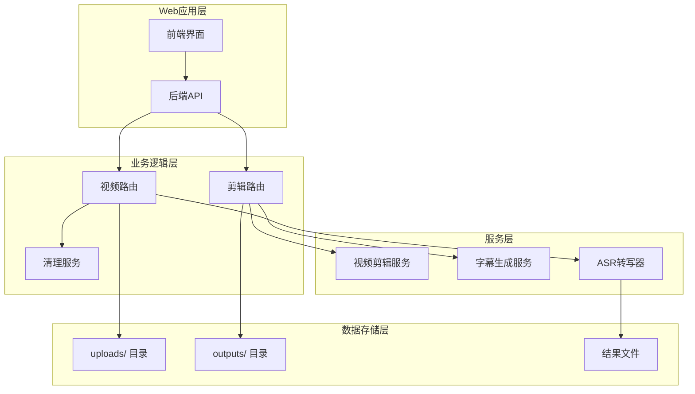
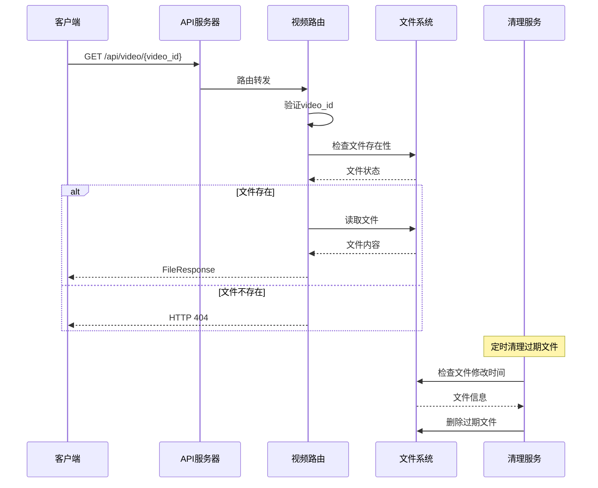
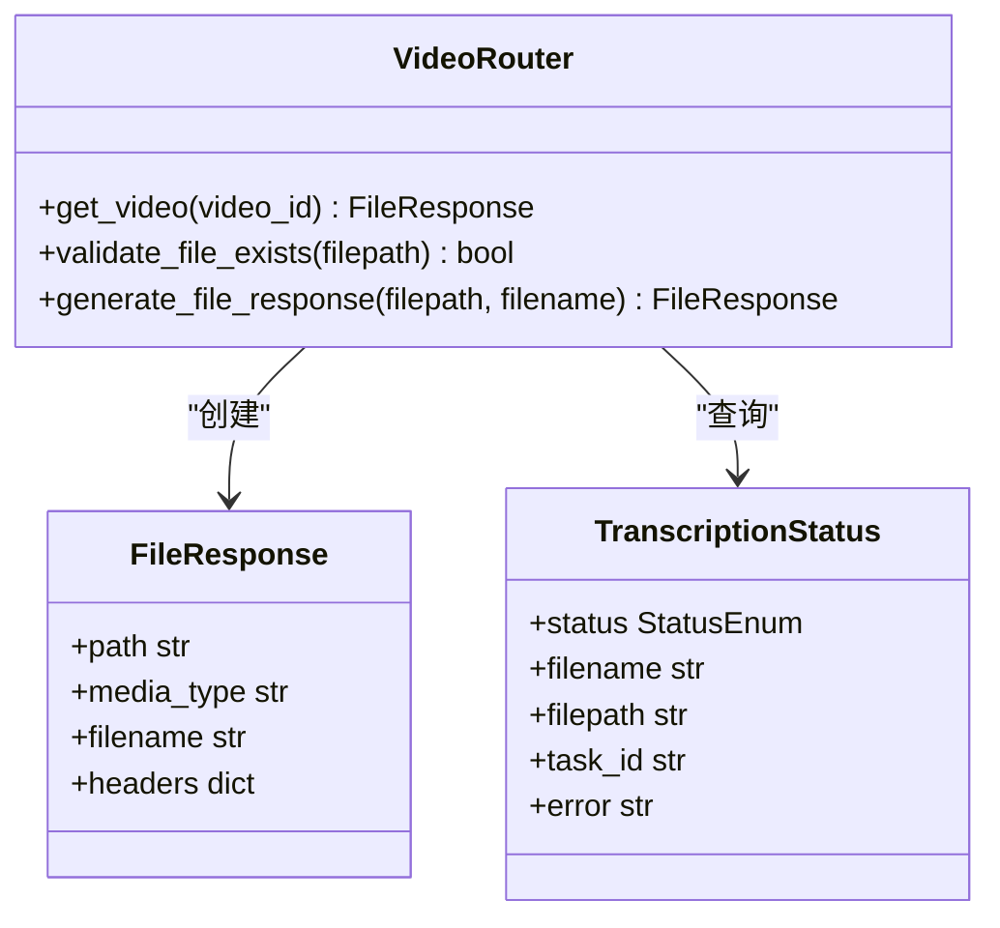
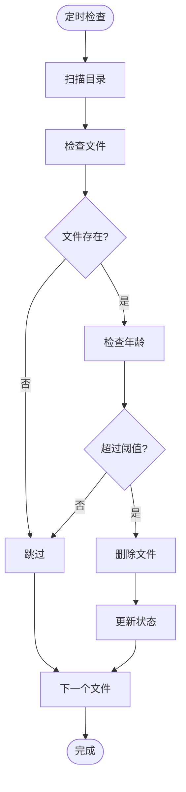
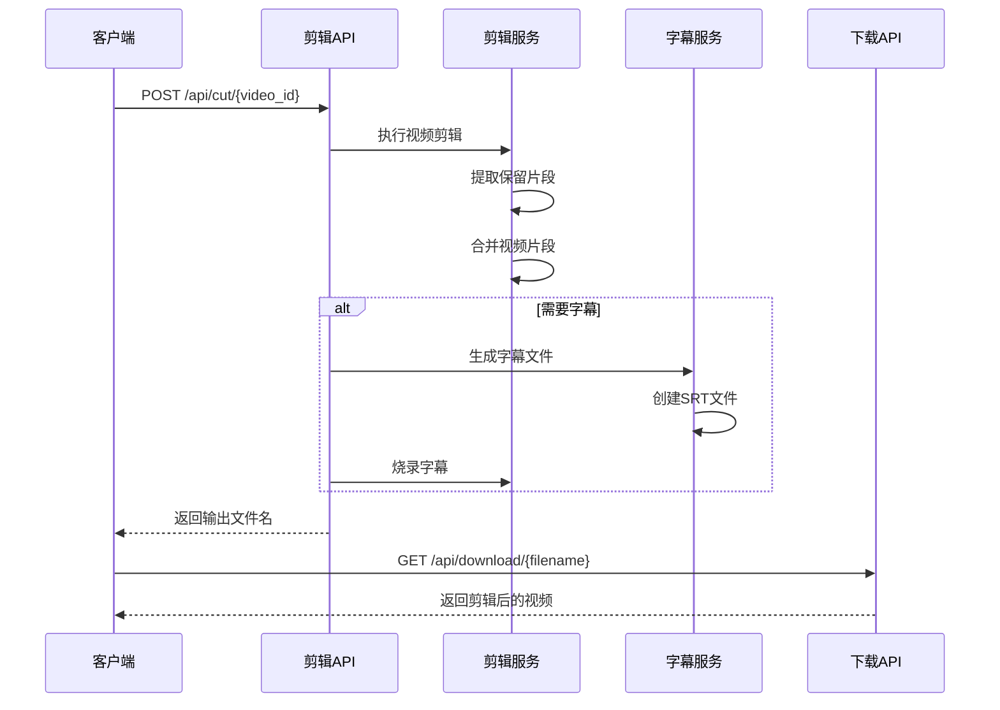
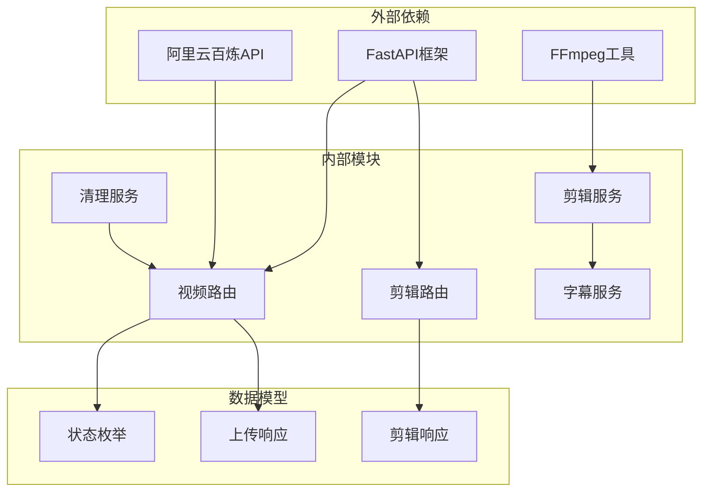
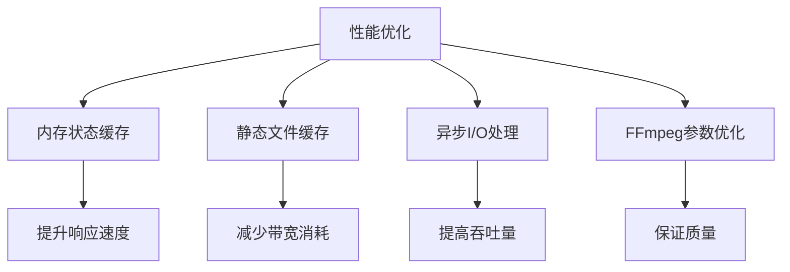
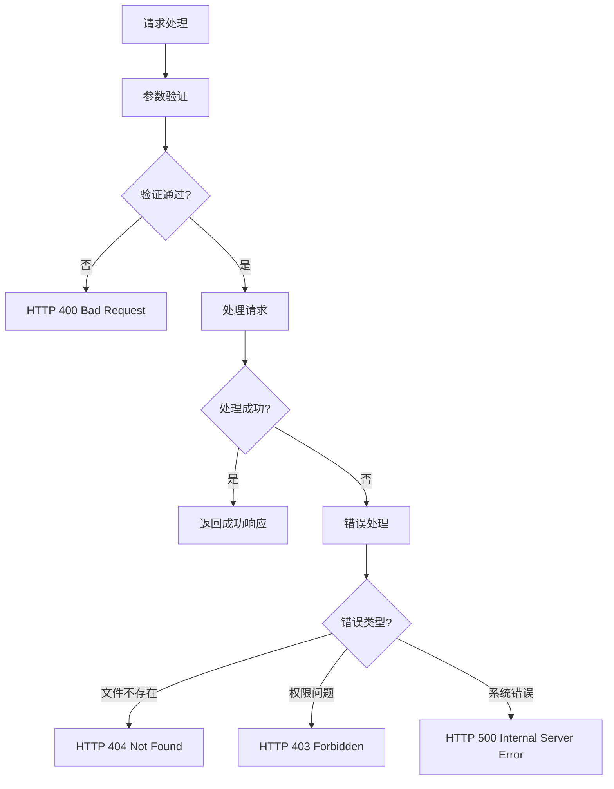

# 视频下载API

<cite>
**本文档引用的文件**
- [video.py](file://cut-video-web/backend/router/video.py)
- [cut.py](file://cut-video-web/backend/router/cut.py)
- [main.py](file://cut-video-web/backend/main.py)
- [cutter.py](file://cut-video-web/backend/service/cutter.py)
- [subtitle.py](file://cut-video-web/backend/service/subtitle.py)
- [cleanup.py](file://cut-video-web/backend/service/cleanup.py)
- [README.md](file://README.md)
- [cli.py](file://cli.py)
- [transcribe_example.py](file://examples/transcribe_example.py)
- [hotwords.json](file://hotwords.json)
</cite>

## 目录
1. [简介](#简介)
2. [项目结构](#项目结构)
3. [核心组件](#核心组件)
4. [架构概览](#架构概览)
5. [详细组件分析](#详细组件分析)
6. [依赖关系分析](#依赖关系分析)
7. [性能考虑](#性能考虑)
8. [故障排除指南](#故障排除指南)
9. [结论](#结论)

## 简介

本文档详细说明了视频下载API的功能、参数和响应格式。该系统提供了完整的视频处理工作流，包括视频上传、自动ASR转写、词级时间戳分析、视频剪辑和下载功能。特别关注GET /api/video/{video_id}端点的实现机制，解释视频文件的下载机制和文件响应处理。

## 项目结构

项目采用前后端分离的架构设计，主要分为以下模块：



**图表来源**
- [main.py:25-51](file://cut-video-web/backend/main.py#L25-L51)
- [video.py:24](file://cut-video-web/backend/router/video.py#L24)
- [cut.py:22](file://cut-video-web/backend/router/cut.py#L22)

**章节来源**
- [main.py:25-84](file://cut-video-web/backend/main.py#L25-L84)
- [README.md:281-300](file://README.md#L281-L300)

## 核心组件

### 视频下载端点

GET /api/video/{video_id} 是系统的核心下载接口，负责提供用户上传的原始视频文件。

**端点功能**：
- 根据video_id检索对应的视频文件
- 验证文件存在性和有效性
- 返回标准的FileResponse响应
- 支持断点续传和范围请求

**参数说明**：
- `video_id` (路径参数): 视频文件的唯一标识符，格式为UUID的前8位

**响应格式**：
- 成功响应：FileResponse对象，包含完整的视频文件
- 错误响应：HTTP 404状态码，包含详细的错误信息

**章节来源**
- [video.py:280-295](file://cut-video-web/backend/router/video.py#L280-L295)

### 文件存储架构

系统采用双目录存储策略：

```mermaid
graph LR
subgraph "存储目录"
Uploads[uploads/]
Outputs[outputs/]
end
subgraph "文件命名规则"
Original[原始视频<br/>{video_id}_{filename}]
Result[转写结果<br/>{video_id}_result.json]
CutVideo[剪辑视频<br/>cut_{video_id}_{random}.mp4]
Subtitle[字幕文件<br/>sub_{video_id}_{random}.srt]
end
Uploads --> Original
Uploads --> Result
Outputs --> CutVideo
Outputs --> Subtitle
```

**图表来源**
- [video.py:136-145](file://cut-video-web/backend/router/video.py#L136-L145)
- [cut.py:71-72](file://cut-video-web/backend/router/cut.py#L71-L72)

**章节来源**
- [video.py:26-29](file://cut-video-web/backend/router/video.py#L26-L29)
- [cut.py:24-28](file://cut-video-web/backend/router/cut.py#L24-L28)

## 架构概览

系统采用异步处理架构，支持高并发的视频处理和下载需求：



**图表来源**
- [video.py:280-295](file://cut-video-web/backend/router/video.py#L280-L295)
- [main.py:61-74](file://cut-video-web/backend/main.py#L61-L74)

**章节来源**
- [main.py:61-84](file://cut-video-web/backend/main.py#L61-L84)
- [video.py:166-234](file://cut-video-web/backend/router/video.py#L166-L234)

## 详细组件分析

### 视频下载路由实现

视频下载功能通过FastAPI的FileResponse类实现，提供高效的文件传输能力：



**图表来源**
- [video.py:280-295](file://cut-video-web/backend/router/video.py#L280-L295)
- [video.py:105-117](file://cut-video-web/backend/router/video.py#L105-L117)

**实现特点**：
- 异常安全：完整的错误处理机制
- 性能优化：直接文件传输，避免内存占用
- 标准兼容：符合HTTP文件下载规范

**章节来源**
- [video.py:280-295](file://cut-video-web/backend/router/video.py#L280-L295)

### 文件清理机制

系统内置智能清理服务，确保磁盘空间的有效利用：



**图表来源**
- [cleanup.py:35-74](file://cut-video-web/backend/service/cleanup.py#L35-L74)

**清理策略**：
- 默认保留24小时
- 每小时检查一次
- 同步清理内存状态
- 支持多目录管理

**章节来源**
- [cleanup.py:15-103](file://cut-video-web/backend/service/cleanup.py#L15-L103)

### 视频剪辑与下载集成

剪辑功能与下载系统紧密集成，提供完整的视频处理链路：



**图表来源**
- [cut.py:51-110](file://cut-video-web/backend/router/cut.py#L51-L110)
- [cut.py:112-124](file://cut-video-web/backend/router/cut.py#L112-L124)

**章节来源**
- [cut.py:51-110](file://cut-video-web/backend/router/cut.py#L51-L110)
- [cut.py:112-124](file://cut-video-web/backend/router/cut.py#L112-L124)

## 依赖关系分析

系统采用模块化的依赖设计，各组件职责清晰：



**图表来源**
- [video.py:13](file://cut-video-web/backend/router/video.py#L13)
- [cut.py:11](file://cut-video-web/backend/router/cut.py#L11)

**依赖特点**：
- 明确的边界划分
- 最小化外部依赖
- 可测试性强
- 可扩展性好

**章节来源**
- [video.py:13-23](file://cut-video-web/backend/router/video.py#L13-L23)
- [cut.py:11-21](file://cut-video-web/backend/router/cut.py#L11-L21)

## 性能考虑

### 缓存策略

系统采用多层次的缓存策略来优化性能：

1. **内存缓存**：转写状态存储在内存中，避免频繁的文件I/O操作
2. **静态文件缓存**：通过FastAPI的StaticFiles提供浏览器缓存支持
3. **文件系统缓存**：操作系统级别的文件系统缓存

### 性能优化措施



**优化策略**：
- 异步处理大量视频文件
- FFmpeg参数调优
- 内存状态管理
- 文件系统优化

**章节来源**
- [video.py:31-32](file://cut-video-web/backend/router/video.py#L31-L32)
- [main.py:46-47](file://cut-video-web/backend/main.py#L46-L47)

## 故障排除指南

### 常见错误及解决方案

| 错误类型 | 错误码 | 描述 | 解决方案 |
|---------|--------|------|----------|
| 视频不存在 | 404 | video_id对应的文件不存在 | 检查video_id是否正确，确认文件是否已上传 |
| 文件权限 | 500 | 文件读取权限不足 | 检查文件权限设置，确保应用有读取权限 |
| 磁盘空间 | 507 | 磁盘空间不足 | 清理过期文件，增加磁盘空间 |
| API密钥 | 500 | DashScope API密钥无效 | 检查环境变量设置 |

### 错误处理机制



**错误处理特点**：
- 具体的错误信息
- 标准的HTTP状态码
- 完善的异常捕获
- 日志记录机制

**章节来源**
- [video.py:284-289](file://cut-video-web/backend/router/video.py#L284-L289)
- [cut.py:108-109](file://cut-video-web/backend/router/cut.py#L108-L109)

### 重试机制

系统提供多种重试策略：

1. **自动重试**：对于临时性错误，系统会自动重试
2. **手动重试**：客户端可以重新发起请求
3. **状态检查**：通过/status端点检查处理进度

**章节来源**
- [video.py:166-234](file://cut-video-web/backend/router/video.py#L166-L234)

## 结论

视频下载API提供了完整、可靠的视频处理和下载解决方案。系统具有以下优势：

1. **架构清晰**：模块化设计，职责明确
2. **性能优秀**：异步处理，高效传输
3. **可靠性强**：完善的错误处理和清理机制
4. **扩展性好**：易于添加新功能和优化性能

通过合理的文件命名规则、存储策略和清理机制，系统能够长期稳定运行，为用户提供优质的视频下载体验。