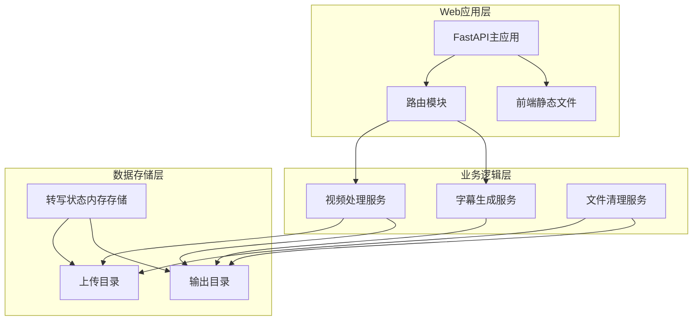
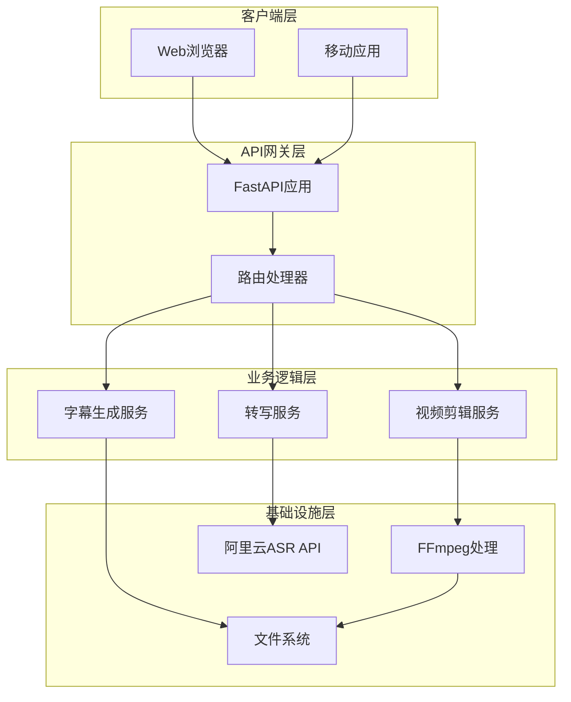
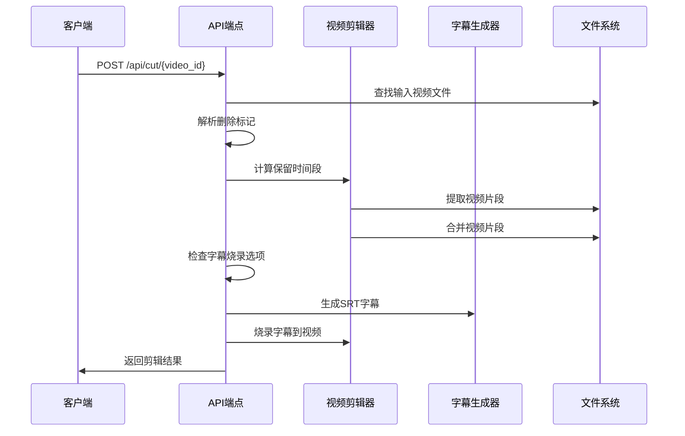
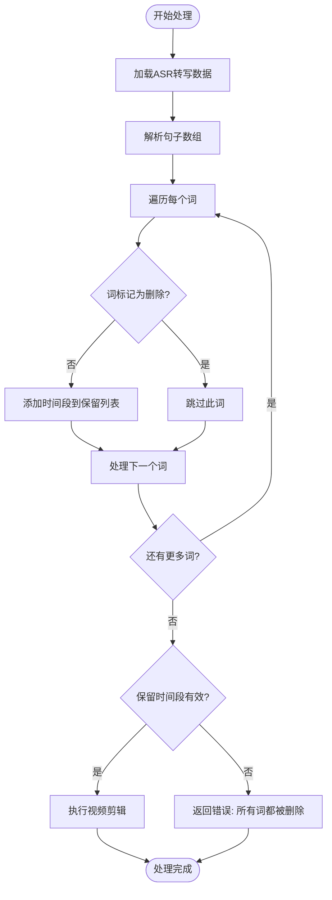
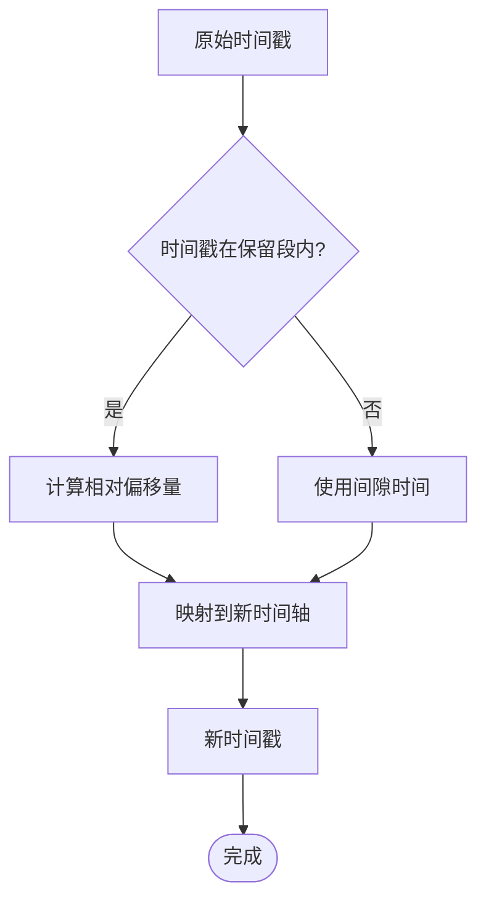
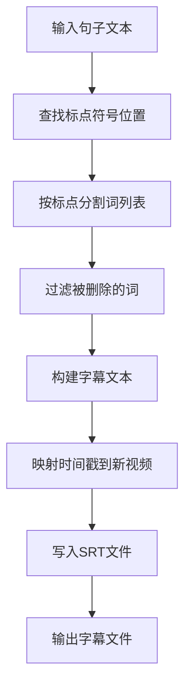
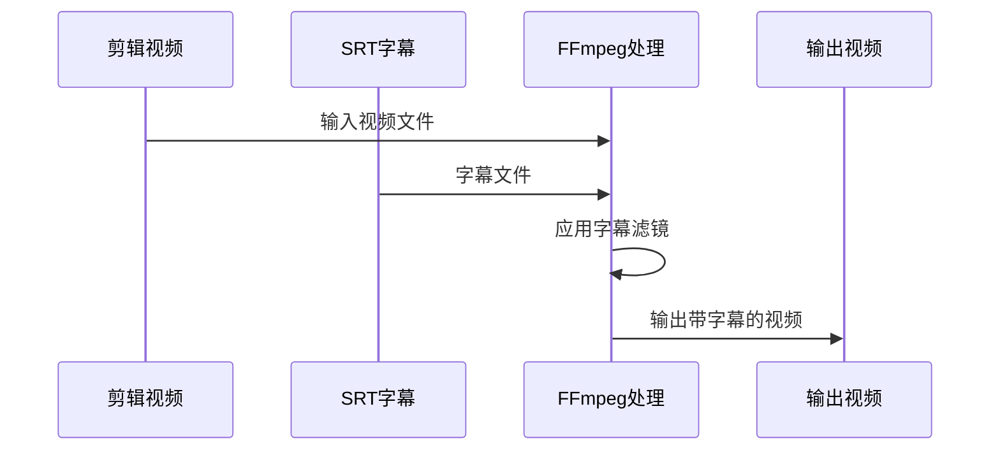
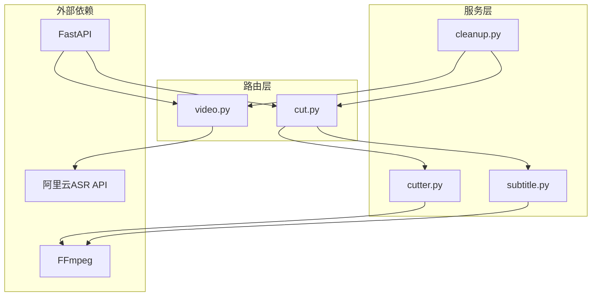
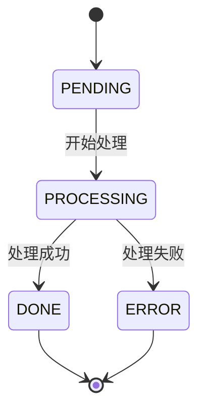

# 视频剪辑API

<cite>
**本文档引用的文件**
- [main.py](file://cut-video-web/backend/main.py)
- [cut.py](file://cut-video-web/backend/router/cut.py)
- [cutter.py](file://cut-video-web/backend/service/cutter.py)
- [subtitle.py](file://cut-video-web/backend/service/subtitle.py)
- [video.py](file://cut-video-web/backend/router/video.py)
- [cleanup.py](file://cut-video-web/backend/service/cleanup.py)
- [12bcc08a_result.json](file://cut-video-web/backend/uploads/12bcc08a_result.json)
- [hotwords.json](file://hotwords.json)
- [README.md](file://README.md)
</cite>

## 目录
1. [简介](#简介)
2. [项目结构](#项目结构)
3. [核心组件](#核心组件)
4. [架构概览](#架构概览)
5. [详细组件分析](#详细组件分析)
6. [依赖关系分析](#依赖关系分析)
7. [性能考虑](#性能考虑)
8. [故障排除指南](#故障排除指南)
9. [结论](#结论)

## 简介

视频剪辑API是一个基于阿里云百炼FunASR API的词级时间戳视频剪辑工具。该系统允许用户上传视频文件，自动进行ASR转写（包含词级时间戳），然后通过Web界面可视化地删除不需要的词或句子，最终生成精确剪辑后的视频文件。

该API提供了完整的视频处理流水线，包括：
- 自动ASR转写（词级时间戳）
- 可视化编辑界面
- 精确的视频剪辑
- 字幕生成和烧录功能
- 文件管理和清理机制

## 项目结构

项目采用模块化的FastAPI架构设计，主要分为以下几个部分：

**图表来源**
- [main.py:25-51](file://cut-video-web/backend/main.py#L25-L51)
- [cut.py:22-28](file://cut-video-web/backend/router/cut.py#L22-L28)

**章节来源**
- [main.py:1-84](file://cut-video-web/backend/main.py#L1-L84)
- [README.md:281-299](file://README.md#L281-L299)

## 核心组件

### API端点概述

系统提供以下核心API端点：

| 端点 | 方法 | 描述 | 响应类型 |
|------|------|------|----------|
| `/api/upload` | POST | 上传视频文件并触发ASR转写 | UploadResponse |
| `/api/status/{video_id}` | GET | 获取转写状态 | StatusResponse |
| `/api/timestamps/{video_id}` | GET | 获取词级时间戳数据 | TimestampsResponse |
| `/api/cut/{video_id}` | POST | 根据删除的词剪辑视频 | CutResponse |
| `/api/download/{filename}` | GET | 下载剪辑后的视频 | FileResponse |
| `/api/outputs` | GET | 列出所有输出文件 | JSON |

### 数据模型

#### 剪辑请求模型 (CutRequest)
- `sentences`: list - 包含词级时间戳的句子数组
- `burn_subtitles`: bool - 是否将字幕烧录到视频中

#### 剪辑响应模型 (CutResponse)
- `output_id`: string - 视频ID
- `output_filename`: string - 输出视频文件名
- `subtitle_filename`: string - 字幕文件名（可选）
- `message`: string - 操作状态消息

#### 时间戳响应模型 (TimestampsResponse)
- `video_id`: string - 视频ID
- `filename`: string - 原始文件名
- `duration`: float - 视频时长（秒）
- `sentences`: list - 包含词级时间戳的句子数组

**章节来源**
- [cut.py:31-43](file://cut-video-web/backend/router/cut.py#L31-L43)
- [video.py:119-124](file://cut-video-web/backend/router/video.py#L119-L124)

## 架构概览

系统采用分层架构设计，确保各组件职责清晰分离：

**图表来源**
- [main.py:19-51](file://cut-video-web/backend/main.py#L19-L51)
- [cut.py:19-21](file://cut-video-web/backend/router/cut.py#L19-L21)

## 详细组件分析

### 视频剪辑API (POST /api/cut/{video_id})

#### 端点功能
该端点接收用户通过Web界面标记的删除词，根据这些标记生成精确的视频剪辑结果。

#### 请求参数
- **路径参数**:
  - `video_id`: string - 视频文件ID

- **请求体**:
  - `sentences`: array - 更新了删除状态的句子数组
  - `burn_subtitles`: boolean - 是否烧录字幕到视频中

#### 响应格式
成功响应包含以下字段：
- `output_id`: 原始视频ID
- `output_filename`: 剪辑后的视频文件名
- `subtitle_filename`: 字幕文件名（如果启用了字幕烧录）
- `message`: 操作状态

#### 处理流程

**图表来源**
- [cut.py:51-110](file://cut-video-web/backend/router/cut.py#L51-L110)
- [cutter.py:21-66](file://cut-video-web/backend/service/cutter.py#L21-L66)

#### 删除标记处理算法

系统使用"删除标记"机制来标识需要移除的词：

**图表来源**
- [cut.py:78-86](file://cut-video-web/backend/router/cut.py#L78-L86)
- [cutter.py:236-246](file://cut-video-web/backend/service/cutter.py#L236-L246)

#### 时间戳调整机制

当视频被剪辑后，系统需要将原始时间戳映射到新的相对时间：

**图表来源**
- [cut.py:127-218](file://cut-video-web/backend/router/cut.py#L127-L218)
- [subtitle.py:173-198](file://cut-video-web/backend/service/subtitle.py#L173-L198)

### 字幕生成服务

#### SRT字幕生成算法

系统支持按标点符号智能分割字幕，并自动过滤被删除的词：

**图表来源**
- [subtitle.py:101-171](file://cut-video-web/backend/service/subtitle.py#L101-L171)
- [subtitle.py:200-219](file://cut-video-web/backend/service/subtitle.py#L200-L219)

#### 字幕烧录流程

**图表来源**
- [cutter.py:155-196](file://cut-video-web/backend/service/cutter.py#L155-L196)

**章节来源**
- [cut.py:51-110](file://cut-video-web/backend/router/cut.py#L51-L110)
- [subtitle.py:18-44](file://cut-video-web/backend/service/subtitle.py#L18-L44)

### 文件管理系统

#### 目录结构
- `uploads/`: 存放上传的原始视频文件和转写结果
- `outputs/`: 存放剪辑后的视频文件
- `backend/uploads/`: 后端上传目录
- `backend/outputs/`: 后端输出目录

#### 文件命名规则

**输入文件命名**:
- `{video_id}_{original_filename}` - 例如: `12bcc08a_testvideo1.mov`

**输出文件命名**:
- 剪辑视频: `cut_{video_id}_{random_hex}.mp4`
- 带字幕的剪辑视频: `cut_sub_{video_id}_{random_hex}.mp4`
- 字幕文件: `sub_{video_id}_{random_hex}.srt`

**章节来源**
- [cut.py:71-99](file://cut-video-web/backend/router/cut.py#L71-L99)
- [main.py:32-41](file://cut-video-web/backend/main.py#L32-L41)

## 依赖关系分析

### 组件依赖图

**图表来源**
- [cut.py:19-21](file://cut-video-web/backend/router/cut.py#L19-L21)
- [video.py:21-22](file://cut-video-web/backend/router/video.py#L21-L22)

### 外部依赖

系统依赖以下关键外部组件：

| 组件 | 版本要求 | 用途 |
|------|----------|------|
| FFmpeg | 最新版 | 视频处理和转码 |
| FastAPI | 最新版 | Web框架 |
| Python | 3.8+ | 主要编程语言 |
| DashScope SDK | 最新版 | 阿里云ASR API |

**章节来源**
- [main.py:7-17](file://cut-video-web/backend/main.py#L7-L17)
- [README.md:31-35](file://README.md#L31-L35)

## 性能考虑

### 视频处理优化

1. **片段合并策略**: 系统会自动合并相邻的保留时间段，减少视频处理步骤
2. **并行处理**: 使用临时目录和异步操作提高处理效率
3. **内存管理**: 及时清理临时文件和过期数据

### 文件清理机制

系统提供自动文件清理功能：
- 默认保留24小时
- 每小时检查一次
- 同步清理内存中的转写状态

**章节来源**
- [cutter.py:68-92](file://cut-video-web/backend/service/cutter.py#L68-L92)
- [cleanup.py:76-96](file://cut-video-web/backend/service/cleanup.py#L76-L96)

## 故障排除指南

### 常见错误及解决方案

#### 404 错误
**问题**: 视频文件不存在
**原因**: 上传的视频文件未找到或已被清理
**解决方案**: 
- 检查视频ID是否正确
- 确认文件仍在上传目录中
- 验证文件命名格式

#### 400 错误
**问题**: 所有词都被删除
**原因**: 用户删除了所有内容导致无法生成输出
**解决方案**:
- 至少保留一个词
- 检查删除标记是否正确

#### 500 错误
**问题**: 视频处理失败
**原因**: FFmpeg命令执行失败或权限问题
**解决方案**:
- 检查FFmpeg安装和权限
- 验证输入文件完整性
- 查看服务器日志获取详细错误信息

### 状态监控

系统提供完整的状态监控机制：

**图表来源**
- [video.py:98-102](file://cut-video-web/backend/router/video.py#L98-L102)

**章节来源**
- [cut.py:108-109](file://cut-video-web/backend/router/cut.py#L108-L109)
- [video.py:236-249](file://cut-video-web/backend/router/video.py#L236-L249)

## 结论

视频剪辑API提供了一个完整的词级时间戳视频处理解决方案。通过结合阿里云ASR技术和FFmpeg视频处理能力，系统实现了精确的视频剪辑功能。

### 主要优势

1. **精确控制**: 基于词级时间戳的精确剪辑
2. **可视化编辑**: 直观的Web界面进行删除标记
3. **高质量输出**: 支持字幕烧录和多种输出格式
4. **自动化处理**: 从上传到剪辑的完整自动化流程

### 技术特点

- 支持多种视频格式（MP4、MOV、AVI等）
- 实时状态监控和错误处理
- 自动文件清理和资源管理
- 可扩展的架构设计

该系统为视频编辑和内容创作提供了强大的技术支持，特别适用于需要精确控制和高质量输出的场景。