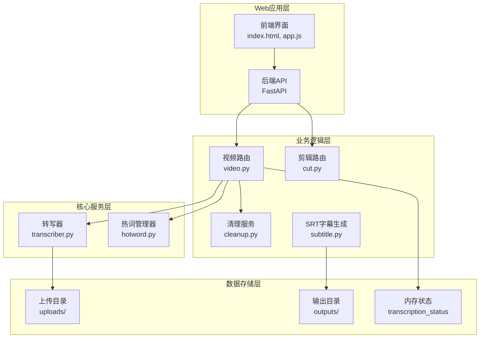
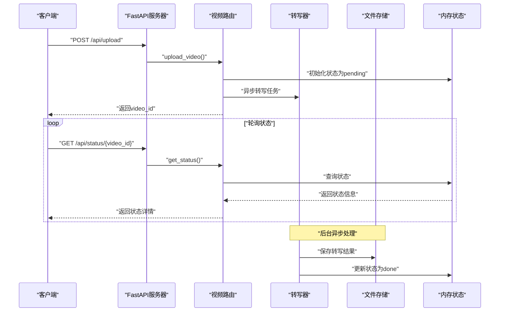
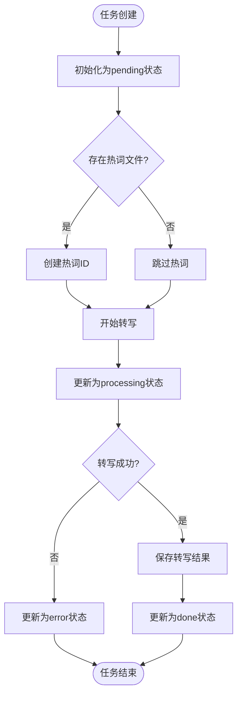
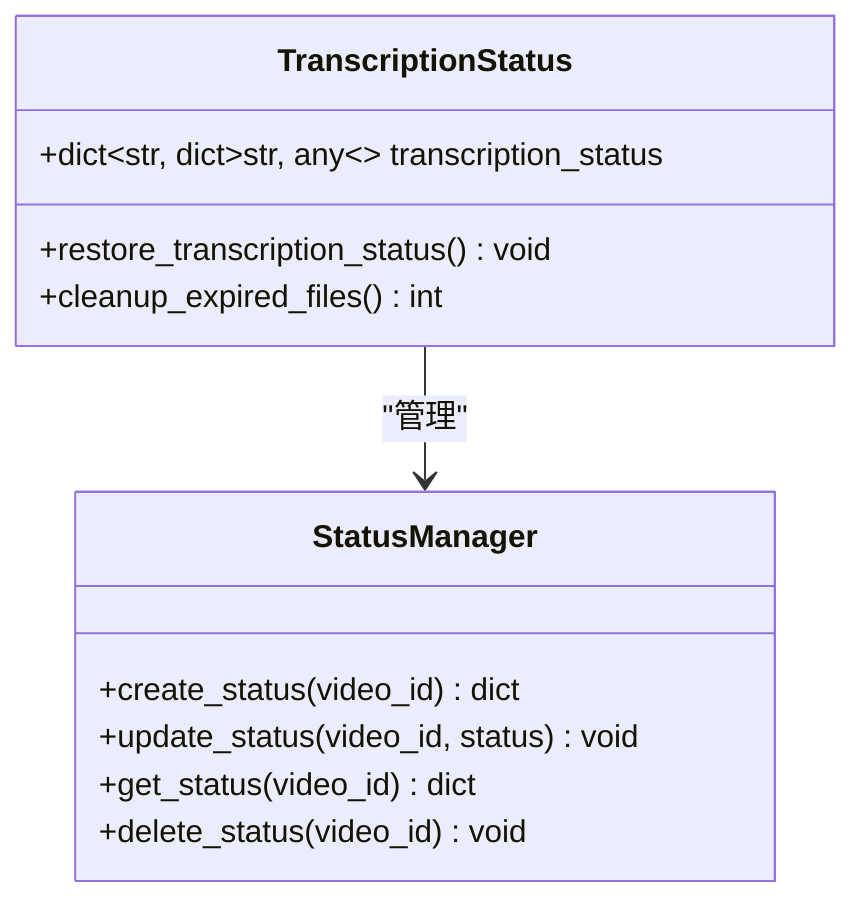
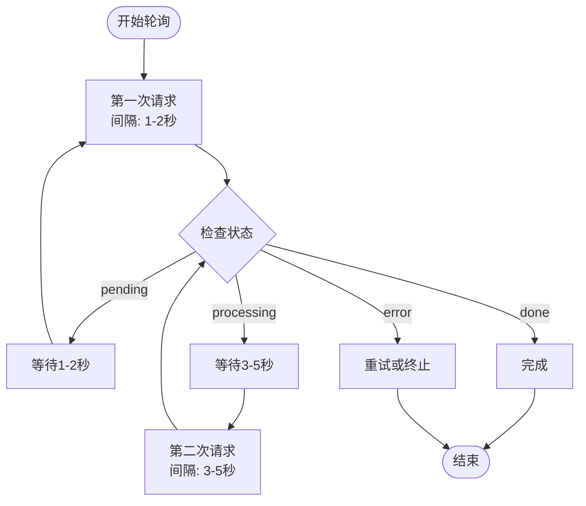
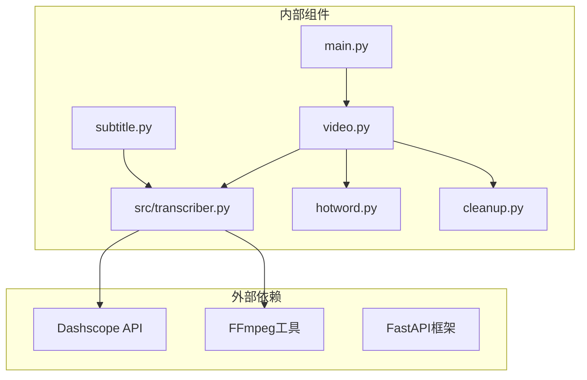

# 转写状态查询API

<cite>
**本文档引用的文件**
- [main.py](file://cut-video-web/backend/main.py)
- [video.py](file://cut-video-web/backend/router/video.py)
- [transcriber.py](file://src/transcriber.py)
- [hotword.py](file://src/hotword.py)
- [cleanup.py](file://cut-video-web/backend/service/cleanup.py)
- [subtitle.py](file://cut-video-web/backend/service/subtitle.py)
- [README.md](file://README.md)
</cite>

## 目录
1. [简介](#简介)
2. [项目结构](#项目结构)
3. [核心组件](#核心组件)
4. [架构概览](#架构概览)
5. [详细组件分析](#详细组件分析)
6. [依赖关系分析](#依赖关系分析)
7. [性能考虑](#性能考虑)
8. [故障排除指南](#故障排除指南)
9. [结论](#结论)

## 简介

转写状态查询API是ASR（自动语音识别）系统的核心接口，用于查询视频转写任务的实时状态。该API提供了完整的状态跟踪机制，包括四种状态枚举值：pending（等待中）、processing（处理中）、done（完成）、error（错误）。用户可以通过GET /api/status/{video_id}端点获取转写任务的当前状态，并根据状态进行相应的处理决策。

该系统采用内存状态存储与文件持久化相结合的方式，确保在服务重启后能够恢复已完成的任务状态。同时，系统还提供了定时清理机制，自动清理过期的文件和状态记录。

## 项目结构

项目采用前后端分离的架构设计，主要分为以下几部分：



**图表来源**
- [main.py:25-51](file://cut-video-web/backend/main.py#L25-L51)
- [video.py:24-32](file://cut-video-web/backend/router/video.py#L24-L32)

**章节来源**
- [main.py:19-84](file://cut-video-web/backend/main.py#L19-L84)
- [README.md:281-310](file://README.md#L281-L310)

## 核心组件

### 状态枚举定义

系统定义了完整的状态枚举体系，用于准确描述转写任务的不同阶段：

```mermaid
stateDiagram-v2
[*] --> Pending : "任务创建"
Pending --> Processing : "开始转写"
Processing --> Done : "转写成功"
Processing --> Error : "转写失败"
Done --> [*] : "任务结束"
Error --> [*] : "任务结束"
note right of Pending : "状态 : pending<br/>描述 : 任务已创建但尚未开始<br/>特征 : filename, filepath可用"
note right of Processing : "状态 : processing<br/>描述 : 正在进行转写处理<br/>特征 : 开始转写时更新"
note right of Done : "状态 : done<br/>描述 : 转写完成<br/>特征 : 生成result.json文件"
note right of Error : "状态 : error<br/>描述 : 转写过程中发生错误<br/>特征 : 错误消息记录"
```

**图表来源**
- [video.py:98-102](file://cut-video-web/backend/router/video.py#L98-L102)

### 状态数据结构

每个转写任务在内存中以字典形式存储，包含以下关键字段：

| 字段名 | 类型 | 描述 | 示例值 |
|--------|------|------|--------|
| status | StatusEnum | 当前任务状态 | "pending" |
| filename | str | 原始文件名 | "abc12345_video.mp4" |
| filepath | str | 文件完整路径 | "/app/uploads/abc12345_video.mp4" |
| task_id | str | 转写任务ID | "asr_task_001" |
| error | str | 错误信息 | "API调用失败" |

**章节来源**
- [video.py:111-117](file://cut-video-web/backend/router/video.py#L111-L117)
- [video.py:147-154](file://cut-video-web/backend/router/video.py#L147-L154)

## 架构概览

系统采用异步处理架构，确保高并发场景下的稳定性和性能：



**图表来源**
- [video.py:126-163](file://cut-video-web/backend/router/video.py#L126-L163)
- [video.py:236-249](file://cut-video-web/backend/router/video.py#L236-L249)

## 详细组件分析

### GET /api/status/{video_id} 端点

#### 端点定义

该端点用于查询指定video_id的转写任务状态，支持以下参数：

| 参数名 | 类型 | 必需 | 描述 |
|--------|------|------|------|
| video_id | str | 是 | 视频文件的唯一标识符 |

#### 请求示例

```bash
# 成功查询状态
curl -X GET "http://localhost:8000/api/status/abc12345" \
  -H "Content-Type: application/json"

# 查询不存在的任务
curl -X GET "http://localhost:8000/api/status/nonexistent" \
  -H "Content-Type: application/json"
```

#### 响应格式

系统返回标准化的JSON响应，包含以下字段：

| 字段名 | 类型 | 描述 | 示例 |
|--------|------|------|------|
| video_id | str | 任务ID | "abc12345" |
| status | str | 任务状态 | "processing" |
| filename | str | 原始文件名 | "video.mp4" |
| task_id | str | 转写任务ID | "task_001" |
| error | str | 错误信息 | "API调用失败" |

#### 正常状态响应

**pending状态响应**
```json
{
  "video_id": "abc12345",
  "status": "pending",
  "filename": "video.mp4",
  "task_id": null,
  "error": null
}
```

**processing状态响应**
```json
{
  "video_id": "abc12345",
  "status": "processing",
  "filename": "video.mp4",
  "task_id": "task_001",
  "error": null
}
```

**done状态响应**
```json
{
  "video_id": "abc12345",
  "status": "done",
  "filename": "video.mp4",
  "task_id": "task_001",
  "error": null
}
```

#### 错误状态响应

**404 Not Found - 任务不存在**
```json
{
  "detail": "视频不存在"
}
```

**400 Bad Request - 任务未完成**
```json
{
  "detail": "转写尚未完成，当前状态: processing"
}
```

**章节来源**
- [video.py:236-249](file://cut-video-web/backend/router/video.py#L236-L249)
- [video.py:252-277](file://cut-video-web/backend/router/video.py#L252-L277)

### 状态转换机制

#### 状态转换流程图



**图表来源**
- [video.py:166-234](file://cut-video-web/backend/router/video.py#L166-L234)

#### 状态转换条件

| 状态 | 转换条件 | 触发操作 | 异常处理 |
|------|----------|----------|----------|
| pending → processing | 开始转写任务 | 更新状态字典 | 无 |
| processing → done | 转写成功完成 | 保存result.json | 无 |
| processing → error | 转写过程中发生异常 | 记录错误信息 | 404错误处理 |
| done → 保持 | 任务完成 | 无 | 无 |

**章节来源**
- [video.py:166-234](file://cut-video-web/backend/router/video.py#L166-L234)

### 状态持久化机制

#### 内存状态管理

系统使用全局字典`transcription_status`作为内存状态存储：



**图表来源**
- [video.py:31-32](file://cut-video-web/backend/router/video.py#L31-L32)
- [video.py:38-96](file://cut-video-web/backend/router/video.py#L38-L96)

#### 文件持久化策略

系统采用文件系统作为持久化存储：

1. **完成状态持久化**：转写完成后将结果保存为`{video_id}_result.json`
2. **中断状态检测**：启动时扫描未完成的任务并标记为ERROR状态
3. **自动恢复机制**：服务重启后自动恢复已完成的任务状态

**章节来源**
- [video.py:210-226](file://cut-video-web/backend/router/video.py#L210-L226)
- [video.py:38-96](file://cut-video-web/backend/router/video.py#L38-L96)

### 客户端轮询策略

#### 推荐轮询策略



#### 轮询最佳实践

1. **指数退避策略**：从1秒开始，每次翻倍
2. **最大重试次数**：建议不超过20次
3. **超时控制**：单次请求超时时间不超过30秒
4. **错误处理**：网络错误时增加额外等待时间

**章节来源**
- [video.py:236-249](file://cut-video-web/backend/router/video.py#L236-L249)

## 依赖关系分析

### 组件依赖图



**图表来源**
- [main.py:23-24](file://cut-video-web/backend/main.py#L23-L24)
- [video.py:21-22](file://cut-video-web/backend/router/video.py#L21-L22)

### 外部依赖分析

| 依赖项 | 版本要求 | 用途 | 配置方式 |
|--------|----------|------|----------|
| Dashscope SDK | >= 1.0.0 | ASR API调用 | 环境变量DASHSCOPE_API_KEY |
| FastAPI | >= 0.95.0 | Web框架 | 项目依赖 |
| FFmpeg | >= 4.0 | 音频提取 | 系统安装 |
| Python | >= 3.8 | 运行环境 | 项目配置 |

**章节来源**
- [transcriber.py:107-121](file://src/transcriber.py#L107-L121)
- [README.md:16-30](file://README.md#L16-L30)

## 性能考虑

### 内存使用优化

系统采用内存存储策略，具有以下特点：

1. **轻量级存储**：每个任务仅存储必要的状态信息
2. **自动清理**：文件清理服务定期移除过期文件和状态
3. **内存限制**：适合中小规模并发场景

### 并发处理能力

- **异步转写**：使用asyncio避免阻塞主线程
- **并发限制**：可根据硬件资源调整并发数
- **资源监控**：定期检查内存使用情况

### 网络优化

- **API调用优化**：合理设置轮询间隔
- **连接池管理**：复用HTTP连接
- **超时控制**：防止长时间阻塞

## 故障排除指南

### 常见问题及解决方案

#### 状态查询失败

**问题**：GET /api/status/{video_id}返回404错误
**原因**：video_id不存在或任务已被清理
**解决方案**：
1. 验证video_id的有效性
2. 检查任务是否超时被清理
3. 重新发起转写任务

#### 转写任务卡住

**问题**：任务状态长期停留在pending或processing
**原因**：API密钥配置错误或网络问题
**解决方案**：
1. 检查DASHSCOPE_API_KEY环境变量
2. 验证网络连接稳定性
3. 查看服务器日志获取详细错误信息

#### 内存泄漏问题

**问题**：内存使用持续增长
**原因**：长时间运行且未清理过期任务
**解决方案**：
1. 检查定时清理服务是否正常运行
2. 调整清理间隔和保留时间
3. 监控内存使用情况

**章节来源**
- [video.py:236-249](file://cut-video-web/backend/router/video.py#L236-L249)
- [cleanup.py:76-96](file://cut-video-web/backend/service/cleanup.py#L76-L96)

### 调试技巧

1. **启用详细日志**：查看转写过程中的详细信息
2. **监控状态变化**：观察状态转换的时序
3. **检查文件完整性**：验证result.json文件内容
4. **测试API连通性**：确认Dashscope API可用性

## 结论

转写状态查询API提供了完整的任务状态跟踪机制，具有以下优势：

1. **简单易用**：RESTful API设计，易于集成
2. **状态完整**：覆盖所有转写阶段的状态
3. **持久化可靠**：结合内存和文件存储确保数据安全
4. **扩展性强**：支持热词、多模型等高级功能

系统适用于视频转写、音频处理等需要状态跟踪的应用场景。通过合理的轮询策略和错误处理机制，可以确保稳定的用户体验。

建议在生产环境中：
- 配置合适的轮询间隔和超时时间
- 实施监控和告警机制
- 定期备份重要数据
- 根据负载调整资源配置