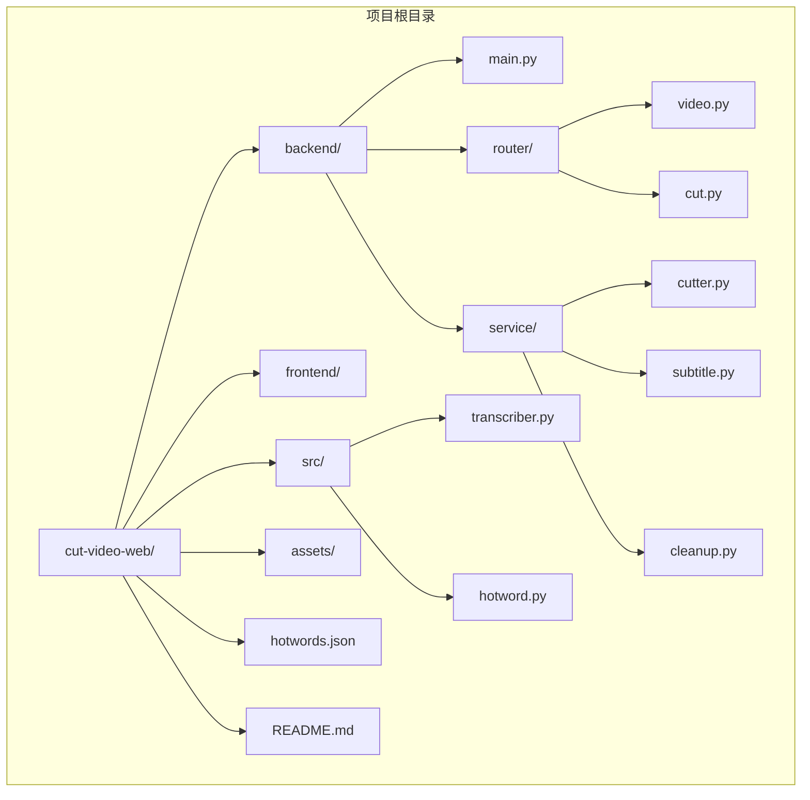
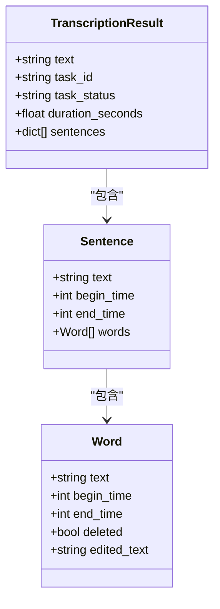
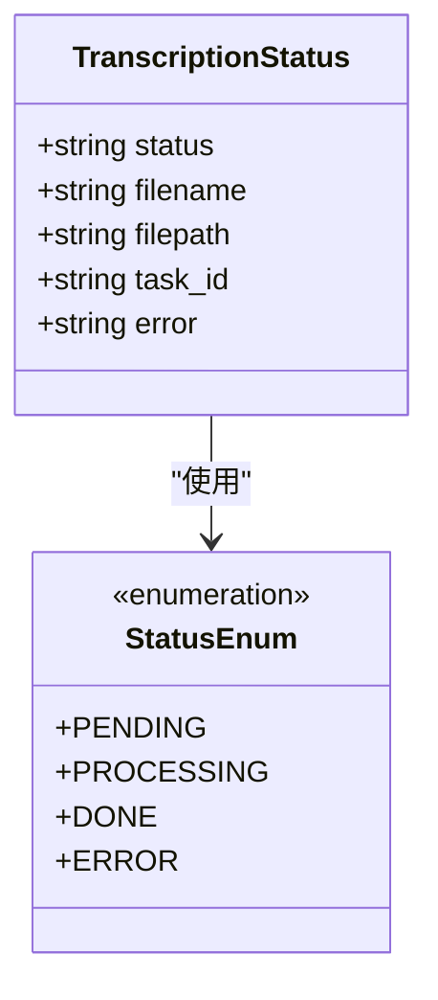
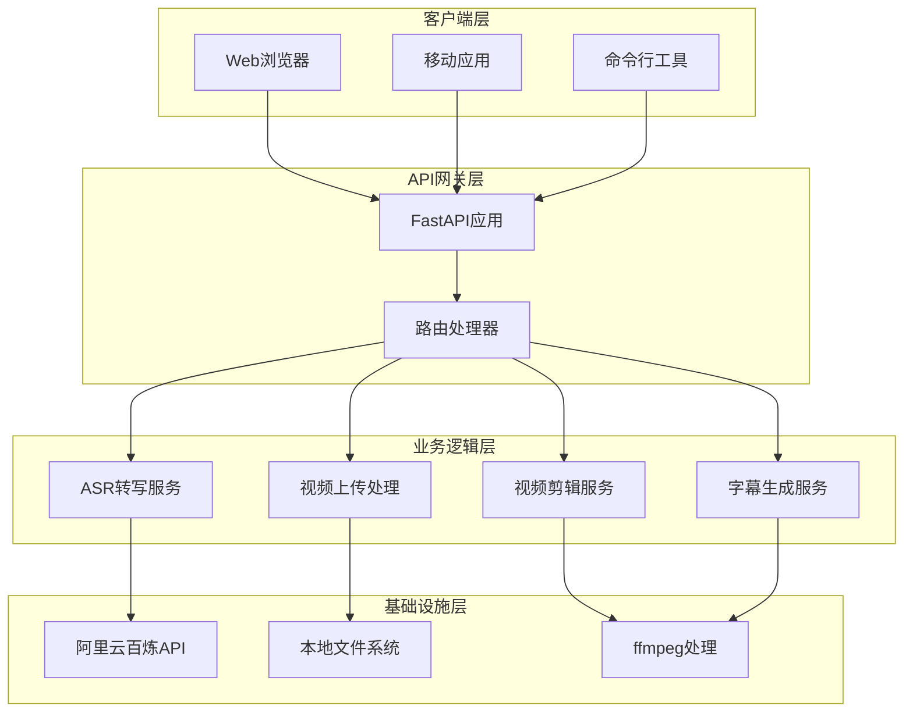
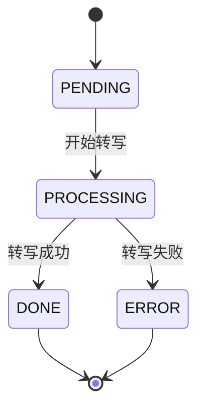
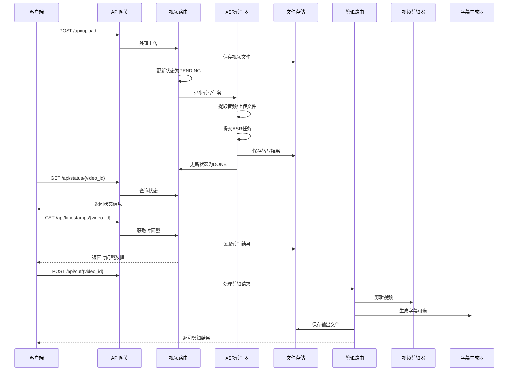
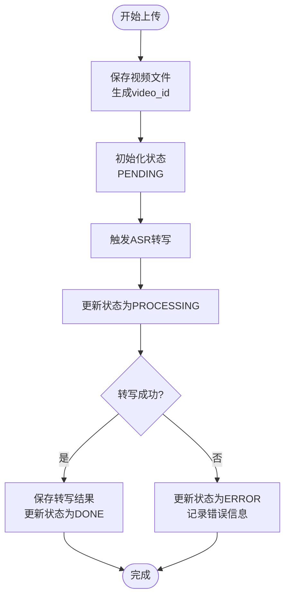

# 数据模型和API参考

<cite>
**本文档引用的文件**
- [main.py](file://cut-video-web/backend/main.py)
- [video.py](file://cut-video-web/backend/router/video.py)
- [cut.py](file://cut-video-web/backend/router/cut.py)
- [transcriber.py](file://src/transcriber.py)
- [hotword.py](file://src/hotword.py)
- [cutter.py](file://cut-video-web/backend/service/cutter.py)
- [subtitle.py](file://cut-video-web/backend/service/subtitle.py)
- [cleanup.py](file://cut-video-web/backend/service/cleanup.py)
- [hotwords.json](file://hotwords.json)
- [12bcc08a_result.json](file://cut-video-web/backend/uploads/12bcc08a_result.json)
- [sub_12bcc08a_0c35f860.srt](file://cut-video-web/backend/outputs/sub_12bcc08a_0c35f860.srt)
- [README.md](file://README.md)
</cite>

## 目录
1. [简介](#简介)
2. [项目结构](#项目结构)
3. [核心数据模型](#核心数据模型)
4. [API架构概览](#api架构概览)
5. [详细API规范](#详细api规范)
6. [数据模型详细说明](#数据模型详细说明)
7. [数据流转和状态变更](#数据流转和状态变更)
8. [性能考虑](#性能考虑)
9. [故障排除指南](#故障排除指南)
10. [结论](#结论)

## 简介

这是一个基于阿里云百炼 FunASR API 的视频剪辑工具，支持词级时间戳的精确视频编辑。该系统提供了完整的Web界面和REST API，允许用户上传视频文件，进行自动语音识别（ASR），然后通过词级时间戳进行精确的视频剪辑操作。

主要功能包括：
- 词级时间戳的语音识别
- 基于删除词的精确视频剪辑
- SRT字幕生成和烧录
- 热词增强识别
- 自动文件清理机制

## 项目结构



**图表来源**
- [main.py:1-84](file://cut-video-web/backend/main.py#L1-L84)
- [video.py:1-296](file://cut-video-web/backend/router/video.py#L1-L296)
- [cut.py:1-232](file://cut-video-web/backend/router/cut.py#L1-L232)

**章节来源**
- [main.py:1-84](file://cut-video-web/backend/main.py#L1-L84)
- [README.md:190-310](file://README.md#L190-L310)

## 核心数据模型

### TranscriptionResult 数据模型

TranscriptionResult 是ASR转写的核心数据结构，包含了完整的转写结果信息。



**图表来源**
- [transcriber.py:34-42](file://src/transcriber.py#L34-L42)
- [transcriber.py:187-194](file://src/transcriber.py#L187-L194)

### 状态枚举模型

系统使用状态枚举来跟踪转写任务的生命周期。



**图表来源**
- [video.py:98-102](file://cut-video-web/backend/router/video.py#L98-L102)
- [video.py:32](file://cut-video-web/backend/router/video.py#L32)

**章节来源**
- [transcriber.py:34-42](file://src/transcriber.py#L34-L42)
- [video.py:98-102](file://cut-video-web/backend/router/video.py#L98-L102)

## API架构概览



**图表来源**
- [main.py:25-51](file://cut-video-web/backend/main.py#L25-L51)
- [video.py:24-24](file://cut-video-web/backend/router/video.py#L24-L24)

## 详细API规范

### 健康检查API

**端点**: `GET /api/health`

**功能**: 检查服务健康状态

**响应**:
```json
{
  "status": "ok"
}
```

**状态码**:
- 200: 服务正常

**章节来源**
- [main.py:54-57](file://cut-video-web/backend/main.py#L54-L57)

### 视频上传API

**端点**: `POST /api/upload`

**功能**: 上传视频文件并触发ASR转写

**请求参数**:
- Content-Type: multipart/form-data
- file: 视频文件（必需）

**请求示例**:
```bash
curl -X POST "http://localhost:8000/api/upload" \
  -H "Content-Type: multipart/form-data" \
  -F "file=@video.mp4"
```

**响应模型**: UploadResponse

**响应字段**:
- video_id: 视频唯一标识符
- filename: 上传的文件名
- status: 当前状态（PENDING）

**状态码**:
- 200: 成功上传
- 400: 文件上传失败
- 500: 服务器内部错误

**章节来源**
- [video.py:126-163](file://cut-video-web/backend/router/video.py#L126-L163)

### 转写状态查询API

**端点**: `GET /api/status/{video_id}`

**功能**: 获取指定视频的转写状态

**路径参数**:
- video_id: 视频唯一标识符

**响应模型**: StatusResponse

**响应字段**:
- video_id: 视频唯一标识符
- status: 当前状态（PENDING, PROCESSING, DONE, ERROR）
- filename: 原始文件名
- task_id: ASR任务ID
- error: 错误信息（如有）

**状态码**:
- 200: 成功
- 404: 视频不存在

**章节来源**
- [video.py:236-249](file://cut-video-web/backend/router/video.py#L236-L249)

### 词级时间戳数据API

**端点**: `GET /api/timestamps/{video_id}`

**功能**: 获取词级时间戳数据

**路径参数**:
- video_id: 视频唯一标识符

**响应模型**: TimestampsResponse

**响应字段**:
- video_id: 视频唯一标识符
- filename: 原始文件名
- duration: 视频总时长（秒）
- sentences: 句子列表（包含词级时间戳）

**状态码**:
- 200: 成功
- 400: 转写尚未完成
- 404: 视频或结果不存在

**章节来源**
- [video.py:252-277](file://cut-video-web/backend/router/video.py#L252-L277)

### 视频文件下载API

**端点**: `GET /api/video/{video_id}`

**功能**: 下载原始视频文件

**路径参数**:
- video_id: 视频唯一标识符

**响应**: 视频文件流

**状态码**:
- 200: 成功
- 404: 视频不存在

**章节来源**
- [video.py:280-295](file://cut-video-web/backend/router/video.py#L280-L295)

### 视频剪辑API

**端点**: `POST /api/cut/{video_id}`

**功能**: 根据删除的词剪辑视频

**路径参数**:
- video_id: 视频唯一标识符

**请求模型**: CutRequest

**请求字段**:
- sentences: 更新了deleted状态的句子列表
- burn_subtitles: 是否烧录字幕（可选，默认false）

**响应模型**: CutResponse

**响应字段**:
- output_id: 输出视频ID
- output_filename: 输出文件名
- subtitle_filename: 字幕文件名（如果烧录了字幕）
- message: 操作结果消息

**状态码**:
- 200: 成功
- 400: 没有保留内容或输入无效
- 500: 剪辑失败

**章节来源**
- [cut.py:51-110](file://cut-video-web/backend/router/cut.py#L51-L110)

### 剪辑后视频下载API

**端点**: `GET /api/download/{filename}`

**功能**: 下载剪辑后的视频文件

**路径参数**:
- filename: 输出文件名

**响应**: 视频文件流

**状态码**:
- 200: 成功
- 404: 文件不存在

**章节来源**
- [cut.py:112-124](file://cut-video-web/backend/router/cut.py#L112-L124)

### 输出文件列表API

**端点**: `GET /api/outputs`

**功能**: 列出所有输出文件

**响应**:
```json
{
  "outputs": [
    {
      "filename": "cut_12bcc08a_abc123.mp4",
      "size": 10485760,
      "created": 1700000000
    }
  ]
}
```

**状态码**:
- 200: 成功

**章节来源**
- [cut.py:221-231](file://cut-video-web/backend/router/cut.py#L221-L231)

## 数据模型详细说明

### TranscriptionResult 模型详解

TranscriptionResult 是ASR转写的核心数据结构，包含以下属性：

**属性定义**:
- `text`: 完整的转写文本
- `task_id`: ASR任务的唯一标识符
- `task_status`: 任务执行状态
- `duration_seconds`: 音频总时长（秒）
- `sentences`: 包含时间戳的句子列表

**复杂度分析**:
- 时间复杂度: O(n)，其中n是句子数量
- 空间复杂度: O(n)，存储所有句子和词的时间戳

**验证规则**:
- 所有数值字段必须为非负数
- 时间戳必须按顺序排列
- 句子列表不能为空

**章节来源**
- [transcriber.py:34-42](file://src/transcriber.py#L34-L42)
- [transcriber.py:288-294](file://src/transcriber.py#L288-L294)

### Sentence 模型详解

Sentence 表示单个句子及其时间信息：

**属性定义**:
- `text`: 句子的完整文本
- `begin_time`: 句子开始时间（毫秒）
- `end_time`: 句子结束时间（毫秒）
- `words`: 包含词级时间戳的词列表

**验证规则**:
- `begin_time` ≤ `end_time`
- 时间戳必须在有效范围内
- 文本不能为空

**章节来源**
- [transcriber.py:181-194](file://src/transcriber.py#L181-L194)
- [12bcc08a_result.json:5-126](file://cut-video-web/backend/uploads/12bcc08a_result.json#L5-L126)

### Word 模型详解

Word 表示单个词及其时间信息：

**属性定义**:
- `text`: 词的文本内容
- `begin_time`: 词开始时间（毫秒）
- `end_time`: 词结束时间（毫秒）
- `deleted`: 是否被标记为删除（用于剪辑）
- `edited_text`: 编辑后的文本（可选）

**验证规则**:
- `begin_time` ≤ `end_time`
- 文本不能为空
- 删除标记为布尔值

**章节来源**
- [transcriber.py:189-193](file://src/transcriber.py#L189-L193)
- [12bcc08a_result.json:10-125](file://cut-video-web/backend/uploads/12bcc08a_result.json#L10-L125)

### 状态管理模型

系统使用内存中的状态字典来跟踪转写任务：



**图表来源**
- [video.py:98-102](file://cut-video-web/backend/router/video.py#L98-L102)

**章节来源**
- [video.py:32](file://cut-video-web/backend/router/video.py#L32)
- [video.py:176-233](file://cut-video-web/backend/router/video.py#L176-L233)

## 数据流转和状态变更

### 完整数据流程图



**图表来源**
- [video.py:126-163](file://cut-video-web/backend/router/video.py#L126-L163)
- [video.py:166-233](file://cut-video-web/backend/router/video.py#L166-L233)
- [cut.py:51-110](file://cut-video-web/backend/router/cut.py#L51-L110)

### 状态变更流程



**图表来源**
- [video.py:148-154](file://cut-video-web/backend/router/video.py#L148-L154)
- [video.py:176-233](file://cut-video-web/backend/router/video.py#L176-L233)

**章节来源**
- [video.py:126-233](file://cut-video-web/backend/router/video.py#L126-L233)

## 性能考虑

### 内存优化策略

1. **状态管理**: 使用内存字典存储转写状态，避免数据库依赖
2. **文件清理**: 定时清理过期文件，防止磁盘空间耗尽
3. **异步处理**: ASR转写使用后台任务，不阻塞主线程

### 存储优化

1. **文件命名**: 使用UUID前缀确保文件名唯一性
2. **目录结构**: 分离上传文件和输出文件
3. **清理策略**: 24小时自动清理过期文件

### 处理效率

1. **批量操作**: 合并相邻的时间段，减少剪辑操作次数
2. **缓存机制**: 热词ID缓存，避免重复创建
3. **并发处理**: 支持多个视频同时转写

## 故障排除指南

### 常见错误和解决方案

**环境变量问题**:
- 错误: `DASHSCOPE_API_KEY` 未设置
- 解决: 设置环境变量或在`.env`文件中配置

**文件上传失败**:
- 错误: 400 Bad Request
- 解决: 检查文件大小和格式限制

**转写任务超时**:
- 错误: 任务长时间处于PROCESSING状态
- 解决: 检查网络连接和API配额

**剪辑失败**:
- 错误: 500 Internal Server Error
- 解决: 检查ffmpeg安装和权限

### 调试工具推荐

1. **API测试**: 使用curl或Postman测试API端点
2. **日志查看**: 查看服务器控制台输出
3. **文件监控**: 检查`uploads/`和`outputs/`目录
4. **状态查询**: 使用`/api/status/{video_id}`端点

**章节来源**
- [video.py:180-183](file://cut-video-web/backend/router/video.py#L180-L183)
- [cut.py:108-109](file://cut-video-web/backend/router/cut.py#L108-L109)

## 结论

本项目提供了一个完整的视频剪辑解决方案，结合了先进的ASR技术和精确的时间戳定位能力。通过词级时间戳，用户可以实现精确的视频编辑，包括删除特定词汇、生成字幕以及将字幕烧录到视频中。

系统的主要优势包括：
- **精确控制**: 词级时间戳提供最高精度的编辑能力
- **易用性**: 简洁的API设计和直观的Web界面
- **可靠性**: 完善的状态管理和错误处理机制
- **可扩展性**: 模块化的架构设计便于功能扩展

未来可以考虑的功能改进：
- 添加更多视频格式支持
- 实现批量处理功能
- 增加更多剪辑效果选项
- 提供更详细的统计和分析功能