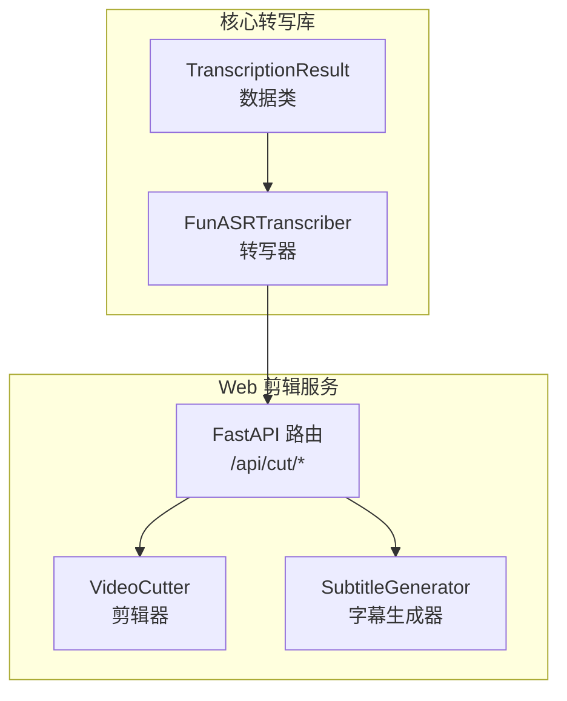
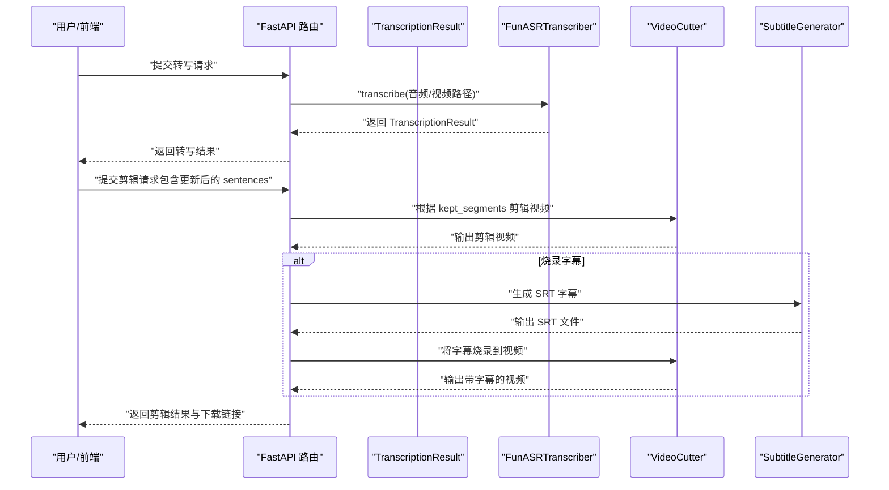
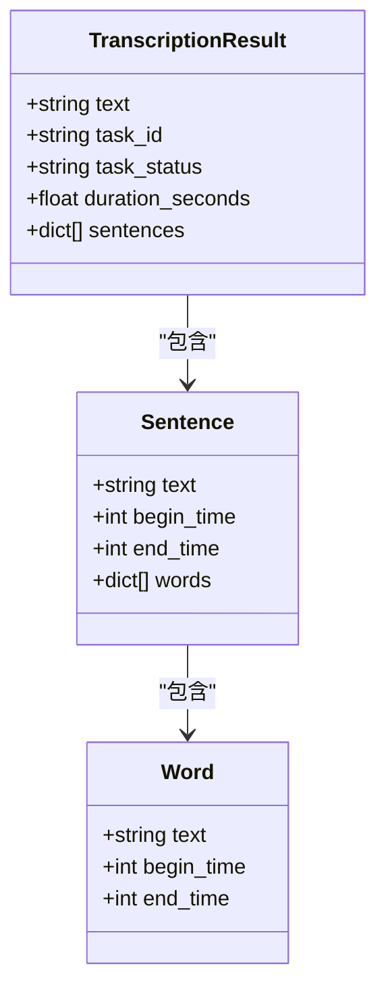
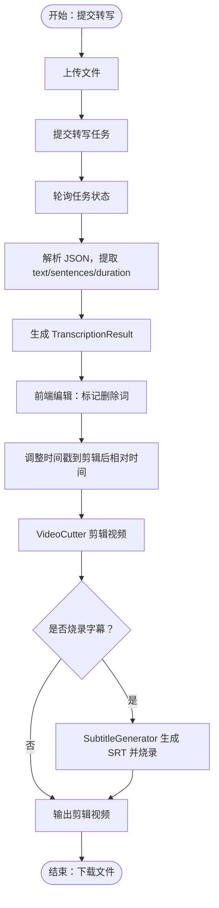
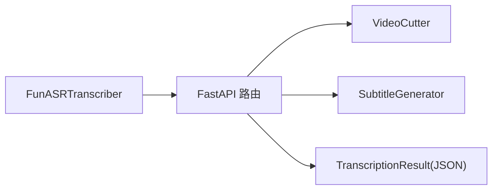

# 核心数据模型

<cite>
**本文档引用的文件**
- [src/transcriber.py](file://src/transcriber.py)
- [cut-video-web/backend/service/subtitle.py](file://cut-video-web/backend/service/subtitle.py)
- [cut-video-web/backend/router/cut.py](file://cut-video-web/backend/router/cut.py)
- [cut-video-web/backend/service/cutter.py](file://cut-video-web/backend/service/cutter.py)
- [cut-video-web/backend/uploads/12bcc08a_result.json](file://cut-video-web/backend/uploads/12bcc08a_result.json)
- [cut-video-web/backend/uploads/7813fb3b_result.json](file://cut-video-web/backend/uploads/7813fb3b_result.json)
- [cut-video-web/backend/uploads/86f2ee3d_result.json](file://cut-video-web/backend/uploads/86f2ee3d_result.json)
- [README.md](file://README.md)
</cite>

## 目录
1. [简介](#简介)
2. [项目结构](#项目结构)
3. [核心组件](#核心组件)
4. [架构总览](#架构总览)
5. [详细组件分析](#详细组件分析)
6. [依赖分析](#依赖分析)
7. [性能考量](#性能考量)
8. [故障排查指南](#故障排查指南)
9. [结论](#结论)
10. [附录](#附录)

## 简介
本文件聚焦于项目中的核心数据模型，系统性阐述 TranscriptionResult、Sentence、Word 等数据结构的设计理念、字段语义、验证规则、使用场景以及它们在 ASR 转写流程中的生命周期与相互关系。同时给出序列化/反序列化示例、验证与错误处理策略，并通过流程图与类图帮助读者建立完整的知识框架。

## 项目结构
该项目由两部分组成：
- 核心转写库：位于 src/transcriber.py，负责调用阿里云百炼 FunASR API，解析转写结果，生成 TranscriptionResult。
- Web 剪辑服务：位于 cut-video-web/backend，负责接收前端交互，基于词级时间戳进行视频剪辑与字幕生成。

图表来源
- [src/transcriber.py:34-42](file://src/transcriber.py#L34-L42)
- [src/transcriber.py:95-316](file://src/transcriber.py#L95-L316)
- [cut-video-web/backend/service/cutter.py:14-253](file://cut-video-web/backend/service/cutter.py#L14-L253)
- [cut-video-web/backend/service/subtitle.py:11-219](file://cut-video-web/backend/service/subtitle.py#L11-L219)
- [cut-video-web/backend/router/cut.py:51-110](file://cut-video-web/backend/router/cut.py#L51-L110)

章节来源
- [src/transcriber.py:1-316](file://src/transcriber.py#L1-L316)
- [cut-video-web/backend/service/cutter.py:1-253](file://cut-video-web/backend/service/cutter.py#L1-L253)
- [cut-video-web/backend/service/subtitle.py:1-219](file://cut-video-web/backend/service/subtitle.py#L1-L219)
- [cut-video-web/backend/router/cut.py:1-232](file://cut-video-web/backend/router/cut.py#L1-L232)

## 核心组件
本节从数据模型视角梳理关键结构及其职责边界。

- TranscriptionResult
  - 作用：承载一次 ASR 转写任务的最终结果，包含全文本、任务元信息、音频时长以及句子级与词级时间戳。
  - 字段与类型：text: str、task_id: str、task_status: str、duration_seconds: float | None、sentences: List[dict] | None。
  - 使用场景：作为转写流程的统一输出载体，供后续剪辑与字幕生成消费。

- Sentence（逻辑概念）
  - 作用：表示一个带时间戳的完整句子，通常由 ASR 返回，内部包含若干 Word。
  - 字段与类型：text: str、begin_time: int、end_time: int、words: List[dict]。
  - 使用场景：作为剪辑与字幕生成的基础单元，支持按句粒度进行可视化编辑与时间戳对齐。

- Word（逻辑概念）
  - 作用：表示句子中的最小时间单元，具备词级 begin_time/end_time。
  - 字段与类型：text: str、begin_time: int、end_time: int。
  - 使用场景：用于精确剪辑（删除单个词）、字幕按标点分割、时间戳映射与相对时间计算。

章节来源
- [src/transcriber.py:34-42](file://src/transcriber.py#L34-L42)
- [src/transcriber.py:175-201](file://src/transcriber.py#L175-L201)
- [cut-video-web/backend/uploads/12bcc08a_result.json:5-371](file://cut-video-web/backend/uploads/12bcc08a_result.json#L5-L371)
- [cut-video-web/backend/uploads/7813fb3b_result.json:5-371](file://cut-video-web/backend/uploads/7813fb3b_result.json#L5-L371)
- [cut-video-web/backend/uploads/86f2ee3d_result.json:5-371](file://cut-video-web/backend/uploads/86f2ee3d_result.json#L5-L371)

## 架构总览
下图展示了从 ASR 转写到剪辑与字幕生成的数据流，强调 TranscriptionResult 与 Sentence/Word 的关系及生命周期。

图表来源
- [src/transcriber.py:203-294](file://src/transcriber.py#L203-L294)
- [cut-video-web/backend/router/cut.py:51-110](file://cut-video-web/backend/router/cut.py#L51-L110)
- [cut-video-web/backend/service/cutter.py:21-66](file://cut-video-web/backend/service/cutter.py#L21-L66)
- [cut-video-web/backend/service/subtitle.py:18-44](file://cut-video-web/backend/service/subtitle.py#L18-L44)

## 详细组件分析

### TranscriptionResult 数据模型
- 设计理念
  - 采用轻量数据类承载转写结果，便于序列化与跨模块传递。
  - 通过可选字段表达“可选能力”（如 duration_seconds、sentences），避免强制依赖。
- 字段详解
  - text: 转写得到的完整文本，用于展示与后续处理。
  - task_id: 任务唯一标识，便于轮询与状态追踪。
  - task_status: 任务状态字符串，用于判断成功/失败。
  - duration_seconds: 音频时长（秒），来源于原始时长转换。
  - sentences: 句子级与词级时间戳集合，是剪辑与字幕生成的核心输入。
- 验证规则
  - 必填校验：text、task_id、task_status 应非空。
  - 类型校验：duration_seconds 为数值类型；sentences 为列表且元素为字典。
  - 一致性校验：sentence.begin_time <= sentence.end_time；word.begin_time <= word.end_time。
- 使用场景
  - 作为 API 响应体的一部分，供前端渲染与交互。
  - 作为剪辑服务的输入，驱动 VideoCutter 与 SubtitleGenerator。
- 生命周期
  - 创建：FunASRTranscriber 在获取转写 URL 并解析 JSON 后构造。
  - 消费：Web 路由接收后，用于剪辑与字幕生成。
  - 销毁：完成下载后由清理服务回收。

章节来源
- [src/transcriber.py:34-42](file://src/transcriber.py#L34-L42)
- [src/transcriber.py:157-201](file://src/transcriber.py#L157-L201)
- [src/transcriber.py:288-294](file://src/transcriber.py#L288-L294)

### Sentence 与 Word 数据模型
- 设计理念
  - Sentence 作为“句级容器”，聚合多个 Word，形成可编辑的语义单元。
  - Word 作为“词级原子”，提供精确的时间戳，支撑剪辑与字幕对齐。
- 字段详解
  - Sentence
    - text: 句子文本，用于字幕生成与可视化。
    - begin_time/end_time: 句子起止时间（毫秒）。
    - words: 词级时间戳数组，每个元素为 Word。
  - Word
    - text: 词文本。
    - begin_time/end_time: 词起止时间（毫秒）。
- 验证规则
  - 时间戳单调性：sentence.begin_time <= sentence.end_time；word.begin_time <= word.end_time。
  - 顺序一致性：words 按 begin_time 递增排列。
  - 文本一致性：words 的拼接应等于 sentence.text（考虑标点与空白）。
- 使用场景
  - 剪辑：收集未删除词的 begin_time/end_time 组成 kept_segments。
  - 字幕：按标点将 sentence 分割为多条字幕，仅包含未删除词。
- 生命周期
  - 创建：ASR 返回 JSON 后解析为 sentences。
  - 编辑：前端交互更新 deleted 状态，后端据此调整时间戳。
  - 消费：VideoCutter 与 SubtitleGenerator 读取 kept_segments 与未删除词。

章节来源
- [src/transcriber.py:175-201](file://src/transcriber.py#L175-L201)
- [cut-video-web/backend/uploads/12bcc08a_result.json:5-371](file://cut-video-web/backend/uploads/12bcc08a_result.json#L5-L371)
- [cut-video-web/backend/uploads/7813fb3b_result.json:5-371](file://cut-video-web/backend/uploads/7813fb3b_result.json#L5-L371)
- [cut-video-web/backend/uploads/86f2ee3d_result.json:5-371](file://cut-video-web/backend/uploads/86f2ee3d_result.json#L5-L371)

### 数据模型关系与继承层次
- 关系图
  - TranscriptionResult 持有 sentences 列表，每个元素为 Sentence（字典结构）。
  - Sentence 包含 words 列表，每个元素为 Word（字典结构）。
  - 该结构为典型的“树形嵌套”：TranscriptionResult -> Sentence -> Word。

图表来源
- [src/transcriber.py:34-42](file://src/transcriber.py#L34-L42)
- [src/transcriber.py:175-201](file://src/transcriber.py#L175-L201)

### 序列化与反序列化示例
- 序列化（Python -> JSON）
  - 将 TranscriptionResult 实例转换为字典，再通过标准 JSON 序列化保存为文件或发送至 Web 服务。
  - 示例路径：[序列化示例:288-294](file://src/transcriber.py#L288-L294)
- 反序列化（JSON -> Python）
  - 从 ASR 返回的 JSON 中提取 transcripts/sentences/words，构建 sentences 列表。
  - 示例路径：[反序列化示例:175-201](file://src/transcriber.py#L175-L201)
- Web 服务中的序列化
  - 路由层将请求体（包含更新后的 sentences）作为 JSON 接收，进行剪辑与字幕生成。
  - 示例路径：[请求体接收:31-43](file://cut-video-web/backend/router/cut.py#L31-L43)

章节来源
- [src/transcriber.py:175-201](file://src/transcriber.py#L175-L201)
- [src/transcriber.py:288-294](file://src/transcriber.py#L288-L294)
- [cut-video-web/backend/router/cut.py:31-43](file://cut-video-web/backend/router/cut.py#L31-L43)

### 数据验证机制与错误处理策略
- 转写阶段
  - 任务状态校验：确保 task_status 为成功状态，否则抛出异常。
  - 结果完整性校验：确保 results 数组非空且包含 transcription_url。
  - 示例路径：[任务状态与结果校验:267-285](file://src/transcriber.py#L267-L285)
- 剪辑阶段
  - 保留段校验：若所有词均被删除，抛出错误提示。
  - 时间戳映射：将原始时间映射到剪辑后视频的相对时间，保证字幕与视频同步。
  - 示例路径：[保留段与映射:78-110](file://cut-video-web/backend/router/cut.py#L78-L110)
- 字幕生成阶段
  - 标点分割：依据中文标点将句子拆分为多条字幕。
  - 过滤删除词：仅保留未删除词生成字幕文本。
  - 示例路径：[字幕生成:18-99](file://cut-video-web/backend/service/subtitle.py#L18-L99)

章节来源
- [src/transcriber.py:267-285](file://src/transcriber.py#L267-L285)
- [cut-video-web/backend/router/cut.py:78-110](file://cut-video-web/backend/router/cut.py#L78-L110)
- [cut-video-web/backend/service/subtitle.py:18-99](file://cut-video-web/backend/service/subtitle.py#L18-L99)

### 实际代码示例：创建、操作与验证
- 创建 TranscriptionResult
  - 步骤：调用 FunASRTranscriber.transcribe，解析返回的 transcription_url，组装 text、sentences、duration。
  - 示例路径：[创建与组装:203-294](file://src/transcriber.py#L203-L294)
- 操作 Sentence/Word
  - 删除词：在前端标记 deleted=True，后端据此收集 kept_segments。
  - 调整时间戳：将原始时间映射到剪辑后视频的相对时间。
  - 示例路径：[删除与映射:78-110](file://cut-video-web/backend/router/cut.py#L78-L110)
- 验证与错误处理
  - 任务失败：捕获异常并返回错误信息。
  - 所有词被删除：提示用户至少保留一个词。
  - 示例路径：[错误处理:83-84](file://cut-video-web/backend/router/cut.py#L83-L84)

章节来源
- [src/transcriber.py:203-294](file://src/transcriber.py#L203-L294)
- [cut-video-web/backend/router/cut.py:78-110](file://cut-video-web/backend/router/cut.py#L78-L110)

### 数据模型在 ASR 转写流程中的作用与生命周期
- 转写阶段
  - 输入：音频/视频文件。
  - 处理：FunASRTranscriber 上传文件、提交任务、轮询结果、解析 JSON。
  - 输出：TranscriptionResult（包含 text、task_id、task_status、duration_seconds、sentences）。
- 剪辑阶段
  - 输入：TranscriptionResult（或前端更新后的 sentences）。
  - 处理：收集 kept_segments，调用 VideoCutter 剪辑视频。
  - 输出：剪辑后的视频文件。
- 字幕阶段
  - 输入：TranscriptionResult（或前端更新后的 sentences）。
  - 处理：按标点分割句子，过滤删除词，生成 SRT。
  - 输出：SRT 字幕文件或带字幕的视频文件。

图表来源
- [src/transcriber.py:203-294](file://src/transcriber.py#L203-L294)
- [cut-video-web/backend/router/cut.py:78-110](file://cut-video-web/backend/router/cut.py#L78-L110)
- [cut-video-web/backend/service/subtitle.py:18-44](file://cut-video-web/backend/service/subtitle.py#L18-L44)

## 依赖分析
- 模块耦合
  - src/transcriber.py 与 Web 路由层通过 JSON 数据交换，保持低耦合。
  - Web 服务内部通过 Cutter 与 Subtitle 两个服务协作，职责清晰。
- 外部依赖
  - 阿里云百炼 DashScope SDK 用于 ASR 转写。
  - ffmpeg/ffprobe 用于音频提取、视频剪辑与字幕烧录。
- 潜在循环依赖
  - 当前结构无循环依赖，模块间通过数据类与 JSON 传递信息。

图表来源
- [src/transcriber.py:203-294](file://src/transcriber.py#L203-L294)
- [cut-video-web/backend/router/cut.py:51-110](file://cut-video-web/backend/router/cut.py#L51-L110)
- [cut-video-web/backend/service/cutter.py:14-66](file://cut-video-web/backend/service/cutter.py#L14-L66)
- [cut-video-web/backend/service/subtitle.py:11-44](file://cut-video-web/backend/service/subtitle.py#L11-L44)

章节来源
- [src/transcriber.py:1-316](file://src/transcriber.py#L1-L316)
- [cut-video-web/backend/router/cut.py:1-232](file://cut-video-web/backend/router/cut.py#L1-L232)
- [cut-video-web/backend/service/cutter.py:1-253](file://cut-video-web/backend/service/cutter.py#L1-L253)
- [cut-video-web/backend/service/subtitle.py:1-219](file://cut-video-web/backend/service/subtitle.py#L1-L219)

## 性能考量
- 时间复杂度
  - 字幕按标点分割：O(n)，其中 n 为词数。
  - 时间戳映射：O(k)，其中 k 为保留段数量。
  - 视频剪辑：O(m)，其中 m 为保留段数量（提取与合并）。
- 空间复杂度
  - sentences 与 words 列表占用 O(n) 空间。
- 优化建议
  - 合并相邻保留段，减少片段数量，提升合并效率。
  - 使用批量处理与并发（如多进程提取片段）加速剪辑。
  - 缓存热词 ID 与中间结果，降低重复请求成本。

## 故障排查指南
- 常见问题
  - 任务状态非成功：检查 API Key、网络与服务可用性。
  - 所有词被删除：提示用户至少保留一个词。
  - ffmpeg/ffprobe 未安装：安装相应工具并确保 PATH 可用。
- 定位方法
  - 查看转写器日志与异常堆栈。
  - 校验 JSON 结构与字段完整性。
  - 使用 ffprobe 验证视频时长与帧率。
- 相关实现
  - 异常抛出与错误信息：[异常处理:88-92](file://src/transcriber.py#L88-L92)
  - 任务状态校验：[状态检查:271-275](file://src/transcriber.py#L271-L275)
  - 保留段校验：[保留段检查:83-84](file://cut-video-web/backend/router/cut.py#L83-L84)

章节来源
- [src/transcriber.py:88-92](file://src/transcriber.py#L88-L92)
- [src/transcriber.py:271-275](file://src/transcriber.py#L271-L275)
- [cut-video-web/backend/router/cut.py:83-84](file://cut-video-web/backend/router/cut.py#L83-L84)

## 结论
TranscriptionResult、Sentence、Word 三者构成清晰的“句-词”层级数据模型，既满足 ASR 转写的需求，又为视频剪辑与字幕生成提供了高精度的时间戳支撑。通过严格的字段定义、验证规则与错误处理策略，系统在易用性与可靠性之间取得平衡。建议在后续迭代中引入更完善的类型注解与数据校验库，进一步提升健壮性与可维护性。

## 附录
- 字段对照与示例
  - TranscriptionResult：[字段定义:34-42](file://src/transcriber.py#L34-L42)
  - Sentence/Word 示例 JSON：[示例文件:5-371](file://cut-video-web/backend/uploads/12bcc08a_result.json#L5-L371)
- 参考文档
  - 项目 README 中关于数据结构与时间戳格式的说明：[参考:134-183](file://README.md#L134-L183)