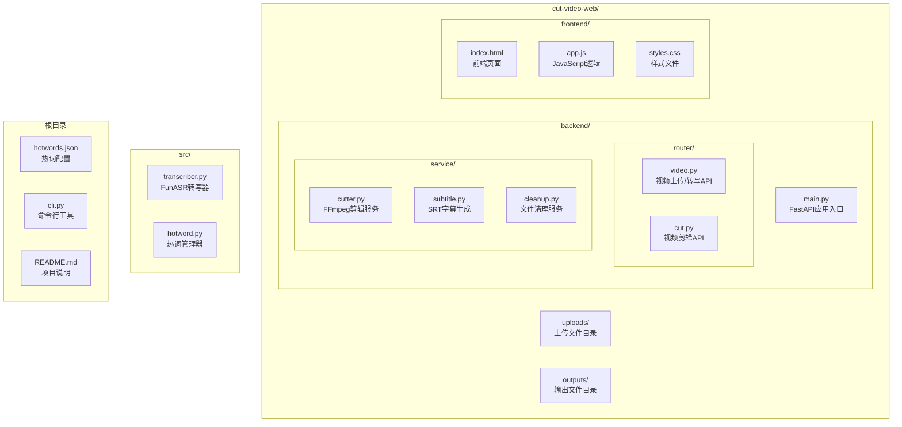
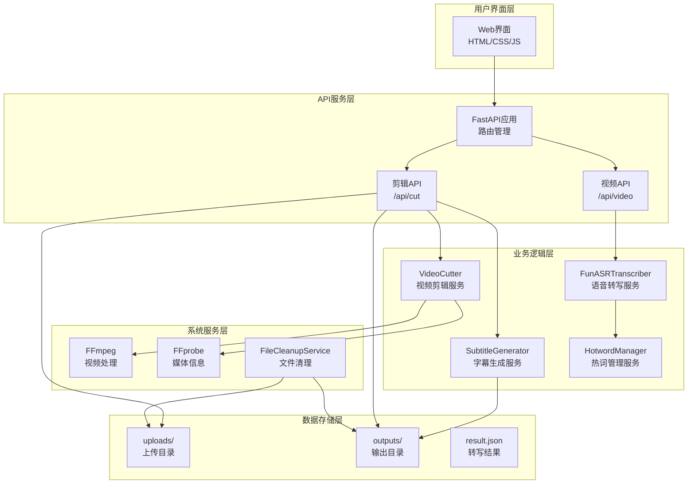
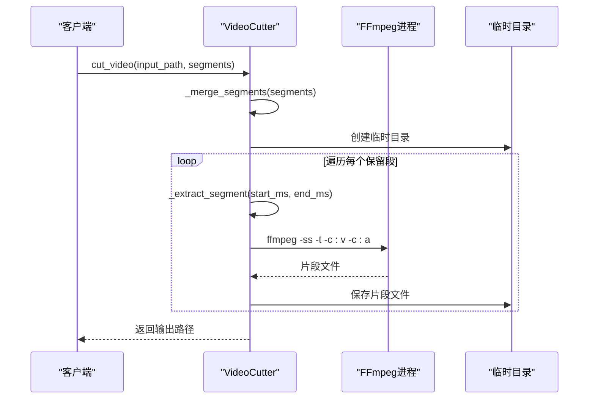
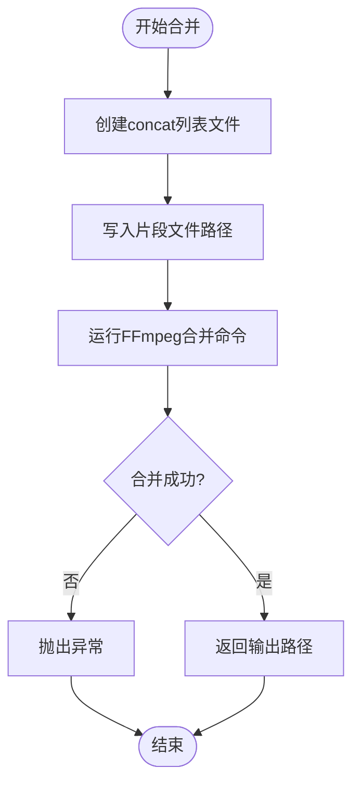
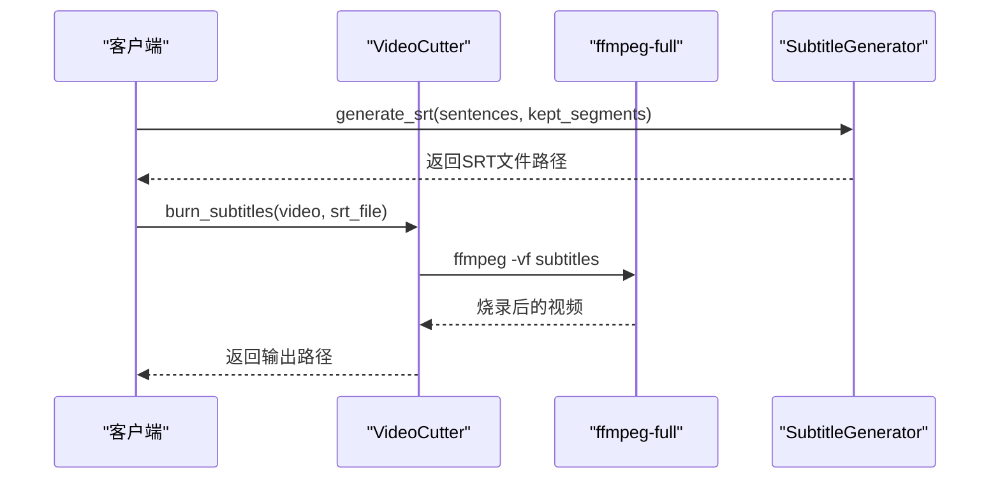
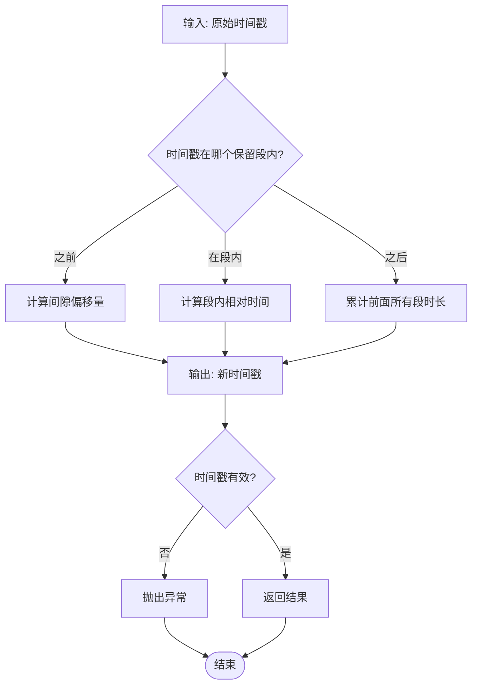
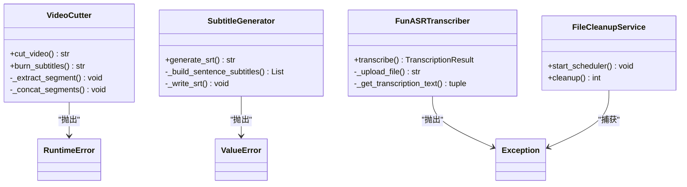
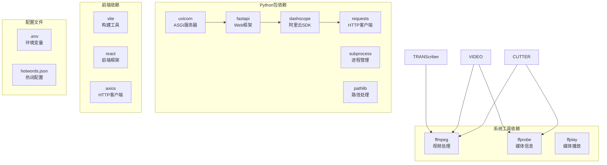
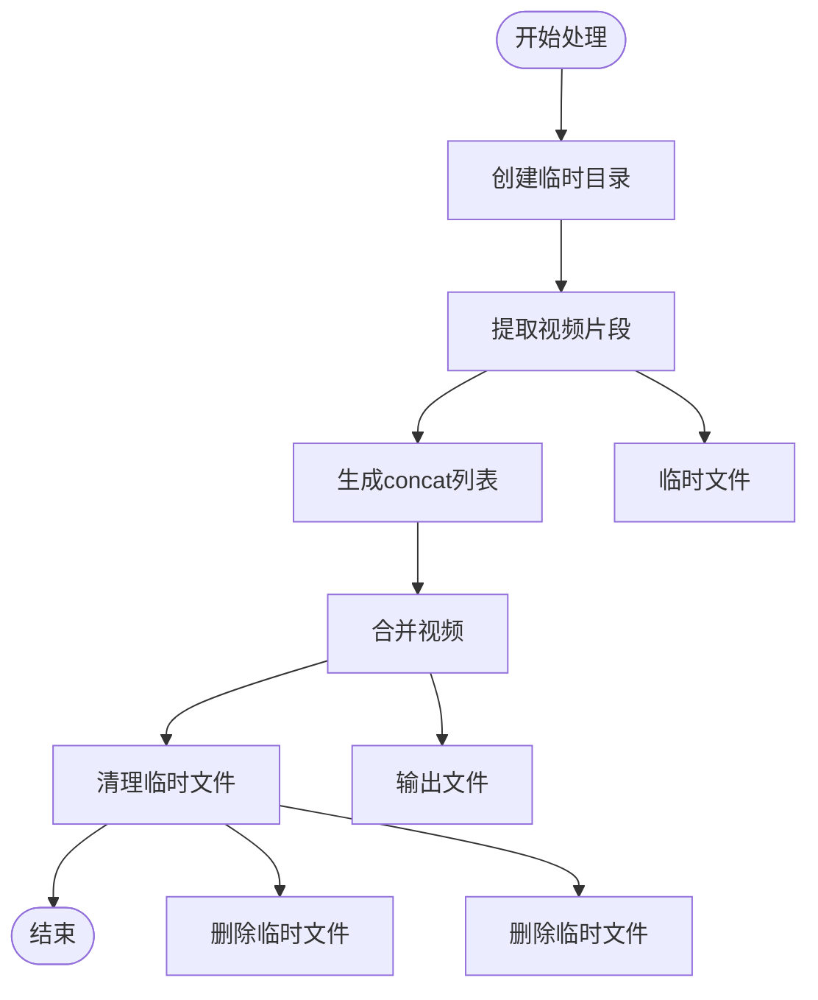
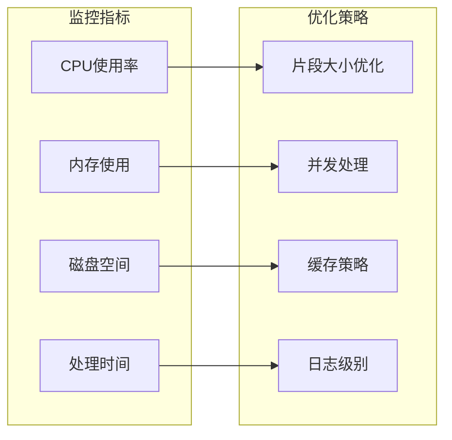

# FFmpeg集成实现

<cite>
**本文档引用的文件**
- [cutter.py](file://cut-video-web/backend/service/cutter.py)
- [subtitle.py](file://cut-video-web/backend/service/subtitle.py)
- [cut.py](file://cut-video-web/backend/router/cut.py)
- [video.py](file://cut-video-web/backend/router/video.py)
- [main.py](file://cut-video-web/backend/main.py)
- [cleanup.py](file://cut-video-web/backend/service/cleanup.py)
- [transcriber.py](file://src/transcriber.py)
- [hotword.py](file://src/hotword.py)
- [README.md](file://README.md)
- [12bcc08a_result.json](file://cut-video-web/backend/uploads/12bcc08a_result.json)
- [hotwords.json](file://hotwords.json)
- [cli.py](file://cli.py)
</cite>

## 目录
1. [简介](#简介)
2. [项目结构](#项目结构)
3. [核心组件](#核心组件)
4. [架构概览](#架构概览)
5. [详细组件分析](#详细组件分析)
6. [依赖分析](#依赖分析)
7. [性能考虑](#性能考虑)
8. [故障排除指南](#故障排除指南)
9. [结论](#结论)
10. [附录](#附录)

## 简介

本项目是一个基于FFmpeg的视频剪辑集成系统，结合了阿里云百炼FunASR的语音识别能力，实现了完整的视频编辑工作流。系统的核心功能包括：

- **智能视频剪辑**：基于词级时间戳的精确剪辑
- **FFmpeg集成**：使用FFmpeg进行视频片段提取和合并
- **字幕烧录**：支持SRT字幕的实时烧录
- **Web界面**：提供用户友好的交互界面
- **热词增强**：通过FunASR的热词功能提升识别准确率

该系统采用模块化设计，主要分为ASR转写层、视频处理层和Web服务层三个核心部分。

## 项目结构

项目采用前后端分离的架构设计，主要目录结构如下：

**图表来源**
- [main.py:1-84](file://cut-video-web/backend/main.py#L1-L84)
- [video.py:1-296](file://cut-video-web/backend/router/video.py#L1-L296)
- [cut.py:1-232](file://cut-video-web/backend/router/cut.py#L1-L232)

**章节来源**
- [main.py:1-84](file://cut-video-web/backend/main.py#L1-L84)
- [README.md:190-310](file://README.md#L190-L310)

## 核心组件

### FFmpeg视频剪辑服务

VideoCutter类是整个系统的核心，负责视频的精确剪辑和合并操作。它提供了以下关键功能：

- **视频片段提取**：使用FFmpeg的-segment选项提取指定时间段的视频片段
- **视频合并**：通过concat demuxer将多个片段合并为一个完整的视频
- **字幕烧录**：支持将SRT字幕实时烧录到视频中
- **时间戳处理**：精确处理毫秒级时间戳转换

### SRT字幕生成服务

SubtitleGenerator类专门负责字幕文件的生成，具有以下特点：

- **智能分割**：根据中文标点符号自动分割句子
- **时间映射**：将原始时间戳映射到剪辑后的相对时间
- **过滤机制**：自动过滤被删除的词，确保字幕准确性
- **格式转换**：将毫秒转换为SRT标准时间格式

### ASR转写服务

FunASRTranscriber类集成了阿里云百炼的语音识别能力：

- **多模型支持**：支持fun-asr、paraformer-v1、paraformer-v2等多种模型
- **热词增强**：通过热词配置提升特定词汇的识别准确率
- **时间戳输出**：提供词级和句子级的精确时间戳
- **视频处理**：自动提取视频中的音频进行转写

**章节来源**
- [cutter.py:14-253](file://cut-video-web/backend/service/cutter.py#L14-L253)
- [subtitle.py:11-219](file://cut-video-web/backend/service/subtitle.py#L11-L219)
- [transcriber.py:95-316](file://src/transcriber.py#L95-L316)

## 架构概览

系统采用分层架构设计，各层职责明确，耦合度低：

**图表来源**
- [main.py:25-52](file://cut-video-web/backend/main.py#L25-L52)
- [cut.py:51-106](file://cut-video-web/backend/router/cut.py#L51-L106)
- [video.py:126-277](file://cut-video-web/backend/router/video.py#L126-L277)

## 详细组件分析

### FFmpeg视频剪辑实现

#### 视频片段提取（_extract_segment方法）

视频片段提取是整个剪辑流程的基础步骤，其核心实现如下：

**图表来源**
- [cutter.py:21-66](file://cut-video-web/backend/service/cutter.py#L21-L66)
- [cutter.py:94-129](file://cut-video-web/backend/service/cutter.py#L94-L129)

关键参数设计原理：

1. **时间参数转换**：将毫秒转换为秒（start_ms/1000, (end_ms-start_ms)/1000）
2. **编解码器选择**：libx264（H.264视频编码）+ aac（音频编码）
3. **时间戳修正**：使用-avoid_negative_ts make_zero避免负时间戳问题

#### 视频合并（_concat_segments方法）

视频合并使用FFmpeg的concat demuxer，具有以下优势：

**图表来源**
- [cutter.py:130-153](file://cut-video-web/backend/service/cutter.py#L130-L153)

concat demuxer的优势：
- **无重新编码**：保持原始质量，提高处理速度
- **内存效率**：适合处理大量片段
- **灵活性**：支持不同分辨率和帧率的片段

#### 字幕烧录实现

字幕烧录功能通过ffmpeg-full版本实现，支持libass字幕渲染：

**图表来源**
- [cutter.py:155-196](file://cut-video-web/backend/service/cutter.py#L155-L196)
- [subtitle.py:18-44](file://cut-video-web/backend/service/subtitle.py#L18-L44)

**章节来源**
- [cutter.py:94-196](file://cut-video-web/backend/service/cutter.py#L94-L196)
- [subtitle.py:18-219](file://cut-video-web/backend/service/subtitle.py#L18-L219)

### 时间戳处理机制

系统实现了复杂的时间戳映射算法，确保剪辑后的时间戳准确性：

**图表来源**
- [cut.py:191-218](file://cut-video-web/backend/router/cut.py#L191-L218)
- [subtitle.py:173-198](file://cut-video-web/backend/service/subtitle.py#L173-L198)

**章节来源**
- [cut.py:127-218](file://cut-video-web/backend/router/cut.py#L127-L218)
- [subtitle.py:173-198](file://cut-video-web/backend/service/subtitle.py#L173-L198)

### 错误处理机制

系统实现了多层次的错误处理机制：

**图表来源**
- [cutter.py:127-153](file://cut-video-web/backend/service/cutter.py#L127-L153)
- [subtitle.py:61-62](file://cut-video-web/backend/service/subtitle.py#L61-L62)
- [transcriber.py:115-119](file://src/transcriber.py#L115-L119)

**章节来源**
- [cutter.py:127-153](file://cut-video-web/backend/service/cutter.py#L127-L153)
- [subtitle.py:61-62](file://cut-video-web/backend/service/subtitle.py#L61-L62)
- [transcriber.py:115-119](file://src/transcriber.py#L115-L119)

## 依赖分析

系统依赖关系清晰，主要外部依赖包括：

**图表来源**
- [main.py:16-23](file://cut-video-web/backend/main.py#L16-L23)
- [transcriber.py:16-20](file://src/transcriber.py#L16-L20)
- [README.md:31-36](file://README.md#L31-L36)

**章节来源**
- [main.py:16-23](file://cut-video-web/backend/main.py#L16-L23)
- [transcriber.py:16-20](file://src/transcriber.py#L16-L20)
- [README.md:31-36](file://README.md#L31-L36)

## 性能考虑

### FFmpeg参数优化

系统在FFmpeg参数设计上充分考虑了性能因素：

1. **无重新编码策略**：在合并阶段使用concat demuxer避免重新编码
2. **时间参数优化**：使用-segment精确控制片段长度
3. **编解码器选择**：libx264和aac提供良好的压缩比和兼容性

### 内存管理

**图表来源**
- [cutter.py:47-66](file://cut-video-web/backend/service/cutter.py#L47-L66)

### 缓存策略

系统实现了智能的文件清理机制，防止磁盘空间占用过大：

- **定时清理**：每小时检查一次过期文件
- **生命周期管理**：默认保留24小时
- **内存同步**：同时清理内存中的状态记录

**章节来源**
- [cutter.py:47-66](file://cut-video-web/backend/service/cutter.py#L47-L66)
- [cleanup.py:76-96](file://cut-video-web/backend/service/cleanup.py#L76-L96)

## 故障排除指南

### 常见FFmpeg问题及解决方案

| 问题类型 | 症状描述 | 解决方案 |
|---------|---------|---------|
| 编码器不可用 | "Error while loading decoder for stream" | 确认安装ffmpeg-full版本，支持libass |
| 时间戳错误 | "Negative timestamp" | 使用-avoid_negative_ts make_zero参数 |
| 内存不足 | "Out of memory" | 分割更大的视频为更小的片段 |
| 音频不同步 | "A/V sync issue" | 使用-concat_tags时添加-audio_track_toffset |
| 字幕显示异常 | "Subtitle rendering failed" | 确认SRT文件格式正确，时间戳有效 |

### 调试技巧

1. **启用详细日志**：在FFmpeg命令中添加-v verbose参数
2. **检查媒体信息**：使用ffprobe验证输入文件的元数据
3. **分步调试**：单独测试片段提取和合并步骤
4. **监控资源使用**：观察CPU和内存使用情况

### 性能监控

**章节来源**
- [cutter.py:121-128](file://cut-video-web/backend/service/cutter.py#L121-L128)
- [video.py:166-234](file://cut-video-web/backend/router/video.py#L166-L234)

## 结论

本FFmpeg集成实现提供了一个完整、高效的视频剪辑解决方案。系统的主要优势包括：

1. **精确控制**：基于词级时间戳的精确剪辑能力
2. **高质量输出**：通过合理的编解码器选择保证视频质量
3. **用户友好**：提供直观的Web界面和丰富的功能
4. **可扩展性**：模块化设计便于功能扩展和维护

通过FFmpeg的高效处理能力和FunASR的精准识别，系统能够满足专业视频编辑的需求。建议在生产环境中：

- 配置适当的硬件资源
- 监控系统性能指标
- 定期清理临时文件
- 备份重要的转写结果

## 附录

### API接口说明

系统提供RESTful API接口，支持完整的视频剪辑工作流：

- **POST /api/upload**：上传视频文件
- **GET /api/status/{video_id}**：查询转写状态
- **GET /api/timestamps/{video_id}**：获取时间戳数据
- **POST /api/cut/{video_id}**：执行视频剪辑
- **GET /api/download/{filename}**：下载输出文件

### 配置选项

| 选项 | 默认值 | 描述 |
|------|--------|------|
| DASHSCOPE_API_KEY | 未设置 | 阿里云百炼API密钥 |
| FFmpeg路径 | ffmpeg | FFmpeg可执行文件路径 |
| 输出目录 | outputs/ | 剪辑输出目录 |
| 临时目录 | 系统临时目录 | FFmpeg临时文件存储 |
| 最大保留时间 | 24小时 | 文件清理阈值 |

### 最佳实践

1. **输入文件规范**：使用标准格式的视频文件
2. **网络稳定性**：确保稳定的网络连接进行转写
3. **资源规划**：合理规划CPU、内存和存储资源
4. **错误处理**：实现完善的异常处理和重试机制
5. **安全考虑**：验证用户上传文件的安全性