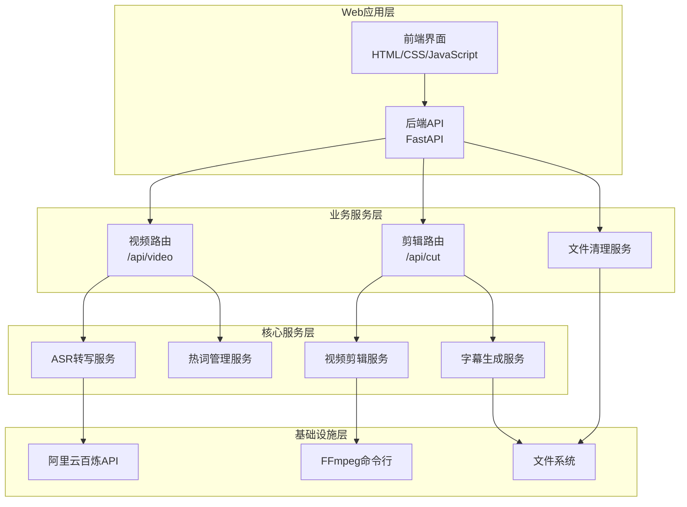
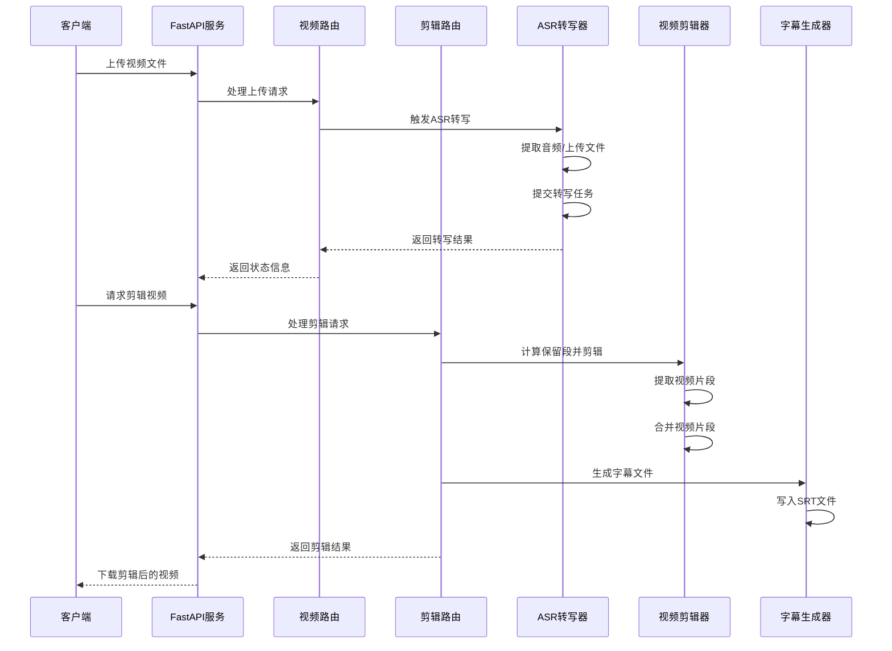
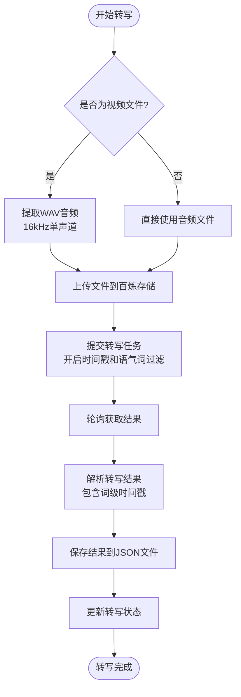
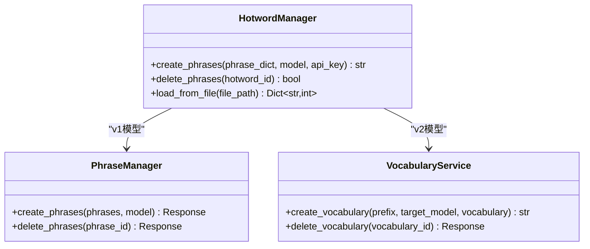
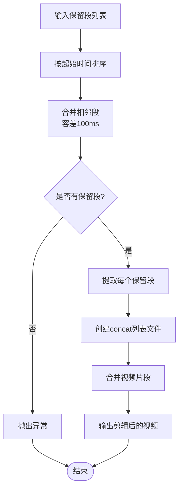
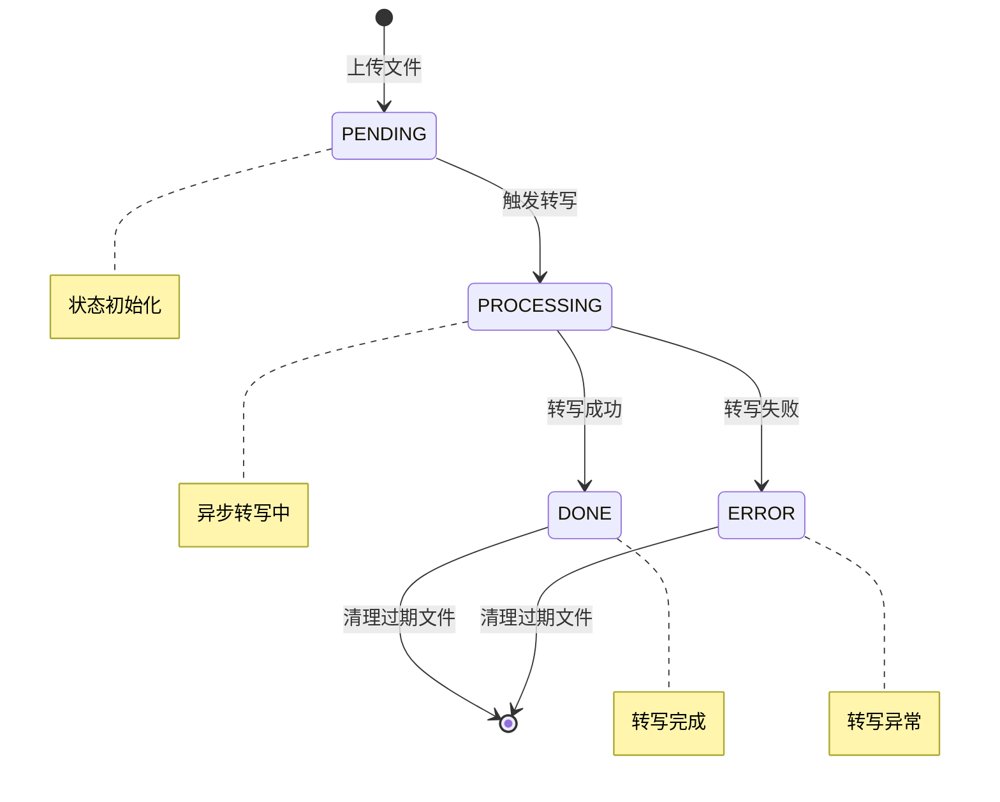
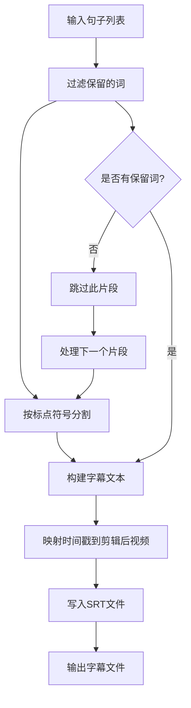
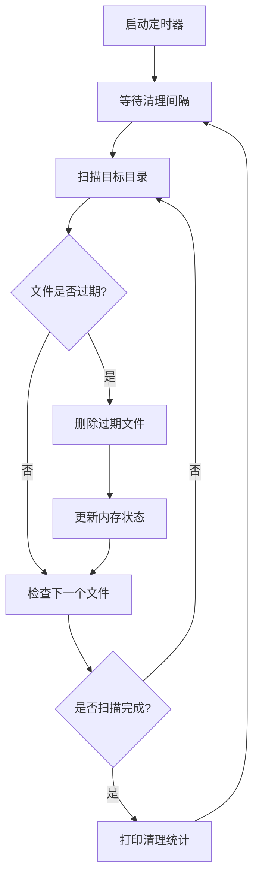
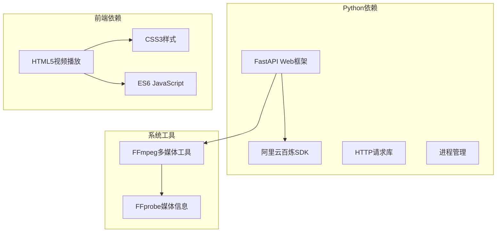
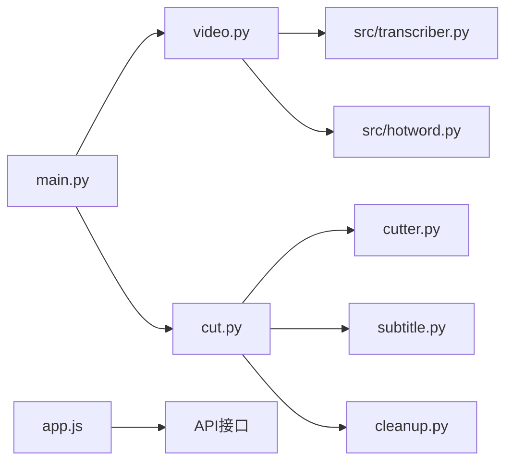

# 视频剪辑服务架构

<cite>
**本文档引用的文件**
- [README.md](file://README.md)
- [main.py](file://cut-video-web/backend/main.py)
- [video.py](file://cut-video-web/backend/router/video.py)
- [cut.py](file://cut-video-web/backend/router/cut.py)
- [cutter.py](file://cut-video-web/backend/service/cutter.py)
- [subtitle.py](file://cut-video-web/backend/service/subtitle.py)
- [cleanup.py](file://cut-video-web/backend/service/cleanup.py)
- [transcriber.py](file://src/transcriber.py)
- [hotword.py](file://src/hotword.py)
- [hotwords.json](file://hotwords.json)
- [cli.py](file://cli.py)
- [app.js](file://cut-video-web/frontend/app.js)
</cite>

## 目录
1. [简介](#简介)
2. [项目结构](#项目结构)
3. [核心组件](#核心组件)
4. [架构概览](#架构概览)
5. [详细组件分析](#详细组件分析)
6. [依赖关系分析](#依赖关系分析)
7. [性能考量](#性能考量)
8. [故障排除指南](#故障排除指南)
9. [结论](#结论)

## 简介

这是一个基于阿里云百炼 FunASR API 的视频剪辑服务，提供了完整的视频处理流水线，包括自动语音识别、词级时间戳标注、精确视频剪辑和字幕烧录功能。该系统采用前后端分离架构，后端使用 FastAPI 提供 RESTful API，前端使用纯 JavaScript 实现交互式视频编辑界面。

## 项目结构

项目采用模块化设计，主要分为以下层次：

**图表来源**
- [main.py:1-84](file://cut-video-web/backend/main.py#L1-L84)
- [video.py:1-296](file://cut-video-web/backend/router/video.py#L1-L296)
- [cut.py:1-232](file://cut-video-web/backend/router/cut.py#L1-L232)

**章节来源**
- [README.md:190-310](file://README.md#L190-L310)
- [main.py:25-84](file://cut-video-web/backend/main.py#L25-L84)

## 核心组件

### ASR转写服务
基于阿里云百炼 FunASR API，支持多种模型类型和热词功能，提供词级时间戳输出。

### 视频剪辑服务
使用 FFmpeg 实现精确的视频片段提取和合并，支持保留段计算和字幕烧录。

### 状态管理系统
内存中的转写状态跟踪，支持服务重启后的状态恢复和定时清理。

### 字幕生成服务
根据保留的词时间段生成 SRT 字幕文件，支持智能标点分割和时间戳映射。

**章节来源**
- [transcriber.py:95-316](file://src/transcriber.py#L95-L316)
- [cutter.py:14-253](file://cut-video-web/backend/service/cutter.py#L14-L253)
- [video.py:32-96](file://cut-video-web/backend/router/video.py#L32-L96)

## 架构概览

系统采用分层架构设计，各层职责清晰分离：

**图表来源**
- [video.py:166-234](file://cut-video-web/backend/router/video.py#L166-L234)
- [cut.py:51-110](file://cut-video-web/backend/router/cut.py#L51-L110)
- [cutter.py:21-66](file://cut-video-web/backend/service/cutter.py#L21-L66)

## 详细组件分析

### ASR转写服务架构

#### 转写流程

**图表来源**
- [transcriber.py:203-294](file://src/transcriber.py#L203-L294)
- [video.py:166-234](file://cut-video-web/backend/router/video.py#L166-L234)

#### 热词管理机制

**图表来源**
- [hotword.py:13-92](file://src/hotword.py#L13-L92)

**章节来源**
- [transcriber.py:95-316](file://src/transcriber.py#L95-L316)
- [hotword.py:13-92](file://src/hotword.py#L13-L92)

### 视频剪辑服务架构

#### 保留段计算逻辑

**图表来源**
- [cutter.py:68-92](file://cut-video-web/backend/service/cutter.py#L68-L92)
- [cutter.py:50-66](file://cut-video-web/backend/service/cutter.py#L50-L66)

#### FFmpeg集成方式
视频剪辑服务通过 FFmpeg 命令行工具实现精确的视频处理：

**片段提取命令**：
- 使用 `-ss` 参数进行精确定位
- 使用 `-t` 参数指定持续时间
- 重新编码视频和音频确保兼容性
- 使用 `-avoid_negative_ts make_zero` 处理时间戳问题

**片段合并命令**：
- 使用 concat demuxer 方式
- 支持 `-safe 0` 处理相对路径
- 使用 `-shortest` 确保音视频同步

**字幕烧录命令**：
- 使用 `subtitles` 视频滤镜
- 支持 libass 字幕渲染
- 保持原有视频质量

**章节来源**
- [cutter.py:94-154](file://cut-video-web/backend/service/cutter.py#L94-L154)
- [cutter.py:155-196](file://cut-video-web/backend/service/cutter.py#L155-L196)

### 状态管理机制

#### 转写状态跟踪

**图表来源**
- [video.py:98-102](file://cut-video-web/backend/router/video.py#L98-L102)
- [video.py:166-234](file://cut-video-web/backend/router/video.py#L166-L234)

#### 服务重启恢复机制
系统启动时会自动扫描上传目录，恢复已完成和中断的任务状态：

**恢复流程**：
1. 扫描所有 `_result.json` 文件
2. 从文件中提取视频ID和文件信息
3. 恢复已完成任务为 `DONE` 状态
4. 标记无结果文件但存在视频文件的任务为 `ERROR` 状态

**章节来源**
- [video.py:38-96](file://cut-video-web/backend/router/video.py#L38-L96)
- [main.py:61-74](file://cut-video-web/backend/main.py#L61-L74)

### 字幕生成服务

#### 字幕生成算法

**图表来源**
- [subtitle.py:46-99](file://cut-video-web/backend/service/subtitle.py#L46-L99)
- [subtitle.py:101-171](file://cut-video-web/backend/service/subtitle.py#L101-L171)

#### 时间戳映射算法
字幕生成器实现了精确的时间戳映射算法，将原始视频时间戳转换为剪辑后视频的相对时间：

**映射规则**：
- 计算保留段的累计时长作为偏移量
- 对于在保留段内的时刻点，减去段起始时间
- 对于在间隙中的时刻点，返回累计偏移量

**章节来源**
- [subtitle.py:173-198](file://cut-video-web/backend/service/subtitle.py#L173-L198)
- [cut.py:191-218](file://cut-video-web/backend/router/cut.py#L191-L218)

### 文件清理服务

#### 定时清理机制

**图表来源**
- [cleanup.py:76-96](file://cut-video-web/backend/service/cleanup.py#L76-L96)
- [cleanup.py:35-74](file://cut-video-web/backend/service/cleanup.py#L35-L74)

**章节来源**
- [cleanup.py:15-103](file://cut-video-web/backend/service/cleanup.py#L15-L103)

## 依赖关系分析

### 外部依赖
系统依赖以下外部组件：

**图表来源**
- [transcriber.py:16-20](file://src/transcriber.py#L16-L20)
- [cutter.py:7-11](file://cut-video-web/backend/service/cutter.py#L7-L11)

### 内部模块依赖

**图表来源**
- [main.py:23-51](file://cut-video-web/backend/main.py#L23-L51)
- [video.py:21-22](file://cut-video-web/backend/router/video.py#L21-L22)
- [cut.py:19-20](file://cut-video-web/backend/router/cut.py#L19-L20)

**章节来源**
- [main.py:1-84](file://cut-video-web/backend/main.py#L1-L84)
- [video.py:1-296](file://cut-video-web/backend/router/video.py#L1-L296)
- [cut.py:1-232](file://cut-video-web/backend/router/cut.py#L1-L232)

## 性能考量

### FFmpeg参数优化
系统在 FFmpeg 命令中采用了多项性能优化策略：

**视频编码优化**：
- 使用 libx264 编码器，提供良好的压缩比和质量平衡
- 采用恒定质量模式，避免不必要的质量损失
- 启用多线程编码提升处理速度

**音频编码优化**：
- 使用 AAC 编码器，兼容性好且压缩效率高
- 保持原始采样率和声道数，减少质量损失
- 采用高质量预设参数

**内存管理**：
- 使用临时目录进行中间文件处理
- 及时清理临时文件，避免磁盘空间占用
- 控制同时处理的视频片段数量

### 并发处理能力
系统支持异步并发处理多个视频任务：

**后台任务处理**：
- 使用 asyncio 实现异步转写
- 支持多个视频文件同时转写
- 内存中的状态管理避免重复计算

**API并发处理**：
- FastAPI 基于异步IO，支持高并发请求
- 每个请求独立处理，互不干扰
- 合理的超时设置防止资源泄露

### 存储优化
- 上传文件和输出文件分离存储
- 定时清理过期文件，控制存储空间
- 使用相对路径引用，避免绝对路径问题

## 故障排除指南

### 常见问题及解决方案

#### FFmpeg相关错误
**问题**：FFmpeg命令执行失败
**原因**：FFmpeg安装不正确或权限不足
**解决方案**：
1. 确认 FFmpeg 已正确安装
2. 检查 FFmpeg 路径配置
3. 验证执行权限

#### ASR转写失败
**问题**：转写任务提交或执行失败
**原因**：网络连接问题或API密钥无效
**解决方案**：
1. 检查网络连接稳定性
2. 验证 DASHSCOPE_API_KEY 环境变量
3. 查看转写日志获取详细错误信息

#### 文件清理异常
**问题**：定时清理服务异常退出
**原因**：文件权限问题或磁盘空间不足
**解决方案**：
1. 检查目标目录的读写权限
2. 确保有足够的磁盘空间
3. 查看清理日志了解具体错误

**章节来源**
- [cutter.py:121-129](file://cut-video-web/backend/service/cutter.py#L121-L129)
- [transcriber.py:115-119](file://src/transcriber.py#L115-L119)
- [cleanup.py:63-64](file://cut-video-web/backend/service/cleanup.py#L63-L64)

## 结论

该视频剪辑服务架构设计合理，功能完整，具有以下特点：

**技术优势**：
- 基于成熟的 FFmpeg 工具链，保证视频处理质量
- 集成阿里云百炼 ASR API，提供准确的词级时间戳
- 采用前后端分离架构，用户体验良好
- 实现了完整的状态管理和错误恢复机制

**扩展性**：
- 模块化设计便于功能扩展
- 支持多种模型类型和热词配置
- 清晰的接口定义便于第三方集成

**性能表现**：
- 异步处理提升并发能力
- 合理的内存和存储管理
- FFmpeg参数优化保证处理效率

该系统为视频内容编辑提供了完整的解决方案，既适合个人使用也适合企业级部署。