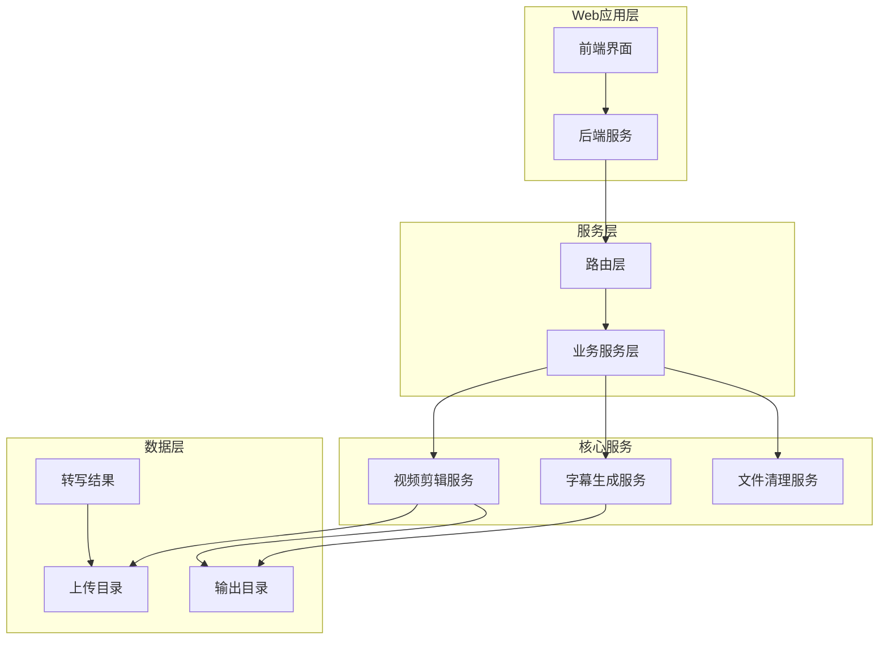
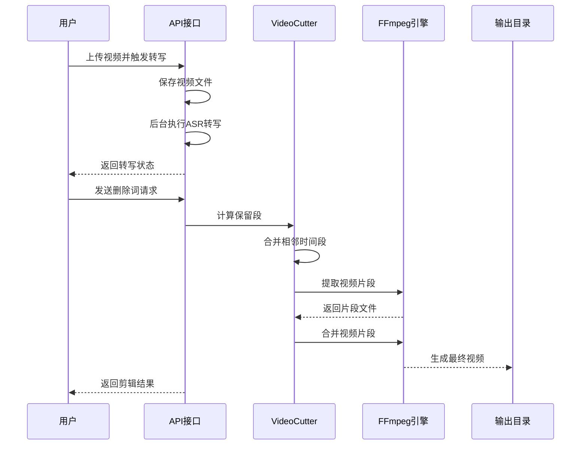
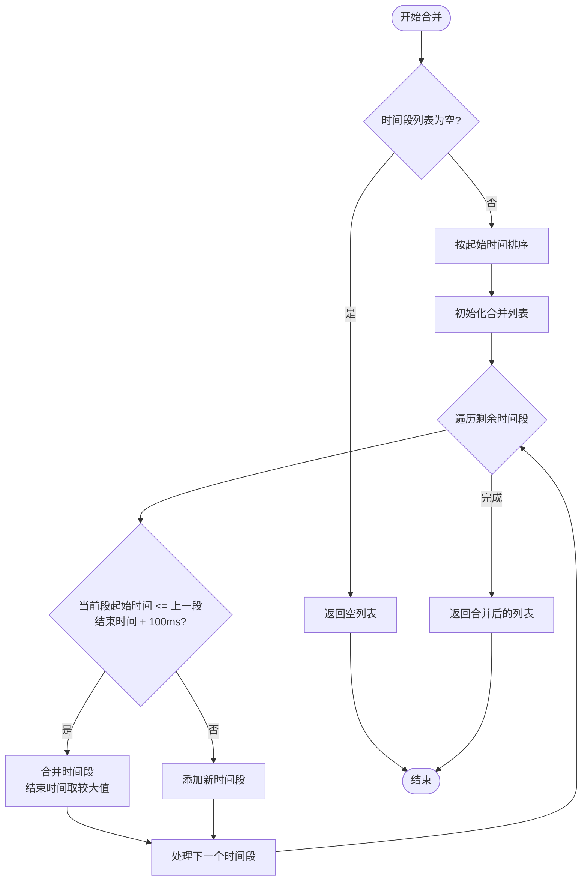
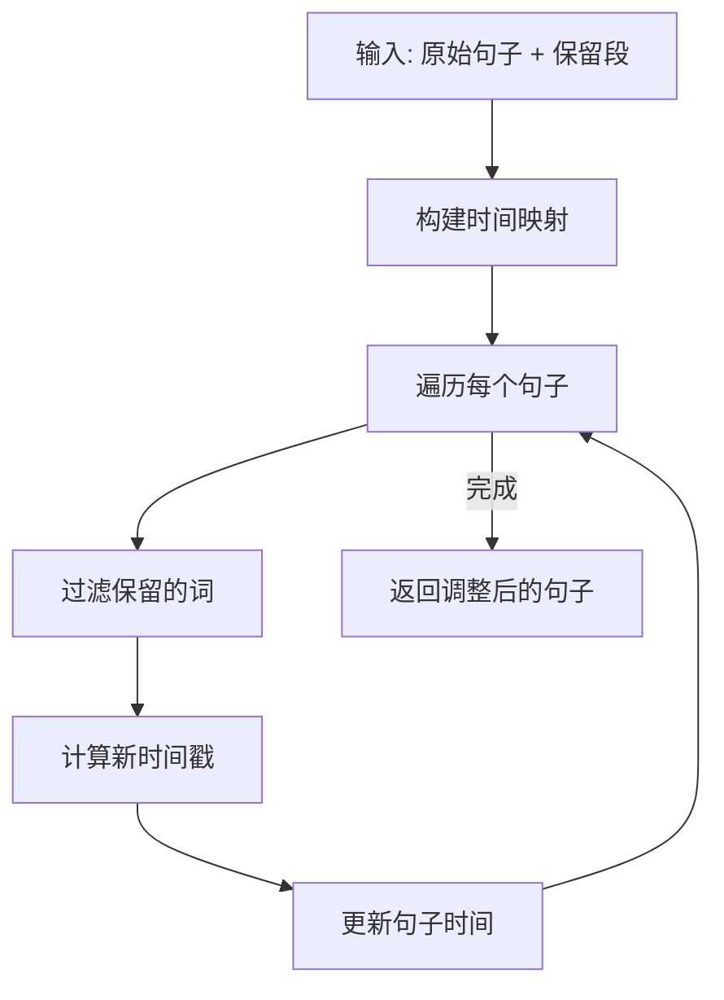
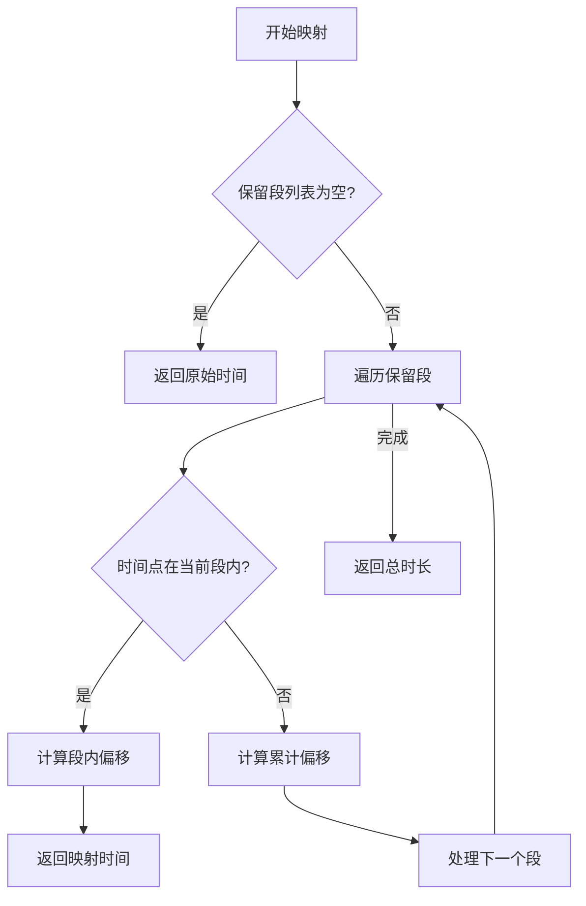
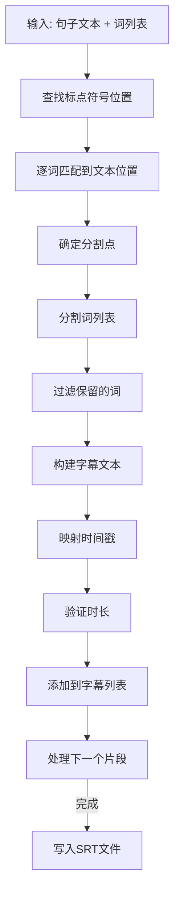
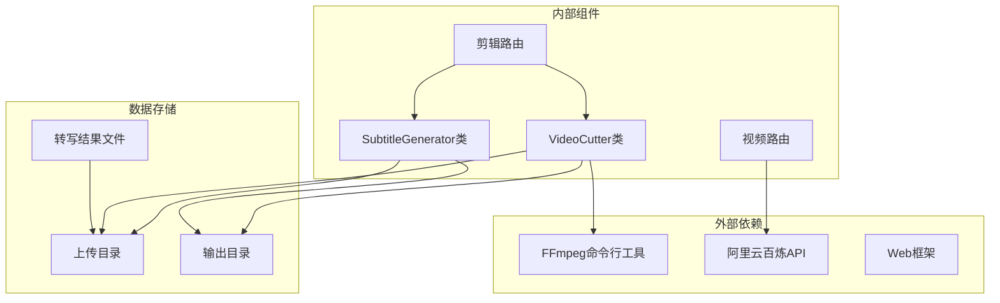

# 视频剪辑算法实现

<cite>
**本文档引用的文件**
- [cutter.py](file://cut-video-web/backend/service/cutter.py)
- [cut.py](file://cut-video-web/backend/router/cut.py)
- [subtitle.py](file://cut-video-web/backend/service/subtitle.py)
- [video.py](file://cut-video-web/backend/router/video.py)
- [main.py](file://cut-video-web/backend/main.py)
- [README.md](file://README.md)
- [12bcc08a_result.json](file://cut-video-web/backend/uploads/12bcc08a_result.json)
- [hotwords.json](file://hotwords.json)
</cite>

## 目录
1. [简介](#简介)
2. [项目结构](#项目结构)
3. [核心组件](#核心组件)
4. [架构概览](#架构概览)
5. [详细组件分析](#详细组件分析)
6. [依赖关系分析](#依赖关系分析)
7. [性能考虑](#性能考虑)
8. [故障排除指南](#故障排除指南)
9. [结论](#结论)

## 简介

本项目是一个基于阿里云百炼 FunASR API 的词级时间戳视频剪辑系统。该系统能够对视频进行精确的词级删除操作，支持实时预览删除效果，并提供字幕烧录功能。核心算法围绕 VideoCutter 类实现，通过保留段合并逻辑、时间段处理策略和基于词级时间戳的剪辑原理，实现了高效的视频剪辑功能。

## 项目结构

该项目采用前后端分离的架构设计，主要包含以下模块：

**图表来源**
- [main.py:25-51](file://cut-video-web/backend/main.py#L25-L51)
- [cutter.py:14-253](file://cut-video-web/backend/service/cutter.py#L14-L253)

**章节来源**
- [main.py:1-84](file://cut-video-web/backend/main.py#L1-L84)
- [README.md:281-299](file://README.md#L281-L299)

## 核心组件

### VideoCutter 类

VideoCutter 是整个视频剪辑系统的核心类，负责处理视频剪辑的所有逻辑。该类提供了完整的视频剪辑生命周期管理，包括时间段合并、视频片段提取、片段合并等功能。

**章节来源**
- [cutter.py:14-253](file://cut-video-web/backend/service/cutter.py#L14-L253)

### 时间戳调整服务

系统提供了专门的时间戳调整功能，用于将原始视频中的时间戳映射到剪辑后视频的相对时间。这确保了字幕和时间轴的准确性。

**章节来源**
- [cut.py:127-219](file://cut-video-web/backend/router/cut.py#L127-L219)

### 字幕生成服务

SubtitleGenerator 类负责根据保留的句子生成 SRT 格式的字幕文件，支持按标点符号智能分割和时间戳映射。

**章节来源**
- [subtitle.py:11-219](file://cut-video-web/backend/service/subtitle.py#L11-L219)

## 架构概览

系统的整体架构采用分层设计，从用户界面到底层服务的完整流程如下：

**图表来源**
- [cut.py:51-106](file://cut-video-web/backend/router/cut.py#L51-L106)
- [cutter.py:21-66](file://cut-video-web/backend/service/cutter.py#L21-L66)

## 详细组件分析

### VideoCutter 类详细分析

VideoCutter 类是整个系统的核心，实现了完整的视频剪辑算法。其设计遵循单一职责原则，每个方法都专注于特定的功能。

#### 核心算法：保留段合并逻辑

`_merge_segments` 方法实现了保留段的合并算法，这是整个剪辑系统的关键逻辑：

**图表来源**
- [cutter.py:68-92](file://cut-video-web/backend/service/cutter.py#L68-L92)

#### 时间容差处理机制

算法采用了100ms的时间容差处理策略，这是为了处理视频编码和时间戳的微小误差：

- **容差范围**：100毫秒
- **应用场景**：处理相邻时间段之间的微小间隙
- **合并条件**：当前段起始时间 ≤ 上一段结束时间 + 100ms

这种设计确保了即使存在微小的时间偏差，相邻的保留段也能正确合并。

#### 边界情况处理

系统针对多种边界情况进行了专门处理：

1. **空时间段列表**：抛出 `ValueError` 异常
2. **所有词都被删除**：抛出 `ValueError` 异常
3. **重叠时间段**：通过合并逻辑自动处理
4. **不连续时间段**：保持原有间隔，不进行合并

**章节来源**
- [cutter.py:38-40](file://cut-video-web/backend/service/cutter.py#L38-L40)
- [cutter.py:245-247](file://cut-video-web/backend/service/cutter.py#L245-L247)

### 时间戳调整算法

系统提供了两种时间戳调整方法，分别用于不同的使用场景：

#### 句子级时间戳调整

`_adjust_timestamps_for_edit` 方法处理整个句子的时间戳调整：

**图表来源**
- [cut.py:127-188](file://cut-video-web/backend/router/cut.py#L127-L188)

#### 单词级时间戳调整

`_map_original_to_adjusted` 方法实现了精确的时间戳映射：

**图表来源**
- [cut.py:191-218](file://cut-video-web/backend/router/cut.py#L191-L218)

### 字幕生成算法

SubtitleGenerator 类实现了智能的字幕生成算法，支持按标点符号分割和时间戳映射：

#### 标点符号分割逻辑

算法通过分析句子文本中的标点符号位置来智能分割字幕：

**图表来源**
- [subtitle.py:46-99](file://cut-video-web/backend/service/subtitle.py#L46-L99)

**章节来源**
- [subtitle.py:101-171](file://cut-video-web/backend/service/subtitle.py#L101-L171)

## 依赖关系分析

系统各组件之间的依赖关系清晰明确，遵循了良好的软件工程原则：

**图表来源**
- [cutter.py:109-154](file://cut-video-web/backend/service/cutter.py#L109-L154)
- [subtitle.py:173-198](file://cut-video-web/backend/service/subtitle.py#L173-L198)

**章节来源**
- [main.py:19-51](file://cut-video-web/backend/main.py#L19-L51)

## 性能考虑

### 算法复杂度分析

#### 时间复杂度

1. **保留段合并算法**：O(n log n)
   - 主要由排序操作决定，其中 n 为时间段数量
   - 合并过程为 O(n)

2. **时间戳调整算法**：O(n × m)
   - n 为句子数量，m 为平均词数量
   - 对每个词执行时间映射操作

3. **字幕生成算法**：O(n × m × k)
   - k 为标点符号数量
   - 每个词需要与标点符号进行位置匹配

#### 空间复杂度

- **保留段存储**：O(n)
- **时间映射缓存**：O(n)
- **字幕生成缓存**：O(n × m)

### 性能优化技巧

1. **批量处理优化**
   - 使用临时目录批量处理视频片段
   - 减少磁盘I/O操作次数

2. **内存管理**
   - 及时清理临时文件
   - 控制同时处理的视频数量

3. **并发处理**
   - 利用异步任务处理后台转写
   - 支持多用户并发访问

4. **缓存策略**
   - 缓存转写结果
   - 避免重复的ASR调用

## 故障排除指南

### 常见错误及解决方案

#### FFmpeg相关错误

**问题**：视频提取或合并失败
**原因**：FFmpeg命令执行失败
**解决方案**：
- 检查FFmpeg安装是否正确
- 验证输入视频文件完整性
- 确认有足够的磁盘空间

#### 时间戳异常

**问题**：时间戳映射不准确
**原因**：时间戳数据异常或格式错误
**解决方案**：
- 验证ASR转写结果的完整性
- 检查时间戳的递增性
- 确认删除标记的正确性

#### 内存不足

**问题**：长时间运行后内存占用过高
**原因**：大量视频片段在内存中累积
**解决方案**：
- 及时清理临时文件
- 限制同时处理的视频数量
- 监控内存使用情况

**章节来源**
- [cutter.py:127-128](file://cut-video-web/backend/service/cutter.py#L127-L128)
- [cut.py:108-109](file://cut-video-web/backend/router/cut.py#L108-L109)

## 结论

本视频剪辑算法实现具有以下特点：

1. **精确性**：基于词级时间戳的精确剪辑，支持单个词的删除
2. **智能化**：自动处理相邻时间段合并和时间容差
3. **可扩展性**：模块化设计，易于扩展新功能
4. **稳定性**：完善的错误处理和边界情况处理
5. **易用性**：提供完整的Web界面和API接口

该系统为视频编辑提供了强大的工具，特别适用于需要精确控制的视频剪辑场景。通过合理的算法设计和性能优化，能够在保证质量的同时提供高效的处理能力。