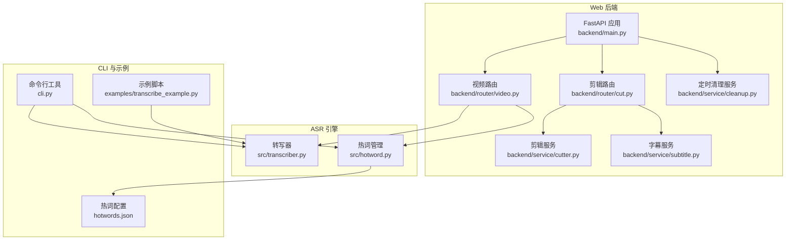
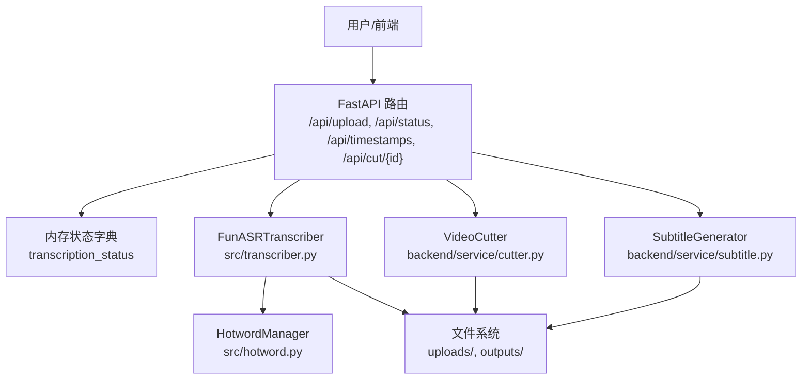
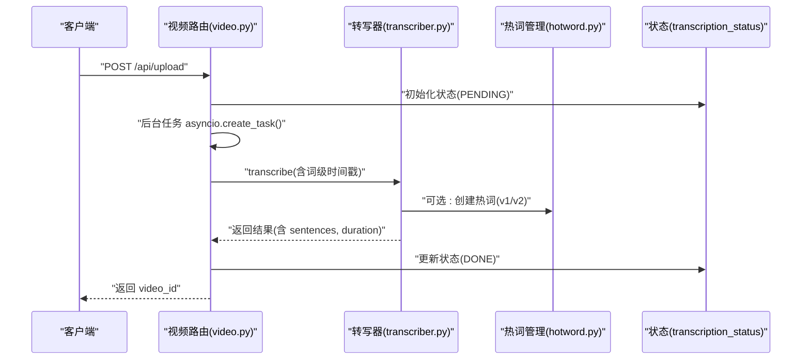
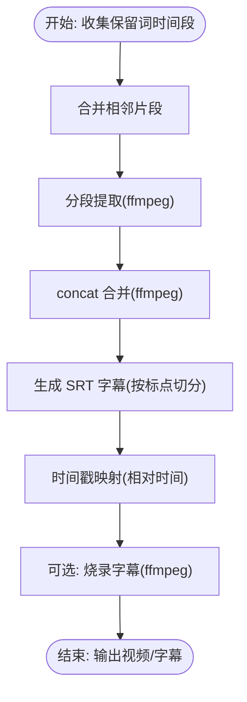
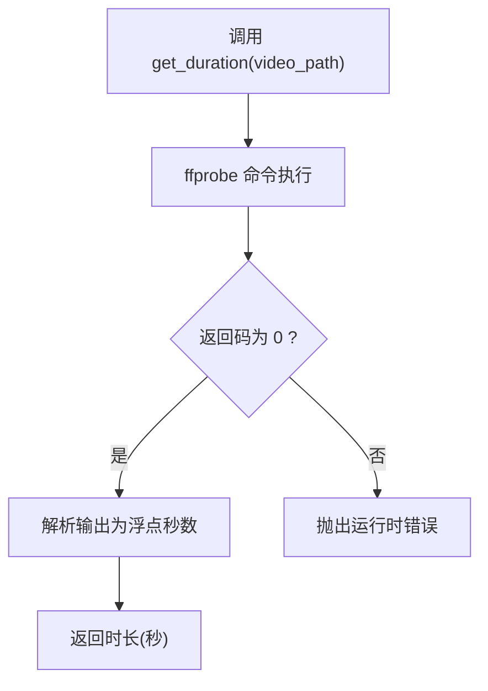
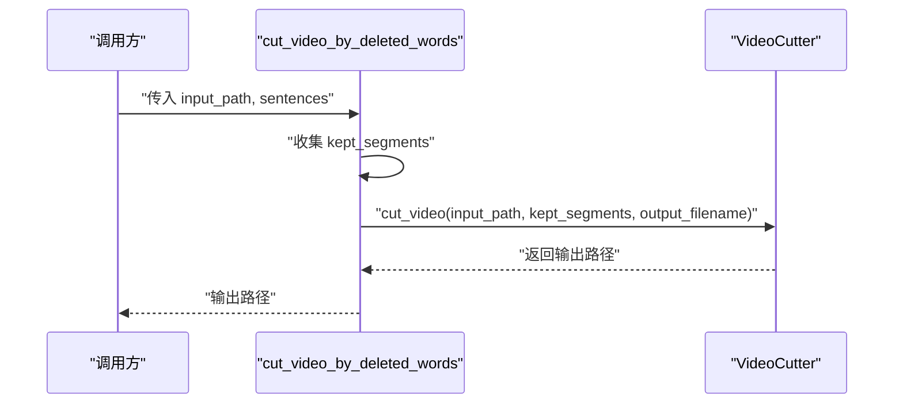
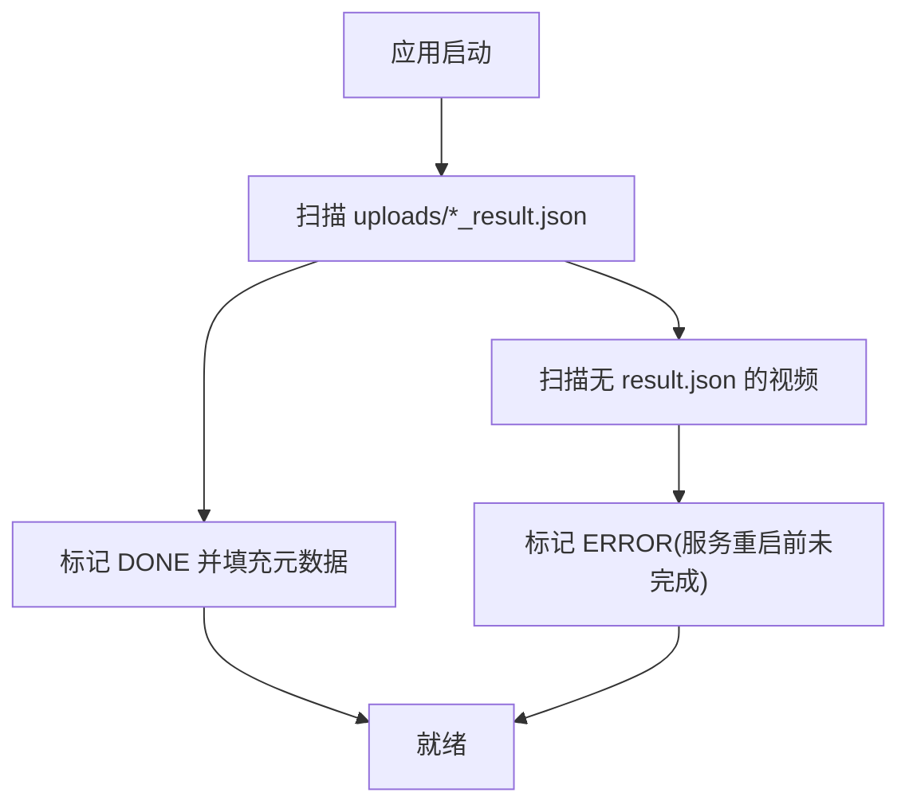
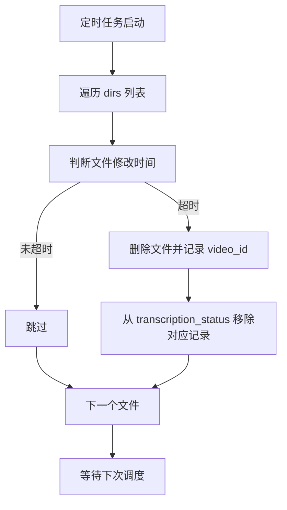
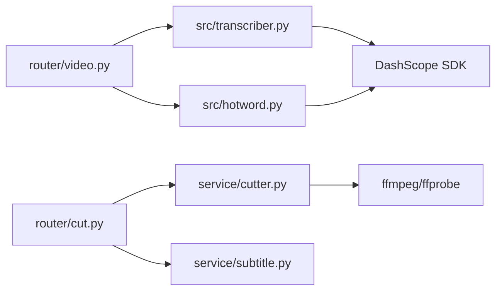

# 视频处理工作流程

<cite>
**本文引用的文件**
- [README.md](file://README.md)
- [main.py](file://cut-video-web/backend/main.py)
- [video.py](file://cut-video-web/backend/router/video.py)
- [cut.py](file://cut-video-web/backend/router/cut.py)
- [cutter.py](file://cut-video-web/backend/service/cutter.py)
- [subtitle.py](file://cut-video-web/backend/service/subtitle.py)
- [cleanup.py](file://cut-video-web/backend/service/cleanup.py)
- [transcriber.py](file://src/transcriber.py)
- [hotword.py](file://src/hotword.py)
- [cli.py](file://cli.py)
- [hotwords.json](file://hotwords.json)
- [transcribe_example.py](file://examples/transcribe_example.py)
</cite>

## 目录
1. [简介](#简介)
2. [项目结构](#项目结构)
3. [核心组件](#核心组件)
4. [架构总览](#架构总览)
5. [详细组件分析](#详细组件分析)
6. [依赖分析](#依赖分析)
7. [性能考量](#性能考量)
8. [故障排查指南](#故障排查指南)
9. [结论](#结论)
10. [附录](#附录)

## 简介
本文件面向“视频处理工作流程”的完整文档，覆盖从输入文件验证、ASR 转写、词级时间戳生成、临时文件管理、进程间通信、状态同步、到最终输出文件生成的全流程。重点解释以下关键点：
- 视频时长获取（get_duration 方法）在流程中的作用与实现原理
- cut_video_by_deleted_words 函数从 ASR 转写结果到最终剪辑输出的完整链路
- 错误恢复机制、异常处理策略与资源清理流程
- 性能监控指标与优化建议
- 并发处理能力与扩展性考虑

## 项目结构
该仓库包含两套主要能力：
- 命令行与 Python API：基于阿里云百炼 FunASR 的长音频/视频转写，支持词级时间戳与热词增强
- Web 界面：视频上传、后台转写、词级时间戳可视化、按删除词进行视频剪辑与字幕烧录

图表来源
- [main.py:1-84](file://cut-video-web/backend/main.py#L1-L84)
- [video.py:1-296](file://cut-video-web/backend/router/video.py#L1-L296)
- [cut.py:1-232](file://cut-video-web/backend/router/cut.py#L1-L232)
- [cutter.py:1-253](file://cut-video-web/backend/service/cutter.py#L1-L253)
- [subtitle.py:1-219](file://cut-video-web/backend/service/subtitle.py#L1-L219)
- [cleanup.py:1-103](file://cut-video-web/backend/service/cleanup.py#L1-L103)
- [transcriber.py:1-316](file://src/transcriber.py#L1-L316)
- [hotword.py:1-92](file://src/hotword.py#L1-L92)
- [cli.py:1-180](file://cli.py#L1-L180)
- [hotwords.json:1-17](file://hotwords.json#L1-L17)
- [transcribe_example.py:1-66](file://examples/transcribe_example.py#L1-L66)

章节来源
- [README.md:190-310](file://README.md#L190-L310)
- [main.py:1-84](file://cut-video-web/backend/main.py#L1-L84)

## 核心组件
- 转写器（FunASRTranscriber）：封装阿里云百炼 ASR，支持视频自动提取音频、上传、异步任务轮询、词级时间戳与语气词过滤
- 热词管理（HotwordManager）：创建/删除热词，兼容 v1（phrase_id）与 v2（vocabulary_id）
- 视频剪辑器（VideoCutter）：基于 ffmpeg 的分段提取与 concat 合并，支持字幕烧录；提供 get_duration 获取视频时长
- 字幕生成器（SubtitleGenerator）：按句子与标点切分，生成 SRT 字幕，支持时间戳映射
- Web 路由与状态管理：视频上传、转写状态（内存字典）、剪辑接口、下载接口
- 定时清理服务：定期清理过期文件并同步清理内存状态

章节来源
- [transcriber.py:95-316](file://src/transcriber.py#L95-L316)
- [hotword.py:13-92](file://src/hotword.py#L13-L92)
- [cutter.py:14-253](file://cut-video-web/backend/service/cutter.py#L14-L253)
- [subtitle.py:11-219](file://cut-video-web/backend/service/subtitle.py#L11-L219)
- [video.py:32-296](file://cut-video-web/backend/router/video.py#L32-L296)
- [cut.py:31-232](file://cut-video-web/backend/router/cut.py#L31-L232)
- [cleanup.py:15-103](file://cut-video-web/backend/service/cleanup.py#L15-L103)

## 架构总览
整体采用“Web 后端 + ASR 引擎 + ffmpeg 处理”的分层架构。Web 后端负责状态管理与接口编排，ASR 引擎负责云端转写，ffmpeg 负责本地音视频处理。

图表来源
- [main.py:25-84](file://cut-video-web/backend/main.py#L25-L84)
- [video.py:166-234](file://cut-video-web/backend/router/video.py#L166-L234)
- [cut.py:51-110](file://cut-video-web/backend/router/cut.py#L51-L110)
- [transcriber.py:95-316](file://src/transcriber.py#L95-L316)
- [hotword.py:13-92](file://src/hotword.py#L13-L92)
- [cutter.py:14-253](file://cut-video-web/backend/service/cutter.py#L14-L253)
- [subtitle.py:11-219](file://cut-video-web/backend/service/subtitle.py#L11-L219)

## 详细组件分析

### 组件一：ASR 转写与状态管理
- 输入验证：支持视频与音频；视频自动提取 16kHz 单声道 WAV
- 任务提交：开启词级时间戳与语气词过滤
- 状态同步：内存字典维护 PENDING/PROCESSING/DONE/ERROR 四态；启动时扫描 uploads 恢复已完成与中断任务
- 输出：保存带词级时间戳的 JSON 结果，供前端与剪辑流程使用

图表来源
- [video.py:126-234](file://cut-video-web/backend/router/video.py#L126-L234)
- [transcriber.py:203-294](file://src/transcriber.py#L203-L294)
- [hotword.py:23-69](file://src/hotword.py#L23-L69)

章节来源
- [video.py:38-96](file://cut-video-web/backend/router/video.py#L38-L96)
- [video.py:166-234](file://cut-video-web/backend/router/video.py#L166-L234)
- [transcriber.py:54-93](file://src/transcriber.py#L54-L93)
- [transcriber.py:203-294](file://src/transcriber.py#L203-L294)

### 组件二：视频剪辑与字幕生成
- 剪辑流程：收集未被删除的词时间段，合并相邻片段，分段提取，concat 合并，得到剪辑视频
- 字幕生成：按句子与标点切分，过滤被删除词，映射时间戳到剪辑后相对时间，生成 SRT
- 可选字幕烧录：将 SRT 烧录至视频，生成最终成品

图表来源
- [cutter.py:21-66](file://cut-video-web/backend/service/cutter.py#L21-L66)
- [subtitle.py:18-99](file://cut-video-web/backend/service/subtitle.py#L18-L99)
- [cut.py:74-106](file://cut-video-web/backend/router/cut.py#L74-L106)

章节来源
- [cutter.py:21-154](file://cut-video-web/backend/service/cutter.py#L21-L154)
- [subtitle.py:18-219](file://cut-video-web/backend/service/subtitle.py#L18-L219)
- [cut.py:74-106](file://cut-video-web/backend/router/cut.py#L74-L106)

### 组件三：get_duration 方法的作用与实现
- 作用：在剪辑前获取视频总时长，用于时间戳校验、进度估计与边界保护
- 实现：调用 ffprobe 获取时长（秒），失败抛出异常

图表来源
- [cutter.py:198-217](file://cut-video-web/backend/service/cutter.py#L198-L217)

章节来源
- [cutter.py:198-217](file://cut-video-web/backend/service/cutter.py#L198-L217)

### 组件四：cut_video_by_deleted_words 函数链路
- 输入：ASR 转写结果（包含词级时间戳）
- 步骤：遍历 sentences 收集未删除词的时间段，合并相邻片段，调用 VideoCutter 剪辑，返回输出路径

图表来源
- [cutter.py:220-252](file://cut-video-web/backend/service/cutter.py#L220-L252)
- [cutter.py:21-66](file://cut-video-web/backend/service/cutter.py#L21-L66)

章节来源
- [cutter.py:220-252](file://cut-video-web/backend/service/cutter.py#L220-L252)

### 组件五：状态同步与恢复机制
- 启动恢复：扫描 uploads 目录，恢复已完成任务（存在 *_result.json）与中断任务（无 result.json）
- 内存状态：PENDING/PROCESSING/DONE/ERROR 四态，便于前端轮询与前端交互
- 异常处理：转写失败写入 ERROR 状态与错误信息

图表来源
- [video.py:38-96](file://cut-video-web/backend/router/video.py#L38-L96)

章节来源
- [video.py:38-96](file://cut-video-web/backend/router/video.py#L38-L96)

### 组件六：临时文件管理与资源清理
- 临时目录：剪辑阶段使用临时目录存放中间片段，结束后自动清理
- 定时清理：定期扫描 uploads/ 与 outputs/，删除超时文件，并同步清理内存状态
- 下载接口：通过 /outputs 挂载目录，提供文件下载

图表来源
- [cleanup.py:35-74](file://cut-video-web/backend/service/cleanup.py#L35-L74)
- [main.py:67-74](file://cut-video-web/backend/main.py#L67-L74)

章节来源
- [cleanup.py:15-103](file://cut-video-web/backend/service/cleanup.py#L15-L103)
- [main.py:60-84](file://cut-video-web/backend/main.py#L60-L84)

## 依赖分析
- 组件耦合
  - 路由层依赖服务层（cutter、subtitle），服务层依赖 ffmpeg/ffprobe
  - 视频路由依赖转写器与热词管理，二者均依赖 DashScope SDK
  - 定时清理服务与内存状态字典存在跨模块引用
- 外部依赖
  - ffmpeg/ffprobe：音视频处理与时长探测
  - DashScope SDK：文件上传与 ASR 任务提交/轮询
- 潜在环依赖
  - 当前模块间为单向依赖，未见循环导入

图表来源
- [video.py:21-22](file://cut-video-web/backend/router/video.py#L21-L22)
- [cut.py:19-20](file://cut-video-web/backend/router/cut.py#L19-L20)
- [transcriber.py:17-19](file://src/transcriber.py#L17-L19)
- [hotword.py:6](file://src/hotword.py#L6)

章节来源
- [video.py:21-22](file://cut-video-web/backend/router/video.py#L21-L22)
- [cut.py:19-20](file://cut-video-web/backend/router/cut.py#L19-L20)
- [transcriber.py:17-19](file://src/transcriber.py#L17-L19)
- [hotword.py:6](file://src/hotword.py#L6)

## 性能考量
- I/O 与 CPU 分担
  - ASR 为网络 I/O 密集，耗时取决于音频长度与网络状况
  - ffmpeg 处理为 CPU 密集，分段提取与合并可利用多核
- 优化建议
  - 并发：多任务队列 + 限速，避免同时大量 ffmpeg 进程导致磁盘与 CPU 抢占
  - 缓存：对热词 ID 与上传文件 URL 做短期缓存，减少重复上传与创建
  - 预处理：对长视频分片上传/转写，再合并结果
  - 监控：记录任务耗时、CPU/内存占用、磁盘 IO，定位瓶颈
- 指标建议
  - 任务时延：提交到完成
  - 吞吐量：单位时间内完成的任务数
  - 成功率：DONE/总任务
  - ffmpeg 时延：分段提取/合并耗时

[本节为通用性能讨论，不直接分析具体文件]

## 故障排查指南
- 常见错误与处理
  - API Key 未设置：转写器初始化即报错，需设置 DASHSCOPE_API_KEY 或传参
  - ffmpeg/ffprobe 未安装：get_duration/_extract_segment/_concat_segments/_burn_subtitles 均会抛出运行时错误
  - 所有词被删除：剪辑阶段抛出参数错误，需至少保留一个时间段
  - 文件不存在：下载接口与剪辑接口均会返回 404
- 日志与可观测性
  - 转写过程打印任务状态与耗时
  - 定时清理打印删除数量与异常
  - 健康检查接口 /api/health
- 资源清理
  - 定时清理服务自动删除过期文件并同步内存状态
  - 临时目录在剪辑过程中自动清理

章节来源
- [transcriber.py:107-121](file://src/transcriber.py#L107-L121)
- [cutter.py:121-153](file://cut-video-web/backend/service/cutter.py#L121-L153)
- [cut.py:83-84](file://cut-video-web/backend/router/cut.py#L83-L84)
- [main.py:54-57](file://cut-video-web/backend/main.py#L54-L57)
- [cleanup.py:35-74](file://cut-video-web/backend/service/cleanup.py#L35-L74)

## 结论
该系统以清晰的分层设计实现了从上传、转写、可视化、剪辑到输出的完整闭环。通过内存状态字典与定时清理保障了服务重启后的恢复与资源回收；通过词级时间戳与 SRT 生成确保了高精度的剪辑与字幕同步。建议在生产环境中引入并发控制、缓存与监控体系，以进一步提升吞吐与稳定性。

[本节为总结性内容，不直接分析具体文件]

## 附录

### A. CLI 与 Python API 使用要点
- CLI 支持模型选择、热词文件、语言提示、时间戳输出与音频输出路径
- Python API 提供 FunASRTranscriber 与 HotwordManager，便于集成

章节来源
- [cli.py:36-176](file://cli.py#L36-L176)
- [transcriber.py:34-42](file://src/transcriber.py#L34-L42)
- [hotword.py:88-92](file://src/hotword.py#L88-L92)

### B. 示例与配置
- 示例脚本演示如何加载环境变量并调用转写器
- 热词配置文件 hotwords.json 提供示例键值对

章节来源
- [transcribe_example.py:25-61](file://examples/transcribe_example.py#L25-L61)
- [hotwords.json:1-17](file://hotwords.json#L1-L17)