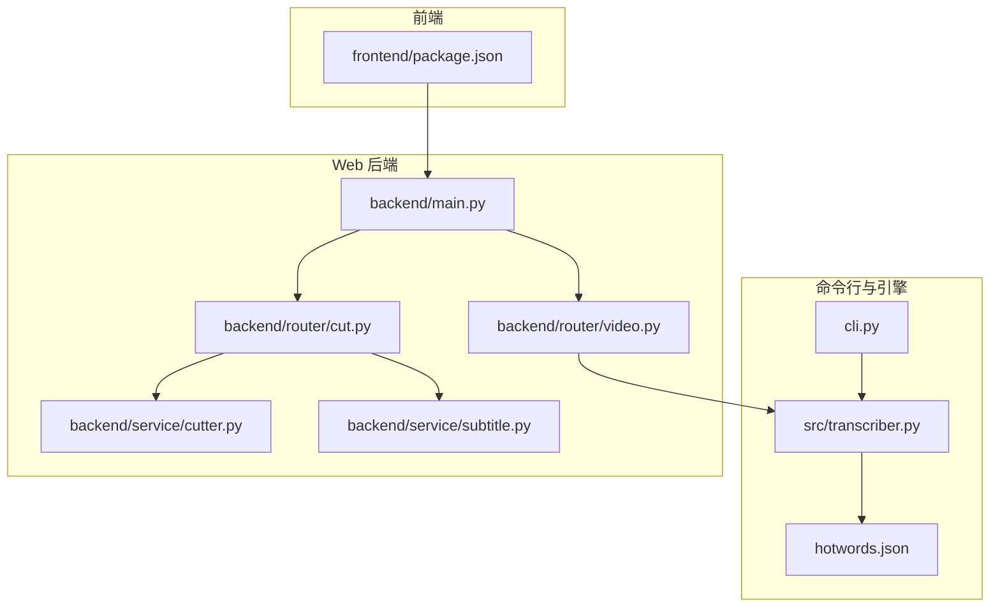
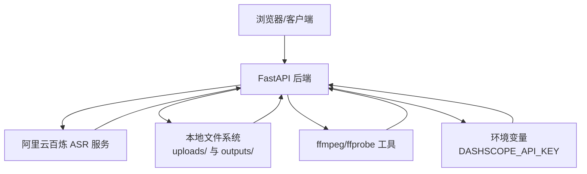
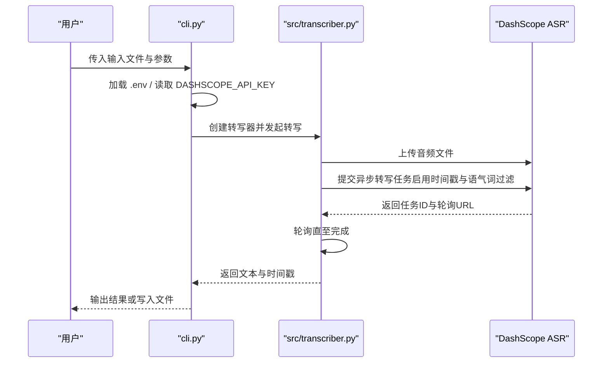
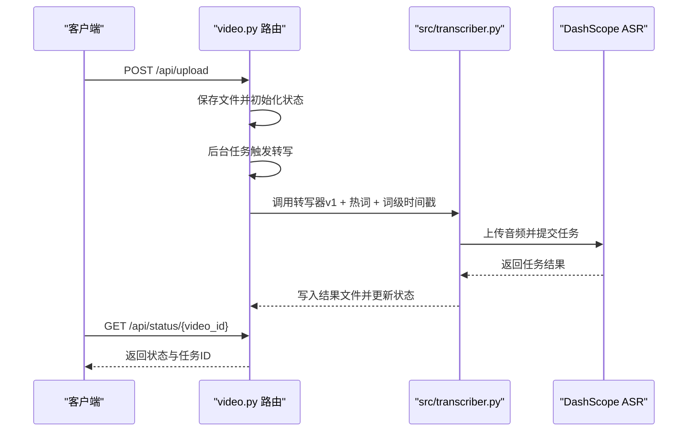
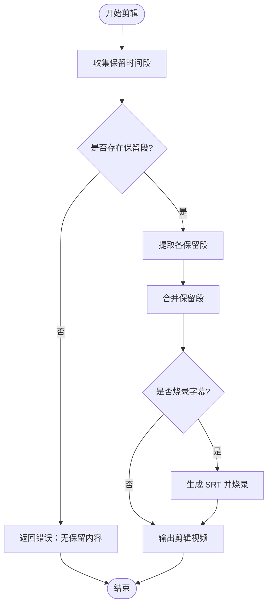
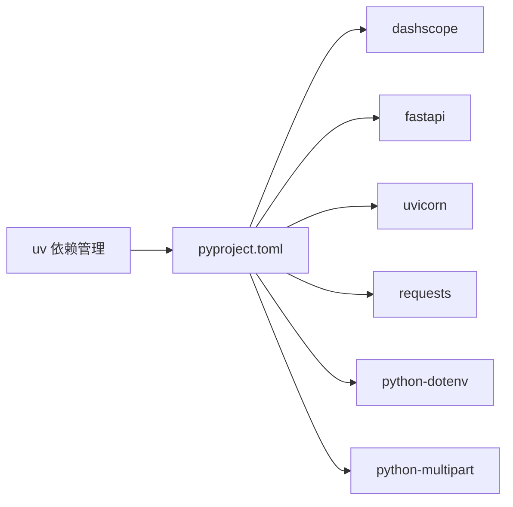

# 部署和运维指南

<cite>
**本文档引用的文件**
- [README.md](file://README.md)
- [pyproject.toml](file://pyproject.toml)
- [cli.py](file://cli.py)
- [src/transcriber.py](file://src/transcriber.py)
- [hotwords.json](file://hotwords.json)
- [cut-video-web/backend/main.py](file://cut-video-web/backend/main.py)
- [cut-video-web/backend/router/video.py](file://cut-video-web/backend/router/video.py)
- [cut-video-web/backend/router/cut.py](file://cut-video-web/backend/router/cut.py)
- [cut-video-web/backend/service/cutter.py](file://cut-video-web/backend/service/cutter.py)
- [cut-video-web/backend/service/subtitle.py](file://cut-video-web/backend/service/subtitle.py)
- [cut-video-web/frontend/package.json](file://cut-video-web/frontend/package.json)
</cite>

## 目录
1. [简介](#简介)
2. [项目结构](#项目结构)
3. [核心组件](#核心组件)
4. [架构总览](#架构总览)
5. [详细组件分析](#详细组件分析)
6. [依赖分析](#依赖分析)
7. [性能考量](#性能考量)
8. [故障排除指南](#故障排除指南)
9. [结论](#结论)
10. [附录](#附录)

## 简介
本指南面向生产环境部署与运维，覆盖以下主题：
- 生产环境部署步骤：服务器配置、依赖安装、环境变量设置、服务启动
- 容器化部署：Docker 镜像构建、Kubernetes 配置、负载均衡
- 性能监控与日志管理：关键指标监控、错误追踪、性能分析
- 安全配置：API 密钥管理、文件上传安全、访问控制
- 故障排除与应急响应：常见问题定位与处理流程
- 扩展性与容量管理：横向扩展、资源规划与限流策略

## 项目结构
项目由两部分组成：
- 命令行工具与 ASR 引擎：CLI、转写器封装、热词管理
- Web 界面：FastAPI 后端 + 前端静态资源，提供视频上传、ASR 转写、视频剪辑与字幕烧录能力

图表来源
- [cut-video-web/backend/main.py:1-84](file://cut-video-web/backend/main.py#L1-L84)
- [cut-video-web/backend/router/video.py:1-296](file://cut-video-web/backend/router/video.py#L1-L296)
- [cut-video-web/backend/router/cut.py:1-232](file://cut-video-web/backend/router/cut.py#L1-L232)
- [cut-video-web/backend/service/cutter.py:1-253](file://cut-video-web/backend/service/cutter.py#L1-L253)
- [cut-video-web/backend/service/subtitle.py:1-219](file://cut-video-web/backend/service/subtitle.py#L1-L219)
- [cli.py:1-180](file://cli.py#L1-L180)
- [src/transcriber.py:1-316](file://src/transcriber.py#L1-L316)
- [hotwords.json:1-17](file://hotwords.json#L1-L17)
- [cut-video-web/frontend/package.json:1-15](file://cut-video-web/frontend/package.json#L1-L15)

章节来源
- [README.md:190-310](file://README.md#L190-L310)
- [pyproject.toml:1-25](file://pyproject.toml#L1-L25)

## 核心组件
- 命令行工具：支持多种模型、热词、时间戳输出、视频音频提取
- ASR 引擎：封装 DashScope API，支持长音频转写、时间戳与语气词过滤
- Web 后端：FastAPI 应用，提供上传、转写、状态查询、剪辑、下载接口
- 剪辑服务：基于 ffmpeg 的视频裁剪与字幕烧录
- 字幕服务：按标点拆分生成 SRT 字幕，支持时间戳映射

章节来源
- [cli.py:1-180](file://cli.py#L1-L180)
- [src/transcriber.py:1-316](file://src/transcriber.py#L1-L316)
- [cut-video-web/backend/main.py:1-84](file://cut-video-web/backend/main.py#L1-L84)
- [cut-video-web/backend/router/video.py:1-296](file://cut-video-web/backend/router/video.py#L1-L296)
- [cut-video-web/backend/router/cut.py:1-232](file://cut-video-web/backend/router/cut.py#L1-L232)
- [cut-video-web/backend/service/cutter.py:1-253](file://cut-video-web/backend/service/cutter.py#L1-L253)
- [cut-video-web/backend/service/subtitle.py:1-219](file://cut-video-web/backend/service/subtitle.py#L1-L219)

## 架构总览
系统采用“前端静态 + 后端 API + 外部 ASR 服务”的三层架构。后端负责文件上传、转写调度、剪辑与字幕生成，外部依赖 DashScope ASR 服务与 ffmpeg 工具链。

图表来源
- [cut-video-web/backend/main.py:1-84](file://cut-video-web/backend/main.py#L1-L84)
- [cut-video-web/backend/router/video.py:160-234](file://cut-video-web/backend/router/video.py#L160-L234)
- [cut-video-web/backend/router/cut.py:70-110](file://cut-video-web/backend/router/cut.py#L70-L110)
- [src/transcriber.py:107-121](file://src/transcriber.py#L107-L121)
- [cut-video-web/backend/service/cutter.py:109-153](file://cut-video-web/backend/service/cutter.py#L109-L153)

## 详细组件分析

### 组件一：命令行工具与 ASR 引擎
- 功能要点
  - 支持模型切换（paraformer-v1/v2/sensevoice/fun-asr）
  - 热词管理：自动加载本地 hotwords.json，调用热词 API 获取 ID 并参与转写
  - 时间戳输出：支持句子级与词级时间戳
  - 视频处理：自动提取音频并转写
- 关键流程（转写序列）

图表来源
- [cli.py:128-175](file://cli.py#L128-L175)
- [src/transcriber.py:203-294](file://src/transcriber.py#L203-L294)

章节来源
- [cli.py:1-180](file://cli.py#L1-L180)
- [src/transcriber.py:1-316](file://src/transcriber.py#L1-L316)
- [hotwords.json:1-17](file://hotwords.json#L1-L17)

### 组件二：Web 后端（FastAPI）
- 功能要点
  - 上传视频并触发后台转写
  - 查询转写状态与时间戳
  - 剪辑视频与下载输出
  - 健康检查与静态资源挂载
- 关键流程（上传与转写）

图表来源
- [cut-video-web/backend/router/video.py:126-234](file://cut-video-web/backend/router/video.py#L126-L234)
- [src/transcriber.py:203-294](file://src/transcriber.py#L203-L294)

章节来源
- [cut-video-web/backend/main.py:1-84](file://cut-video-web/backend/main.py#L1-L84)
- [cut-video-web/backend/router/video.py:1-296](file://cut-video-web/backend/router/video.py#L1-L296)

### 组件三：视频剪辑与字幕生成
- 功能要点
  - 基于保留时间段进行视频裁剪（ffmpeg）
  - 字幕按标点拆分生成 SRT，支持时间戳映射
  - 可选将字幕烧录至视频
- 关键流程（剪辑与字幕）

图表来源
- [cut-video-web/backend/router/cut.py:70-110](file://cut-video-web/backend/router/cut.py#L70-L110)
- [cut-video-web/backend/service/cutter.py:21-66](file://cut-video-web/backend/service/cutter.py#L21-L66)
- [cut-video-web/backend/service/subtitle.py:18-44](file://cut-video-web/backend/service/subtitle.py#L18-L44)

章节来源
- [cut-video-web/backend/router/cut.py:1-232](file://cut-video-web/backend/router/cut.py#L1-L232)
- [cut-video-web/backend/service/cutter.py:1-253](file://cut-video-web/backend/service/cutter.py#L1-L253)
- [cut-video-web/backend/service/subtitle.py:1-219](file://cut-video-web/backend/service/subtitle.py#L1-L219)

## 依赖分析
- 运行时依赖
  - Python 3.12+
  - DashScope SDK、FastAPI、Uvicorn、python-multipart
  - ffmpeg/ffprobe（系统工具）
- 项目依赖（uv）
  - 通过 pyproject.toml 管理，支持脚本入口 asr

图表来源
- [pyproject.toml:1-25](file://pyproject.toml#L1-L25)

章节来源
- [pyproject.toml:1-25](file://pyproject.toml#L1-L25)
- [README.md:16-36](file://README.md#L16-L36)

## 性能考量
- 转写性能
  - 使用 DashScope 异步转写，需关注网络延迟与并发任务数
  - 词级时间戳与语气词过滤会增加处理开销
- 剪辑性能
  - ffmpeg 提取与合并为 CPU/IO 密集操作，建议在具备足够 CPU 与磁盘 IOPS 的环境中运行
  - 合并相邻时间段可减少片段数量，降低合并成本
- 缓存与清理
  - 后端提供定时清理服务，避免 uploads/ 与 outputs/ 目录无限增长
- 并发与限流
  - 建议在网关层实施请求速率限制，防止大量并发转写导致外部服务压力过大

章节来源
- [cut-video-web/backend/main.py:60-79](file://cut-video-web/backend/main.py#L60-L79)
- [cut-video-web/backend/service/cutter.py:68-92](file://cut-video-web/backend/service/cutter.py#L68-L92)

## 故障排除指南
- 环境变量缺失
  - 现象：启动时报错提示未设置 DASHSCOPE_API_KEY
  - 处理：确保 .env 或系统环境变量中包含该密钥
- ffmpeg/ffprobe 未安装或不可用
  - 现象：视频提取、时长探测、字幕烧录失败
  - 处理：安装 ffmpeg-full 并确保 PATH 可访问
- 热词创建失败
  - 现象：v1/v2 热词 ID 获取失败
  - 处理：检查 API Key 权限与网络连通性
- 转写任务失败
  - 现象：任务状态为 ERROR，返回错误信息
  - 处理：查看后端日志，确认文件上传与任务轮询是否成功
- 剪辑输出为空
  - 现象：所有词被删除导致无可保留段
  - 处理：调整删除选择，确保至少保留一个时间段

章节来源
- [cli.py:83-88](file://cli.py#L83-L88)
- [src/transcriber.py:114-121](file://src/transcriber.py#L114-L121)
- [cut-video-web/backend/service/cutter.py:174-196](file://cut-video-web/backend/service/cutter.py#L174-L196)
- [cut-video-web/backend/router/video.py:229-234](file://cut-video-web/backend/router/video.py#L229-L234)
- [cut-video-web/backend/router/cut.py:83-84](file://cut-video-web/backend/router/cut.py#L83-L84)

## 结论
本指南提供了从开发到生产的完整落地方案，涵盖部署、容器化、监控、安全与运维排障。建议在生产中结合企业级平台完善日志与告警体系，并按业务峰值预留充足的 CPU、I/O 与网络带宽资源。

## 附录

### A. 生产环境部署步骤
- 服务器准备
  - 操作系统：Linux（推荐 Ubuntu 20.04+）
  - Python：3.12+，建议使用 uv 进行依赖管理
  - 工具：ffmpeg/ffprobe
- 依赖安装
  - 使用 uv 安装项目依赖
- 环境变量
  - 设置 DASHSCOPE_API_KEY
  - 可选：.env 文件放置于项目根目录
- 服务启动
  - 后端：uvicorn 启动 FastAPI 应用
  - 前端：可直接挂载静态资源或构建产物
- 目录权限
  - 确保 uploads/ 与 outputs/ 目录可读写

章节来源
- [README.md:16-36](file://README.md#L16-L36)
- [cut-video-web/backend/main.py:32-47](file://cut-video-web/backend/main.py#L32-L47)
- [cut-video-web/frontend/package.json:6-10](file://cut-video-web/frontend/package.json#L6-L10)

### B. 容器化部署（Docker + Kubernetes）
- Docker 镜像构建
  - 基础镜像：python:3.12-alpine 或 slim
  - 安装 ffmpeg-full 与编译依赖
  - 使用 uv 安装 pyproject.toml 中的依赖
  - 暴露端口：8000
  - CMD：uvicorn 启动后端
- Kubernetes 配置
  - Deployment：副本数、资源请求/限制、探针
  - Service：ClusterIP/LoadBalancer
  - ConfigMap：环境变量（API Key 通过 Secret 注入）
  - PersistentVolume：挂载 uploads/ 与 outputs/ 目录
- 负载均衡
  - Ingress 控制器 + TLS 终止
  - 建议启用连接数与 QPS 限流

[本节为概念性指导，不直接对应具体源文件]

### C. 性能监控与日志管理
- 指标监控
  - CPU/内存/磁盘 I/O：系统层面
  - ASR 转写耗时、队列长度、错误率：应用层面
  - 剪辑耗时、字幕生成耗时：服务层面
- 错误追踪
  - 记录异常堆栈与上下文（任务ID、视频ID）
  - 结合统一日志平台（如 ELK/Fluentd/Loki）
- 性能分析
  - 分布式追踪（如 OpenTelemetry）
  - 火焰图分析 ffmpeg 耗时热点

[本节为通用运维建议，不直接对应具体源文件]

### D. 安全配置最佳实践
- API 密钥管理
  - 使用 Secret 管理 DASHSCOPE_API_KEY，避免硬编码
  - 限制密钥权限范围与配额
- 文件上传安全
  - 限制文件类型与大小，校验 MIME
  - 存储隔离与只读挂载 outputs/ 用于下载
- 访问控制
  - 网关层鉴权与速率限制
  - HTTPS/TLS 终止与 HSTS

[本节为通用安全建议，不直接对应具体源文件]