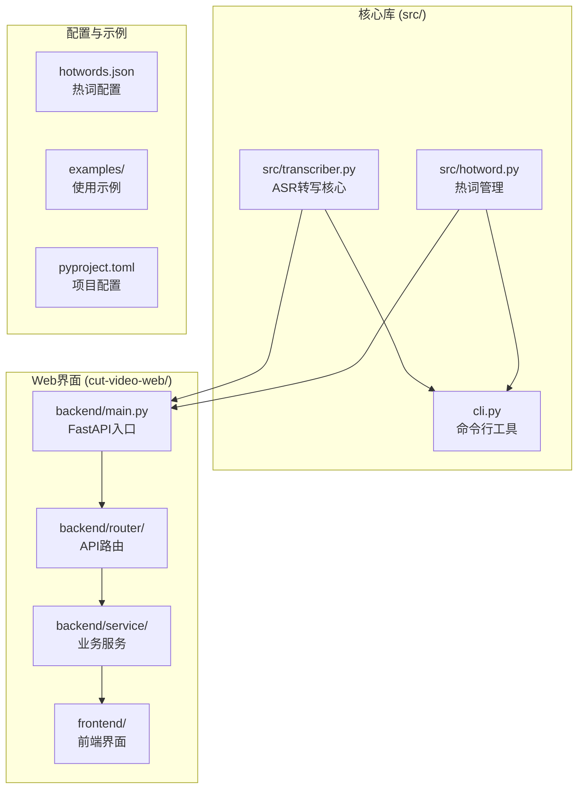
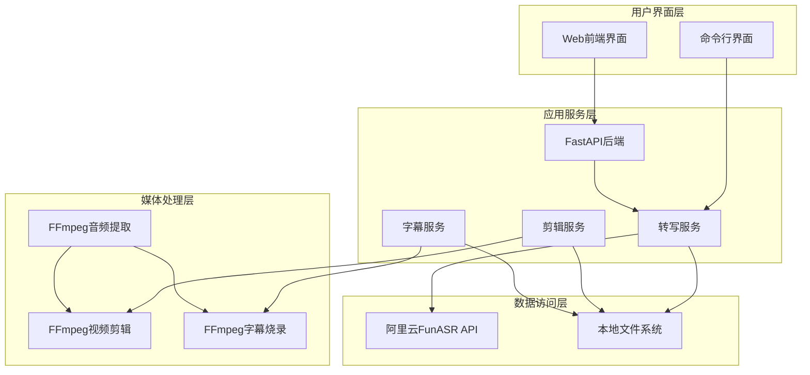
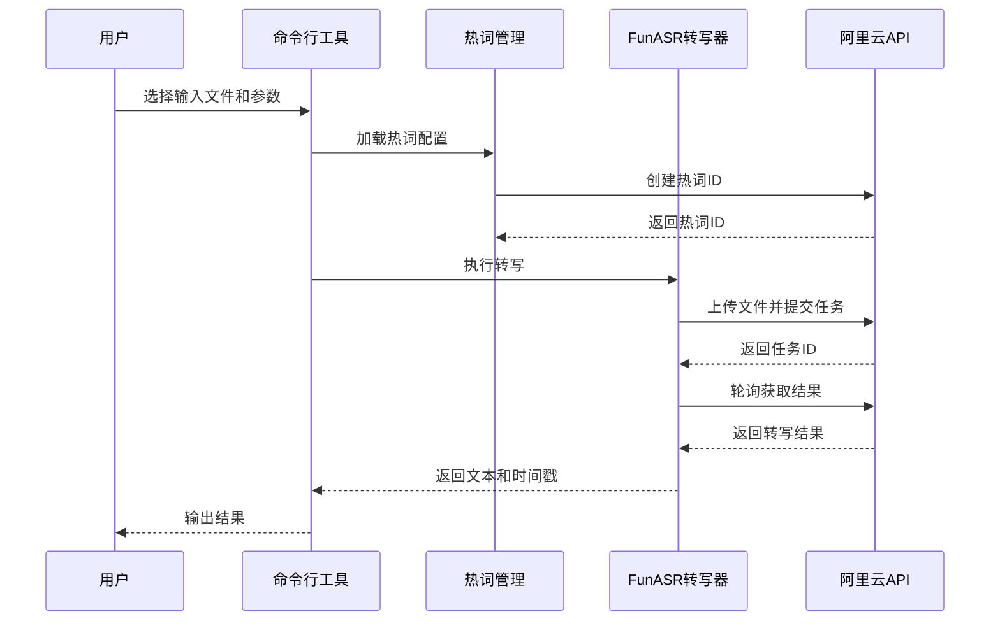
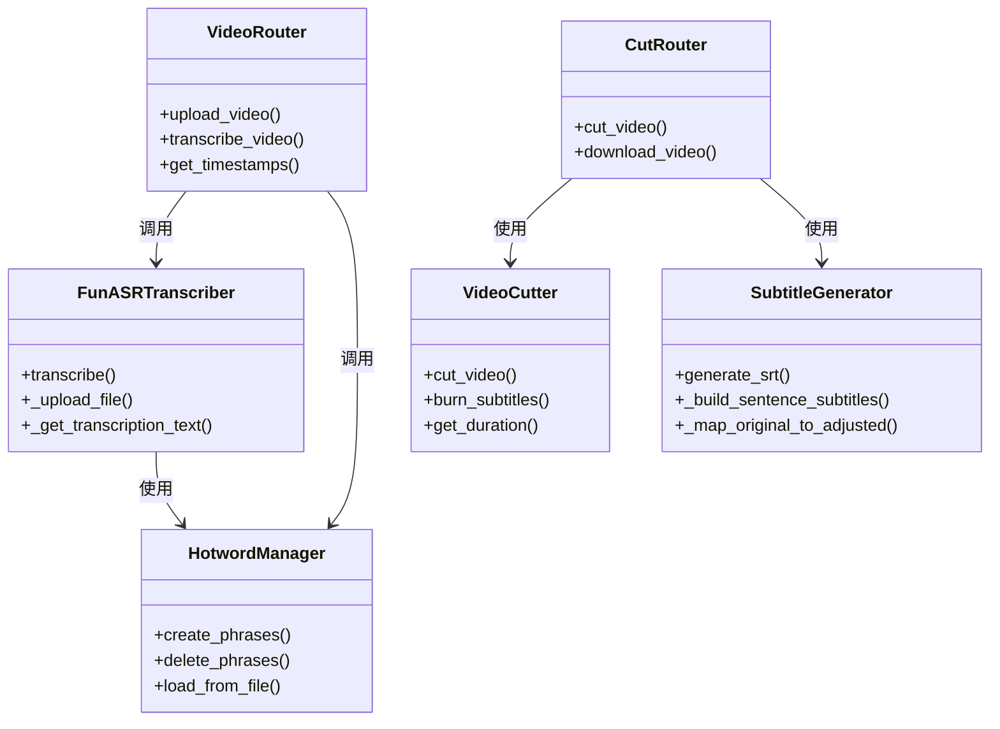
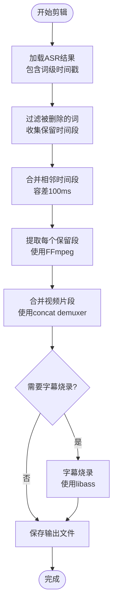
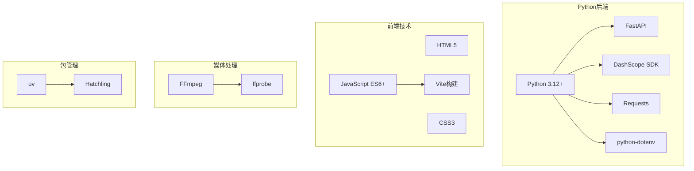

# 项目概述

<cite>
**本文档引用的文件**
- [README.md](file://README.md)
- [cli.py](file://cli.py)
- [src/transcriber.py](file://src/transcriber.py)
- [src/hotword.py](file://src/hotword.py)
- [pyproject.toml](file://pyproject.toml)
- [cut-video-web/backend/main.py](file://cut-video-web/backend/main.py)
- [cut-video-web/backend/router/video.py](file://cut-video-web/backend/router/video.py)
- [cut-video-web/backend/router/cut.py](file://cut-video-web/backend/router/cut.py)
- [cut-video-web/backend/service/cutter.py](file://cut-video-web/backend/service/cutter.py)
- [cut-video-web/backend/service/subtitle.py](file://cut-video-web/backend/service/subtitle.py)
- [cut-video-web/frontend/index.html](file://cut-video-web/frontend/index.html)
- [cut-video-web/frontend/app.js](file://cut-video-web/frontend/app.js)
- [examples/transcribe_example.py](file://examples/transcribe_example.py)
- [hotwords.json](file://hotwords.json)
</cite>

## 目录
1. [简介](#简介)
2. [项目结构](#项目结构)
3. [核心组件](#核心组件)
4. [架构概览](#架构概览)
5. [详细组件分析](#详细组件分析)
6. [依赖关系分析](#依赖关系分析)
7. [性能考量](#性能考量)
8. [故障排除指南](#故障排除指南)
9. [结论](#结论)

## 简介

cut-video是一个基于阿里云百炼FunASR API的ASR语音识别工具，提供完整的命令行工具、Python API和Web界面解决方案。该项目的核心价值在于：

- **高精度语音识别**：支持最长12小时、2GB文件的长音频转写，提供毫秒级时间戳
- **多语言支持**：支持中文、英文等多语言及方言识别
- **精确剪辑能力**：基于词级时间戳实现精确的视频内容剪辑
- **智能热词优化**：支持v1和v2模型的热词功能，显著提升特定词汇识别准确率
- **完整的媒体处理链路**：从音频提取、转写、剪辑到字幕生成的一站式解决方案

## 项目结构

项目采用模块化设计，分为三个主要部分：

**图表来源**
- [src/transcriber.py:1-316](file://src/transcriber.py#L1-L316)
- [cut-video-web/backend/main.py:1-84](file://cut-video-web/backend/main.py#L1-L84)

**章节来源**
- [README.md:190-206](file://README.md#L190-L206)
- [pyproject.toml:1-25](file://pyproject.toml#L1-L25)

## 核心组件

### ASR转写引擎

ASR转写引擎是整个系统的核心，负责与阿里云百炼FunASR API交互，实现高质量的语音识别：

- **模型支持**：支持fun-asr、paraformer-v1、paraformer-v2、sensevoice等多种模型
- **时间戳精度**：提供句子级和词级双层时间戳
- **自动音频提取**：支持视频文件自动提取WAV音频
- **语气词过滤**：内置disfluency removal功能

### 热词管理系统

热词系统通过阿里云的AsrPhraseManager和VocabularyService实现：

- **v1/v2模型兼容**：分别使用不同的API接口
- **权重控制**：支持1-5的增强权重和-6到-1的减弱权重
- **批量管理**：支持热词的创建、删除和批量操作

### Web剪辑界面

Web界面提供完整的视频剪辑工作流：

- **实时预览**：词级时间轴可视化编辑
- **精确控制**：支持按词删除和整句删除
- **字幕烧录**：可选的字幕烧录功能
- **导出管理**：自动化的输出文件管理

**章节来源**
- [src/transcriber.py:22-42](file://src/transcriber.py#L22-L42)
- [src/hotword.py:13-70](file://src/hotword.py#L13-L70)
- [cut-video-web/backend/router/video.py:98-102](file://cut-video-web/backend/router/video.py#L98-L102)

## 架构概览

项目采用分层架构设计，清晰分离了数据访问层、业务逻辑层和表现层：

**图表来源**
- [cut-video-web/backend/main.py:25-30](file://cut-video-web/backend/main.py#L25-L30)
- [src/transcriber.py:95-121](file://src/transcriber.py#L95-L121)
- [cut-video-web/backend/service/cutter.py:14-20](file://cut-video-web/backend/service/cutter.py#L14-L20)

## 详细组件分析

### 命令行工具 (cli.py)

命令行工具提供了最直接的ASR转写入口：

**图表来源**
- [cli.py:36-176](file://cli.py#L36-L176)
- [src/hotword.py:22-69](file://src/hotword.py#L22-L69)
- [src/transcriber.py:203-294](file://src/transcriber.py#L203-L294)

### Web后端服务

Web后端采用FastAPI框架，提供RESTful API：

**图表来源**
- [src/transcriber.py:95-294](file://src/transcriber.py#L95-L294)
- [src/hotword.py:13-92](file://src/hotword.py#L13-L92)
- [cut-video-web/backend/router/video.py:166-234](file://cut-video-web/backend/router/video.py#L166-L234)
- [cut-video-web/backend/router/cut.py:51-110](file://cut-video-web/backend/router/cut.py#L51-L110)

### 剪辑算法流程

视频剪辑采用精确的时间段合并策略：

**图表来源**
- [cut-video-web/backend/router/cut.py:70-106](file://cut-video-web/backend/router/cut.py#L70-L106)
- [cut-video-web/backend/service/cutter.py:21-66](file://cut-video-web/backend/service/cutter.py#L21-L66)

**章节来源**
- [cli.py:1-180](file://cli.py#L1-L180)
- [cut-video-web/backend/router/video.py:166-234](file://cut-video-web/backend/router/video.py#L166-L234)
- [cut-video-web/backend/router/cut.py:51-110](file://cut-video-web/backend/router/cut.py#L51-L110)

## 依赖关系分析

项目的技术栈选择体现了明确的架构考量：

**图表来源**
- [pyproject.toml:7-14](file://pyproject.toml#L7-L14)
- [cut-video-web/backend/service/cutter.py:175-196](file://cut-video-web/backend/service/cutter.py#L175-L196)

**章节来源**
- [pyproject.toml:1-25](file://pyproject.toml#L1-L25)
- [cut-video-web/backend/main.py:19-30](file://cut-video-web/backend/main.py#L19-L30)

## 性能考量

### 转写性能优化

- **异步处理**：Web界面采用后台任务处理ASR转写，避免阻塞主线程
- **热词缓存**：热词ID在内存中缓存，减少重复创建开销
- **文件复用**：已完成的转写结果持久化，支持服务重启后的状态恢复

### 剪辑性能优化

- **时间段合并**：自动合并相邻时间段，减少FFmpeg调用次数
- **增量处理**：支持撤销操作的历史记录，便于快速回滚
- **资源管理**：临时文件自动清理，避免磁盘空间浪费

## 故障排除指南

### 常见问题及解决方案

1. **API密钥配置错误**
   - 确认DASHSCOPE_API_KEY环境变量正确设置
   - 检查.env文件格式和权限

2. **FFmpeg依赖问题**
   - 确认FFmpeg已安装且在PATH中
   - 检查FFmpeg版本兼容性

3. **网络连接超时**
   - 检查网络连接稳定性
   - 考虑增加超时时间配置

4. **文件权限问题**
   - 确认uploads和outputs目录可读写
   - 检查磁盘空间充足

**章节来源**
- [cli.py:83-88](file://cli.py#L83-L88)
- [cut-video-web/backend/service/cutter.py:175-196](file://cut-video-web/backend/service/cutter.py#L175-L196)

## 结论

cut-video项目通过整合阿里云百炼FunASR API和FFmpeg工具链，构建了一个功能完整、性能优异的视频内容处理解决方案。项目的主要优势包括：

- **技术架构先进**：采用现代Python生态和FastAPI框架
- **功能覆盖全面**：从基础转写到高级剪辑的完整工作流
- **用户体验优秀**：直观的Web界面和精确的词级编辑能力
- **扩展性强**：模块化设计便于功能扩展和维护

该解决方案特别适用于需要精确视频内容编辑、字幕生成和内容分析的场景，为视频内容创作者和企业用户提供了一套高效的技术工具。